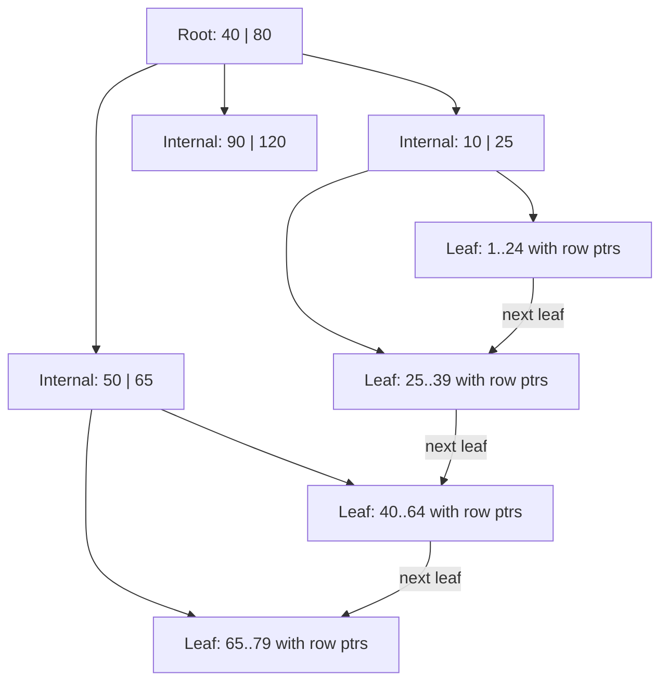
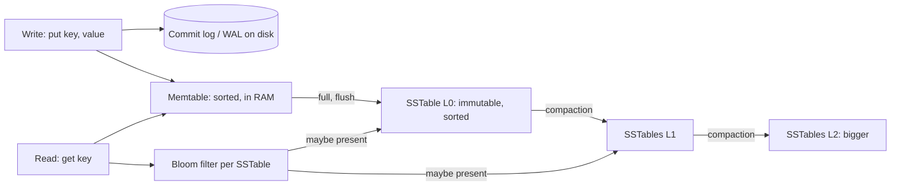

# Indexes

An index is a separate, sorted (or hashed) structure that points to rows, so the database can jump to the data instead of reading the whole table. Almost every "this query is slow" interview question ends at an index. Know the structures (B+tree, hash, LSM), the rules (leftmost prefix, covering) and the cost (every write updates every index).

## ⭐ Why indexes: full scan vs lookup

**In one line:** without an index the database reads every row (full table scan, O(n)); with a B+tree index it walks a few pages down a tree (O(log n)) and reads only matching rows.

> **Example:** Zomato has 50 lakh restaurants. `WHERE city_id = 7` without an index reads all 50 lakh rows from disk. With an index on `city_id` it reads 3–4 index pages and then only the ~40,000 Bangalore rows.

| | Full table scan | Index lookup |
|---|---|---|
| Work | Reads every page of the table | Reads 3–4 tree pages, then matching rows |
| Complexity | O(n) | O(log n) + matches |
| Good when | Table is tiny, or query returns a large % of rows | Query is selective (returns few rows) |
| I/O pattern | Sequential (fast per page) | Random (slower per page, far fewer pages) |

- The database stores data in **pages** (Postgres 8 KB, InnoDB 16 KB). Cost is roughly "how many pages did I touch".
- An index is a trade: faster reads, slower writes, extra disk and RAM.
- The **query planner** decides whether to use an index. If your query returns 40% of the table, a sequential scan is often cheaper than millions of random index hops, and the planner will ignore your index. That is correct behaviour.

**Interview tip:** "Why not index every column?" Every INSERT/UPDATE/DELETE must update every index, indexes take RAM away from data cache, and the planner only uses one or two per table access anyway. Index for your actual query patterns.

**Common mistake:** assuming an index is always used once it exists. Low selectivity, a function on the column, or stale statistics make the planner pick a seq scan.

## ⭐ B-tree / B+tree structure

**In one line:** a B+tree is a short, wide, balanced tree; internal nodes hold only keys for routing, leaves hold keys plus row pointers (or the rows) and are linked left to right for range scans.



- **Fan-out** is huge: one 16 KB page holds hundreds of keys. With fan-out ~500, three levels cover 500³ = 12.5 crore keys. So a lookup is 3–4 page reads, and the top levels are almost always in RAM.
- **Balanced:** every leaf is at the same depth. Inserts split full pages and push a key up; deletes merge. Height grows only at the root.
- **B-tree vs B+tree:** a classic B-tree stores values in internal nodes too. A B+tree keeps data only in leaves and links leaves, so range scans (`BETWEEN`, `ORDER BY`, `>`) just walk the leaf chain. Every major RDBMS "B-tree index" is really a B+tree.
- Supports: `=`, `<`, `>`, `BETWEEN`, `ORDER BY`, prefix `LIKE 'abc%'`, `MIN/MAX`.
- Updates are **in place**: find the page, modify it, write it back (with WAL for durability). Random writes are the main write cost.

**Interview tip:** "Why B+tree and not a binary search tree on disk?" A BST has height log2(n) (about 27 for 10 crore rows), and each level is a random disk read. A B+tree with fan-out 500 has height 3–4. Disks and SSDs read in pages, so pack many keys per page.

**Common mistake:** saying a B-tree lookup is O(1). It is O(log n), just with a very large log base.

## Hash index

**In one line:** a hash table from key to row location; O(1) equality lookups, but no ranges and no ordering.

- Postgres has `CREATE INDEX ... USING HASH` (crash-safe since v10). MySQL MEMORY engine supports hash; InnoDB builds an internal **adaptive hash index** on hot B-tree pages automatically.
- Redis, Memcached and the in-memory key directory of Bitcask are hash indexes at heart.
- Cannot do `>`, `<`, `BETWEEN`, `ORDER BY`, or prefix match. Rarely better than a B-tree in Postgres, so B-tree stays the default.

**Interview tip:** "When would you choose a hash index?" Pure equality lookups on a long key (like a session token or URL hash) where you never need range or sort. Even then, a B-tree is usually fine.

**Common mistake:** creating a hash index and then filtering with `>` on that column. The index is useless for it.

## ⭐ LSM-tree: memtable, SSTables, compaction, bloom filters

**In one line:** an LSM-tree turns random writes into sequential writes: write to an in-memory sorted table plus a log, flush it as an immutable sorted file (SSTable), and merge files in the background.



Write path:
1. Append to the **commit log** (WAL) for durability. Sequential write, fast.
2. Insert into the **memtable** (a sorted structure in RAM, e.g. a skip list).
3. When the memtable is full (say 64 MB), flush it to disk as an **SSTable** (Sorted String Table): immutable, sorted, with a small index and a **bloom filter**.
4. **Compaction** merges SSTables in the background, keeps the newest version of each key, drops deleted keys (**tombstones**) and overwritten values.

Read path:
1. Check the memtable. Then SSTables from newest to oldest.
2. For each SSTable, ask its **bloom filter** first: "definitely not here" (skip the file) or "maybe here" (read it). Bloom filters have false positives but no false negatives.
3. A key may exist in several files; the newest wins.

Compaction strategies:
- **Size-tiered (STCS):** merge SSTables of similar size. Cheap writes, more read and space amplification. Cassandra default.
- **Leveled (LCS):** each level is 10x bigger with non-overlapping key ranges. Reads touch about one file per level; more write amplification. RocksDB default.

**Interview tip:** "Why are LSM writes fast?" No in-place page updates. Every write is a sequential append (log) plus a RAM insert. The cost is paid later in compaction and at read time.

**Common mistake:** thinking deletes free space immediately in an LSM store. A delete writes a tombstone; space comes back only after compaction (and in Cassandra after `gc_grace_seconds`).

## ⭐ B-tree vs LSM-tree

| | B+tree | LSM-tree |
|---|---|---|
| Write pattern | Random in-place page updates | Sequential appends + background merge |
| Write throughput | Medium | High |
| Read latency | Predictable, 3–4 pages | Can check several SSTables (bloom filters help) |
| Range scans | Excellent (linked leaves) | Good, but merges results from many files |
| Write amplification | Page rewrite for a small change + WAL | Same data rewritten on each compaction |
| Read amplification | Low | Higher, especially with size-tiered |
| Space amplification | Page fragmentation (~30% free space) | Old versions until compacted |
| Used by | PostgreSQL, MySQL InnoDB, Oracle, SQL Server, MongoDB WiredTiger (default) | Cassandra, ScyllaDB, RocksDB, LevelDB, HBase, Bigtable, DynamoDB storage, InfluxDB |
| Best for | Read-heavy OLTP, transactions, ranges | Write-heavy: logs, metrics, chat messages, IoT |

- **Write amplification** = bytes written to disk / bytes the app wrote. **Read amplification** = pages read per lookup. **Space amplification** = disk used / live data size. You can optimise two of these, not all three (RUM conjecture).

**Interview tip:** "Chat messages at WhatsApp scale, which storage engine?" LSM (Cassandra/ScyllaDB/HBase): huge write rate, reads are recent-first by partition. "Bank ledger with many reads and transactions?" B+tree (Postgres/MySQL).

**Common mistake:** saying LSM is "faster" in general. It is faster for writes; reads and compaction spikes can hurt p99 latency.

## ⭐ Composite index and the leftmost-prefix rule

**In one line:** an index on `(a, b, c)` is sorted by `a`, then `b` within `a`, then `c` within `b`; it helps queries that filter on a leftmost prefix: `a`, `a,b`, or `a,b,c`.

Think of a phone book sorted by (last_name, first_name). Finding "Sharma, Rahul" is fast. Finding everyone named "Rahul" is not.

```sql
CREATE INDEX idx_orders_user_status_time
  ON orders (user_id, status, created_at);
```

| Query | Uses index? | Why |
|---|---|---|
| `WHERE user_id = 42` | Yes | Leftmost column |
| `WHERE user_id = 42 AND status = 'DELIVERED'` | Yes | Prefix (a, b) |
| `WHERE user_id = 42 AND status = 'DELIVERED' ORDER BY created_at DESC` | Yes, no sort step | Full prefix, rows already in order |
| `WHERE status = 'DELIVERED'` | No (or skip scan in some DBs) | Skips leftmost column |
| `WHERE user_id = 42 AND created_at > now() - interval '7 days'` | Partly | Seeks on `user_id`, then filters `created_at` inside it (status gap) |
| `WHERE user_id = 42 AND status IN ('A','B')` | Yes | IN on a prefix column is fine |
| `WHERE user_id > 40 AND status = 'X'` | Partly | Range on `a` stops the index from seeking on `b` |

Column order rules of thumb:
1. **Equality columns first**, then the **range** or **sort** column last ("ESR": Equality, Sort, Range).
2. Among equality columns, put the one used by the most queries first, so the index serves more queries.
3. One `(a, b)` index makes a separate index on `(a)` redundant. Drop it.

**Interview tip:** "Index on (a,b) and query on b only?" Generally not usable for seeking. MySQL 8 and Oracle can do a **skip scan** when `a` has very few distinct values, but do not design for that.

**Common mistake:** creating separate single-column indexes on `user_id`, `status`, `created_at` and expecting them to behave like one composite index. The planner may combine them (bitmap AND in Postgres, index merge in MySQL), but that is much slower than one right composite index.

## ⭐ Covering index and index-only scan

**In one line:** if the index contains every column the query needs, the database answers from the index alone and never touches the table.

```sql
-- Query: order history list screen
SELECT created_at, total_amount
FROM orders
WHERE user_id = 42
ORDER BY created_at DESC
LIMIT 20;

-- Postgres: key columns + INCLUDE payload columns
CREATE INDEX idx_orders_user_time_cov
  ON orders (user_id, created_at DESC) INCLUDE (total_amount);

-- MySQL: just put it in the key
CREATE INDEX idx_orders_user_time_cov ON orders (user_id, created_at, total_amount);
```

- Postgres plan shows `Index Only Scan`. It still checks the **visibility map**; after heavy updates run `VACUUM` so pages are marked all-visible, otherwise it goes back to the heap.
- MySQL `EXPLAIN` shows `Using index` in the Extra column.
- `SELECT *` kills covering. Select only what the screen needs.

**Interview tip:** "How do you make a hot read query faster without a cache?" Make it a covering index: equality columns, then sort column, then INCLUDE the selected columns.

**Common mistake:** adding wide columns (like a JSON blob) to a covering index. The index becomes huge and stops fitting in RAM.

## Partial and expression indexes

**In one line:** a partial index indexes only rows matching a `WHERE`; an expression index indexes the result of a function, so `WHERE lower(email) = ...` can use it.

```sql
-- Partial: only 2% of orders are active; index just those
CREATE INDEX idx_orders_active ON orders (restaurant_id, created_at)
  WHERE status IN ('PLACED', 'PREPARING', 'OUT_FOR_DELIVERY');

-- Partial unique: one active cart per user
CREATE UNIQUE INDEX uq_one_active_cart ON carts (user_id) WHERE is_active;

-- Expression: case-insensitive login
CREATE INDEX idx_users_lower_email ON users (lower(email));
SELECT * FROM users WHERE lower(email) = 'rahul@paytm.com';

-- MySQL 8 functional index (note the double brackets)
CREATE INDEX idx_users_lower_email ON users ((lower(email)));
```

- Partial indexes are small, fast and cheap to maintain. The query's `WHERE` must imply the index's `WHERE` for the planner to use it.
- MySQL has no partial indexes; it has functional indexes (8.0.13+) and generated columns.

**Common mistake:** writing `WHERE lower(email) = ?` with only a plain index on `email`. The function hides the column from the index.

## Unique index

**In one line:** a unique index enforces "no two rows have the same key" and is also a normal lookup index.

```sql
CREATE UNIQUE INDEX uq_users_phone ON users (phone);
ALTER TABLE payments ADD CONSTRAINT uq_payment_idem UNIQUE (merchant_id, idempotency_key);
```

- A `PRIMARY KEY` or `UNIQUE` constraint creates a unique index automatically.
- It is the cleanest way to get **idempotency** and to stop double booking: the second insert fails with a duplicate-key error, which you catch. See [Idempotency & retries](../01-topics/10-idempotency-retries.md) and [BookMyShow](../02-questions/t1-05-bookmyshow.md).
- `NULL`s: in Postgres and MySQL, multiple NULLs are allowed in a unique column (Postgres 15 has `NULLS NOT DISTINCT` to change that).

**Common mistake:** enforcing uniqueness with "SELECT, then INSERT if missing" in application code. Two requests race past the SELECT. Let the unique index decide.

## ⭐ Clustered vs secondary index (InnoDB primary key clustering)

**In one line:** a clustered index *is* the table: rows are stored inside the B+tree leaves in primary key order; a secondary index stores keys plus a pointer back to the row.


| | MySQL InnoDB | PostgreSQL |
|---|---|---|
| Table storage | Clustered on the primary key (B+tree) | Heap (unordered); every index is secondary |
| Secondary index leaf stores | Indexed columns + **primary key** | Indexed columns + **TID** (page, slot) |
| Secondary lookup cost | Two tree walks (secondary, then PK) | Index walk + one heap page fetch |
| Range on PK | Very fast, rows are physically adjacent | Needs `CLUSTER` (one-time) or BRIN for locality |

InnoDB consequences:
- Use a **short, increasing primary key** (BIGINT auto-increment, or time-ordered IDs like Snowflake/ULID). A random UUIDv4 PK inserts all over the tree, causes page splits, fragmentation and bigger secondary indexes (the PK is copied into each one). See [Unique ID generation](../01-topics/17-unique-id-generation.md).
- No PK? InnoDB uses the first NOT NULL unique key, else a hidden 6-byte row id.
- A secondary index on `(email)` is automatically "covering" for `SELECT id FROM users WHERE email = ?` because the PK is in the leaf.

**Interview tip:** "Why is UUID a bad primary key in MySQL?" Random inserts into a clustered B+tree cause page splits and poor cache locality, and the 16-byte key is repeated in every secondary index. Use a time-ordered ID.

**Common mistake:** assuming Postgres tables are ordered by primary key. They are a heap; order is whatever insertion and updates left behind.

## ⭐ When indexes hurt

**In one line:** indexes cost writes, RAM and disk, and some query shapes cannot use them at all.

| Problem | Why | Fix |
|---|---|---|
| Too many indexes on a write-heavy table | Each INSERT updates every index; UPDATE of an indexed column too | Keep only indexes that serve real queries; check `pg_stat_user_indexes.idx_scan = 0` |
| Low cardinality column (`gender`, `is_active`) | Index returns a huge % of rows; seq scan is cheaper | Partial index on the rare value, or composite with a selective column |
| Function on the column: `WHERE DATE(created_at) = '2026-10-01'` | Index is on `created_at`, not `DATE(created_at)` | Rewrite as range: `created_at >= '2026-10-01' AND created_at < '2026-10-02'` |
| Leading wildcard: `LIKE '%biryani%'` | B-tree is sorted by prefix; no prefix to seek on | Full-text search (Postgres `tsvector`/GIN, `pg_trgm`) or Elasticsearch |
| Implicit type cast: `WHERE phone = 9876543210` on a VARCHAR | Casts every row's column | Pass the correct type |
| `OR` across different columns | One index cannot serve both sides | `UNION ALL` of two indexed queries, or separate indexes + bitmap OR |
| Big bulk load | Index maintenance per row | Drop indexes, load, recreate |
| Random UUID PK in InnoDB | Page splits | Time-ordered IDs |

- Postgres **HOT updates**: if an UPDATE changes no indexed column and the page has space, Postgres skips index updates. Indexing a frequently updated column (like `last_seen_at`) kills HOT and bloats indexes.

**Common mistake:** adding an index for every slow query found in logs. Ten overlapping indexes on `orders` will slow checkout writes more than they help reads.

## ⭐ Commands: create, drop, EXPLAIN

| Command / method | What it does | Example |
|---|---|---|
| `CREATE INDEX` | Build a B-tree index (locks writes on the table in Postgres while building) | `CREATE INDEX idx_r_city ON restaurants (city_id);` |
| `CREATE INDEX CONCURRENTLY` | Postgres: build without blocking writes (slower, cannot run inside a transaction) | `CREATE INDEX CONCURRENTLY idx_r_city ON restaurants (city_id);` |
| `CREATE UNIQUE INDEX` | Index + uniqueness constraint | `CREATE UNIQUE INDEX uq_u_phone ON users (phone);` |
| `USING gin / gist / brin / hash` | Postgres index type | `CREATE INDEX ON menu USING gin (to_tsvector('english', name));` |
| `INCLUDE (...)` | Postgres covering payload columns | `CREATE INDEX ON orders (user_id) INCLUDE (total);` |
| `ALTER TABLE ... ADD INDEX ..., ALGORITHM=INPLACE, LOCK=NONE` | MySQL online index build | `ALTER TABLE orders ADD INDEX idx_u (user_id), ALGORITHM=INPLACE, LOCK=NONE;` |
| `DROP INDEX` / `DROP INDEX CONCURRENTLY` | Remove an index | `DROP INDEX CONCURRENTLY idx_old;` |
| `REINDEX INDEX CONCURRENTLY` | Postgres: rebuild a bloated index | `REINDEX INDEX CONCURRENTLY idx_r_city;` |
| `EXPLAIN` | Show the plan with estimated costs, without running | `EXPLAIN SELECT ...;` |
| `EXPLAIN ANALYZE` | Run the query and show actual rows and time | `EXPLAIN (ANALYZE, BUFFERS) SELECT ...;` |
| `ANALYZE` | Refresh table statistics the planner uses | `ANALYZE restaurants;` |

How to read a Postgres plan:

| Node | Meaning | Good or bad |
|---|---|---|
| `Seq Scan` | Read the whole table | Fine on small tables or big result sets; bad on a selective filter over a big table |
| `Index Scan` | Walk the index, fetch each matching row from the heap | Good for few rows |
| `Index Only Scan` | Answer from the index alone (`Heap Fetches: 0` is ideal) | Best |
| `Bitmap Index Scan` + `Bitmap Heap Scan` | Collect matching row locations, then read pages in order | Good for medium result sets or combining indexes |
| `Sort` (with `external merge Disk`) | Sorting rows, spilled to disk | Often removable with the right index order |
| `Rows Removed by Filter: 480000` | Read rows and threw them away | Missing or wrong index |

- Compare **estimated rows vs actual rows**. A 100x gap means stale stats: run `ANALYZE`.
- `actual time=0.04..12.3` is first row..last row in ms. `loops=1000` multiplies it.
- MySQL `EXPLAIN`: look at `type` (`ALL` = full scan, `ref`/`range`/`const` = index), `key` (index chosen), `rows`, and `Extra` (`Using index` = covering, `Using filesort`, `Using temporary` = extra work).

**Interview tip:** "How do you add an index to a 50 GB production table?" `CREATE INDEX CONCURRENTLY` in Postgres (or online DDL / `gh-ost` / `pt-online-schema-change` in MySQL), off-peak, then check it is `VALID`, then `EXPLAIN` the target query.

**Common mistake:** running plain `CREATE INDEX` on a busy Postgres table. It takes a lock that blocks all writes until the build finishes.

## ⭐ Real example: tuning a slow Zomato restaurant search

> **Example:** the "restaurants near me, open now, rating 4+, sorted by rating" API has p99 of 1.8 s. The table has 50 lakh rows.

The query:

```sql
SELECT id, name, rating, avg_cost
FROM restaurants
WHERE city_id = 7
  AND is_open = true
  AND rating >= 4.0
  AND lower(name) LIKE '%biryani%'
ORDER BY rating DESC
LIMIT 20;
```

Step 1: `EXPLAIN (ANALYZE, BUFFERS)`:

```text
Limit  (actual time=1790.2..1790.3 rows=20 loops=1)
  ->  Sort  (Sort Method: top-N heapsort)
        ->  Seq Scan on restaurants  (actual rows=212 loops=1)
              Filter: (is_open AND rating >= 4.0 AND city_id = 7 AND lower(name) ~~ '%biryani%')
              Rows Removed by Filter: 4999788
              Buffers: shared read=98000
```

Diagnosis: seq scan over 50 lakh rows, almost all thrown away. Three problems: no index on `city_id`, `ORDER BY rating` needs a sort, and `LIKE '%biryani%'` cannot use a B-tree.

Step 2: composite index in ESR order, partial on open restaurants, covering the selected columns:

```sql
CREATE INDEX CONCURRENTLY idx_rest_city_rating_open
  ON restaurants (city_id, rating DESC)
  INCLUDE (name, avg_cost)
  WHERE is_open = true;
```

Step 3: handle text search separately. Use a trigram index (or move search to Elasticsearch, see [Search indexing](../01-topics/14-search-indexing.md)):

```sql
CREATE EXTENSION IF NOT EXISTS pg_trgm;
CREATE INDEX CONCURRENTLY idx_rest_name_trgm
  ON restaurants USING gin (lower(name) gin_trgm_ops);
ANALYZE restaurants;
```

Step 4: new plan:

```text
Limit  (actual time=0.9..2.1 rows=20 loops=1)
  ->  Index Only Scan using idx_rest_city_rating_open on restaurants
        Index Cond: (city_id = 7 AND rating >= 4.0)
        Filter: (lower(name) ~~ '%biryani%')
        Heap Fetches: 0
```

- Rows arrive already sorted by rating, so `LIMIT 20` stops early. No sort node.
- 1.8 s became about 2 ms. Writes pay for two extra indexes; restaurants change rarely, so that is fine.
- Real "near me" uses geohash or PostGIS GiST on location, see [Geospatial](../01-topics/13-geospatial.md) and [Nearby places](../02-questions/t2-21-nearby-places.md).

**Interview tip:** walk through it as: measure (EXPLAIN ANALYZE) → find rows removed / sort / seq scan → design index (equality, sort, range, include) → verify new plan → check write cost.

## Where it shows up in system design

- [Indexing & replication](../01-topics/03-indexing-replication.md): index basics in HLD
- [SQL vs NoSQL](../01-topics/02-sql-vs-nosql.md): B-tree vs LSM engines
- [URL shortener](../02-questions/t1-01-url-shortener.md): unique index on short code
- [BookMyShow](../02-questions/t1-05-bookmyshow.md): unique (show_id, seat_id) to block double booking
- [WhatsApp chat](../02-questions/t1-04-whatsapp-chat.md): LSM store for message writes
- [Typeahead](../02-questions/t1-10-typeahead.md) and [Search indexing](../01-topics/14-search-indexing.md): why B-tree LIKE is not search
- [Food delivery](../02-questions/t2-14-food-delivery.md): restaurant and order queries

## Checklist

- [ ] I can explain full scan vs index lookup and when the planner rightly ignores an index
- [ ] I can draw a B+tree and explain fan-out, height and why leaves are linked
- [ ] I can explain the LSM write and read path: WAL, memtable, SSTable, bloom filter, compaction
- [ ] I can compare B-tree vs LSM on read/write/space amplification and name DBs using each
- [ ] I can apply the leftmost-prefix rule and order composite index columns (equality, sort, range)
- [ ] I can design a covering, partial or expression index for a given query
- [ ] I can explain InnoDB clustered PK vs Postgres heap and why random UUID PKs hurt
- [ ] I can list cases where an index is not used (function on column, leading wildcard, low cardinality, casts)
- [ ] I can read EXPLAIN ANALYZE output and tune a slow query end to end
