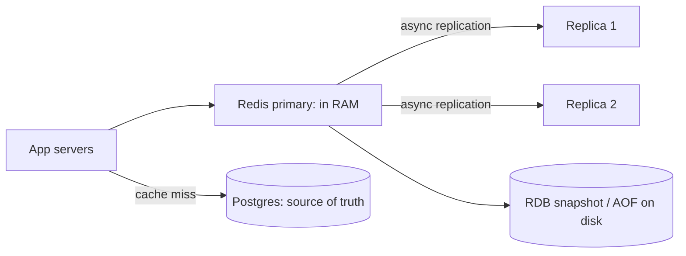
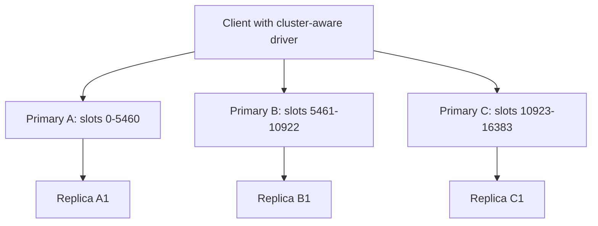
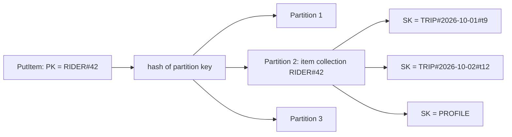

# Key-Value: Redis & DynamoDB

A key-value store gives you `get(key)` and `put(key, value)` at very low latency and huge scale, and almost nothing else. Redis is the in-memory one with rich data structures (cache, counters, leaderboards, locks). DynamoDB is the durable, managed, infinitely scaling one where you design the table around your access patterns. Both show up in nearly every HLD round.

## ⭐ Redis in one picture

**In one line:** Redis is a single-threaded (for commands), in-memory data structure server; every operation on one key is atomic, and most are O(1) or O(log n), so you get sub-millisecond latency.

> **Example:** Swiggy keeps the "restaurant is open / busy" flag, user sessions, OTP attempts and rate-limit counters in Redis. Postgres stays the source of truth for orders.

- **In memory:** dataset must fit in RAM (or across a cluster). Disk is only for persistence and restart.
- **Single-threaded command execution:** no locks inside, every command is atomic. Redis 6+ uses I/O threads for network reads/writes, but commands still run one at a time. One slow command (`KEYS *`, a huge `SMEMBERS`) blocks everyone.
- **Data structures, not just strings:** you push logic to the server (`INCR`, `ZINCRBY`) instead of read-modify-write in the app.
- **Throughput:** about 1 lakh+ ops/sec per instance for simple commands.



**Interview tip:** "Redis is single-threaded, how is it so fast?" Everything is in RAM, no lock contention, efficient data structures, and an event loop (epoll) serving thousands of connections. The bottleneck is usually network, not CPU.

**Common mistake:** running `KEYS *` in production. It is O(n) and blocks the server. Use `SCAN` with a cursor.

## ⭐ Strings, counters and expiry

**In one line:** a string holds bytes up to 512 MB (text, JSON, a number, a serialized object); numeric strings support atomic `INCR`.

| Command / method | What it does | Example |
|---|---|---|
| `SET key val` | Set value (overwrites) | `SET user:42:name "Rahul"` |
| `GET key` | Get value or nil | `GET user:42:name` |
| `SET key val EX sec` | Set with TTL in seconds (`PX` for ms) | `SET otp:9876543210 482913 EX 300` |
| `SET key val NX` | Set only if key does not exist | `SET lock:order:7 uuid-abc NX EX 10` |
| `SET key val XX` | Set only if key exists | `SET session:abc data XX EX 1800` |
| `INCR` / `INCRBY` / `DECR` | Atomic counter | `INCRBY views:video:9 1` |
| `MGET` / `MSET` | Many keys in one round trip | `MGET price:1 price:2 price:3` |
| `EXPIRE key sec` | Set TTL on existing key | `EXPIRE cart:42 86400` |
| `TTL key` | Seconds left (-1 no TTL, -2 no key) | `TTL otp:9876543210` |
| `PERSIST key` | Remove TTL | `PERSIST cart:42` |
| `DEL` / `UNLINK` | Delete (`UNLINK` frees memory in background) | `UNLINK big:key` |
| `SCAN cursor MATCH p COUNT n` | Iterate keys safely | `SCAN 0 MATCH session:* COUNT 100` |

```bash
# Cache-aside for a restaurant menu (Swiggy)
GET menu:rest:501                         # miss -> nil
SET menu:rest:501 '{"items":[...]}' EX 600  # fill from DB with 10 min TTL

# OTP: max 5 attempts in 10 minutes
INCR otp_attempts:9876543210              # -> 1
EXPIRE otp_attempts:9876543210 600 NX     # set TTL only on first attempt (Redis 7)
```

- Expiry is **lazy + active**: an expired key is deleted when someone touches it, plus a background job samples keys with TTL and deletes expired ones.

**Common mistake:** `SET` on a key that had a TTL removes the TTL unless you pass `EX` again (or `KEEPTTL`).

## ⭐ Hashes, lists and sets

**In one line:** a hash is a small map inside one key (an object), a list is a linked list (queue/stack, latest-N), a set is an unordered unique collection.

| Command / method | What it does | Example |
|---|---|---|
| `HSET key f v [f v...]` | Set fields of a hash | `HSET user:42 name Rahul city BLR` |
| `HGET` / `HMGET` | Get one / many fields | `HGET user:42 city` |
| `HGETALL` | All fields (careful on big hashes) | `HGETALL user:42` |
| `HINCRBY key f n` | Atomic increment of a field | `HINCRBY cart:42 item:77 1` |
| `HDEL` | Remove a field | `HDEL cart:42 item:77` |
| `LPUSH` / `RPUSH` | Push at head / tail | `LPUSH notif:42 "order delivered"` |
| `RPOP` / `LPOP` | Pop from tail / head | `RPOP jobs:email` |
| `BLPOP key timeout` | Blocking pop, waits for an item | `BLPOP jobs:email 5` |
| `LRANGE key 0 9` | Range by index | `LRANGE notif:42 0 9` |
| `LTRIM key 0 99` | Keep only first 100 | `LTRIM feed:42 0 99` |
| `SADD` / `SREM` | Add / remove members | `SADD liked:post:9 user:42` |
| `SISMEMBER` | O(1) membership check | `SISMEMBER liked:post:9 user:42` |
| `SCARD` | Count members | `SCARD liked:post:9` |
| `SINTER` / `SUNION` | Set intersection / union | `SINTER followers:a followers:b` |

```bash
# Cart as a hash: field = item id, value = qty
HSET cart:42 item:77 2 item:81 1
HINCRBY cart:42 item:77 1
HGETALL cart:42

# Latest 100 notifications
LPUSH notif:42 '{"t":"Order out for delivery"}'
LTRIM notif:42 0 99

# Simple work queue: producer RPUSH, worker blocks on BLPOP
RPUSH jobs:sms '{"to":"98xxxx","msg":"OTP 4821"}'
BLPOP jobs:sms 0
```

- Small hashes, lists and sets use compact encodings (listpack), so storing an object as a hash is memory-efficient compared with one key per field.
- A list queue loses a job if the worker crashes after `BLPOP`. Use `BLMOVE` into a processing list, or Streams.

**Common mistake:** storing a whole user as a JSON string and doing GET, modify, SET from two servers. Last writer wins. Use `HSET`/`HINCRBY` on fields, or a Lua script.

## ⭐ Sorted sets (leaderboards)

**In one line:** a sorted set is a set where each member has a score; it stays ordered by score (skip list + hash), giving O(log n) insert/update and rank queries.

| Command / method | What it does | Example |
|---|---|---|
| `ZADD key score member` | Add or update score | `ZADD lb:ipl:2026 1520 user:42` |
| `ZINCRBY key n member` | Atomic score increment | `ZINCRBY lb:ipl:2026 50 user:42` |
| `ZRANGE key start stop [REV] [WITHSCORES]` | Members by rank | `ZRANGE lb:ipl:2026 0 9 REV WITHSCORES` |
| `ZRANGE key min max BYSCORE` | Members by score range | `ZRANGE delayed:jobs 0 1727950000 BYSCORE` |
| `ZREVRANK key member` | Rank from top (0-based) | `ZREVRANK lb:ipl:2026 user:42` |
| `ZSCORE` | Score of a member | `ZSCORE lb:ipl:2026 user:42` |
| `ZREM` / `ZREMRANGEBYSCORE` | Remove members | `ZREMRANGEBYSCORE ratelimit:42 0 1727949940000` |
| `ZCARD` / `ZCOUNT` | Size / count in score range | `ZCOUNT lb:ipl:2026 1000 +inf` |

```bash
# Dream11-style fantasy leaderboard
ZINCRBY lb:match:881 64 team:42          # player scored, team gets points
ZRANGE lb:match:881 0 9 REV WITHSCORES   # top 10
ZREVRANK lb:match:881 team:42            # my rank -> 1530 (0-based)
```

Uses: leaderboards, top-K, delayed job queues (score = run-at timestamp), sliding-window rate limiter (score = request timestamp), feed ranking. See [Leaderboard](../02-questions/t2-16-leaderboard.md), [Counting & top-K](../01-topics/15-counting-top-k.md).

**Interview tip:** "Leaderboard for 10 crore users?" One sorted set handles a few crore members (about 100 bytes each). Beyond that shard by score range or region, or keep exact ranks for the top and approximate (bucketed) ranks for the long tail.

**Common mistake:** using `ZRANGE ... 0 -1` on a huge set. It returns everything and blocks Redis.

## Streams, HyperLogLog, bitmaps and geo

**In one line:** Streams are an append-only log with consumer groups (mini Kafka), HyperLogLog counts unique items in 12 KB, bitmaps are bit arrays for yes/no per id, and geo indexes lat/long for radius search.

| Command / method | What it does | Example |
|---|---|---|
| `XADD key * f v` | Append an entry (auto id) | `XADD orders:events * order 991 status PLACED` |
| `XGROUP CREATE key g $ MKSTREAM` | Create consumer group | `XGROUP CREATE orders:events billing $ MKSTREAM` |
| `XREADGROUP GROUP g c COUNT n BLOCK ms STREAMS key >` | Read new entries as consumer `c` | `XREADGROUP GROUP billing w1 COUNT 10 BLOCK 5000 STREAMS orders:events >` |
| `XACK key g id` | Mark processed | `XACK orders:events billing 1727950000000-0` |
| `XPENDING` / `XAUTOCLAIM` | See / take over stuck messages | `XAUTOCLAIM orders:events billing w2 60000 0` |
| `PFADD key el...` | Add to HyperLogLog | `PFADD uv:2026-10-03 user:42` |
| `PFCOUNT key...` | Approx unique count (~0.81% error) | `PFCOUNT uv:2026-10-03` |
| `SETBIT key offset 1` | Set one bit | `SETBIT active:2026-10-03 42 1` |
| `BITCOUNT key` | Count set bits | `BITCOUNT active:2026-10-03` |
| `GEOADD key lon lat member` | Add a location | `GEOADD riders 77.5946 12.9716 rider:7` |
| `GEOSEARCH key FROMLONLAT lon lat BYRADIUS r km ASC COUNT n` | Nearby members | `GEOSEARCH riders FROMLONLAT 77.59 12.97 BYRADIUS 3 km ASC COUNT 10` |

- **Streams vs Kafka:** Streams are great for small/medium event pipelines inside one Redis; Kafka wins for huge retention, replay over days and very high throughput. See [Message queues & Kafka](../01-topics/07-message-queues-kafka.md).
- **HyperLogLog:** daily unique visitors for Flipkart with 12 KB per key, at ~1% error. `PFMERGE` for weekly uniques.
- **Bitmaps:** "was user N active today" for 10 crore users = 12.5 MB per day.
- **Geo** is a sorted set with geohash scores. Good for "nearest delivery partners", see [Geospatial](../01-topics/13-geospatial.md) and [Uber](../02-questions/t1-06-uber.md).

**Common mistake:** using a Set for unique visitor counts at scale. It stores every id; HyperLogLog gives a near-exact count in fixed memory.

## ⭐ Atomicity: MULTI/EXEC and Lua

**In one line:** single commands are already atomic; for several commands use `MULTI/EXEC` (queued, run together) or a Lua script (runs atomically on the server, can branch on values).

| Command / method | What it does | Example |
|---|---|---|
| `MULTI` ... `EXEC` | Queue commands, run them back to back with nothing in between | `MULTI` / `INCR a` / `INCR b` / `EXEC` |
| `WATCH key` | Optimistic lock: `EXEC` fails if key changed | `WATCH stock:sku:9` |
| `DISCARD` | Cancel the queued transaction | `DISCARD` |
| `EVAL script numkeys keys... args...` | Run Lua atomically | see below |
| `EVALSHA sha ...` | Run a cached script by hash | `EVALSHA 3f2a... 1 lock:x id` |

```bash
# Safe lock release: delete only if I still own the lock
EVAL "if redis.call('GET', KEYS[1]) == ARGV[1] then
        return redis.call('DEL', KEYS[1])
      else return 0 end" 1 lock:order:7 uuid-abc

# Fixed-window rate limit: 100 req per minute per user
EVAL "local c = redis.call('INCR', KEYS[1])
      if c == 1 then redis.call('EXPIRE', KEYS[1], 60) end
      return c" 1 rl:user:42:202610031205
```

- `MULTI/EXEC` has **no rollback**. If one command fails (wrong type), others still run. It only guarantees isolation (no interleaving).
- Lua scripts block the server while running. Keep them short.
- In Cluster mode, all keys in one MULTI or script must be in the **same hash slot** (use hash tags `{user:42}`).

**Interview tip:** "Check stock and decrement atomically in Redis?" Lua script: GET stock, if > 0 then DECR and return 1, else 0. No race because Redis runs the script as one unit. See [Flash sale](../02-questions/t2-15-flash-sale.md).

**Common mistake:** calling `MULTI/EXEC` a transaction like SQL. No rollback, no conditional logic inside; use `WATCH` or Lua for that.

## ⭐ Persistence: RDB vs AOF

**In one line:** RDB takes periodic point-in-time snapshots; AOF logs every write command and replays it on restart; production often uses both.

| | RDB snapshot | AOF (append-only file) |
|---|---|---|
| How | `fork()` child writes whole dataset to a `.rdb` file | Every write command appended to a log |
| Data loss on crash | Since last snapshot (minutes) | `appendfsync everysec`: about 1 second; `always`: none but slow |
| File size | Compact | Bigger; rewritten (compacted) by `BGREWRITEAOF` |
| Restart speed | Fast load | Slower replay (Redis 7 multi-part AOF with RDB base helps) |
| Cost | Fork can spike memory (copy-on-write) on big datasets | fsync disk I/O |
| Use | Backups, fast restart, replicas full sync | Durability-sensitive data |

- Config: `save 900 1` (snapshot if 1 change in 15 min), `appendonly yes`, `appendfsync everysec`.
- Pure cache? Persistence can be off; the DB refills it.

**Interview tip:** "Can Redis be your primary database?" For data where losing about a second on a crash is acceptable, with AOF everysec + replicas, yes. For money or orders, keep a durable DB as the source of truth.

**Common mistake:** thinking replication equals durability. Replication is async; a primary can ack a write and crash before replicas get it.

## ⭐ Eviction policies

**In one line:** when `maxmemory` is hit, the eviction policy decides which keys to delete (or to reject writes).

| Policy | Evicts | Use when |
|---|---|---|
| `noeviction` (default) | Nothing; writes return OOM error | Redis is a store, not a cache (queues, locks) |
| `allkeys-lru` | Least recently used, any key | General cache (most common choice) |
| `allkeys-lfu` | Least frequently used, any key | Cache with stable hot set (popular menus) |
| `volatile-lru` | LRU among keys with TTL only | Mix of cache keys (TTL) and permanent keys |
| `volatile-lfu` | LFU among keys with TTL | Same, frequency-based |
| `volatile-ttl` | Keys closest to expiry | You set TTL by importance |
| `allkeys-random` / `volatile-random` | Random | Uniform access patterns |

- LRU/LFU are **approximate**: Redis samples a few keys (`maxmemory-samples 5`) and evicts the best candidate. Cheap and close enough.
- Set `maxmemory` to about 70–80% of RAM to leave room for fork during RDB/AOF rewrite.

**Common mistake:** using `noeviction` for a cache. When memory fills, every `SET` fails and the app breaks. Also: `volatile-*` with no TTL keys behaves like `noeviction`.

## ⭐ Replication, Sentinel and Cluster

**In one line:** replication copies a primary to replicas (async); Sentinel watches them and promotes a replica on failure; Cluster shards keys across many primaries using 16384 hash slots.



| | Sentinel | Cluster |
|---|---|---|
| Solves | High availability (auto failover) | HA + horizontal scaling (sharding) |
| Data | Whole dataset on one primary | Split across N primaries |
| Keys mapping | n/a | `slot = CRC16(key) mod 16384` |
| Multi-key ops | All allowed | Only if keys are in the same slot (hash tags `{...}`) |
| Client | Asks Sentinel for current primary | Follows `MOVED` / `ASK` redirects, caches slot map |
| Use when | Data fits one machine's RAM | Data or throughput exceeds one machine |

- **Hash tags:** only the part inside `{}` is hashed. `cart:{42}` and `wishlist:{42}` land in the same slot, so a Lua script can touch both.
- Resharding moves slots between nodes online.
- Failover can lose the last few acknowledged writes (async replication). `WAIT numreplicas timeout` reduces this, it does not remove it.
- Managed options: AWS ElastiCache / MemoryDB, Redis Cloud.

**Interview tip:** "Why 16384 slots and not consistent hashing?" Fixed slots make rebalancing explicit (move slot ranges), and the slot map is small enough to gossip in heartbeats. Compare with [Sharding & consistent hashing](../01-topics/04-sharding-consistent-hashing.md).

**Common mistake:** expecting `MGET user:1 user:2` to work across slots in Cluster. It fails with CROSSSLOT unless keys share a hash tag.

## Pub/Sub

**In one line:** `PUBLISH channel msg` pushes a message to every client currently `SUBSCRIBE`d; fire-and-forget, nothing is stored.

```bash
SUBSCRIBE order:991:status          # rider app / websocket server listens
PUBLISH order:991:status "PICKED_UP"
PSUBSCRIBE order:*:status           # pattern subscribe
```

- Offline subscribers miss messages. No ack, no replay. Use Streams or Kafka when delivery matters.
- Good for fan-out across websocket servers: each server subscribes, and whichever holds the user's socket pushes it. See [Real-time communication](../01-topics/08-real-time-communication.md) and [WhatsApp chat](../02-questions/t1-04-whatsapp-chat.md).

**Common mistake:** using Pub/Sub as a job queue. If no worker is listening at that moment, the job is lost.

## Redis vs Memcached

| | Redis | Memcached |
|---|---|---|
| Data types | Strings, hashes, lists, sets, sorted sets, streams, HLL, geo | Strings (blobs) only |
| Threads | Single-threaded commands (I/O threads in 6+) | Multi-threaded |
| Persistence | RDB, AOF | None |
| Replication / HA | Replicas, Sentinel, Cluster | None built in (client-side sharding) |
| Atomic ops | INCR, Lua, MULTI | `incr`, `cas` |
| Max value | 512 MB | 1 MB default |
| Pick when | Almost always: cache + counters + structures | Pure, simple, huge multi-core cache of blobs |

## ⭐ Redis use cases

| Use case | Structure / commands | Link |
|---|---|---|
| Cache (cache-aside, TTL) | `GET` / `SET EX`, `allkeys-lru` | [Caching](../01-topics/05-caching.md) |
| Session store | Hash + `EXPIRE` sliding TTL | [Scaling basics](../01-topics/01-scaling-basics.md) |
| Rate limiter | `INCR` + `EXPIRE` (fixed window), sorted set or Lua token bucket | [Rate limiting](../01-topics/11-rate-limiting.md), [Rate limiter](../02-questions/t1-02-rate-limiter.md) |
| Leaderboard | Sorted set `ZINCRBY`, `ZREVRANK` | [Leaderboard](../02-questions/t2-16-leaderboard.md) |
| Distributed lock | `SET key id NX PX 10000` + Lua release | [Locks & contention](../01-topics/09-locks-and-contention.md) |
| Seat hold / inventory hold | `SET seat:x user NX EX 600` | [BookMyShow](../02-questions/t1-05-bookmyshow.md), [Flash sale](../02-questions/t2-15-flash-sale.md) |
| Idempotency keys | `SET idem:key result NX EX 86400` | [Idempotency & retries](../01-topics/10-idempotency-retries.md) |
| Nearby drivers | `GEOADD` / `GEOSEARCH` | [Uber](../02-questions/t1-06-uber.md) |
| Typeahead top suggestions | Sorted set per prefix | [Typeahead](../02-questions/t1-10-typeahead.md) |

**Interview tip:** for a Redis lock, always mention: random owner value, TTL, release via Lua compare-and-delete, and a **fencing token** if the protected resource must reject a stale lock holder (Redlock alone is debated).

## ⭐ DynamoDB data model: partition key and sort key

**In one line:** DynamoDB is a managed key-value/document store; every item has a **partition key** (hashed to pick a physical partition) and optionally a **sort key** (orders items inside that partition).

> **Example:** Uber trip history. Partition key `rider_id`, sort key `trip_time#trip_id`. "Last 20 trips of rider 42" is one `Query` on one partition, already sorted.



- **Primary key** = partition key alone (simple) or partition key + sort key (composite). Must be unique.
- **Item collection** = all items sharing a partition key. `Query` reads it with sort key conditions: `=`, `<`, `>`, `BETWEEN`, `begins_with`.
- Items are schemaless (except key attributes), max **400 KB** per item.
- Each physical partition: up to about **3000 RCU and 1000 WCU** per second and ~10 GB. DynamoDB splits partitions automatically as data or traffic grows.
- **Consistency:** reads are eventually consistent by default (half the cost); `ConsistentRead=true` for strong reads on the base table (not on GSIs).
- Storage engine under the hood is replicated across 3 AZs; writes ack after 2 of 3 replicas.

**Interview tip:** "How do you pick a partition key?" High cardinality, evenly spread traffic, and it should be what your main queries filter on with equality. `user_id`, `order_id`, `device_id` are good; `status`, `country`, `date` are bad.

**Common mistake:** designing tables like SQL (one per entity, normalized) and then needing joins. DynamoDB has no joins.

## ⭐ GSI vs LSI

**In one line:** a secondary index gives another key to query by; a GSI has a different partition key (a new "table view"), an LSI keeps the same partition key with a different sort key.

| | GSI (Global Secondary Index) | LSI (Local Secondary Index) |
|---|---|---|
| Keys | Any partition key + optional sort key | Same partition key, different sort key |
| When created | Any time | Only at table creation |
| Consistency | Eventually consistent only | Strong or eventual |
| Capacity | Own RCU/WCU (throttled GSI can throttle base writes) | Shares the table's |
| Size limit | None | 10 GB per item collection |
| Limit per table | 20 (default) | 5 |
| Projection | KEYS_ONLY, INCLUDE, ALL | Same |

- Every write to the base table that touches indexed attributes is also written to the GSI (extra WCU).
- **Sparse index:** items without the GSI key attribute are not in the GSI. Great for "only active orders".

**Common mistake:** adding an LSI "for later". It must exist at creation and caps each partition key's collection at 10 GB. Prefer GSIs.

## Capacity modes and single-table design

**In one line:** on-demand mode bills per request and absorbs spikes; provisioned mode sets RCU/WCU (with auto scaling) and is cheaper for steady traffic.

| | On-demand | Provisioned |
|---|---|---|
| Billing | Per read/write request unit | Per hour for set RCU/WCU |
| Good for | Spiky or unknown traffic, new apps | Predictable load, cost-sensitive |
| Throttling | Rare (scales to 2x previous peak instantly) | When you exceed capacity (burst credits help briefly) |

- 1 RCU = one strongly consistent read of up to 4 KB per second (or two eventually consistent). 1 WCU = one write of up to 1 KB per second. Transactions cost 2x.

**Single-table design:** put several entity types in one table, using generic keys (`PK`, `SK`) with prefixes, so one `Query` fetches related items together (pre-joined).

| PK | SK | Attributes |
|---|---|---|
| `USER#42` | `PROFILE` | name, phone |
| `USER#42` | `ORDER#2026-10-03#991` | total, status |
| `USER#42` | `ADDR#home` | lat, lng |
| `ORDER#991` | `ITEM#1` | name, qty |

`Query PK = USER#42` returns profile + orders + addresses in one call. `begins_with(SK, 'ORDER#')` gets only orders, newest first with `ScanIndexForward=false`.

**Common mistake:** single-table design for an app whose access patterns are not known yet. It is powerful but rigid; a new query may need a new GSI or a migration.

## ⭐ DynamoDB API methods

| Command / method | What it does | Example |
|---|---|---|
| `PutItem` | Create or replace an item | `put_item(Item={...})` |
| `GetItem` | Read one item by full primary key | `get_item(Key={'PK':'USER#42','SK':'PROFILE'})` |
| `Query` | Items in one partition, filter by sort key, sorted | `KeyConditionExpression='PK = :p AND begins_with(SK, :o)'` |
| `Scan` | Reads the whole table (avoid: costs all RCUs, slow) | Only for exports, backfills, tiny tables |
| `UpdateItem` | Change attributes in place, atomic counters | `UpdateExpression='SET #s = :s ADD views :one'` |
| `ConditionExpression` | Write only if condition holds (optimistic lock, no overwrite) | `attribute_not_exists(PK)`, `version = :v` |
| `DeleteItem` | Delete by key (optionally conditional) | `delete_item(Key=..., ConditionExpression=...)` |
| `BatchGetItem` / `BatchWriteItem` | Up to 100 reads / 25 writes per call, not atomic | Bulk load; retry `UnprocessedItems` |
| `TransactWriteItems` | Up to 100 actions, all-or-nothing, across tables | Debit wallet + create order |
| `TransactGetItems` | Consistent multi-item read | Read order + payment together |
| DynamoDB Streams | Ordered change log per item (24 h) → Lambda, Kinesis | Update search index, send notifications |
| TTL | Auto-delete items after an epoch attribute (free, within ~48 h) | `expires_at` on sessions, OTPs |

```python
import boto3
from boto3.dynamodb.conditions import Key

table = boto3.resource("dynamodb").Table("uber")

# Start a trip only if this trip id does not exist (idempotent create)
table.put_item(
    Item={"PK": "RIDER#42", "SK": "TRIP#2026-10-03T09:15#t991",
          "status": "REQUESTED", "driver_id": None, "version": 1},
    ConditionExpression="attribute_not_exists(PK)",
)

# Assign driver only if still REQUESTED (no two drivers get the same trip)
table.update_item(
    Key={"PK": "RIDER#42", "SK": "TRIP#2026-10-03T09:15#t991"},
    UpdateExpression="SET #s = :acc, driver_id = :d ADD version :one",
    ConditionExpression="#s = :req",
    ExpressionAttributeNames={"#s": "status"},
    ExpressionAttributeValues={":acc": "ACCEPTED", ":req": "REQUESTED",
                               ":d": "DRIVER#7", ":one": 1},
)

# Last 20 trips of rider 42, newest first
resp = table.query(
    KeyConditionExpression=Key("PK").eq("RIDER#42") & Key("SK").begins_with("TRIP#"),
    ScanIndexForward=False, Limit=20,
)
```

- `FilterExpression` is applied **after** reading; you still pay for all items read. Put selective conditions in the key.
- Results are paged at 1 MB; follow `LastEvaluatedKey`.

**Interview tip:** "How do you prevent two drivers accepting the same ride in DynamoDB?" `UpdateItem` with `ConditionExpression status = REQUESTED`. The losing write gets `ConditionalCheckFailedException`.

**Common mistake:** using `Scan` + `FilterExpression` in an API path. It reads (and bills) the whole table every time.

## ⭐ Hot partitions

**In one line:** a hot partition is one partition key getting far more traffic than others; since a partition caps at ~3000 RCU / 1000 WCU, it throttles even when total table capacity is free.

| Cause | Example | Fix |
|---|---|---|
| Low cardinality key | PK = `status` or `date` | Use a high-cardinality key |
| Celebrity / viral key | PK = `MATCH#IND-PAK` for live score | Cache in front (DAX / Redis), read replicas of the item |
| Write-heavy single key | Counter for one product's views | **Write sharding**: `PK = PRODUCT#9#<rand 0..9>`, sum on read |
| Time-based key | PK = today's date for all events | Prefix with a hash/bucket, or use `device_id` |

- **Adaptive capacity** moves capacity to hot partitions and can split a hot key range, but one single key is still limited.
- **DAX** is DynamoDB's in-memory read-through cache (microsecond reads).

**Common mistake:** hearing "DynamoDB scales infinitely" and ignoring key design. It scales across keys, not within one key.

## ⭐ Access-pattern-first modeling: Uber trips

**In one line:** in DynamoDB you list every query first, then design keys and GSIs so each query is a single `GetItem` or `Query`.

Step 1: access patterns.

| # | Access pattern | Frequency |
|---|---|---|
| 1 | Get trip by trip id | Very high |
| 2 | Rider's trip history, newest first | High |
| 3 | Driver's trips for a day (earnings) | Medium |
| 4 | Active (ongoing) trips in a city for ops dashboard | Low |
| 5 | Update trip status with no lost updates | Very high |

Step 2: keys.

| Entity | PK | SK | GSI1PK | GSI1SK | GSI2PK (sparse) |
|---|---|---|---|---|---|
| Trip | `TRIP#t991` | `TRIP#t991` | `DRIVER#7` | `2026-10-03T09:15` | `ACTIVE#BLR#<0..9>` only while ongoing |
| Rider trip ref | `RIDER#42` | `TRIP#2026-10-03T09:15#t991` | | | |

Step 3: map patterns to calls.

| # | Call |
|---|---|
| 1 | `GetItem PK=TRIP#t991, SK=TRIP#t991` |
| 2 | `Query PK=RIDER#42, begins_with(SK,'TRIP#'), ScanIndexForward=false` |
| 3 | `Query GSI1 PK=DRIVER#7, SK BETWEEN '2026-10-03' AND '2026-10-04'` |
| 4 | `Query GSI2` for each of the 10 shards `ACTIVE#BLR#0..9`, merge |
| 5 | `UpdateItem ... ConditionExpression version = :v` (optimistic lock) |

- Rider history is a small duplicated item; write the trip and the rider ref together with `TransactWriteItems`, or update the ref from DynamoDB Streams.
- When the trip ends, `REMOVE GSI2PK` so it drops out of the sparse "active" index.
- Old trips: TTL or export to S3 for analytics. See [Uber](../02-questions/t1-06-uber.md), [Distributed KV store](../02-questions/t2-20-distributed-kv-store.md).

**Interview tip:** say "I'll list access patterns first" before drawing a DynamoDB table. Interviewers look for exactly that.

## When to use / when not

| Use Redis when | Use DynamoDB when | Avoid both when |
|---|---|---|
| Sub-ms reads, cache, counters, leaderboards, locks, rate limits | Durable KV at any scale, serverless, known access patterns | You need ad-hoc queries, joins, reporting |
| Data fits in RAM (or cluster RAM) | Single-digit ms is fine, predictable cost per request | Access patterns keep changing |
| Losing ~1 s of writes on crash is OK | Need multi-AZ durability without ops work | Complex multi-row transactions are the core (use Postgres) |

## Where it shows up in system design

- [Caching](../01-topics/05-caching.md), [Rate limiting](../01-topics/11-rate-limiting.md), [Locks & contention](../01-topics/09-locks-and-contention.md)
- [URL shortener](../02-questions/t1-01-url-shortener.md): short code → URL in DynamoDB/Redis
- [Rate limiter](../02-questions/t1-02-rate-limiter.md), [Leaderboard](../02-questions/t2-16-leaderboard.md), [Flash sale](../02-questions/t2-15-flash-sale.md)
- [Uber](../02-questions/t1-06-uber.md): geo in Redis, trips in DynamoDB
- [Distributed KV store](../02-questions/t2-20-distributed-kv-store.md): how Dynamo-style stores work inside

## Checklist

- [ ] I can explain why single-threaded Redis is fast and which commands block it
- [ ] I can pick the right Redis structure and commands for cache, session, counter, queue, leaderboard and unique counts
- [ ] I can write a Redis lock with `SET NX PX` and a Lua compare-and-delete release
- [ ] I can compare RDB vs AOF and choose an eviction policy for a cache
- [ ] I can explain Sentinel vs Cluster, hash slots and hash tags
- [ ] I can explain DynamoDB partition key, sort key, item collections and GSI vs LSI
- [ ] I can use Query, UpdateItem with ConditionExpression and TransactWriteItems, and explain why Scan is avoided
- [ ] I can detect and fix a hot partition with better keys or write sharding
- [ ] I can model a DynamoDB table access-pattern-first for a given app
