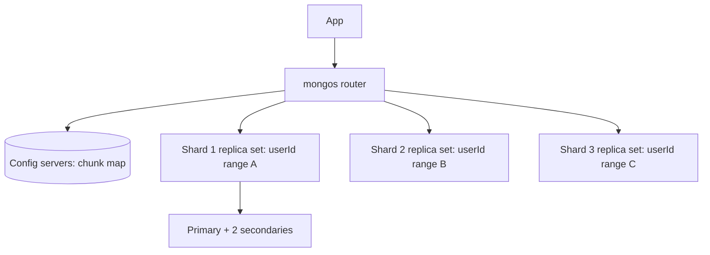
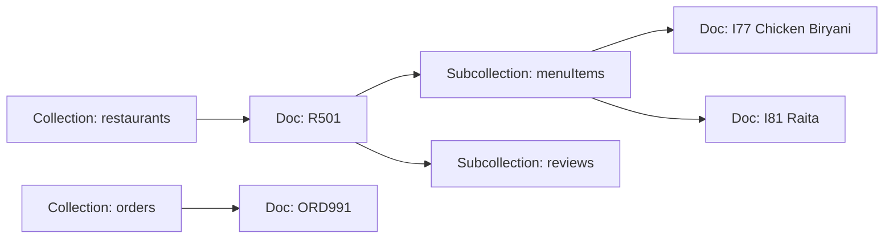

# Document: MongoDB & Firestore

A document database stores JSON-like documents, so one read returns a whole object (an order with its items, a restaurant with its menu) without joins. MongoDB is the general-purpose one you run or rent (Atlas). Firestore is Google's serverless one with real-time listeners and per-read pricing. Interviews focus on: embed vs reference, schema design, indexes, shard key choice, and when a document DB is the wrong pick.

## ⭐ Document model

**In one line:** data is stored as documents (BSON in MongoDB, up to 16 MB) grouped in collections; each document can have nested objects and arrays and its own shape.

> **Example:** a Swiggy restaurant document holds name, address, cuisines, timings and ratings summary in one place. The app screen needs exactly that, so one read renders the page.

```javascript
// collection: restaurants
{
  _id: ObjectId("66fe1a..."),
  name: "Meghana Foods",
  city: "Bangalore",
  cuisines: ["Biryani", "Andhra"],
  location: { type: "Point", coordinates: [77.6101, 12.9352] },
  timings: { open: "11:00", close: "23:30" },
  rating: { avg: 4.4, count: 18234 },
  isOpen: true
}
```

| SQL term | MongoDB term |
|---|---|
| Database | Database |
| Table | Collection |
| Row | Document |
| Column | Field |
| Primary key | `_id` (ObjectId by default: timestamp + random + counter) |
| JOIN | Embedding, or `$lookup` in aggregation |
| Index | Index (B-tree in WiredTiger) |

- **Flexible schema:** two documents in a collection can have different fields. You can still enforce shape with `$jsonSchema` validation.
- **Atomic per document:** a single-document update is always atomic, even if it changes nested arrays. That is why good modeling puts data that changes together in one document.
- **Storage engine:** WiredTiger, with B-tree indexes, document-level concurrency and compression.

**Interview tip:** "Schemaless means no schema design?" No. The schema lives in your code and access patterns. You design it around reads, not around normalization.

**Common mistake:** treating MongoDB like SQL: one collection per table, then lots of `$lookup`. You get the cost of joins without the optimizer of a relational DB.

## ⭐ Embed vs reference

**In one line:** embed data that is read together and owned by the parent; reference data that is large, shared, unbounded or changes independently.

| Question | Embed | Reference |
|---|---|---|
| Relationship | One-to-one, one-to-few | One-to-many (large), many-to-many |
| Read together? | Almost always | Often separately |
| Growth | Bounded (a few to a few hundred) | Unbounded (can grow forever) |
| Updated independently? | Rarely | Often, by different flows |
| Shared by many parents? | No | Yes (duplication would be painful) |
| Doc size risk | Stays well under 16 MB | Would hit 16 MB |

| Example | Choice | Why |
|---|---|---|
| User → addresses (2–5) | Embed array | Small, always shown with user |
| Order → line items | Embed | Snapshot at order time; never changes after |
| Order → restaurant | Reference + copy name/logo | Restaurant changes; order needs only a snapshot |
| Restaurant → reviews (lakhs) | Reference (reviews collection with `restaurantId`) | Unbounded |
| Restaurant → latest 5 reviews | Embed a subset | Fast page load (subset pattern) |
| Student ↔ courses | Reference arrays of ids | Many-to-many |
| Product → current price | Embed in product, reference from cart | Cart must see price changes |

```javascript
// Order: items embedded, restaurant referenced with a few copied fields
{
  _id: "ORD991",
  userId: "U42",
  restaurant: { _id: "R501", name: "Meghana Foods" },   // extended reference
  items: [
    { itemId: "I77", name: "Chicken Biryani", qty: 2, price: 320 },
    { itemId: "I81", name: "Raita", qty: 1, price: 40 }
  ],
  total: 680,
  status: "PLACED",
  createdAt: ISODate("2026-10-03T09:15:00Z")
}
```

**Interview tip:** say the rule out loud: "What is read together is stored together. Unbounded arrays go to their own collection."

**Common mistake:** embedding an ever-growing array (all comments, all orders of a user). The document grows, updates get slower, and eventually hits 16 MB.

## Schema design patterns

**In one line:** a few named patterns solve the common document-modeling problems.

| Pattern | Problem | Idea | Example |
|---|---|---|---|
| **Bucket** | Millions of tiny docs (IoT, time series) | Group many readings into one doc per time window | One doc per rider per hour holding 360 GPS pings |
| **Subset** | Big doc, page shows only part | Embed the hot subset, keep the rest in another collection | Latest 5 reviews in restaurant doc, all reviews separate |
| **Extended reference** | Need a `$lookup` on every read | Copy a few rarely-changing fields of the referenced doc | Order stores restaurant name + logo, not just id |
| Computed | Recomputing aggregates on every read | Store precomputed values, update on write | `rating.avg`, `rating.count` on restaurant |
| Outlier | A few docs are huge (celebrity) | Flag them and overflow into extra docs | Restaurant with 50k menu combos gets overflow docs |
| Schema versioning | Shape changes over time | `schemaVersion` field, migrate lazily | Old docs v1, new v2 |

```javascript
// Bucket pattern: rider location pings for one hour
{
  riderId: "RD7",
  hour: ISODate("2026-10-03T09:00:00Z"),
  count: 3,
  pings: [
    { t: ISODate("2026-10-03T09:00:10Z"), lat: 12.9352, lng: 77.6101 },
    { t: ISODate("2026-10-03T09:00:20Z"), lat: 12.9356, lng: 77.6105 },
    { t: ISODate("2026-10-03T09:00:30Z"), lat: 12.9361, lng: 77.6110 }
  ]
}
```

- MongoDB 5+ also has native **time-series collections** that apply bucketing internally.

**Common mistake:** duplicating fields (extended reference) that change often. Then every change must fan out to thousands of docs.

## ⭐ MongoDB shell methods

| Command / method | What it does | Example |
|---|---|---|
| `insertOne` / `insertMany` | Insert documents | `db.orders.insertOne({ userId: "U42", total: 680 })` |
| `find(filter, projection)` | Query with filter and field selection | `db.restaurants.find({ city: "Bangalore" }, { name: 1, rating: 1 })` |
| Comparison operators | `$eq $ne $gt $gte $lt $lte $in $nin` | `{ "rating.avg": { $gte: 4 } }` |
| Logical / array operators | `$and $or $not`, `$all $elemMatch $size`, `$exists` | `{ cuisines: { $in: ["Biryani"] } }` |
| `.sort().skip().limit()` | Order and paginate | `.sort({ "rating.avg": -1 }).limit(20)` |
| `findOne` | First matching doc | `db.users.findOne({ phone: "98xxxx" })` |
| `updateOne` / `updateMany` | Update with operators | `db.orders.updateOne({ _id: "ORD991" }, { $set: { status: "DELIVERED" } })` |
| `$set` / `$unset` | Set / remove fields | `{ $set: { isOpen: false } }` |
| `$inc` | Atomic increment | `{ $inc: { "rating.count": 1 } }` |
| `$push` / `$addToSet` / `$pull` | Array append / append-unique / remove | `{ $push: { items: { itemId: "I90", qty: 1 } } }` |
| `upsert: true` | Insert if no match | `updateOne({ _id: "U42" }, { $setOnInsert: {...} }, { upsert: true })` |
| `findOneAndUpdate` | Update and return the doc atomically | `{ returnDocument: "after" }` |
| `deleteOne` / `deleteMany` | Delete | `db.carts.deleteOne({ userId: "U42" })` |
| `aggregate([...])` | Pipeline: `$match $group $lookup $sort $project $unwind $limit` | see below |
| `createIndex` | Build index | `db.orders.createIndex({ userId: 1, createdAt: -1 })` |
| `.explain("executionStats")` | Show plan: `IXSCAN` vs `COLLSCAN`, docs examined | `db.orders.find({...}).explain("executionStats")` |
| `bulkWrite` | Many writes in one round trip | Bulk menu price update |

```javascript
// Top 10 open biryani places in Bangalore, only fields the list needs
db.restaurants.find(
  { city: "Bangalore", isOpen: true, cuisines: "Biryani", "rating.avg": { $gte: 4 } },
  { name: 1, "rating.avg": 1, _id: 0 }
).sort({ "rating.avg": -1 }).limit(10);

// Add item to cart, or create the cart if missing (upsert)
db.carts.updateOne(
  { userId: "U42" },
  { $push: { items: { itemId: "I77", qty: 1 } },
    $setOnInsert: { createdAt: new Date() } },
  { upsert: true }
);

// Revenue per restaurant for today, with restaurant name
db.orders.aggregate([
  { $match: { status: "DELIVERED", createdAt: { $gte: ISODate("2026-10-03") } } },
  { $group: { _id: "$restaurant._id", revenue: { $sum: "$total" }, orders: { $sum: 1 } } },
  { $sort: { revenue: -1 } },
  { $limit: 5 },
  { $lookup: { from: "restaurants", localField: "_id", foreignField: "_id", as: "r" } },
  { $project: { _id: 0, name: { $first: "$r.name" }, revenue: 1, orders: 1 } }
]);
```

- Put `$match` (and `$sort` on an indexed field) **first** in a pipeline so it can use an index and shrink the data early.
- `skip` on big offsets is slow; use range pagination (`createdAt < lastSeen`).

**Interview tip:** in `explain("executionStats")`, compare `nReturned` with `totalDocsExamined`. 20 returned vs 2 lakh examined means a missing or wrong index. `COLLSCAN` = full collection scan.

**Common mistake:** `updateOne({ _id }, { status: "X" })` without an operator. In the old API it replaced the whole document; the modern drivers reject it, but `replaceOne` will do exactly that.

## ⭐ Indexes in MongoDB

**In one line:** MongoDB indexes are B-trees like SQL indexes, with the same leftmost-prefix and ESR rules, plus special types for arrays, text, geo and TTL.

| Index type | Use | Example |
|---|---|---|
| Single field | Simple filter / sort | `createIndex({ phone: 1 }, { unique: true })` |
| Compound | Multi-field filter + sort (ESR order) | `createIndex({ userId: 1, createdAt: -1 })` |
| Multikey | Field is an array; one entry per element | `createIndex({ cuisines: 1 })` |
| Text | Basic word search | `createIndex({ name: "text" })` |
| 2dsphere | Geo near / within | `createIndex({ location: "2dsphere" })` |
| TTL | Auto-delete after time | `createIndex({ createdAt: 1 }, { expireAfterSeconds: 3600 })` |
| Partial | Index only matching docs | `{ partialFilterExpression: { status: "ACTIVE" } }` |
| Hashed | Hashed shard key | `createIndex({ userId: "hashed" })` |

- Covered query: if the filter and projection use only indexed fields (and you exclude `_id` or it is in the index), Mongo answers from the index (`totalDocsExamined: 0`).
- Details of B-tree, compound and covering indexes: see [Indexes](04-indexes.md).

**Common mistake:** a compound index with two array fields. MongoDB does not allow a multikey compound index on more than one array field in the same document.

## ⭐ Transactions, write concern and read concern

**In one line:** single-document writes are atomic; multi-document ACID transactions exist since 4.0 (replica sets) and 4.2 (sharded), but they are slower and meant for the exception, not the norm.

```javascript
const session = db.getMongo().startSession();
session.startTransaction({ readConcern: { level: "snapshot" }, writeConcern: { w: "majority" } });
try {
  const wallets = session.getDatabase("pay").wallets;
  const ledger  = session.getDatabase("pay").ledger;
  wallets.updateOne({ _id: "U42", balance: { $gte: 680 } }, { $inc: { balance: -680 } });
  ledger.insertOne({ userId: "U42", orderId: "ORD991", amount: -680, at: new Date() });
  session.commitTransaction();
} catch (e) {
  session.abortTransaction();   // retry on TransientTransactionError
}
```

| Setting | Values | Meaning |
|---|---|---|
| Write concern `w` | `1`, `"majority"`, number | How many replicas must ack. `majority` (default since 5.0) survives primary failover |
| `j: true` | journal | Ack after written to on-disk journal |
| Read concern | `local`, `majority`, `snapshot`, `linearizable` | `majority` = only data that will not be rolled back |
| Read preference | `primary`, `primaryPreferred`, `secondary`, `nearest` | Where reads go; secondaries can be stale |

- Transactions have a default 60 s limit and hold WiredTiger snapshots, so keep them short.
- If you need transactions everywhere, your model probably belongs in Postgres. See [Transactions & ACID](03-transactions-acid.md).

**Interview tip:** "Is MongoDB ACID?" Yes for single documents always, and for multi-document transactions since 4.0. Good modeling (embedding) avoids most multi-doc transactions.

**Common mistake:** writing with `w: 1` and reading from secondaries, then being surprised the user does not see their own update. Use `majority` and read from primary (or causal consistency sessions) for read-your-writes.

## ⭐ Replica sets and sharding

**In one line:** a replica set is one primary plus secondaries with automatic election; sharding splits a collection across replica sets by a shard key, with `mongos` routers in front.



Replica set:
- Writes go to the **primary**, replicated to secondaries through the **oplog**.
- Primary dies → secondaries hold an election (Raft-like), new primary in ~10 s. Use an odd number of voting members (3 or 5).

Sharding:
- Data is split into **chunks** (ranges of shard key values); the balancer moves chunks between shards.
- Queries that include the shard key are **targeted** to one shard. Without it they are **scatter-gather** to all shards.

| Shard key choice | Good / bad | Why |
|---|---|---|
| `{ userId: "hashed" }` | Good for even writes | Uniform spread; range queries on userId go everywhere |
| `{ restaurantId: 1, createdAt: 1 }` | Good for orders by restaurant | Targeted queries, range by time inside a restaurant |
| `{ createdAt: 1 }` | Bad | Monotonic: all inserts hit the last chunk (hot shard) |
| `{ status: 1 }` | Bad | Low cardinality: a few huge chunks that cannot split |
| `{ city: 1 }` | Bad alone | Bangalore shard becomes hot; add a second field |

- Good shard key = high cardinality, low frequency of any one value, not monotonic, and present in most queries. Since 5.0 you can **reshard** online, but it is expensive. See [Sharding & consistent hashing](../01-topics/04-sharding-consistent-hashing.md).

**Common mistake:** sharding on `_id` with default ObjectId. ObjectIds increase with time, so every insert goes to one shard. Use hashed `_id` or a better key.

## ⭐ Firestore model

**In one line:** Firestore is a serverless document DB from Google: documents live in collections, can have subcollections, every query must be backed by an index, clients can listen to live changes, and you pay per document read.



| Feature | How it works |
|---|---|
| Data model | Collection → document (max 1 MB) → subcollection → document |
| Queries | Equality, range, `in`, `array-contains`, `orderBy`, `limit`, cursors; shallow (a query reads one collection or a collection group) |
| Indexes | Single-field indexes automatic; composite indexes must be declared (console gives a link when a query needs one) |
| Real-time listeners | `onSnapshot` pushes changes to clients (web/mobile) |
| Offline | Mobile/web SDKs cache locally and sync later |
| Security rules | Declarative rules checked on every client read/write |
| Transactions | ACID transactions and batched writes (up to 500 ops) |
| Pricing | Per document read, write, delete + storage + network |
| Limits | ~1 write/sec sustained per document; avoid sequential IDs at high write rates |

```javascript
import { collection, query, where, orderBy, limit, onSnapshot, doc, updateDoc, increment } from "firebase/firestore";

// Live order tracking screen: re-renders when status changes
const unsub = onSnapshot(doc(db, "orders", "ORD991"), (snap) => {
  render(snap.data().status);   // PLACED -> PREPARING -> OUT_FOR_DELIVERY
});

// Top rated open restaurants in a city (needs composite index city + isOpen + rating)
const q = query(collection(db, "restaurants"),
  where("city", "==", "Bangalore"), where("isOpen", "==", true),
  orderBy("rating", "desc"), limit(20));

// Counter: atomic server-side increment
await updateDoc(doc(db, "restaurants", "R501"), { likes: increment(1) });
```

```javascript
// firestore.rules: users can read only their own orders
rules_version = '2';
service cloud.firestore {
  match /databases/{db}/documents {
    match /orders/{orderId} {
      allow read: if request.auth != null && resource.data.userId == request.auth.uid;
      allow write: if false;   // only backend (Admin SDK) writes orders
    }
  }
}
```

- **Cost trap:** a listener on a query that returns 500 docs costs 500 reads on start, plus one read per changed doc. Paginate and keep listeners narrow.
- Hot counters (likes on a viral post): use **distributed counters** (N shard docs, sum on read), because one doc takes ~1 write/sec.
- Firestore is great for mobile apps with real-time UI and small teams. Not for analytics or heavy server-side aggregation (export to BigQuery).

**Interview tip:** "Why do Firestore queries need an index for everything?" So every query costs proportional to the result size, not the collection size. That is what lets it scale without you tuning anything.

**Common mistake:** relying on security rules as filters. Rules are not filters: a query that could return docs the user cannot read fails entirely. The query itself must include `where("userId", "==", uid)`.

## When a document DB beats SQL, and when it does not

| Document DB wins | SQL wins |
|---|---|
| Object read as one unit (catalog item, profile, CMS page) | Heavy joins across many entities (reports, admin panels) |
| Fields vary per item (electronics vs clothes attributes) | Strict relations and constraints (foreign keys, unique across tables) |
| Fast iteration on schema | Multi-row transactions are the core (payments, ledgers, inventory) |
| Horizontal scale with built-in sharding | Ad-hoc analytical queries |
| Mobile real-time sync (Firestore) | Strong consistency across many records by default |

- Many teams use both: Postgres for orders and payments, MongoDB for catalog/menu, Elasticsearch for search. See [SQL vs NoSQL](../01-topics/02-sql-vs-nosql.md) and [Choosing a Database](01-choosing-a-database.md).
- Postgres `JSONB` with GIN indexes covers a lot of "I need flexible fields" cases without a second database.

**Interview tip:** never say "MongoDB because it scales". Say "the menu is read as one unit, attributes vary per item, and we have no cross-entity transactions here, so a document model fits; orders and payments stay in Postgres".

**Common mistake:** choosing MongoDB for a banking ledger or anything with many-to-many relations and reporting. You end up rebuilding joins and constraints in app code.

## ⭐ Example: Swiggy menu and catalog

> **Example:** 3 lakh restaurants, each with 50–500 menu items. Item attributes vary (veg/non-veg, spice level, portion sizes, add-ons, combo slots). The menu page must load in under 100 ms; restaurants edit prices and availability during the day.

Access patterns:
1. Load a restaurant's full menu (very high, read-heavy).
2. Toggle item availability / change price (frequent small writes from restaurant app).
3. Show one item with add-ons on the cart screen.
4. Search dishes across restaurants (goes to Elasticsearch, not Mongo).

Model:
- `restaurants` collection: restaurant info + **categories with embedded items** (bounded: a few hundred items). One read = full menu page.
- Add-on groups embedded inside each item (small, owned by the item).
- For outlier restaurants with thousands of items (cloud kitchens), split per category doc (**outlier / bucket by category**).
- Orders store an **extended reference** snapshot of item name and price at order time.

```javascript
{
  _id: "R501",
  name: "Meghana Foods",
  city: "Bangalore",
  menuVersion: 87,
  categories: [
    { name: "Biryani", items: [
      { itemId: "I77", name: "Chicken Boneless Biryani", price: 320, veg: false,
        available: true, spice: "medium",
        addons: [{ group: "Extras", options: [{ name: "Extra raita", price: 40 }] }] }
    ]}
  ]
}
```

```javascript
// Restaurant app marks one item out of stock: single-document atomic update
db.restaurants.updateOne(
  { _id: "R501", "categories.items.itemId": "I77" },
  { $set: { "categories.$[].items.$[it].available": false }, $inc: { menuVersion: 1 } },
  { arrayFilters: [{ "it.itemId": "I77" }] }
);
db.restaurants.createIndex({ city: 1, "categories.items.itemId": 1 });
```

- Cache the menu in Redis/CDN keyed by `R501:v87`; bump `menuVersion` on every edit so caches invalidate cleanly. See [Caching](../01-topics/05-caching.md).
- Change streams (`db.restaurants.watch()`) push edits to Elasticsearch for dish search. See [Search indexing](../01-topics/14-search-indexing.md).
- Shard key `{ _id: "hashed" }` (restaurant id): every menu read is targeted to one shard.
- Orders, payments and refunds live in Postgres because they need cross-row transactions. See [Food delivery](../02-questions/t2-14-food-delivery.md).

**Interview tip:** explain the boundary: catalog in a document DB (read as a unit, flexible attributes), transactions in SQL, search in Elasticsearch, cache in Redis.

## Where it shows up in system design

- [SQL vs NoSQL](../01-topics/02-sql-vs-nosql.md): picking a data model
- [Food delivery](../02-questions/t2-14-food-delivery.md): menus and catalog
- [Instagram](../02-questions/t2-13-instagram.md): user profiles, post metadata
- [E-commerce inventory](../02-questions/t2-24-ecommerce-inventory.md): product catalog with varying attributes
- [Google Docs](../02-questions/t2-19-google-docs.md): document metadata, real-time listeners idea
- [Sharding & consistent hashing](../01-topics/04-sharding-consistent-hashing.md): shard key choice

## Checklist

- [ ] I can explain the document model and map SQL terms to MongoDB terms
- [ ] I can decide embed vs reference for a relationship and justify it with growth and access pattern
- [ ] I can name and apply the bucket, subset and extended reference patterns
- [ ] I can write MongoDB find, updateOne with $set/$inc/$push, upsert and an aggregate pipeline
- [ ] I can read explain output and design compound, multikey and TTL indexes
- [ ] I can explain multi-document transactions, write concern majority and read preference trade-offs
- [ ] I can explain replica set failover and choose a good shard key, avoiding monotonic keys
- [ ] I can explain Firestore collections, composite indexes, listeners, security rules and per-read pricing
- [ ] I can argue when a document DB beats SQL and when it does not, with the Swiggy menu example
