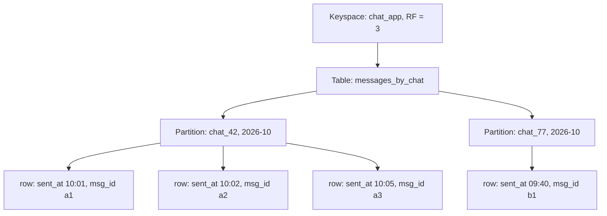
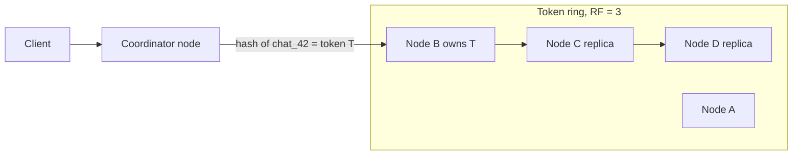
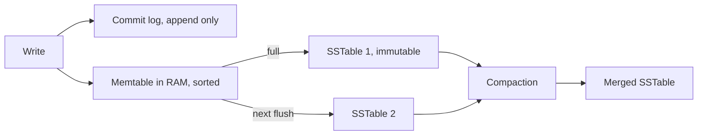

# Wide-column: Cassandra & ScyllaDB

Cassandra is a distributed, masterless, write-heavy database. Data is spread across nodes by partition key, and rows inside a partition stay sorted by clustering columns. It comes up in interviews when writes are very high (chat messages, events, IoT, activity feeds) and the access patterns are known up front.

## ⭐ Data model: keyspace, table, partition, clustering

**In one line:** keyspace = database (replication is set here), table = a group of rows, the partition key decides which node a row lives on, and clustering columns decide the order inside a partition.

- **Keyspace:** the SQL "database". Replication strategy and replication factor (RF) are set here.
- **Table:** columns with a fixed schema (CQL does have a schema). It is called "wide-column" because one partition can hold thousands to millions of rows (cells).
- **Primary key = partition key + clustering columns.** `PRIMARY KEY ((chat_id, bucket), sent_at, msg_id)`.
  - The **partition key** `(chat_id, bucket)` is hashed (Murmur3) into a token. The token picks the node.
  - The **clustering columns** `sent_at, msg_id` define the sorted on-disk order inside the partition. Range queries run on these.
- **Wide partition:** many rows under one partition key. This is a feature (one disk read gives a chat's latest 50 messages), but within limits: keep a partition under ~100 MB and ~100k rows.



| Concept | SQL equivalent | What is different in Cassandra |
|---|---|---|
| Keyspace | Database / schema | Replication is defined here |
| Partition key | Shard key | Hashed to pick the node, must be given in the query |
| Clustering column | Index + ORDER BY | Sorted on disk, range queries are free |
| Row | Row | Can be sparse, null cells are not stored |

**Interview tip:** "Partition key vs clustering key?" Partition key = **where** the data lives (which node). Clustering key = **what order** it is in inside the partition. A query must give the partition key with equality.

**Common mistake:** picking a low-cardinality partition key (like `country` or `status`). All of India's data lands in one partition and one node gets hot.

## ⭐ Query-first modeling: one table per query

**In one line:** in SQL you model entities first and write queries later; in Cassandra you list the queries first, then build one table per query. There are no joins, so denormalize.

Steps:
1. Write down every access pattern: "latest 50 messages of a chat", "a user's chat list sorted by latest activity".
2. One table per query: partition key = what you filter on with equality, clustering = what you sort or range on.
3. Write the same data into multiple tables (the write amplification is fine, writes are cheap).

**Real example: WhatsApp messages.** Query: "latest messages of chat X, older ones on scroll". If a popular group's years of messages go into one partition, the partition grows without bound. So add a **time bucket** (month or day).

```sql
-- Query 1: messages of one chat, latest first
CREATE TABLE messages_by_chat (
    chat_id   uuid,
    bucket    text,          -- '2026-10' (month bucket)
    sent_at   timestamp,
    msg_id    timeuuid,
    sender_id uuid,
    body      text,
    PRIMARY KEY ((chat_id, bucket), sent_at, msg_id)
) WITH CLUSTERING ORDER BY (sent_at DESC, msg_id DESC);

-- Query 2: a user's chat list, latest activity first
CREATE TABLE chats_by_user (
    user_id      uuid,
    last_msg_at  timestamp,
    chat_id      uuid,
    last_preview text,
    PRIMARY KEY ((user_id), last_msg_at, chat_id)
) WITH CLUSTERING ORDER BY (last_msg_at DESC, chat_id ASC);

-- Read: latest 50 messages this month
SELECT sender_id, body, sent_at FROM messages_by_chat
WHERE chat_id = 4f1c... AND bucket = '2026-10'
LIMIT 50;

-- Scroll up: older than the previous page
SELECT * FROM messages_by_chat
WHERE chat_id = 4f1c... AND bucket = '2026-10'
  AND sent_at < '2026-10-03 10:00:00'
LIMIT 50;
```

If the bucket runs out (fewer than 50 this month), the app queries the previous bucket `'2026-09'`.

One catch in `chats_by_user`: `last_msg_at` is a clustering column and cannot be updated. On a new message you delete the old row and insert a new one (which creates a tombstone). That is why many systems keep the chat list in Redis or a cache.

**Interview tip:** say "I list the access patterns first, then one table per pattern. A time bucket keeps partition size bounded." This line signals that you really understand Cassandra.

**Common mistake:** copying a normalized SQL schema into Cassandra and then running queries with `ALLOW FILTERING`.

## ⭐ Ring, consistent hashing and vnodes

**In one line:** all nodes sit on a token ring; the Murmur3 hash of the partition key gives a token, and the first node clockwise on the ring owns it. There is no master.

- Token range: -2^63 to 2^63-1. Each node owns some ranges.
- **Vnodes (virtual nodes):** each physical node takes many small ranges on the ring (for example 16 or 256), not one. Benefit: when a node joins or leaves, load shifts a little from every node instead of from one neighbour. You can give more vnodes to bigger hardware.
- **Coordinator:** the client can talk to any node; that node becomes the coordinator and forwards the request to the right replicas. Token-aware drivers send straight to a replica.
- **Gossip:** nodes share state with each other every second (who is up, who is down). Failure detection is built on this.
- **Snitch:** tells which node is in which rack/datacenter, so replicas land on different racks.



For details: [Sharding & consistent hashing](../01-topics/04-sharding-consistent-hashing.md).

**Interview tip:** "Single point of failure in Cassandra?" No. It is masterless; every node is equal and any node can coordinate.

**Common mistake:** thinking you have to shard Cassandra by hand. Give a partition key and the ring distributes the data.

## ⭐ Replication factor and tunable consistency

**In one line:** RF = how many copies of each partition; consistency level (CL) = how many replicas must answer each read/write. You pick latency vs consistency per query.

```sql
CREATE KEYSPACE chat_app
WITH replication = {'class': 'NetworkTopologyStrategy', 'mumbai': 3, 'singapore': 3};
```

| Consistency level | Meaning (RF = 3) | When to use |
|---|---|---|
| `ONE` | ack from 1 replica | Fast, logs/metrics, stale is fine |
| `QUORUM` | majority, 2 of 3 (across all DCs) | Default strong-ish |
| `LOCAL_QUORUM` | majority in the local DC | Most common in multi-DC |
| `ALL` | all 3 | Fails if any one is down, rarely used |
| `EACH_QUORUM` | quorum in every DC (writes) | Strict multi-DC writes |

**R + W > N rule:** N = RF, W = replicas for the write CL, R = replicas for the read CL. If `R + W > N`, the read and write sets overlap and a read sees the latest write.
- RF 3, `QUORUM` write (2) + `QUORUM` read (2) = 4 > 3. Strong read.
- `ONE` + `ONE` = 2, not > 3. Eventual consistency.

When a replica is down:
- **Hinted handoff:** the coordinator keeps a "hint" for the missed write and sends it when the node returns.
- **Read repair:** if replicas disagree during a read, the latest value (by timestamp) is written back.
- **Anti-entropy repair (`nodetool repair`):** compares Merkle trees and syncs in the background. Run it regularly.

Conflict resolution: **last-write-wins** by cell timestamp. No vector clocks. With clock skew, the wrong value can win.

Theory: [CAP & consistency](../01-topics/06-cap-consistency.md). Cassandra is on the AP side by default.

**Interview tip:** "Can Cassandra be strongly consistent?" Yes, per query: `QUORUM`/`QUORUM` gives read-your-writes. But you do not get transactions or isolation; it is not linearizable across rows.

**Common mistake:** using `QUORUM` in multi-DC. Every request pays cross-DC latency; use `LOCAL_QUORUM`.

## ⭐ Write path and read path

**In one line:** a write = append to the commit log + put in the memtable (RAM), done. When the memtable fills, it is flushed to disk as an immutable SSTable. This is an LSM tree, which is why writes are so fast.



**Write path:**
1. Sequential append to the commit log (for crash recovery).
2. Insert into the memtable (sorted by partition + clustering).
3. Ack to the client. No random disk write happened, so it is fast.
4. When the memtable is full, flush to an SSTable. An SSTable is never modified.
5. Updates and deletes are also new writes (a delete = a tombstone).

**Read path:** one partition's data can be spread across the memtable and many SSTables, so reads are costlier.
1. Check the memtable.
2. For each SSTable, the **bloom filter** (in RAM) says "this partition is definitely not in this file". False positives are possible, false negatives are not.
3. **Key cache / partition summary / partition index** give the offset inside the SSTable.
4. Read the data, merge all versions, the latest timestamp wins.

**Compaction strategies:**

| Strategy | How | Best for | Downside |
|---|---|---|---|
| STCS (Size-Tiered) | Merge SSTables of similar size | Write-heavy, default | Reads touch many files, needs 2x disk during compaction |
| LCS (Leveled) | Levels, non-overlapping files per level | Read-heavy, many updates | More write amplification, more IO |
| TWCS (Time-Window) | Group SSTables by time window, never re-compact old windows | Time-series + TTL data | Bad with out-of-order writes/updates |

Newer versions also have UCS (Unified Compaction Strategy), but these three are enough for interviews.

**Interview tip:** "Why are Cassandra writes fast?" Sequential commit log append + memory write, no read-before-write, no in-place update. B-tree vs LSM: [Indexes](04-indexes.md).

**Common mistake:** putting a read-heavy workload on Cassandra and leaving STCS. Read latency suffers; consider LCS or a different DB.

## ⭐ Tombstones and their problems

**In one line:** Cassandra does not delete right away; it writes a tombstone marker that is only removed by compaction after `gc_grace_seconds` (default 10 days).

Why? If a replica was down and missed the delete, without a tombstone it would bring the old data back to life (zombie data). The tombstone gives the delete time to reach every replica.

Where tombstones come from:
- `DELETE` statements
- TTL expiry
- Inserting a `null` value (yes, `INSERT ... body = null` is a tombstone too)
- Overwriting a whole collection (list/set/map)

Problems:
- Reads must scan tombstones too. In a queue-like pattern (insert, then delete) one partition collects millions of tombstones and reads get slow.
- Crossing `tombstone_warn_threshold` (1000) and `tombstone_failure_threshold` (100000) makes the query fail.
- If repair does not run within `gc_grace_seconds`, deleted data can come back.

How to avoid them:
- Do not use Cassandra as a queue.
- For time-series use TTL + TWCS, so a whole SSTable is dropped at once.
- Do not insert nulls; leave the column out.
- Use time buckets so old partitions are never read.

**Interview tip:** "Why does disk space not go down after a delete?" Tombstone + gc_grace + compaction. Space is freed only after compaction.

**Common mistake:** building a job queue or a "pending orders" list in Cassandra where rows are deleted all the time.

## ⭐ CQL commands

**In one line:** CQL looks like SQL, but it only allows queries that can run efficiently using the partition key.

| Command / method | What it does | Example |
|---|---|---|
| `CREATE KEYSPACE` | Keyspace + replication | `CREATE KEYSPACE app WITH replication = {'class':'NetworkTopologyStrategy','dc1':3};` |
| `CREATE TABLE ... PRIMARY KEY ((pk), ck)` | Define partition + clustering | `PRIMARY KEY ((chat_id, bucket), sent_at)` |
| `WITH CLUSTERING ORDER BY` | On-disk sort order | `WITH CLUSTERING ORDER BY (sent_at DESC)` |
| `INSERT ... USING TTL` | Auto-expiring row | `INSERT INTO otp (phone, code) VALUES ('98..', '4821') USING TTL 300;` |
| `UPDATE` | Upsert (creates the row if missing) | `UPDATE users SET name='Riya' WHERE id=...;` |
| `SELECT` with pk + range | Partition + clustering range | `WHERE chat_id=? AND bucket=? AND sent_at > ?` |
| `ALLOW FILTERING` | Allows a scan without a proper key | Avoid; can scan the whole cluster |
| `IF NOT EXISTS` (LWT) | Compare-and-set via Paxos | `INSERT INTO usernames (name, uid) VALUES ('vaibhav', ?) IF NOT EXISTS;` |
| `UPDATE ... IF` (LWT) | Conditional update | `UPDATE seats SET owner=? WHERE show=? AND seat=? IF owner = null;` |
| `BEGIN BATCH ... APPLY BATCH` | Multiple writes, atomic (logged) | Keep denormalized tables in sync |
| `CREATE MATERIALIZED VIEW` | Auto-maintained alternate table | Experimental, be careful in production |
| `CREATE INDEX` (secondary) | Local index per node | Queries every node, expensive |

```sql
-- OTP expires by itself in 5 minutes
INSERT INTO otp_by_phone (phone, code, created_at)
VALUES ('9876543210', '482193', toTimestamp(now()))
USING TTL 300;

-- Unique username: lightweight transaction (Paxos, 4 round trips)
INSERT INTO users_by_username (username, user_id)
VALUES ('vaibhav', 9b2e...) IF NOT EXISTS;
-- result: [applied] = true / false

-- Write one message into two tables: logged batch
BEGIN BATCH
  INSERT INTO messages_by_chat (chat_id, bucket, sent_at, msg_id, sender_id, body)
  VALUES (4f1c..., '2026-10', '2026-10-03 10:05:00', now(), 77aa..., 'hi');
  INSERT INTO chats_by_user (user_id, last_msg_at, chat_id, last_preview)
  VALUES (77aa..., '2026-10-03 10:05:00', 4f1c..., 'hi');
APPLY BATCH;

-- This fails: no partition key given
SELECT * FROM messages_by_chat WHERE sender_id = 77aa...;
-- "Cannot execute this query ... use ALLOW FILTERING"
```

**Why avoid ALLOW FILTERING:** Cassandra does not know which partition holds the data, so it scans every partition on every node and filters. It works on small dev data and times out in production. The right fix: a new table for that query.

**The truth about BATCH:** a logged batch gives atomicity (all statements apply, eventually), not isolation. It is not a performance tool. Putting 1000 rows from different partitions in one batch loads the coordinator. An unlogged batch of rows in the same partition is fine.

**LWT:** uses Paxos, roughly 4x slower than a normal write. Use it only for uniqueness/compare-and-set (username, seat booking), not for every write.

**Materialized views:** in Cassandra they are behind an experimental flag, and the base table and view can drift out of sync. In production people write to the second table from the app.

**Interview tip:** "Unique username in Cassandra?" `IF NOT EXISTS` LWT. Say that it is Paxos and expensive, so only on signup.

**Common mistake:** using BATCH to "make bulk inserts faster".

## ScyllaDB vs Cassandra

**In one line:** ScyllaDB is a C++ rewrite of Cassandra with the same CQL and data model, but its shard-per-core design gives more throughput on fewer nodes and a stable p99.

| Point | Cassandra | ScyllaDB |
|---|---|---|
| Language | Java (JVM) | C++ (Seastar framework) |
| GC pauses | Possible, p99 spikes | None |
| Threading | Shared threads | Shard-per-core, each core owns its data, no locks |
| Compatibility | Original | CQL + Cassandra drivers compatible, also a DynamoDB-compatible API (Alternator) |
| Tuning | Mostly manual | More auto-tuning |
| Example | Netflix, Apple, Instagram (earlier) | Discord (migrated from Cassandra) |

Discord moved trillions of messages from Cassandra to ScyllaDB because of GC pauses and hot partitions. See [Discord](../02-questions/t2-25-discord.md).

**Interview tip:** "You picked Cassandra but p99 latency is a problem?" Mention ScyllaDB as a drop-in option with the same data model.

**Common mistake:** thinking ScyllaDB fixes data model problems (a bad partition key). A hot partition is hot in both.

## HBase and Bigtable

**In one line:** these are wide-column too, but different from Cassandra: master-based, strongly consistent per row, and sorted by row key (range scans across keys are possible).

- **Google Bigtable:** the original paper (2006). Rows sorted by row key, split into tablets. Strong consistency within a single cluster. Used for Google Analytics, Maps, time-series.
- **HBase:** open-source Bigtable clone on top of HDFS, with ZooKeeper + HMaster. Part of the Hadoop ecosystem.
- **Difference:** Cassandra uses hash partitioning (range scans only inside a partition); Bigtable/HBase use range partitioning (scan by row key prefix, but sequential keys cause hotspots). Cassandra is masterless AP, HBase is CP.

**Interview tip:** Bigtable row key design = Cassandra partition key design. Do not start it with a timestamp (hotspot); use something like `device_id#reverse_timestamp`.

**Common mistake:** calling HBase and Cassandra the same. Both the consistency model and the partitioning differ.

## ⭐ Cassandra vs DynamoDB

**In one line:** both are inspired by the Dynamo paper and use a partition key + sort key model, but DynamoDB is fully managed while you run Cassandra yourself (or use Astra/Keyspaces).

| Point | Cassandra / ScyllaDB | DynamoDB |
|---|---|---|
| Hosting | Self-managed (or Astra, AWS Keyspaces) | Fully managed, serverless |
| Keys | Partition key (composite) + multiple clustering columns | Partition key + one sort key |
| Query language | CQL | API (`GetItem`, `Query`, `PutItem`), PartiQL |
| Consistency | Tunable per query (ONE...ALL) | Eventual or strongly consistent read |
| Transactions | LWT (single partition), logged batch | `TransactWriteItems`, multi-item ACID (up to 100 items) |
| Secondary index | Weak (local), MV experimental | GSI / LSI first-class |
| Multi-region | Multi-DC built in, active-active | Global Tables |
| Cost model | Hardware/ops, predictable at scale | Per request/capacity; expensive at very high throughput |
| TTL | Per row/cell | Per item |
| Vendor lock-in | None, open source | AWS only |

Details: [Key-Value: Redis & DynamoDB](05-key-value.md).

**Interview tip:** "Startup, small team" means DynamoDB (zero ops). "Huge scale, multi-cloud or cost control" means Cassandra/Scylla.

**Common mistake:** calling DynamoDB "managed Cassandra". The internals differ (Paxos-based replication groups, one leader per partition).

## ⭐ When to use and when not

**Use it when:**
- Writes are very high (hundreds of thousands per second): chat messages, activity logs, IoT sensor data, click events.
- Access patterns are fixed and key-based.
- You need linear horizontal scale and multi-DC / always-on (writes keep working when a node is down).
- The data is time-series-like, with TTL.

**Do not use it when:**
- You need **ad-hoc queries** ("filter on any column"): use OLAP for analytics ([Columnar](12-columnar-olap.md)) and Elasticsearch for search.
- You need **joins or aggregations** (GROUP BY, SUM across partitions).
- You need **strong consistency + multi-row transactions**: payments, wallet balance, inventory. Use Postgres or NewSQL.
- The data is small (a few GB). Postgres is simpler and enough.
- The workload is update/delete-heavy or queue-like (tombstones).

| Which system design questions | Why |
|---|---|
| [WhatsApp chat](../02-questions/t1-04-whatsapp-chat.md) | Messages by chat_id + time, heavy writes |
| [Discord](../02-questions/t2-25-discord.md) | Messages by channel + bucket, Scylla migration |
| [News feed](../02-questions/t1-03-news-feed.md) | Precomputed feed per user |
| [Ad click aggregator](../02-questions/t2-17-ad-click-aggregator.md) | Raw click event store |
| [Distributed logging](../02-questions/t2-26-distributed-logging.md) | Append-only log events, TTL |
| [Distributed KV store](../02-questions/t2-20-distributed-kv-store.md) | Ring, replication, quorum, hinted handoff are the same design |
| [Notification system](../02-questions/t1-09-notification-system.md) | Notification history per user |

Comparison: [SQL vs NoSQL](../01-topics/02-sql-vs-nosql.md), [Choosing a Database](01-choosing-a-database.md).

**Interview tip:** when you pick Cassandra, state the partition key and clustering key in one line, and always say "a bucket keeps the partition bounded".

**Common mistake:** picking Cassandra just because "we need scale", without stating the access pattern.

## Checklist

- [ ] I can explain partition key vs clustering columns and the `PRIMARY KEY ((pk), ck)` syntax
- [ ] I can design a WhatsApp messages table with a time bucket using query-first modeling
- [ ] I can explain the token ring, vnodes, coordinator and gossip
- [ ] I can explain RF, consistency levels and the R + W > N rule with an example
- [ ] I can explain the write path (commit log, memtable, SSTable) and read path (bloom filter, partition index)
- [ ] I can choose between STCS, LCS and TWCS for a workload
- [ ] I can explain why tombstones are created and the problems they cause
- [ ] I can explain the pitfalls of ALLOW FILTERING, BATCH, LWT and materialized views
- [ ] I can compare Cassandra vs DynamoDB and say when not to use Cassandra
