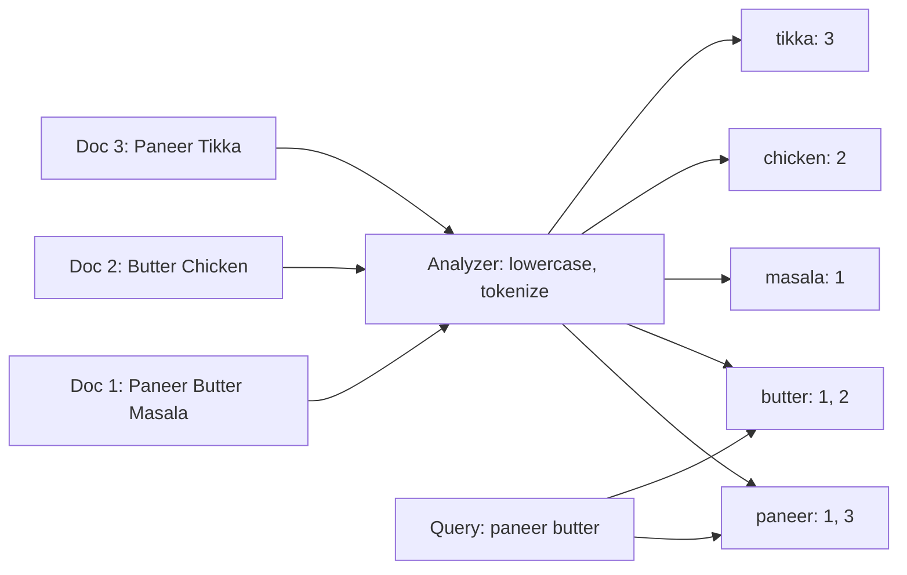
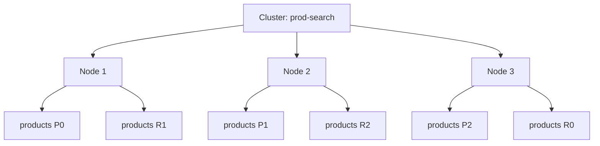
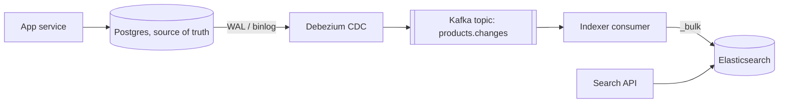

# Search: Elasticsearch

Elasticsearch (ES) is a distributed search and analytics engine built on Apache Lucene. It is the default choice for full-text search, typo-tolerant search, filters + facets, and log analytics. In an interview, whenever a "search bar" or "log search" comes up, name ES, and also say that it is not the primary database.

## ⭐ Inverted index

**In one line:** a map from each word (term) to the list of documents that contain it. Like the index at the back of a book: look up a word, get the page numbers.

A normal DB stores document → words. An inverted index stores word → documents. So a "contains 'paneer'" query does not full-scan like `LIKE '%paneer%'`; it reads the posting list directly.

Example: Swiggy dishes.
- Doc 1: "Paneer Butter Masala"
- Doc 2: "Butter Chicken"
- Doc 3: "Paneer Tikka"



Query "paneer butter": `paneer → {1,3}`, `butter → {1,2}`. Doc 1 is in both, so it ranks first. Posting lists also store term frequency and positions (for phrase search).

Lucene internals that help in interviews:
- The index is built from **segments**. A segment is immutable (LSM-like). New docs go into new segments, merged in the background.
- Delete = mark the doc as "deleted"; space is freed on merge. Update = delete + reinsert.
- `keyword`/numeric fields get **doc values** (columnar storage): sorting and aggregations use these.

**Interview tip:** "Why not search with SQL `LIKE '%x%'`?" A leading wildcard cannot use a B-tree index, so it is a full table scan. You also get no relevance ranking, typo tolerance or stemming.

**Common mistake:** thinking ES "scans" documents to search. The work happens at index time (analyze + inverted index); query time is just lookups.

## ⭐ Analyzers and tokenizers

**In one line:** an analyzer turns text into terms: character filters → tokenizer → token filters. The same analyzer should run at index time and query time.

| Step | What it does | Example |
|---|---|---|
| Character filter | Cleans raw text | Strip HTML tags, `&` to `and` |
| Tokenizer | Splits text into tokens | `standard`: on words; `whitespace`; `ngram`; `edge_ngram` |
| Token filter | Changes tokens | `lowercase`, `stop` (the, is), `stemmer` (running → run), `synonym` (mobile = phone), `asciifolding` |

- **Standard analyzer** (default): standard tokenizer + lowercase.
- **Edge n-gram:** "paneer" → `p, pa, pan, pane, panee, paneer`. For autocomplete / search-as-you-type.
- **Synonyms:** "chole" = "chana", "mobile" = "phone". Very useful in Flipkart-style search.
- Indian context: the `icu_tokenizer` plugin for Hindi/Hinglish, and synonyms + fuzzy for spelling variants ("paneer", "panir").

```json
PUT /dishes
{
  "settings": {
    "analysis": {
      "filter": {
        "autocomplete_filter": { "type": "edge_ngram", "min_gram": 2, "max_gram": 15 },
        "food_synonyms": { "type": "synonym", "synonyms": ["chole, chana", "curd, dahi"] }
      },
      "analyzer": {
        "autocomplete": {
          "tokenizer": "standard",
          "filter": ["lowercase", "autocomplete_filter"]
        },
        "food_text": {
          "tokenizer": "standard",
          "filter": ["lowercase", "food_synonyms"]
        }
      }
    }
  }
}
```

To test: `POST /dishes/_analyze { "analyzer": "autocomplete", "text": "Paneer" }`.

**Interview tip:** for autocomplete use the `edge_ngram` analyzer at index time and `standard` at query time (`search_analyzer`). Otherwise the query is also split into n-grams and you get wrong matches.

**Common mistake:** changing the analyzer after the mapping exists. An existing field's analyzer cannot change; create a new index and `_reindex`.

## ⭐ Mapping: text vs keyword

**In one line:** the mapping is ES's schema. `text` is analyzed (for full-text search); `keyword` stays an exact value (for filters, sorting, aggregations).

| Type | Analyzed? | Use | Example field |
|---|---|---|---|
| `text` | Yes | Full-text search, relevance | `name`, `description` |
| `keyword` | No | Exact match, sort, aggs, terms | `city`, `status`, `brand`, `email` |
| `integer`, `float`, `scaled_float` | No | Range, sort | `price`, `rating` |
| `date` | No | Range, date_histogram | `created_at` |
| `geo_point` | No | Distance search | `location` |
| `nested` | - | Array of objects where each object must match on its own | `variants` |

One field can be both (**multi-field**): `name` as text + `name.raw` as keyword.

```json
PUT /products
{
  "mappings": {
    "dynamic": "strict",
    "properties": {
      "name":       { "type": "text", "fields": { "raw": { "type": "keyword" } } },
      "brand":      { "type": "keyword" },
      "category":   { "type": "keyword" },
      "price":      { "type": "scaled_float", "scaling_factor": 100 },
      "rating":     { "type": "float" },
      "in_stock":   { "type": "boolean" },
      "created_at": { "type": "date" },
      "suggest":    { "type": "text", "analyzer": "autocomplete", "search_analyzer": "standard" }
    }
  }
}
```

- **Dynamic mapping:** when a new field shows up, ES guesses its type (string → text + keyword). In production use `"dynamic": "strict"` or templates; otherwise logs cause a "mapping explosion" (thousands of fields).
- A field's type cannot change later. New index + reindex.

**Interview tip:** "Why does a `match` on `status` give wrong results?" `status` was `text` and got analyzed. Keep filter/aggregation fields as `keyword`.

**Common mistake:** running a `term` query on a `text` field. "Paneer Tikka" was indexed as `paneer`, `tikka`; `term: "Paneer Tikka"` matches nothing.

## ⭐ Relevance scoring: BM25 basics

**In one line:** ES gives every matching doc a `_score`; the default algorithm is BM25: the rarer the term and the more often it appears in the doc, the higher the score, with saturation.

BM25's three ingredients:
1. **TF (term frequency):** how often the term appears in the doc. It saturates (parameter `k1`, default 1.2): writing "paneer" 10 times does not give 10x the score.
2. **IDF (inverse document frequency):** how many docs contain the term. "paneer" is rare, so more weight; "the" is everywhere, so almost zero.
3. **Field length normalization** (parameter `b`, default 0.75): a match in a short field matters more. A match in the title "Paneer Tikka" > a match in a 500-word description.

Ways to tune the score:
- **Boost:** `"fields": ["name^3", "description"]` (name is 3x as important).
- **function_score:** mix rating, popularity, distance into the score. Swiggy: text match + restaurant rating + distance.
- **filter context:** filters do not affect score and are cached. Put anything that does not affect relevance in `filter`.

Note: IDF is computed per shard. With very little data, scores can look a bit inconsistent across shards.

**Interview tip:** "TF-IDF vs BM25?" BM25 saturates TF and has tunable length normalization. Default since ES 5.0.

**Common mistake:** putting everything in `must`. Price/stock conditions then change the score and are not cached.

## ⭐ Cluster, node, index, shard, replica

**In one line:** an index is logically like a table; physically it is split into primary shards (each one a Lucene index), and each primary has replica copies on other nodes.



| Term | Meaning |
|---|---|
| Cluster | A named group of nodes |
| Node | One ES process. Roles: master-eligible, data, ingest, coordinating |
| Index | A collection of documents (like `products`) |
| Shard (primary) | A piece of the index; a doc goes to shard `hash(_routing) % num_primary_shards` (`_routing` defaults to `_id`) |
| Replica | A copy of a primary on another node. HA + read throughput |

- **The primary shard count is fixed once the index is created** (because of the routing formula). To change it use `_split`/`_shrink` or reindex.
- The replica count can change any time.
- Search: the coordinating node sends the query to all shards (**scatter**), each shard returns its top-N, the coordinator merges into the final top-N (**gather**). Then the actual docs are fetched.
- The master node manages cluster state (which shard is where). Keep 3 dedicated master-eligible nodes to avoid split brain.
- Rule of thumb: shard size 10–50 GB. Too many small shards = overhead (each shard costs memory).

**Interview tip:** "How do you pick the shard count?" Expected data size / ~30 GB, and think about growth. For time-based data (logs) use daily/monthly indices + ILM so the shard count stops being a worry.

**Common mistake:** 50 shards for 5 GB of data. Every search hits 50 shards, slow and wasteful.

## ⭐ Near-real-time refresh

**In one line:** an indexed document does not show up in search right away; a **refresh** (every 1 second by default) makes a new segment searchable. That is why ES is "near real-time".

Write path:
1. The doc reaches the primary shard and goes into the **in-memory buffer** + **translog** (durability, like a WAL).
2. **Refresh** (1s): the buffer becomes a new Lucene segment (in the filesystem cache), now searchable. Not fsynced yet.
3. **Flush:** segments are fsynced to disk and the translog is cleared.
4. The same operation is forwarded to replicas.
5. **Merge:** small segments are merged into bigger ones in the background.

- `GET /index/_doc/id` (get by id) is real-time: it can read from the translog. Only `_search` waits for a refresh.
- For bulk loads: set `"refresh_interval": "-1"` and `"number_of_replicas": 0`, and restore after the load. Much faster indexing.
- `?refresh=wait_for` makes a write return only once the doc is searchable (for tests; use sparingly in production).

**Interview tip:** "The user added a product; why is it not in search right away?" The refresh interval. If it matters, show it to that user from the primary DB, or use `wait_for`.

**Common mistake:** adding `?refresh=true` to every write. You get tiny segments and indexing throughput drops.

## ⭐ Query DSL

**In one line:** ES's JSON query language. Two contexts: **query** (how well does it match, produces a score) and **filter** (match or not, no score, cached).

**match** (full-text, analyzed):
```json
GET /products/_search
{
  "query": { "match": { "name": { "query": "paneer tikka", "operator": "and" } } }
}
```

**multi_match** (several fields, with boosts):
```json
GET /products/_search
{
  "query": {
    "multi_match": {
      "query": "redmi note 13",
      "fields": ["name^3", "brand^2", "description"],
      "type": "best_fields"
    }
  }
}
```

**term** (exact, keyword field):
```json
GET /products/_search
{
  "query": { "term": { "brand": "Xiaomi" } }
}
```

**bool** (must / filter / should / must_not) + **range**: Flipkart search "redmi phone", 10k–20k, in stock, boost 4+ rating.
```json
GET /products/_search
{
  "query": {
    "bool": {
      "must": [
        { "match": { "name": "redmi phone" } }
      ],
      "filter": [
        { "term":  { "category": "mobiles" } },
        { "term":  { "in_stock": true } },
        { "range": { "price": { "gte": 10000, "lte": 20000 } } }
      ],
      "should": [
        { "range": { "rating": { "gte": 4 } } }
      ],
      "must_not": [
        { "term": { "brand": "refurbished" } }
      ]
    }
  }
}
```

| Clause | Must match? | Affects score? | Cached? |
|---|---|---|---|
| `must` | Yes | Yes | No |
| `filter` | Yes | No | Yes |
| `should` | Not if must/filter exist (only boosts) | Yes | No |
| `must_not` | Must not match | No | Yes |

**fuzzy** (typos): "panner" → "paneer". Uses edit distance (Levenshtein).
```json
GET /dishes/_search
{
  "query": {
    "match": { "name": { "query": "panner tika", "fuzziness": "AUTO", "prefix_length": 1 } }
  }
}
```
`AUTO`: 0 edits for 1-2 char words, 1 for 3-5, 2 for more than 5. `prefix_length` keeps the first chars fixed (faster, fewer garbage matches).

**Aggregations** (facets and analytics): count by brand and daily orders.
```json
GET /products/_search
{
  "size": 0,
  "query": { "match": { "name": "phone" } },
  "aggs": {
    "by_brand": { "terms": { "field": "brand", "size": 10 } },
    "price_stats": { "stats": { "field": "price" } },
    "per_day": {
      "date_histogram": { "field": "created_at", "calendar_interval": "day" }
    }
  }
}
```
The left-side filters (Brand: Samsung (120), Xiaomi (95)) come from these `terms` aggs. Note: the `terms` agg is approximate; each shard sends its own top-N.

**Pagination:**
```json
GET /products/_search
{ "from": 20, "size": 10, "query": { "match": { "name": "phone" } } }
```
```json
GET /products/_search
{
  "size": 10,
  "query": { "match": { "name": "phone" } },
  "sort": [ { "rating": "desc" }, { "_id": "asc" } ],
  "search_after": [4.5, "sku_8812"]
}
```

| Method | How | Problem / use |
|---|---|---|
| `from` + `size` | Offset | Each shard must produce `from + size` docs; deep pages are expensive. Default limit `max_result_window` = 10,000 |
| `search_after` | Pass the last doc's sort values | For deep / infinite scroll; needs a tiebreaker sort field. Use with PIT (point in time) for a consistent view |
| `scroll` | Snapshot cursor | Old; for bulk export, PIT + search_after is now recommended |

**Interview tip:** "How do you get page 5000?" Not `from/size`; use `search_after` + PIT. And do not let the UI offer pages that deep.

**Common mistake:** putting `filter`-type conditions in `must`, and running a `terms` agg on a `text` field (error or fielddata memory blow-up).

## ⭐ Important REST APIs

**In one line:** ES is entirely an HTTP + JSON API; creating indices, adding documents, search, update and reindex are all REST calls.

| Command / method | What it does | Example |
|---|---|---|
| `PUT /index` | Create an index with settings + mappings | `PUT /products { "settings": {...}, "mappings": {...} }` |
| `POST /index/_doc` | Add a doc, ES generates the id | `POST /products/_doc { "name": "Redmi Note 13" }` |
| `PUT /index/_doc/{id}` | Create/replace the doc at a given id | `PUT /products/_doc/sku_1 {...}` |
| `GET /index/_doc/{id}` | Doc by id (real-time) | `GET /products/_doc/sku_1` |
| `POST /_bulk` | Many index/update/delete ops in one request (NDJSON) | The right way to index |
| `GET /index/_search` | Query DSL search | `{ "query": {...} }` |
| `POST /index/_update/{id}` | Partial update (delete + reindex inside) | `{ "doc": { "price": 14999 } }` |
| `POST /index/_update_by_query` | Update everything matching a query | With a script |
| `POST /index/_delete_by_query` | Delete everything matching a query | Clean old data |
| `POST /_reindex` | Copy from one index to another | After a mapping change |
| `POST /_aliases` | Add/remove aliases atomically | Zero-downtime reindex |
| `GET /_cat/indices?v`, `GET /_cluster/health` | Cluster status | green / yellow / red |

```bash
# Bulk indexing (NDJSON: a doc line after each action line, newline at the end)
curl -s -X POST localhost:9200/_bulk -H 'Content-Type: application/x-ndjson' --data-binary '
{ "index": { "_index": "products_v2", "_id": "sku_1" } }
{ "name": "Redmi Note 13", "brand": "Xiaomi", "price": 16999, "in_stock": true }
{ "update": { "_index": "products_v2", "_id": "sku_2" } }
{ "doc": { "price": 12999 } }
{ "delete": { "_index": "products_v2", "_id": "sku_3" } }
'

# Mapping change: new index, reindex, then switch the alias (zero downtime)
curl -s -X POST localhost:9200/_reindex -H 'Content-Type: application/json' -d '
{ "source": { "index": "products_v1" }, "dest": { "index": "products_v2" } }'

curl -s -X POST localhost:9200/_aliases -H 'Content-Type: application/json' -d '
{ "actions": [
  { "remove": { "index": "products_v1", "alias": "products" } },
  { "add":    { "index": "products_v2", "alias": "products" } }
] }'
```

The app always talks to the alias `products`, never to `products_v1`. Then after a reindex you only switch the alias.

Cluster health: **green** = all primaries + replicas assigned; **yellow** = primaries fine, some replicas unassigned (normal on a single node); **red** = a primary is missing, data unavailable.

**Interview tip:** "Mapping change without downtime?" New index + `_reindex` + atomic alias swap. Writes during the reindex go to both (or are replayed from CDC).

**Common mistake:** indexing docs one by one with `POST _doc` in a loop. Use `_bulk` (5–15 MB batches).

## ⭐ Syncing from the primary DB

**In one line:** the source of truth stays in Postgres/MySQL/Mongo; ES is a derived read model kept in sync from changes. The best way is CDC (Change Data Capture).



**The dual writes problem:** the app writes to the DB and then to ES itself:
- The DB commits, the ES call fails (or the app crashes). ES is missing data, nothing retries.
- Two concurrent updates reach the two stores in different orders. ES ends up with the old value.
- The transaction rolls back but ES already got the write.

**Correct approaches:**
| Approach | How | Note |
|---|---|---|
| CDC (Debezium + Kafka) | Read the DB's WAL/binlog, events to Kafka, a consumer writes to ES | Best. Order per key (Kafka partition by id), retries, replay |
| Transactional outbox | Write an event to an `outbox` table in the same DB transaction, a relay sends it to Kafka | When you want domain events |
| Periodic batch / `updated_at` poll | Pick changed rows every N minutes | Simple, but misses deletes and adds delay |

Keep the consumer idempotent: doc id = DB primary key, and use `version_type: external` (DB version/`updated_at`) so an old event never overwrites newer data.

For a full re-sync: new index, bulk load from a snapshot, catch up from the CDC offset, switch the alias.

Topic detail: [Search indexing](../01-topics/14-search-indexing.md), [Message queues & Kafka](../01-topics/07-message-queues-kafka.md), [Distributed transactions](../01-topics/16-distributed-transactions.md).

**Interview tip:** "How do you keep the DB and ES in sync?" Say "no dual writes, CDC: Debezium reads the WAL, Kafka, the indexer does `_bulk`, external versioning keeps out-of-order events safe."

**Common mistake:** writing `db.save(); es.index();` in app code and assuming both will always be consistent.

## ⭐ Why not use it as the primary database

**In one line:** ES is optimized for search, not for durability and correctness. Treat it as a derived store.

- **No transactions:** no multi-document ACID. Order + payment + inventory cannot be atomic together.
- **Near real-time:** a write is not searchable for up to 1s. Read-your-writes is not guaranteed (in search).
- **Rigid mapping:** changing a field type = reindexing all data.
- **Expensive updates:** every update = delete + reindex the whole doc. Bad for high-frequency counters (likes, stock count).
- **No joins** (only `nested` and the `join` field, both limited and slow).
- **Operational risk:** split brain (old versions), mapping explosion, heap pressure, and a history of data loss incidents. Backups rely on snapshots.
- **No strict uniqueness** (cannot enforce a unique email).

For cases like logs (losing some data is acceptable, append-only) ES can be the store itself, with ILM.

**Interview tip:** always draw ES "behind" the DB in the design, with a CDC arrow. Say "if ES dies we can rebuild it from the DB".

**Common mistake:** keeping product price/stock only in ES and reading checkout data from ES too.

## OpenSearch

**In one line:** OpenSearch is AWS's fork of ES 7.10 (made in 2021 after Elastic changed its license). The query DSL and REST APIs are almost the same.

- AWS's managed service is now "Amazon OpenSearch Service".
- The Kibana fork: OpenSearch Dashboards.
- Features have diverged a bit: Elastic has ES|QL and newer vector features; OpenSearch has its own k-NN and a built-in security plugin.
- Elastic added an AGPL option again in 2024, but the fork remains.

**Interview tip:** saying "Elasticsearch/OpenSearch" in an interview is fine; the concepts are the same.

**Common mistake:** thinking the latest versions of both are 100% compatible. Client libraries and new features differ.

## ⭐ Use cases

**In one line:** use ES where you need text search, relevance, facets or log analytics.

| Use case | How it is used | Link |
|---|---|---|
| Product search (Flipkart, Amazon) | `multi_match` + filters + `terms` facets + `function_score` (popularity) | [Search indexing](../01-topics/14-search-indexing.md) |
| Food / restaurant search (Swiggy, Zomato) | Text + `geo_distance` filter + rating boost | [Food delivery](../02-questions/t2-14-food-delivery.md), [Nearby places](../02-questions/t2-21-nearby-places.md) |
| Autocomplete / typeahead | `edge_ngram` or the `completion` suggester; at very high QPS a trie/Redis is better | [Typeahead](../02-questions/t1-10-typeahead.md) |
| Logs (ELK stack) | Daily indices, ILM hot-warm-cold-delete, Kibana | [Distributed logging](../02-questions/t2-26-distributed-logging.md) |
| Video / content search | Search on title, tags, description | [YouTube](../02-questions/t1-07-youtube.md) |
| Message search | Chat history search (Discord used ES) | [Discord](../02-questions/t2-25-discord.md) |
| Vector / semantic search | `dense_vector` + kNN (HNSW) | [Vector Databases](11-vector.md) |

**Autocomplete note:** in the typeahead question the interviewer often wants < 50ms latency at very high QPS. Then precomputed top-K per prefix (trie or Redis) beats ES. Pick ES when you need fuzzy/typo handling and rich filters.

**Logs note:** time-based indices (`logs-2026.10.03`), rollover + ILM, old data on warm/cold nodes, then delete. Never build one giant `logs` index.

**Interview tip:** when search comes up, say three things: inverted index, sync via CDC, and ES is not the primary DB.

**Common mistake:** a heavy ES `bool` query on every typeahead keystroke with no debounce/cache.

## Checklist

- [ ] I can draw an inverted index and posting lists from an example
- [ ] I can explain the analyzer pipeline (char filter, tokenizer, token filter) and edge n-gram autocomplete
- [ ] I can explain `text` vs `keyword` and when to use each
- [ ] I can explain BM25's TF, IDF, length normalization and boosting
- [ ] I can explain shards, replicas, routing and why the primary shard count is fixed
- [ ] I can explain refresh, the translog and what near-real-time means
- [ ] I can write a query with bool (must/filter/should), fuzzy, aggregations and search_after
- [ ] I can do a zero-downtime mapping change with reindex + alias
- [ ] I can explain the dual writes problem and syncing with CDC (Debezium + Kafka)
- [ ] I can give 3–4 reasons not to use ES as the primary DB
