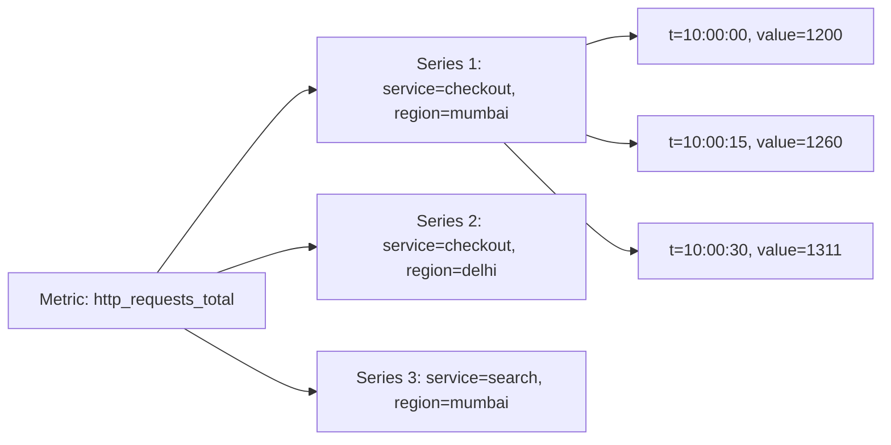
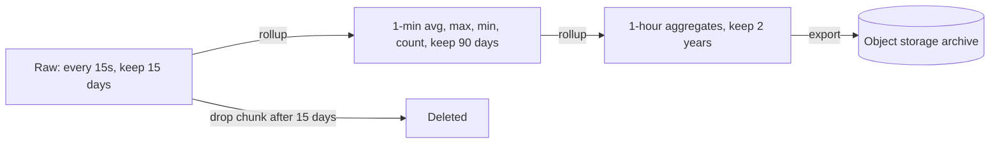
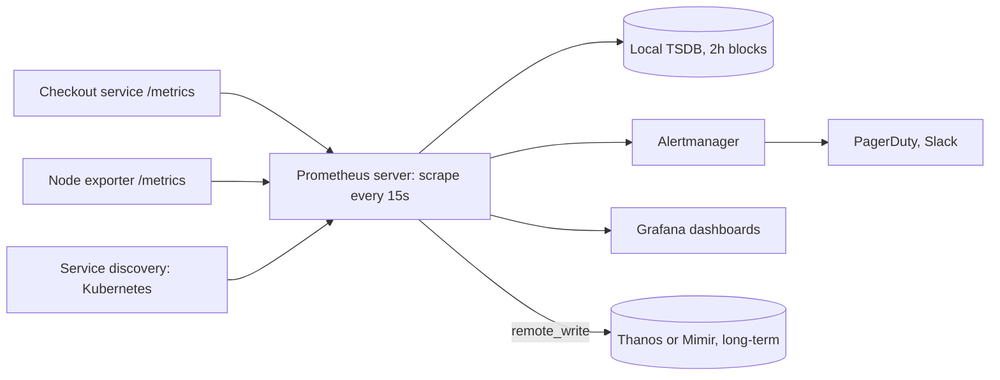
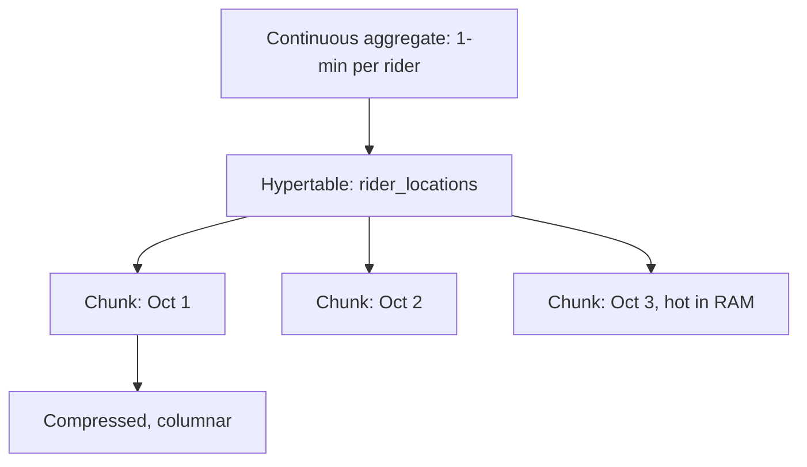

# Time-series Databases

A time-series database (TSDB) is built for values that arrive over time: CPU usage every 15 seconds, a stock price on every tick, a delivery partner's location every 5 seconds. The pattern is so fixed (append, time-range query, aggregate) that special storage, compression and retention give 10–20x less disk and faster queries. It comes up in interviews on monitoring, metrics, IoT and trading questions.

## ⭐ What makes time-series data special

**In one line:** the data is append-only, arrives in time order, is almost never updated, and people ask for an aggregate over a time range (avg, max, rate), not a single point.

| Property | Meaning | Effect on design |
|---|---|---|
| Append-only | New points arrive, old ones do not change | LSM / append storage, no update path needed |
| Time-ordered | Points arrive almost in order | Partition by time (chunks/blocks), delta compression |
| Write-heavy | Hundreds of thousands of points/sec (every server, every metric) | Batched writes, in-memory head block |
| Range + aggregate reads | "p99 over the last hour", "avg every 5 min" | Pre-aggregation, downsampling |
| Recent data is hot | 90% of queries hit the last 24h | Hot data in RAM/SSD, old data on object storage |
| Old data is worth less | Per-second data from a year ago is useless | Retention + rollups |
| Deletes happen in bulk | Not row by row; whole old chunks are dropped | Drop chunk/partition, no tombstones |

**Real example:** Zerodha Kite. A tick (price, volume) for every instrument from NSE, several times a second. Charts need 1-minute candles (OHLC: open, high, low, close), and 5-year-old data only at the daily candle level.

**Interview tip:** "Why not just use Postgres with a timestamp column?" At small scale it works. At billions of rows the B-tree index is huge, inserts slow down, deleting old data (`DELETE`) becomes vacuum hell, and there is no compression. A TSDB drops time chunks and compresses 10x.

**Common mistake:** putting time-series data in a normal OLTP table and aggregating raw rows on every query.

## ⭐ Data model: metric, tags, fields, timestamp

**In one line:** one data point = metric name + tags (labels, who) + field value (what was measured) + timestamp (when). Same metric + same tags = one **series**.



| Part | What it is | Indexed? | Example |
|---|---|---|---|
| Metric / measurement | What you measure | Yes | `cpu_usage`, `order_count`, `tick` |
| Tags / labels | Dimensions, who/where | Yes (inverted index) | `host=web-12`, `city=bengaluru`, `symbol=INFY` |
| Fields / value | The actual number | No | `value=73.5`, `price=1520.4, volume=300` |
| Timestamp | When | Primary sort | `2026-10-03T10:00:00Z` |

- Query flow: find the matching series by tags (inverted index), then read those series' points for the time range.
- In Prometheus each series holds a single float value; in InfluxDB one point can have multiple fields.

**Interview tip:** the tag vs field rule: if you filter/group by it and its values are limited, it is a tag. If it is the measured number or unbounded, it is a field.

**Common mistake:** making `price` or `user_id` a tag. Every unique value creates a new series.

## ⭐ High cardinality problem

**In one line:** cardinality = the number of unique series = every combination of label values. Push it too high and the TSDB index no longer fits in RAM and the DB falls over.

Calculation: `http_requests_total` with labels:
- `service` (50) × `endpoint` (100) × `status` (5) × `pod` (500) = **12.5 million series**. Add `user_id` (10 million users) and it is practically infinite.

For every series the TSDB keeps an index entry + an in-memory chunk (roughly 3–4 KB per active series in Prometheus). Tens of millions of series = hundreds of GB of RAM.

How to avoid it:
- Only bounded values in labels: `status_code`, `region`, `service`. **Never:** `user_id`, `order_id`, `request_id`, `email`, raw URL path (`/order/98213`).
- Turn URLs into route templates: `/order/{id}`.
- If you need per-user/per-order data, that is a job for **logs/traces** or an OLAP store (ClickHouse), not metrics.
- In Prometheus drop useless labels with `metric_relabel_configs`; watch cardinality dashboards.
- Systems built for high cardinality: ClickHouse, InfluxDB 3 (columnar), VictoriaMetrics handle it somewhat better, but the cost still grows.

**Interview tip:** "Put every user's API latency in a metric?" Say no, high cardinality. Metrics are for aggregates; use logs or ClickHouse for per-user data.

**Common mistake:** everything looks fine in dev with 10 users, then Prometheus OOMs in production.

## ⭐ Compression: delta-of-delta and Gorilla

**In one line:** consecutive timestamps and values are very close to each other, so store only the "difference" instead of the full number. Facebook's Gorilla paper brought a point from 16 bytes down to ~1.37 bytes.

**Timestamps: delta-of-delta.**
- Raw: `1000, 1015, 1030, 1045, 1061`
- Delta: `15, 15, 15, 16`
- Delta-of-delta: `0, 0, 1`
- With a regular scrape interval it is mostly `0`, which is stored in just **1 bit**.

**Values: XOR (Gorilla).**
- XOR the current float with the previous one. If the value is the same, XOR = 0, just 1 bit.
- If the value changed slightly, the XOR has many leading and trailing zeros; store only the meaningful bits in the middle.
- Works very well for slowly changing gauges like CPU 73.5, 73.5, 73.6.

Other techniques:
- **Columnar storage:** time in one column, value in another. Same-type values sit together, better compression (TimescaleDB, InfluxDB 3, ClickHouse).
- **Run-length encoding:** a repeated value (status = 1, 1, 1, 1) becomes `(1, ×4)`.
- **Dictionary encoding:** repeated strings (tags) become integer ids.

Prometheus TSDB: 2-hour blocks, each series' chunk Gorilla-compressed, ~1–2 bytes per sample.

**Interview tip:** in estimation say "~1.5 bytes/sample after Gorilla compression". 100k series × every 15s × 1 day = ~576 million samples ≈ ~0.9 GB/day. This number changes design decisions.

**Common mistake:** estimating storage as 16+ bytes per point (8 timestamp + 8 value) + tag bytes. Tags are not stored per point; they are stored once per series.

## ⭐ Retention, downsampling and rollups

**In one line:** keep raw high-resolution data for a few days, build 1-min/1-hour aggregates (rollups) from it and keep those for longer; drop the raw data.



- **Retention policy:** "raw data for 15 days". A TSDB stores data in time chunks/blocks, so retention = dropping a whole old chunk (instant, no tombstones or vacuum).
- **Downsampling:** lowering the resolution. A 1-year graph is built from per-hour points, not per-second points.
- **What to store in rollups:** not just `avg`. Keep `min`, `max`, `sum`, `count` (avg = sum/count can be rebuilt, and an avg of avgs is wrong). For percentiles keep histogram buckets or a sketch (t-digest, DDSketch), because a p99 of p99s is also wrong.
- Prometheus does not downsample by itself; Thanos / Mimir / VictoriaMetrics do. TimescaleDB does it with continuous aggregates, InfluxDB with tasks.

**Real example:** Zerodha: raw ticks for a few days, 1-minute candles for months, daily candles for years.

**Interview tip:** "How do you store years of data?" Tiered retention + rollups, with old data on object storage (S3) (this is what Thanos/Mimir do).

**Common mistake:** storing only the average in a rollup, then later being asked for the max or p99.

## ⭐ Prometheus and PromQL

**In one line:** Prometheus is a pull-based monitoring system + local TSDB: it scrapes each target's `/metrics` endpoint every 15–60s, and you query/alert with PromQL.



**Pull model:**
- Prometheus scrapes the targets itself. Benefits: if a target is down you see `up == 0` right away; the app does not need to know Prometheus's address; scrape rate is centrally controlled.
- For short-lived jobs (cron) there is the **Pushgateway**. Push-based systems: InfluxDB, the Datadog agent, OpenTelemetry push.
- It is single-node, no clustering. For HA run two identical Prometheus servers; for long-term + a global view use Thanos/Mimir/VictoriaMetrics.

**Metric types:**
| Type | What | Example |
|---|---|---|
| Counter | Only goes up (0 on restart) | `http_requests_total` |
| Gauge | Goes up and down | `memory_bytes`, `active_orders` |
| Histogram | Counts in buckets (`_bucket`, `_sum`, `_count`) | `http_request_duration_seconds` |
| Summary | Client-side quantiles | Cannot be aggregated, prefer histograms |

An app's `/metrics` output:
```text
# TYPE http_requests_total counter
http_requests_total{service="checkout",method="POST",status="200"} 128734
http_requests_total{service="checkout",method="POST",status="500"} 42
# TYPE http_request_duration_seconds histogram
http_request_duration_seconds_bucket{service="checkout",le="0.1"} 98000
http_request_duration_seconds_bucket{service="checkout",le="0.5"} 127000
http_request_duration_seconds_bucket{service="checkout",le="+Inf"} 128776
```

**PromQL commands:**

| Command / method | What it does | Example |
|---|---|---|
| Selector | Pick series by labels | `http_requests_total{service="checkout", status=~"5.."}` |
| Range vector `[5m]` | Each series' points over the last 5 min | `http_requests_total[5m]` |
| `rate()` | Per-second average increase of a counter (handles resets) | `rate(http_requests_total[5m])` |
| `irate()` | Instant rate from the last two points | For spiky graphs |
| `increase()` | Total increase over the window | `increase(orders_total[1h])` |
| `sum by (label)` | Sum grouped by a label | `sum by (service) (rate(http_requests_total[5m]))` |
| `topk()` | Top K series | `topk(5, sum by (endpoint) (rate(http_requests_total[5m])))` |
| `histogram_quantile()` | Percentile from histogram buckets | `histogram_quantile(0.99, sum by (le) (rate(http_request_duration_seconds_bucket[5m])))` |
| `avg_over_time()` | Window average of a gauge | `avg_over_time(cpu_usage_percent[10m])` |
| `max_over_time()` | Window max | `max_over_time(queue_depth[1h])` |
| `absent()` | Alert when a metric disappears | `absent(up{job="payments"})` |

```promql
# Checkout error rate (%) over the last 5 min
100 * sum(rate(http_requests_total{service="checkout", status=~"5.."}[5m]))
    / sum(rate(http_requests_total{service="checkout"}[5m]))

# p99 latency per service
histogram_quantile(0.99,
  sum by (service, le) (rate(http_request_duration_seconds_bucket[5m])))

# Swiggy: orders per minute in each city
sum by (city) (rate(orders_placed_total[1m])) * 60

# CPU above 85% for 10 min (alert rule expr)
avg_over_time(node_cpu_usage_percent[10m]) > 85
```

Alert rule:
```yaml
groups:
  - name: checkout
    rules:
      - alert: CheckoutHighErrorRate
        expr: sum(rate(http_requests_total{service="checkout",status=~"5.."}[5m])) / sum(rate(http_requests_total{service="checkout"}[5m])) > 0.02
        for: 5m
        labels: { severity: page }
```

**Interview tip:** "Why not graph a counter's raw value?" A counter always goes up and resets on restart; `rate()` handles resets and gives a per-second rate. And `rate` first, `sum` after: `sum(rate(x[5m]))`, not the other way round.

**Common mistake:** averaging percentiles (`avg(p99)`). Correct: `sum by (le)` over the buckets, then `histogram_quantile`.

## InfluxDB

**In one line:** InfluxDB is a push-based, purpose-built TSDB; you send data over HTTP in **line protocol** and query it with InfluxQL (SQL-like) / Flux / SQL.

**Line protocol:** `measurement,tag1=v1,tag2=v2 field1=x,field2=y timestamp`
```text
ticks,symbol=INFY,exchange=NSE price=1520.40,volume=300i 1759485600000000000
ticks,symbol=TCS,exchange=NSE price=4102.10,volume=120i 1759485600000000000
sensor,device=cold-room-7,city=pune temp=3.8,humidity=71 1759485605000000000
```
Tags (`symbol`, `exchange`) are indexed, fields (`price`, `volume`) are not. The `i` suffix = integer. Timestamp in nanoseconds.

```bash
# Write via HTTP API (v2 style)
curl -XPOST "http://localhost:8086/api/v2/write?org=zerodha&bucket=market&precision=ns" \
  -H "Authorization: Token $INFLUX_TOKEN" \
  --data-binary 'ticks,symbol=INFY,exchange=NSE price=1520.40,volume=300i 1759485600000000000'
```

InfluxQL (1-minute OHLC-style):
```sql
SELECT FIRST(price) AS open, MAX(price) AS high, MIN(price) AS low, LAST(price) AS close
FROM ticks
WHERE symbol = 'INFY' AND time > now() - 1h
GROUP BY time(1m)
```

Flux (v2), pipe style:
```javascript
from(bucket: "market")
  |> range(start: -1h)
  |> filter(fn: (r) => r._measurement == "ticks" and r.symbol == "INFY")
  |> aggregateWindow(every: 1m, fn: mean)
```

Versions: 1.x (InfluxQL), 2.x (Flux, buckets with retention), 3.x (Rust rewrite, Apache Arrow + Parquet columnar, SQL; Flux deprecated). Retention is set at the bucket level.

**Interview tip:** name InfluxDB for IoT/sensor data, where devices push data themselves (pull is not possible, devices sit behind NAT).

**Common mistake:** in v1 every unique tag value created more series, so a `user_id` tag = cardinality blow-up. The same rule applies here.

## ⭐ TimescaleDB

**In one line:** TimescaleDB is a Postgres extension that turns a normal table into a **hypertable**: automatically partitioned by time into chunks (child tables). You keep full SQL, joins and indexes.



- **Hypertable:** you talk to one table; inside there are chunks (7 days per chunk by default). If the query has a time filter, only the relevant chunks are scanned (chunk exclusion).
- **Compression:** old chunks are compressed into columnar form (90%+ space saving), grouped by a `segmentby` column.
- **Retention:** `add_retention_policy` = `DROP` old chunks (instant).
- **Continuous aggregates:** a materialized view that refreshes incrementally; only the aggregate over new data is recomputed.
- `time_bucket()` = a flexible `date_trunc` (5 min, 15 min buckets).

```sql
CREATE EXTENSION IF NOT EXISTS timescaledb;

-- Swiggy/Zomato: delivery partner location every 5 sec
CREATE TABLE rider_locations (
    time      timestamptz NOT NULL,
    rider_id  bigint      NOT NULL,
    city      text        NOT NULL,
    lat       double precision,
    lng       double precision,
    speed_kmh real
);
SELECT create_hypertable('rider_locations', by_range('time', INTERVAL '1 day'));
CREATE INDEX ON rider_locations (rider_id, time DESC);

-- A rider's locations over the last 10 min
SELECT time, lat, lng FROM rider_locations
WHERE rider_id = 8812 AND time > now() - INTERVAL '10 minutes'
ORDER BY time DESC;

-- Continuous aggregate: avg speed per city every 5 min
CREATE MATERIALIZED VIEW city_speed_5m
WITH (timescaledb.continuous) AS
SELECT time_bucket('5 minutes', time) AS bucket, city,
       avg(speed_kmh) AS avg_speed, count(*) AS pings
FROM rider_locations
GROUP BY bucket, city;

SELECT add_continuous_aggregate_policy('city_speed_5m',
  start_offset => INTERVAL '1 hour', end_offset => INTERVAL '5 minutes',
  schedule_interval => INTERVAL '5 minutes');

-- Compress after 2 days, delete raw after 30 days
ALTER TABLE rider_locations SET (timescaledb.compress, timescaledb.compress_segmentby = 'rider_id');
SELECT add_compression_policy('rider_locations', INTERVAL '2 days');
SELECT add_retention_policy('rider_locations', INTERVAL '30 days');
```

**Interview tip:** "We already run Postgres and also need time-series" means TimescaleDB is the best answer: no new DB to learn, and you can join time-series with normal tables (riders, orders).

**Common mistake:** querying a hypertable without a time filter. Every chunk gets scanned.

## ⭐ Comparison table

**In one line:** Prometheus for monitoring metrics, InfluxDB for IoT/push events, TimescaleDB when you need SQL + joins, and ClickHouse for very high-cardinality analytics.

| Point | Prometheus | InfluxDB | TimescaleDB | ClickHouse (OLAP) |
|---|---|---|---|---|
| Model | Pull (scrape) | Push (line protocol) | Push (SQL INSERT) | Push (batch insert) |
| Query | PromQL | InfluxQL / Flux / SQL (v3) | Full PostgreSQL SQL | SQL |
| Joins | Label matching only | Limited | Full joins | Joins (with limits) |
| Cardinality | Low–medium | Medium (v3 better) | Medium–high | Very high |
| Retention / rollups | Local retention; downsampling via Thanos/Mimir | Bucket retention, tasks | Retention + continuous aggregates | TTL, materialized views |
| Scale out | Single node (+ Thanos/Mimir/VictoriaMetrics) | Enterprise / Cloud | Multi-node limited, mostly vertical + replicas | Native sharding |
| Best for | Infra/app metrics, alerting | IoT, sensors, events | Postgres shops, business time-series | Logs, events, high-cardinality analytics |

Others: VictoriaMetrics (Prometheus-compatible, cheaper), QuestDB (fast ingest, finance), Amazon Timestream, Druid/Pinot (real-time OLAP). Detail: [Columnar / OLAP](12-columnar-olap.md).

**Interview tip:** one line for the comparison: "Metrics + alerting = Prometheus; business time-series with joins = TimescaleDB; per-event high-cardinality analytics = ClickHouse."

**Common mistake:** putting business data (every order's amount) into Prometheus. Prometheus is for monitoring, not exact billing data (scrapes can be missed, values are approximate).

## ⭐ Use cases

**In one line:** anywhere there is a "metric over time": server health, sensors, market ticks, counters per minute.

| Use case | What is stored | Which DB | Link |
|---|---|---|---|
| Server / app metrics | CPU, memory, QPS, latency histograms | Prometheus + Grafana, Thanos | [Reliability & observability](../01-topics/20-reliability-observability.md) |
| IoT (cold-chain trucks, smart meters) | Temperature, humidity per device | InfluxDB / TimescaleDB | - |
| Zerodha tick data | Ticks → 1-min/daily OHLC candles | TimescaleDB / QuestDB / ClickHouse (Zerodha itself is heavy on Postgres/ClickHouse) | - |
| Ad click counts per minute | Clicks per ad per minute, rollups | Druid / Pinot / ClickHouse, Flink pre-aggregation | [Ad click aggregator](../02-questions/t2-17-ad-click-aggregator.md) |
| Rider / driver location history | Lat, lng per rider every few sec | TimescaleDB / Cassandra | [Uber](../02-questions/t1-06-uber.md), [Food delivery](../02-questions/t2-14-food-delivery.md) |
| Log-based metrics | Error count per service per minute | Prometheus (from logs) / ClickHouse | [Distributed logging](../02-questions/t2-26-distributed-logging.md) |
| Rate limiter dashboards | Rejected requests per client | Prometheus | [Rate limiter](../02-questions/t1-02-rate-limiter.md) |

Counting and top-K patterns: [Counting & top-K](../01-topics/15-counting-top-k.md).

**Interview tip:** in the ad click aggregator say: "Flink pre-aggregates in 1-min windows, per-minute rows go to OLAP/TSDB, raw events go to S3 for reconciliation."

**Common mistake:** pulling exact counts such as ad billing from Prometheus.

## When a regular DB is enough

**In one line:** if the data is small (up to tens of millions of rows), retention is simple and queries are few, a Postgres/MySQL table + an `(entity_id, time)` index + time partitioning is enough.

A regular DB is fine when:
- Writes are under a few thousand per second and total data is a few hundred GB at most.
- Queries are mostly "this entity's data for the last N days" (fast with an index).
- Aggregates are shown on a dashboard occasionally, not in real time.
- With Postgres native partitioning (`PARTITION BY RANGE (time)`) you can `DROP` an old month's partition.

```sql
CREATE TABLE wallet_balance_history (
    user_id    bigint,
    time       timestamptz,
    balance    numeric(12,2),
    PRIMARY KEY (user_id, time)
) PARTITION BY RANGE (time);

CREATE TABLE wallet_balance_history_2026_10
  PARTITION OF wallet_balance_history
  FOR VALUES FROM ('2026-10-01') TO ('2026-11-01');

-- Retention: drop the old month (not DELETE)
DROP TABLE wallet_balance_history_2025_10;
```

Move to a TSDB when you have hundreds of thousands of points/sec, tens of millions of series, need heavy compression, or managing rollups/retention by hand gets painful.

Partitioning detail: [Scaling Databases](14-scaling-databases.md).

**Interview tip:** at small scale say "Postgres with time partitioning for now, TimescaleDB if scale grows (same SQL)". It sounds pragmatic.

**Common mistake:** standing up a separate Prometheus/InfluxDB cluster for 10 thousand rows a day.

## Checklist

- [ ] I can explain the properties of time-series data (append-only, time-ordered, range aggregates) and their effect on design
- [ ] I can explain metric, tags/labels, fields, timestamp and series with an example
- [ ] I can calculate the high cardinality problem and say which labels to avoid
- [ ] I can explain delta-of-delta and Gorilla XOR compression
- [ ] I can design retention, downsampling and rollups (min/max/sum/count)
- [ ] I can explain the Prometheus pull model and write PromQL (`rate`, `sum by`, `histogram_quantile`, `avg_over_time`)
- [ ] I can write InfluxDB line protocol and a TimescaleDB hypertable + continuous aggregate
- [ ] I can compare Prometheus vs InfluxDB vs TimescaleDB vs ClickHouse and say when a regular DB is enough
