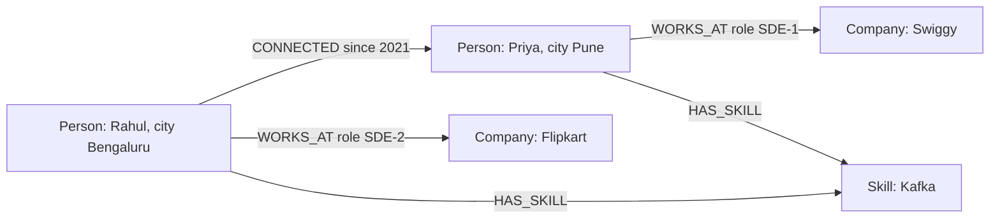
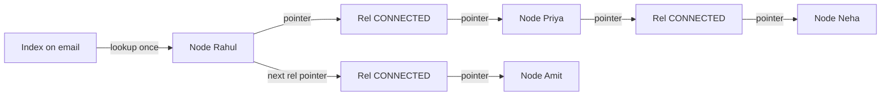

# Graph Databases

A graph DB stores data as nodes and relationships, and the relationship is a first-class object, not just a foreign key. When the question is "who is connected to whom, and how many hops away" (friends-of-friends, fraud rings, recommendations), a graph DB shines. Interviews ask when you actually need a graph DB and when Postgres is enough.

## ⭐ Property graph model

**In one line:** data = nodes (entities) + relationships (directed, typed edges) + properties (key-value pairs on both).

- **Node:** an entity. It has one or more **labels**: `:Person`, `:Company`, `:Account`.
- **Relationship:** a directed edge between two nodes, always with a **type**: `:FOLLOWS`, `:WORKS_AT`, `:SENT_MONEY`. Direction is stored, but queries can traverse either way.
- **Properties:** key-value pairs on both nodes and relationships: `name`, `since`, `amount`.
- Schema is optional. One `:Person` node can have `city` and another can skip it.

> **Example:** on LinkedIn, Rahul worked at Flipkart, is connected to Priya, and Priya is at Swiggy. That is three nodes and three relationships, each with properties.



| Graph term | Rough relational equivalent | Difference |
|---|---|---|
| Node | row | a node can have several labels |
| Label | table | no fixed schema |
| Relationship | foreign key / join table row | a stored object of its own, with properties |
| Property | column | each node can have a different set |

**Interview tip:** "RDF vs property graph?" RDF is triples (subject, predicate, object), queried with SPARQL, used for semantic web / knowledge graphs. The property graph (Neo4j, Neptune in openCypher/Gremlin mode) is more common in app development.

**Common mistake:** turning everything into a node. A simple value like `city` should be a property; make it a node only when you need to traverse through it (e.g. "people in the same city").

## ⭐ Why joins get slow for deep relationships

**In one line:** in SQL every hop is another self-join; each join adds an index lookup and grows the intermediate result set, and at 3–4 hops the rows explode.

Friends-of-friends in SQL:

```sql
-- connections(user_id, friend_id), indexed on both
-- 2nd degree connections of Rahul (id 1)
SELECT DISTINCT c2.friend_id
FROM connections c1
JOIN connections c2 ON c2.user_id = c1.friend_id
WHERE c1.user_id = 1
  AND c2.friend_id <> 1;

-- 3rd degree: one more join, plus NOT IN to remove existing 1st/2nd degree
```

Understand the problem:
- Assume ~300 connections per user. 1 hop = 300 rows, 2 hops = 90,000, 3 hops = 27 million (with duplicates).
- Each hop is a B-tree index lookup, O(log n) where n = size of the **whole table** (billions of rows). Bigger table, costlier hop.
- The query planner needs the hop count up front. "Any number of hops" (variable depth) needs a recursive CTE.

| Hops | SQL (index joins) | Graph DB (pointer chasing) |
|---|---|---|
| 1 | fast | fast |
| 2 | okay | fast |
| 3–4 | seconds, memory heavy | a bit over milliseconds |
| 5+ / variable | often times out | works with a depth limit |

An old Neo4j benchmark (1 million users, depth 4–5) had SQL taking minutes and the graph DB 1–2 seconds. Don't memorise exact numbers, remember the trend: **a graph DB's cost depends on the part of the graph you touch, not on the whole dataset.**

**Interview tip:** say "joins explode on the fan-out per hop, not on row count. A graph DB has fan-out too, but each step is a direct pointer follow, not an index lookup."

**Common mistake:** saying SQL cannot do graph queries at all. It can, and it is good at 1–2 hops. The problem is deep and variable-depth traversal.

## ⭐ Index-free adjacency

**In one line:** each node keeps direct pointers (physical addresses) to its relationships, so reaching a neighbour is O(1), not a global index lookup.

- In Neo4j a node record is fixed size. It holds a pointer to its first relationship; relationship records form doubly linked lists (one chain for the start node, one for the end node).
- Traversal = following pointers. Cost ~ O(edges touched), independent of table size.
- An index is needed only to find the **starting point** (e.g. Rahul's node by `email`). After that, traversal is index-free.



**Supernode problem:** a node with tens of millions of edges (Virat Kohli's followers, or a popular merchant). Traversing it = tens of millions of pointers. Fix: filter by relationship type + direction, cap the degree, or model those edges separately.

**Interview tip:** "What does index-free adjacency buy you?" Query time is local: with 10 million users or 1 billion, the cost of Rahul's 3-hop network is roughly the same.

**Common mistake:** assuming every graph DB uses native storage. Some (JanusGraph on Cassandra, Neptune's internal layer) put another storage engine under the graph API; there each hop may internally be a lookup too.

## ⭐ Neo4j Cypher commands

**In one line:** Cypher is an ASCII-art style query language: you write `(node)-[:REL]->(node)` to match a pattern.

| Command / method | What it does | Example |
|---|---|---|
| `CREATE` | creates a node / relationship (no duplicate check) | `CREATE (:Person {id: 1, name: 'Rahul'})` |
| `MATCH` | finds a pattern | `MATCH (p:Person)-[:WORKS_AT]->(c:Company) RETURN p, c` |
| `MERGE` | match if exists, else create (upsert) | `MERGE (c:Company {name: 'Swiggy'})` |
| `ON CREATE SET` / `ON MATCH SET` | set properties after MERGE | `MERGE (p:Person {id: 1}) ON CREATE SET p.created = timestamp()` |
| `WHERE` | filter | `WHERE p.city = 'Pune' AND r.since > 2020` |
| `-[:REL*1..3]-` | variable-length path, 1 to 3 hops | `MATCH (a)-[:CONNECTED*1..3]-(b)` |
| `shortestPath()` | shortest path between two nodes | `shortestPath((a)-[:CONNECTED*..6]-(b))` |
| `RETURN ... count()` | aggregation, implicit group by on non-aggregated fields | `RETURN c.name, count(p) AS employees` |
| `ORDER BY` / `LIMIT` | sort and top-K | `ORDER BY mutual DESC LIMIT 10` |
| `SET` / `REMOVE` | update / remove a property | `SET p.city = 'Mumbai'` |
| `DELETE` / `DETACH DELETE` | delete; DETACH removes edges first | `MATCH (p {id: 9}) DETACH DELETE p` |
| `CREATE INDEX` | makes finding the starting point fast | `CREATE INDEX person_email FOR (p:Person) ON (p.email)` |
| `CREATE CONSTRAINT` | uniqueness (also creates an index) | `CREATE CONSTRAINT FOR (p:Person) REQUIRE p.id IS UNIQUE` |
| `EXPLAIN` / `PROFILE` | query plan / actual db hits | `PROFILE MATCH ...` |

```cypher
// Unique constraint: makes MERGE fast and safe
CREATE CONSTRAINT person_id IF NOT EXISTS FOR (p:Person) REQUIRE p.id IS UNIQUE;
CREATE INDEX person_email IF NOT EXISTS FOR (p:Person) ON (p.email);

// Insert data: MERGE avoids duplicates
MERGE (r:Person {id: 1}) ON CREATE SET r.name = 'Rahul', r.city = 'Bengaluru';
MERGE (p:Person {id: 2}) ON CREATE SET p.name = 'Priya', p.city = 'Pune';
MERGE (f:Company {name: 'Flipkart'});
MATCH (r:Person {id: 1}), (p:Person {id: 2})
MERGE (r)-[:CONNECTED {since: 2021}]->(p);

// "People you may know": 2nd degree, ranked by mutual connections
MATCH (me:Person {id: 1})-[:CONNECTED]-(friend)-[:CONNECTED]-(fof)
WHERE fof <> me AND NOT (me)-[:CONNECTED]-(fof)
RETURN fof.name, count(DISTINCT friend) AS mutual
ORDER BY mutual DESC
LIMIT 10;

// Who within 1 to 3 hops works at Swiggy (finding a referral)
MATCH (me:Person {id: 1})-[:CONNECTED*1..3]-(p:Person)-[:WORKS_AT]->(:Company {name: 'Swiggy'})
RETURN DISTINCT p.name;

// Shortest path from Rahul to Neha (LinkedIn's "2nd" / "3rd" badge)
MATCH path = shortestPath(
  (a:Person {id: 1})-[:CONNECTED*..6]-(b:Person {name: 'Neha'})
)
RETURN [n IN nodes(path) | n.name] AS chain, length(path) AS hops;
```

**Interview tip:** always give variable-length paths an upper bound (`*1..3`, `*..6`). An unbounded `*` can explore the whole graph.

**Common mistake:** running `MERGE` on a whole pattern (`MERGE (a:Person {id:1})-[:X]->(b:Person {id:2})`). If the full pattern doesn't match, MERGE creates the **entire pattern** again, including duplicate nodes. MERGE the nodes first, then the relationship.

## ⭐ Real examples: LinkedIn, Paytm fraud rings, recommendations

**In one line:** where the answer hides in the pattern of connections, use a graph.

**1. LinkedIn connections (1st/2nd/3rd degree):**
- The "2nd" badge on a profile = shortest path of length 2. "People you may know" = mutual connection count.
- LinkedIn built its own in-memory graph service (LIquid) because this query runs on every page load.

**2. Paytm / UPI fraud rings:**
- Nodes: `Account`, `Device`, `Phone`, `UPI_ID`, `Merchant`. Edges: `USES_DEVICE`, `SENT_MONEY`, `REGISTERED_WITH`.
- Fraud pattern: 20 "different" accounts share one device or phone number, and money loops around in a circle before landing in a mule account.
- In SQL this is a dynamic 4–5 join query. In a graph it is one pattern.

```cypher
// Accounts tied to one device that pass money around among themselves (cycle)
MATCH (d:Device)<-[:USES_DEVICE]-(a:Account)
WITH d, collect(a) AS accts
WHERE size(accts) >= 5
MATCH cycle = (x:Account)-[:SENT_MONEY*3..5]->(x)
WHERE x IN accts
RETURN d.id, [n IN nodes(cycle) | n.id] AS ring
LIMIT 20;
```

**3. Recommendations (Flipkart / Swiggy):**
- "People who bought this also bought": `(me)-[:BOUGHT]->(p)<-[:BOUGHT]-(other)-[:BOUGHT]->(rec)`.
- Good in real time on a small neighbourhood. At large scale, offline embeddings + a vector DB are more common ([Vector Databases](11-vector.md)).

```cypher
MATCH (me:User {id: 42})-[:BOUGHT]->(p:Product)<-[:BOUGHT]-(other:User)-[:BOUGHT]->(rec:Product)
WHERE NOT (me)-[:BOUGHT]->(rec)
RETURN rec.name, count(DISTINCT other) AS score
ORDER BY score DESC LIMIT 5;
```

**Interview tip:** fraud detection is the strongest graph use case. Say "a shared device/phone/address is a hidden link; in a graph it is one hop, in SQL every new link type is a new join."

**Common mistake:** running graph traversals over the whole catalog for recommendations. Popular products become supernodes; add degree limits or precomputed scores.

## Amazon Neptune, Gremlin and SPARQL

**In one line:** Neptune is AWS's managed graph DB that supports both property graphs (Gremlin, openCypher) and RDF (SPARQL).

| | Neo4j | Amazon Neptune |
|---|---|---|
| Deploy | self-host or AuraDB (managed) | fully managed on AWS |
| Query language | Cypher | Gremlin, openCypher, SPARQL |
| Storage | native graph, index-free adjacency | AWS distributed storage (Aurora-like), 6 copies across 3 AZs |
| Scaling | read replicas; writes on one primary | 1 writer + up to 15 read replicas |
| When | rich Cypher, graph algorithms (GDS library) | AWS stack, managed ops, RDF/knowledge graphs |

**Gremlin** (Apache TinkerPop) is an imperative traversal language that runs step by step:

```groovy
// Rahul's 2nd degree connections, excluding Rahul and 1st degree
g.V().has('Person', 'name', 'Rahul').as('me').
  both('CONNECTED').aggregate('first').
  both('CONNECTED').
  where(neq('me')).where(without('first')).
  dedup().values('name').limit(10)
```

**SPARQL** runs on RDF triples, for knowledge graphs:

```sparql
SELECT ?colleague WHERE {
  :Rahul :worksAt ?company .
  ?colleague :worksAt ?company .
  FILTER (?colleague != :Rahul)
}
```

Other names: **JanusGraph** (distributed on Cassandra/HBase), **TigerGraph** (MPP, analytics), **ArangoDB** (multi-model), **Memgraph** (in-memory, Cypher).

**Interview tip:** in an AWS-based design, say "Neptune with openCypher" to cut ops burden. If asked Cypher vs Gremlin: Cypher is declarative (what you want), Gremlin is imperative (how to traverse).

**Common mistake:** thinking Neptune shards writes horizontally. Writes go to a single writer instance.

## ⭐ When a relational DB with a recursive CTE is enough

**In one line:** if the graph is small, hops are few and fixed, or graph queries are a small part of the app, Postgres `WITH RECURSIVE` is enough. Don't add a new DB.

```sql
-- Employee hierarchy: everyone under Rahul (id 1), with depth
WITH RECURSIVE reports AS (
    SELECT id, name, manager_id, 1 AS depth
    FROM employees
    WHERE manager_id = 1
  UNION ALL
    SELECT e.id, e.name, e.manager_id, r.depth + 1
    FROM employees e
    JOIN reports r ON e.manager_id = r.id
    WHERE r.depth < 5                       -- depth limit, avoids infinite loops
)
SELECT * FROM reports ORDER BY depth;

-- In a cyclic graph (social), track the path, otherwise it loops
WITH RECURSIVE fof AS (
    SELECT friend_id, ARRAY[1, friend_id] AS path, 1 AS depth
    FROM connections WHERE user_id = 1
  UNION ALL
    SELECT c.friend_id, f.path || c.friend_id, f.depth + 1
    FROM connections c
    JOIN fof f ON c.user_id = f.friend_id
    WHERE f.depth < 3 AND NOT c.friend_id = ANY(f.path)
)
SELECT DISTINCT friend_id FROM fof WHERE depth = 2;
```

Postgres 14+ also has a `CYCLE` clause. The Apache AGE extension gives Postgres Cypher support.

| Situation | Choice |
|---|---|
| Org chart, category tree, comment threads | Postgres recursive CTE / `ltree` |
| Follow graph, only 1 hop (followers list) | Postgres / Cassandra adjacency table |
| 2 hops, fixed, cacheable | SQL + cache |
| 3+ hops, variable depth, pattern match, real-time | graph DB |
| Fraud rings, knowledge graph, network/dependency analysis | graph DB |
| PageRank/community detection over the whole graph, batch | Spark GraphX / Neo4j GDS, offline |

**Interview tip:** "Graph DB for a social network?" Say: for the follow list (1 hop) a sharded KV/SQL adjacency list is enough; Twitter used FlockDB (on MySQL). Use a graph DB when you need multi-hop queries like mutual friends / PYMK in real time.

**Common mistake:** no depth limit or cycle check in a recursive CTE. On cyclic data the query never finishes.

## Scaling limits of graph DBs

**In one line:** graphs are hard to shard, because any cut splits edges across machines, and a cross-machine hop becomes a network call.

- **Sharding is hard:** hash users across machines and Rahul's friends end up on 100 machines. 3 hops = an explosion of network calls. Graph partitioning (min edge cut) is NP-hard, and the graph keeps changing.
- **Writes on one primary:** in a Neo4j cluster writes go to the leader (Raft), reads to replicas. Not built for write-heavy loads (hundreds of thousands of likes per second).
- **Memory hungry:** fast traversal needs the graph in RAM (page cache). If it spills to disk, pointer chasing = random IO.
- **Supernodes:** a celebrity node slows every traversal through it.
- **Analytics vs OLTP:** whole-graph aggregations ("total edges of type X") are slow in a graph DB; use OLAP for that ([Columnar / OLAP](12-columnar-olap.md)).

Fixes:
- Neo4j Fabric / composite DBs: separate graphs per domain (one per country).
- Distributed graph DBs (TigerGraph, JanusGraph, NebulaGraph) that partition, but cross-partition hops still cost.
- Keep the hot subgraph in an in-memory service (LinkedIn LIquid), with the source of truth in another DB.

**Interview tip:** say "graph DBs scale vertically + with read replicas; if data is far bigger than one machine's RAM, first ask whether you only need a hot subgraph."

**Common mistake:** making the graph DB the primary store for all data. The graph is often a **derived view**: source of truth in Postgres, synced to the graph via CDC.

## ⭐ When to use / when not

| Use it | Don't use it |
|---|---|
| multi-hop, variable-depth queries in real time | simple CRUD, 1-hop lookups |
| fraud ring, money laundering detection | heavy aggregations / reports (use OLAP) |
| PYMK, mutual friends, referral path | write-heavy event streams (likes, clicks) |
| knowledge graph, access control graph (who can see what) | data that won't fit one machine's RAM with cross-shard hops |
| network/IT dependency, supply chain impact analysis | team has no graph experience and Postgres CTEs work |

## Where it is used

- [News Feed](../02-questions/t1-03-news-feed.md): the follow graph. For fan-out, "who are my followers" is a 1-hop query served from a sharded adjacency list (Cassandra/MySQL). A graph DB comes in for "suggested follows". See [Fan-out](../01-topics/18-fan-out.md).
- [Instagram](../02-questions/t2-13-instagram.md): followers graph, "suggested for you".
- [Recommendation System](../02-questions/t2-23-recommendation-system.md): co-purchase graph, candidate generation.
- [Payment System](../02-questions/t1-11-payment-system.md): fraud/risk checks on shared device/account links.
- Bigger picture of DB choice: [SQL vs NoSQL](../01-topics/02-sql-vs-nosql.md), [Choosing a Database](01-choosing-a-database.md).

## Say this in the interview

- "The follow list is 1-hop, so I'll keep it in a sharded KV adjacency list. A graph DB only for multi-hop features (PYMK, fraud rings), synced via CDC."
- "In a graph DB query cost depends on the touched subgraph, not total data, thanks to index-free adjacency. The starting node comes from an index, the rest is pointer chasing."

## Common mistakes

- Defaulting to a graph DB for every social app without stating hops and query patterns.
- No upper bound on variable-length paths.
- Ignoring supernodes (celebrities, popular merchants).
- Assuming graph DBs shard horizontally with ease.
- Running `MERGE` on a whole pattern and creating duplicate nodes.

## Checklist

- [ ] I can explain the property graph model (node, label, relationship type, property) with a diagram
- [ ] I can explain with numbers why SQL joins explode for friends-of-friends
- [ ] I can explain index-free adjacency and the supernode problem
- [ ] I can write Cypher queries with MATCH, MERGE, variable-length paths `*1..3`, shortestPath and aggregation
- [ ] I can model use cases like fraud rings and PYMK as a graph
- [ ] I can explain Neo4j vs Neptune and Cypher vs Gremlin vs SPARQL
- [ ] I can write a recursive CTE with depth limit and cycle check, and say when it is enough
- [ ] I can explain graph DB scaling limits (sharding, single writer, RAM) and where to keep the follow graph in a news feed
