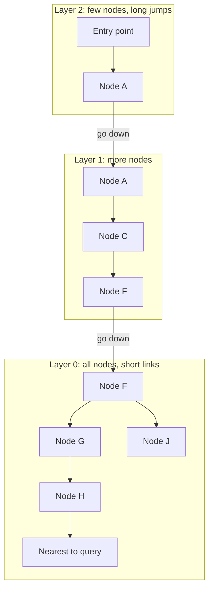
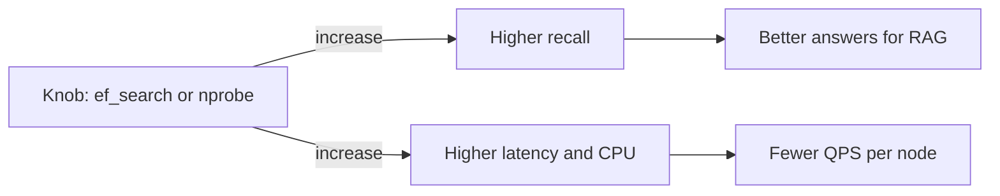
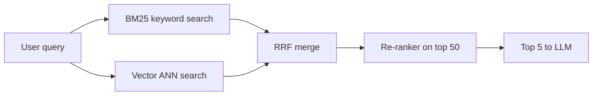
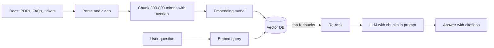

# Vector Databases

A vector DB searches by "meaning", not by exact words. Turn text, an image or a product into a list of numbers (an embedding), then ask "give me the K items closest to this query". RAG (LLM chat apps), semantic search and recommendations all run on this. Interviews ask about HNSW, recall vs latency, filtering and "do you really need a vector DB".

## ⭐ Embeddings in plain words

**In one line:** an embedding is a fixed-length float array (say 1536 numbers) that captures the meaning of something; things that are close in meaning have vectors that are close too.

- An **embedding model** (OpenAI `text-embedding-3-small`, Cohere, open-source `bge`, `e5`, CLIP for images) takes input and returns a vector.
- "Sasta phone 15000 ke andar" and "budget smartphone under 15k" use different words, but their vectors will be close. Keyword search would miss this.
- Dimensions depend on the model: 384, 768, 1024, 1536, 3072. More dims = more memory, slightly better quality.
- Embed both queries and documents with the **same model**. Vectors from different models cannot be compared.

> **Example:** on Flipkart you search "comfortable chair for office". The product title says "ergonomic chair". Vector search matches the two.

Memory math (useful in interviews):
- 10 million vectors × 1536 dims × 4 bytes (float32) ≈ **61 GB** for raw vectors alone. The index (HNSW links) adds ~10–30% on top.
- That is why quantization (float16, int8, PQ) and reducing dims (`dimensions` parameter, Matryoshka embeddings) matter.

**Interview tip:** say "an embedding = semantic coordinates. A vector DB's job is just this: find the query's nearest K among billions of points, fast, with filters."

**Common mistake:** switching the embedding model without re-embedding the whole corpus. Old and new vectors live in different "spaces", and results turn into garbage.

## ⭐ Similarity metrics: cosine, dot product, L2

**In one line:** how "close" two vectors are is measured three ways: angle (cosine), dot product, or straight-line distance (L2 / Euclidean).

| Metric | Formula (idea) | Range | When |
|---|---|---|---|
| Cosine similarity | `a·b / (‖a‖ ‖b‖)`, angle only | -1 to 1 (1 = same direction) | text embeddings, default choice |
| Dot product (inner product) | `a·b`, angle + length | unbounded | same as cosine on normalized vectors, fastest; in recommendations length = popularity |
| L2 (Euclidean) distance | `sqrt(sum (a-b)^2)` | 0 to infinity (0 = identical) | image embeddings, some models are trained on it |

- If vectors are **normalized** (length 1), cosine, dot and L2 all give the same ranking. OpenAI embeddings come normalized.
- Use the metric the model was trained with. The model card says so.
- Watch distance (smaller = better) vs similarity (bigger = better). pgvector `<=>` returns cosine **distance** = 1 − cosine similarity.

**Interview tip:** "Why cosine?" In text, document length can inflate the vector's magnitude; cosine only looks at direction, so a long and a short document on the same topic still match.

**Common mistake:** building the index on one metric (L2) and querying with another (cosine). The index won't be used, or results will be wrong.

## ⭐ Exact vs approximate nearest neighbour

**In one line:** exact kNN compares against every vector (100% correct, slow); ANN uses an index to look at only some candidates (95–99% correct, very fast).

| | Exact kNN (brute force / flat) | ANN (HNSW, IVF, PQ) |
|---|---|---|
| How | query vs every vector, top-K | candidates from the index, top-K among them |
| Time | O(N × d) | ~O(log N) (HNSW) |
| Recall | 100% | 90–99%, tunable |
| Memory | vectors only | vectors + index |
| When | < 100k vectors, or a small filtered subset | millions to billions of vectors |

- Brute force on 100k × 768 dims with SIMD takes ~10–20 ms. A small corpus doesn't need an ANN index at all.
- At 10 million it takes ~seconds. That's where ANN is needed.
- **Recall@K** = how many of the exact top-K the ANN returned. This is the main metric for tuning ANN.

**Interview tip:** measure recall against exact search: run a flat search on sample queries and compare ANN results against it.

**Common mistake:** assuming a vector DB always returns the true nearest. ANN is approximate; some relevant results can be missed.

## ⭐ HNSW (Hierarchical Navigable Small World)

**In one line:** a multi-layer graph: upper layers have few nodes and long jumps, the bottom layer has all nodes and short jumps; search walks greedily from the top down, like a skip list.

How it works:
1. Each vector is a node. On insert it gets a random level (most nodes only in layer 0, some in layer 1, very few in layer 2).
2. In each layer a node links to its ~`M` nearest neighbours.
3. **Search:** start at the top layer's entry point. At each step move to the neighbour closest to the query. When nothing closer exists, drop one layer. In layer 0 keep a candidate list of size `ef_search` and take the best K.



| Parameter | What it does | Increase it and |
|---|---|---|
| `M` | max links per node | recall up, memory up, slower build |
| `ef_construction` | candidate list size at build time | better graph, slower build |
| `ef_search` | candidate list size at query time | recall up, latency up |

- Pros: very good recall-latency balance, incremental inserts, no training.
- Cons: memory heavy (graph lives in RAM), deletes are hard (tombstones, periodic rebuild), slow build.

**Interview tip:** "HNSW is like a skip list: coarse navigation at the top, fine search at the bottom. I tune recall vs latency at query time with `ef_search`."

**Common mistake:** treating HNSW as disk-friendly. It does random pointer jumps; if it isn't in RAM, latency shoots up. For disk there are indexes like DiskANN.

## IVF and PQ

**In one line:** IVF splits vectors into clusters and searches only nearby clusters; PQ compresses vectors so more fit in RAM.

**IVF (Inverted File index):**
- Training: k-means builds `nlist` centroids (say 1000). Each vector goes into its nearest centroid's list.
- Query: scan only the lists of the query's nearest `nprobe` centroids (say 10).
- Raise `nprobe` = recall up, latency up. If the data distribution shifts, retrain.
- Less memory than HNSW, faster build, but usually a bit slower at the same recall.

**PQ (Product Quantization):**
- Split a 1536-dim vector into 96 small sub-vectors; replace each sub-vector with the ID (1 byte) of one of 256 codes.
- A 6 KB vector becomes ~96 bytes (~64x smaller). Distances become approximate.
- Common combo: **IVF-PQ** (FAISS, Milvus). Get candidates with PQ first, then **re-rank** with the original vectors.

| Index | Memory | Speed | Recall | Note |
|---|---|---|---|---|
| Flat | high | slow at scale | 100% | baseline |
| HNSW | highest | fastest | very high | default for most |
| IVF-Flat | medium | fast | high | needs training |
| IVF-PQ | very low | fast | medium | billions scale, needs re-rank |

**Interview tip:** "A billion vectors won't fit in RAM. IVF-PQ or DiskANN, and re-rank the top 100 with full-precision vectors."

**Common mistake:** building an IVF index on an empty or tiny table. Centroids are trained from the data; load data first, then build the index.

## ⭐ Recall vs latency trade-off

**In one line:** look at more candidates and you get more correct results but spend more time; every ANN knob (`ef_search`, `nprobe`) turns this same dial.



Practical numbers (rough, 10 million vectors, HNSW):
- recall 0.90 → ~2 ms, recall 0.95 → ~5 ms, recall 0.99 → ~15–20 ms.
- The last 1% of recall is the most expensive.

How to choose:
- RAG: recall 0.95 is enough, because the LLM only reads the top 5/10 chunks and a re-ranker comes after.
- Dedup / fraud (must not miss): high recall, or exact search on a filtered set.
- Very high QPS: add replicas, or save memory with quantization.

**Interview tip:** state the SLO like this: "p99 < 50 ms at recall@10 ≥ 0.95". Latency alone is half the story.

**Common mistake:** benchmarking only latency and forgetting to measure recall.

## ⭐ Metadata filtering: pre-filter vs post-filter

**In one line:** in a query like "similar among Bengaluru restaurants", you apply the filter before the vector search (pre) or after it (post), and both have trade-offs.

| | Pre-filter | Post-filter |
|---|---|---|
| How | filter first, then search only matching vectors | top-K ANN first, then filter |
| Accuracy | correct K results | can end up with fewer than K (filter removed them) |
| Problem | a restrictive filter "breaks" the HNSW graph, forcing a fall back to brute force | 0 results on a selective filter |
| Fix | filtered HNSW (Qdrant, Weaviate, Pinecone do it internally) | oversample K (take top 200, filter, keep top 10) |

- Modern DBs do **in-filter / filtered traversal**: during the HNSW walk they skip non-matching nodes but still pass through them to keep the graph connected.
- On a very selective filter (1% of data) the planner picks brute force on the filtered set. That's fine.
- Multi-tenant SaaS: separate data with a **namespace / partition** per tenant, better than a filter.

**Interview tip:** "If the filter is selective, pre-filter + flat scan; if broad, filtered HNSW. Post-filter only with oversampling."

**Common mistake:** writing `WHERE city = 'Pune' ORDER BY embedding <=> $1 LIMIT 10` in pgvector and assuming you get 10 results. The HNSW index scan first fetches ~`ef_search` candidates, then filters; fewer can come back. In pgvector 0.8+ turn on `hnsw.iterative_scan`.

## Hybrid search: BM25 + vector

**In one line:** keyword search (BM25) catches exact terms, vector search catches meaning; merge both results for the best of both.

- Vector search is weak on: SKU codes, names, error codes ("ERR_402"), rare words. BM25 catches them exactly.
- BM25 is weak on: synonyms, paraphrase, other languages.
- **How to merge:** Reciprocal Rank Fusion (RRF): `score = sum 1 / (60 + rank_i)`. No score normalization needed, only rank.
- Or weighted: `alpha * vector_score + (1 - alpha) * bm25_score` (Weaviate `alpha`).
- Often a third step: a **cross-encoder re-ranker** rescores the top 50.



Tools: Elasticsearch/OpenSearch (BM25 + kNN both), Weaviate `hybrid`, Qdrant sparse + dense vectors, Postgres `tsvector` + pgvector. See [Search: Elasticsearch](08-search.md).

**Interview tip:** in a RAG design say "hybrid retrieval + re-ranker"; vector search alone misses product codes and names.

**Common mistake:** adding BM25 and cosine scores directly. Their scales differ; use RRF or normalization.

## ⭐ pgvector: vector search in Postgres

**In one line:** a Postgres extension that adds a `vector` column type, distance operators and HNSW/IVFFlat indexes, so vectors live in the same DB as the rest of your data.

| Command / method | What it does | Example |
|---|---|---|
| `CREATE EXTENSION vector` | enables pgvector | `CREATE EXTENSION IF NOT EXISTS vector;` |
| `vector(n)` | n-dim column | `embedding vector(1536)` |
| `<->` | L2 distance | `ORDER BY embedding <-> $1` |
| `<=>` | cosine distance (1 − similarity) | `ORDER BY embedding <=> $1` |
| `<#>` | negative inner product | `ORDER BY embedding <#> $1` |
| `USING hnsw (col vector_cosine_ops)` | HNSW index | `WITH (m = 16, ef_construction = 64)` |
| `USING ivfflat (col vector_l2_ops)` | IVF index | `WITH (lists = 1000)` |
| `SET hnsw.ef_search` | query recall knob | `SET hnsw.ef_search = 100;` |
| `SET ivfflat.probes` | IVF clusters to scan | `SET ivfflat.probes = 10;` |
| `halfvec(n)` | float16, half the memory | `embedding halfvec(3072)` |

```sql
CREATE EXTENSION IF NOT EXISTS vector;

CREATE TABLE doc_chunks (
    id          BIGSERIAL PRIMARY KEY,
    doc_id      BIGINT NOT NULL,
    tenant_id   BIGINT NOT NULL,
    content     TEXT NOT NULL,
    embedding   vector(1536) NOT NULL,
    created_at  TIMESTAMPTZ DEFAULT now()
);

-- HNSW index for cosine (operator class must match the query operator)
CREATE INDEX ON doc_chunks USING hnsw (embedding vector_cosine_ops)
    WITH (m = 16, ef_construction = 64);
CREATE INDEX ON doc_chunks (tenant_id);

-- Or IVFFlat: build it AFTER loading data, lists ~ rows/1000
-- CREATE INDEX ON doc_chunks USING ivfflat (embedding vector_cosine_ops) WITH (lists = 1000);

-- Insert (the app gets the vector from the embedding model)
INSERT INTO doc_chunks (doc_id, tenant_id, content, embedding)
VALUES (7, 1, 'Refund 5-7 din me account me aata hai', '[0.012, -0.044, ...]');

-- Top 5 similar chunks, with a tenant filter
SET hnsw.ef_search = 100;
SET hnsw.iterative_scan = relaxed_order;   -- pgvector 0.8+: K results even after filtering
SELECT id, content, 1 - (embedding <=> $1) AS similarity
FROM doc_chunks
WHERE tenant_id = 1
ORDER BY embedding <=> $1
LIMIT 5;
```

- Pros: one DB, ACID, joins, backups, permissions. Metadata filters are a normal SQL `WHERE`.
- Limits: comfortable up to ~10–50 million vectors per node; HNSW builds are memory heavy (raise `maintenance_work_mem`); indexed `vector` max 2000 dims (`halfvec` 4000).

**Interview tip:** "At small to medium scale I'll start with pgvector, since the data is already in Postgres. If scale or QPS grows, a dedicated vector DB."

**Common mistake:** using `<->` in `ORDER BY` when the index was built with `vector_cosine_ops`. The index won't be used, you get a seq scan.

## Pinecone, Milvus, Weaviate, Qdrant

**In one line:** dedicated vector DBs: all give upsert, top-K query + filter, delete and namespaces/collections; they differ in hosting, filtering and scale.

| Command / method | What it does | Example |
|---|---|---|
| `upsert` | insert/replace id + vector + metadata | Pinecone `index.upsert(vectors=[...], namespace="t1")` |
| `query` / `search` | top-K nearest, with filter | Pinecone `index.query(vector=v, top_k=5, filter={...})` |
| `delete` | remove by ids or filter | `index.delete(ids=["c1"], namespace="t1")` |
| namespace / partition / tenant | logically separates data | Pinecone namespace, Milvus partition, Weaviate tenant |
| Qdrant `query_points` | search with `query_filter` | `client.query_points("docs", query=v, limit=5)` |
| Milvus `search` | search with a boolean `filter` expr | `client.search("docs", data=[v], limit=5, filter='city == "Pune"')` |
| Weaviate `near_vector` / `hybrid` | vector or hybrid search | `col.query.hybrid(query="refund", alpha=0.5, limit=5)` |

```python
from pinecone import Pinecone

pc = Pinecone(api_key="...")
index = pc.Index("support-docs")

# Upsert: id, vector and metadata for each chunk
index.upsert(
    vectors=[
        {"id": "doc7-c0", "values": emb0, "metadata": {"doc_id": 7, "lang": "hi", "city": "Pune"}},
        {"id": "doc7-c1", "values": emb1, "metadata": {"doc_id": 7, "lang": "en", "city": "Pune"}},
    ],
    namespace="tenant-swiggy",
)

# Query: top 5, with a metadata filter
res = index.query(
    vector=query_emb,
    top_k=5,
    filter={"lang": {"$eq": "en"}, "doc_id": {"$in": [7, 9]}},
    include_metadata=True,
    namespace="tenant-swiggy",
)
for m in res.matches:
    print(m.id, m.score, m.metadata["doc_id"])

# Document deleted: remove its chunks
index.delete(ids=["doc7-c0", "doc7-c1"], namespace="tenant-swiggy")
```

| | Pinecone | Milvus | Weaviate | Qdrant | pgvector |
|---|---|---|---|---|---|
| Hosting | managed only (serverless) | open source + Zilliz Cloud | open source + cloud | open source + cloud | Postgres extension |
| Scale | billions | billions, distributed | tens of millions to billions | tens of millions to billions | tens of millions per node |
| Strength | zero ops | GPU index, IVF-PQ, DiskANN | built-in hybrid search, modules | fast filtered search (Rust) | one DB, SQL |
| When | team wants no ops | very large scale | hybrid + multi-tenant | heavy filtering | already on Postgres |

**Interview tip:** in a design, more important than naming a product is saying: "upsert is idempotent by id, one namespace per tenant, filters are indexed."

**Common mistake:** using random chunk ids. Use a deterministic id like `docId-chunkNo`, otherwise re-ingestion creates duplicates and deletes get hard.

## ⭐ Chunking and embedding pipeline for RAG

**In one line:** split documents into small chunks, embed each chunk and store it in the vector DB; when a query comes, fetch similar chunks and put them in the LLM's prompt.



Ingestion decisions:
- **Chunk size:** 300–800 tokens, 10–20% overlap. Too small = broken context; too big = irrelevant text, blurry embedding.
- **Structure-aware chunking:** split on headings, paragraphs, tables, not on a fixed character count.
- **Metadata:** `doc_id`, `tenant_id`, `source_url`, `updated_at`, `acl`. Filtering and citations come from this.
- **Updates:** when a doc changes, delete all its chunk ids + re-upsert. Trigger via Kafka/CDC.
- **Batching:** call the embedding API in batches (100–1000 per call), respecting rate limits.
- **Versioning:** keep `embedding_model` in metadata; when the model changes, re-embed into a new index, then switch.

At query time:
- Embed query → top 20–50 (hybrid) → re-rank → top 5 into the prompt.
- Apply the permission filter (ACL) at retrieval, not after the LLM.

**Interview tip:** in RAG most of the quality comes from chunking and retrieval, less from swapping the LLM. Interviewers like this line.

**Common mistake:** skipping the ACL filter. User A's private docs end up in User B's answer.

## When you do not need a vector DB

**In one line:** with a small corpus, low QPS, or data already in Postgres, a separate vector DB is one more system to maintain.

| Situation | Choice |
|---|---|
| < 100k vectors, occasional queries | in-memory NumPy / FAISS flat, or brute force |
| < 10 million vectors, data in Postgres | pgvector (HNSW) |
| Search already on Elasticsearch/OpenSearch | use its kNN field |
| Prototype / hackathon | in-process FAISS, Chroma, LanceDB |
| Tens of millions to billions of vectors, high QPS, heavy filtering | dedicated vector DB |
| Exact keyword match needed (SKU, order id) | normal index / BM25, not vectors |

- 10,000 FAQ chunks × 1536 × 4 bytes = 61 MB. That fits in the app's RAM; brute force < 5 ms.
- One more DB = one more sync pipeline, backup, monitoring, consistency issue.

**Interview tip:** if the interviewer asks "which vector DB?", ask about scale first. "For 10k docs pgvector or in-memory is enough, Pinecone is overkill."

**Common mistake:** adding a separate vector DB to every AI feature without calculating corpus size.

## Where it is used

- [LLM Chat App](../02-questions/t2-22-llm-chat-app.md): RAG retrieval, conversation memory, semantic cache (cached answer for a question with the same meaning).
- [Recommendation System](../02-questions/t2-23-recommendation-system.md): user/item embeddings from a two-tower model, candidate generation via ANN, then a ranking model.
- [Typeahead](../02-questions/t1-10-typeahead.md): semantic suggestions (a prefix trie is mostly enough).
- [Search Indexing](../01-topics/14-search-indexing.md): hybrid search, inverted index + vectors.
- Related: [Graph Databases](10-graph.md), [Search: Elasticsearch](08-search.md).

## Say this in the interview

- "I'll split documents into 500-token chunks and embed them, storing them in the vector DB with chunk id + tenant + ACL metadata. On query: hybrid retrieval, re-rank, then top 5 to the LLM."
- "ANN index is HNSW, tuned with `ef_search` for recall 0.95; at small scale pgvector, otherwise a dedicated vector DB with a namespace per tenant."

## Common mistakes

- Embedding queries and documents with different embedding models.
- Index metric and query operator mismatch.
- Getting fewer than K results from post-filtering in filtered search and not noticing.
- Benchmarking only latency, not recall.
- Bringing in a dedicated vector DB for a small corpus.

## Checklist

- [ ] I can explain what an embedding is and calculate the memory for 10 million vectors
- [ ] I can explain cosine vs dot product vs L2 and when to use which
- [ ] I can explain exact vs ANN and recall@K
- [ ] I can explain HNSW layers, `M`, `ef_search` and the idea of IVF/PQ
- [ ] I can explain pre-filter vs post-filter and hybrid search (BM25 + vector, RRF)
- [ ] I can write a pgvector table, HNSW index and filtered top-K query
- [ ] I can use upsert, query with filter, delete and namespaces in a DB like Pinecone/Qdrant
- [ ] I can explain the RAG chunking/embedding pipeline and when you do not need a vector DB
