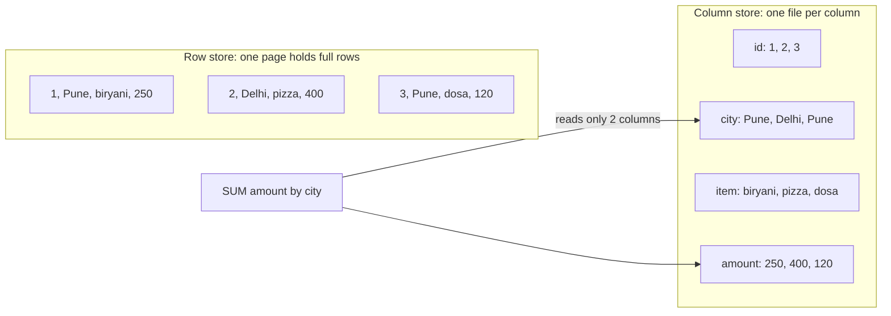
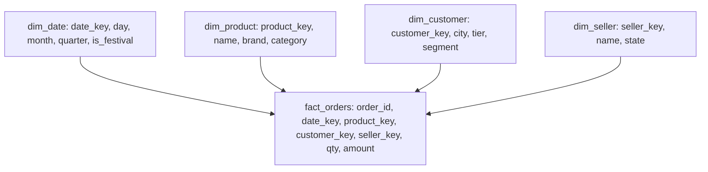
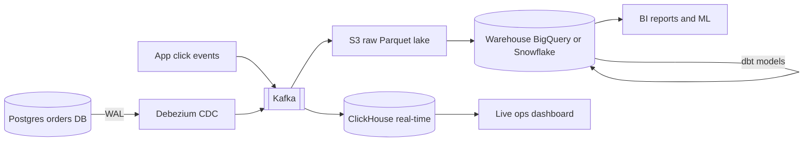

# Columnar / OLAP

OLAP databases are built to run `GROUP BY`, `SUM`, `COUNT` over billions of rows in seconds. The trick is simple: store data column-wise, compress it, and read only the columns the query needs. In interviews this is the answer to "where will you serve dashboards / analytics / aggregations from", and also to why those queries should not run on the OLTP DB (Postgres/MySQL).

## ⭐ OLTP vs OLAP

**In one line:** OLTP = lots of small read/write transactions (place one order); OLAP = few but heavy queries that scan millions of rows and aggregate (city-wise sales this month).

| | OLTP | OLAP |
|---|---|---|
| Example query | `SELECT * FROM orders WHERE id = 42` | `SELECT city, SUM(amount) FROM orders GROUP BY city` |
| Rows per query | 1–100 | hundreds of thousands to billions |
| Columns per query | all | 3–10 (out of 100+) |
| Writes | frequent, single row, UPDATE/DELETE | bulk append, rarely update |
| Latency goal | ms, high QPS | ms to seconds, low QPS |
| Storage | row-oriented, B-tree | column-oriented, compressed |
| Schema | normalized (3NF) | denormalized, star schema |
| Examples | Postgres, MySQL, DynamoDB | ClickHouse, BigQuery, Snowflake, Redshift, Druid, Pinot |
| Users | the app (customers) | analysts, dashboards, ML, sometimes user-facing analytics |

> **Example:** placing an order on Swiggy is OLTP (one row in Postgres). "How many biryani orders came in per hour in Bengaluru over the last 30 days" is OLAP (a scan of tens of millions of rows).

**Interview tip:** say "running analytics on the primary OLTP DB slows production: it pollutes the buffer pool and competes for locks/IO. Copy data into an OLAP store."

**Common mistake:** saying "we'll run it on a read replica" and stopping there. The replica is also a row store; a GROUP BY over 500 million rows will take minutes there too.

## ⭐ Row vs column storage

**In one line:** a row store keeps all columns of a row together (fetching one order is fast); a column store keeps all values of a column together (aggregating one column is fast).



- A table with 100 columns, a query that uses 2. The row store reads whole rows (IO for 100 columns). The column store reads just 2 files: **~50x less IO**.
- A column holds values of one type that often repeat (city), so compression is very good.
- Downside: reading one full row means stitching one value from each of 100 files. Single-row inserts/updates are expensive.
- That is why OLAP DBs **write in batches**: first into memory/small parts, then merge in the background (LSM-like).

**Interview tip:** "In a column store, query cost ~ (columns touched × rows scanned) / compression ratio. That is why `SELECT *` is the costliest mistake in OLAP."

**Common mistake:** row-by-row `INSERT` into a column store (thousands of single inserts per second). Batch them (10k–100k rows per insert) or ingest from Kafka.

## ⭐ Compression and vectorized execution

**In one line:** repeating values of one type compress 5–20x, and the CPU runs SIMD instructions over thousands of values at once instead of looping row by row.

Compression techniques:

| Technique | How | Good for |
|---|---|---|
| Dictionary encoding | replace "Bengaluru" with id 3 | low-cardinality strings (city, status) |
| Run-length encoding (RLE) | "Pune ×5000" | sorted columns |
| Delta encoding | store differences between timestamps | time, increasing ids |
| Bit packing | small integers in fewer bits | flags, small counts |
| General codec (LZ4, ZSTD) | byte-level compression on top | everything |

- The more **sorted** the data (ORDER BY key), the better RLE/delta work.
- Compressed data = less disk IO, and more data fits in cache/RAM.

Vectorized execution:
- A row-at-a-time engine (classic Postgres) makes function calls per row: `next() → eval → next()`.
- A vectorized engine takes a **batch** of a column (say 8192 values) and runs a tight loop. CPU cache friendly, and SIMD (AVX2) processes 8–16 values per instruction.
- Plus: **late materialization** (apply filters on compressed columns first, stitch rows later), **zone maps / min-max indexes** (look at a block's min/max and skip the whole block).

**Interview tip:** why is ClickHouse fast? Say three things: columnar + compression (less IO), vectorized SIMD execution (less CPU per row), and data skipping via a sparse primary index.

**Common mistake:** putting a high-cardinality random string (UUID) as the first column of the sort key in an OLAP table. Both compression and data skipping suffer.

## ⭐ Star schema: fact and dimension

**In one line:** a big **fact** table in the middle (events/transactions, numbers), with small **dimension** tables around it (who, what, where, when) that hold descriptive attributes.



- **Fact:** very long (billions of rows), narrow (foreign keys + measures). Decide the grain: "one row = one order line item".
- **Dimension:** small (thousands to hundreds of thousands of rows), wide (many attributes).
- **Snowflake schema:** dimensions are normalized too (product → category table). Less storage, more joins.
- **Slowly Changing Dimension (SCD Type 2):** when a customer changes city, add a new dimension row with `valid_from`/`valid_to`, so old orders still count under the old city.
- In modern columnar DBs a **wide denormalized table** (One Big Table) is also common: no joins, compression handles the duplicates.

```sql
-- Category-wise revenue in Diwali week, in tier-2 cities
SELECT p.category, SUM(f.amount) AS revenue
FROM fact_orders f
JOIN dim_date d     ON f.date_key = d.date_key
JOIN dim_product p  ON f.product_key = p.product_key
JOIN dim_customer c ON f.customer_key = c.customer_key
WHERE d.is_festival = TRUE AND d.year = 2025
  AND c.tier = 2
GROUP BY p.category
ORDER BY revenue DESC;
```

**Interview tip:** "Fix the fact table's grain first." If the grain is wrong (daily summary), hourly drill-down is impossible later.

**Common mistake:** stuffing descriptive strings (product name, city name) into every fact row out of row-store habit, and also keeping dimensions. Either a star schema or deliberate denormalization; not half of each.

## Materialized views and rollups

**In one line:** precompute and store the result of an aggregation that runs again and again, so the dashboard reads a small summary table instead of raw events.

- **Rollup:** raw clicks (1 billion/day) → per minute per ad (10 million/day) → per hour (2 million/day). Each level is 10–100x smaller.
- **Materialized view (MV):**
  - Postgres: `CREATE MATERIALIZED VIEW ...; REFRESH MATERIALIZED VIEW CONCURRENTLY ...` (full recompute, on a schedule).
  - ClickHouse: an MV is an **insert trigger**: on each new insert block it runs the query and writes to a target table. Incremental, real-time.
  - BigQuery / Snowflake: automatic incremental refresh, and the optimizer can rewrite queries to use the MV.
- Druid/Pinot roll up at ingestion time (the raw row is not stored at all if rollup is on).

| Keep raw | Keep only rollups |
|---|---|
| can answer any new question | storage and queries are very cheap |
| expensive | detail is gone (unique users, debugging) |
| usual: raw for 30–90 days, rollups for years | |

**Interview tip:** "I keep raw events cheaply in object storage (for replay), and hot rollups in OLAP for dashboards."

**Common mistake:** adding up distinct counts (unique users) across rollups. Summing hourly unique users does not give daily uniques; store HyperLogLog sketches (`uniqState`, `HLL_COUNT`).

## ⭐ ClickHouse

**In one line:** an open-source columnar DB (born at Yandex) that scans billions of rows per second on one or a few servers; built for real-time ingestion and sub-second dashboards.

Core concepts:
- **MergeTree engine:** each insert creates a new immutable "part" (sorted by ORDER BY). Parts merge in the background (LSM-like).
- **ORDER BY key = primary key (sorting key):** data sits on disk in this order. **Sparse primary index:** one entry per 8192 rows (granule). A filter on a prefix of ORDER BY skips granules.
- **PARTITION BY:** usually month (`toYYYYMM`). Dropping old data is cheap (`DROP PARTITION`), and TTL works too.
- Variants: `ReplacingMergeTree` (keep the latest for the same key, for dedup/upsert), `SummingMergeTree` / `AggregatingMergeTree` (sum/aggregate on merge), `ReplicatedMergeTree` (replication via Keeper).
- Sharding with the `Distributed` table engine: the query goes to all shards and results are merged.

| Command / method | What it does | Example |
|---|---|---|
| `ENGINE = MergeTree` | main columnar table | `ENGINE = MergeTree ORDER BY (campaign_id, event_time)` |
| `PARTITION BY` | split data into partitions | `PARTITION BY toYYYYMM(event_time)` |
| `ORDER BY` | sort + sparse primary index | `ORDER BY (campaign_id, ad_id, event_time)` |
| `TTL` | auto delete / move old data | `TTL event_time + INTERVAL 90 DAY` |
| `toStartOfHour()` | round time down to the hour | `GROUP BY toStartOfHour(event_time)` |
| `uniq()` / `uniqExact()` | approx / exact distinct | `uniq(user_id)` |
| `quantile(0.99)()` | percentile | `quantile(0.99)(latency_ms)` |
| `CREATE MATERIALIZED VIEW ... TO` | incremental rollup on insert | example below |
| `FINAL` | merge at query time (Replacing/Summing) | `SELECT ... FROM t FINAL` |
| `ALTER TABLE ... DROP PARTITION` | drop a whole partition, instantly | `ALTER TABLE ad_clicks DROP PARTITION 202501` |
| `ENGINE = Kafka` | ingest directly from a Kafka topic | into MergeTree via an MV |

```sql
-- Raw ad clicks
CREATE TABLE ad_clicks
(
    event_time   DateTime,
    click_id     UUID,
    ad_id        UInt64,
    campaign_id  UInt32,
    city         LowCardinality(String),
    device       LowCardinality(String),
    cost_paise   UInt32
)
ENGINE = MergeTree
PARTITION BY toYYYYMM(event_time)
ORDER BY (campaign_id, ad_id, event_time)
TTL event_time + INTERVAL 90 DAY;

-- Batch insert (the app or Kafka consumer sends 10k+ rows at once)
INSERT INTO ad_clicks VALUES
    ('2025-10-20 21:05:11', generateUUIDv4(), 501, 12, 'Bengaluru', 'android', 150),
    ('2025-10-20 21:05:12', generateUUIDv4(), 502, 12, 'Pune', 'ios', 150);

-- Hourly clicks and spend for campaign 12, last 24 hours
SELECT
    toStartOfHour(event_time) AS hour,
    ad_id,
    count()                    AS clicks,
    sum(cost_paise) / 100      AS spend_rs
FROM ad_clicks
WHERE campaign_id = 12
  AND event_time >= now() - INTERVAL 24 HOUR
GROUP BY hour, ad_id
ORDER BY hour, clicks DESC;

-- Hourly rollup table + an MV that updates on every insert
CREATE TABLE ad_clicks_hourly
(
    hour         DateTime,
    campaign_id  UInt32,
    ad_id        UInt64,
    clicks       UInt64,
    cost_paise   UInt64
)
ENGINE = SummingMergeTree
ORDER BY (campaign_id, ad_id, hour);

CREATE MATERIALIZED VIEW ad_clicks_hourly_mv TO ad_clicks_hourly AS
SELECT toStartOfHour(event_time) AS hour, campaign_id, ad_id,
       count() AS clicks, sum(cost_paise) AS cost_paise
FROM ad_clicks
GROUP BY hour, campaign_id, ad_id;

-- The dashboard reads the rollup; merges are async so still apply sum()
SELECT hour, sum(clicks) AS clicks
FROM ad_clicks_hourly
WHERE campaign_id = 12
GROUP BY hour ORDER BY hour;
```

**Interview tip:** pick the ORDER BY key so the most common filter is its prefix, with low-cardinality columns first (`campaign_id` then `ad_id` then `event_time`). Both data skipping and compression improve.

**Common mistake:** using `UPDATE`/`DELETE` in ClickHouse like an OLTP DB. `ALTER TABLE ... UPDATE` is a heavy "mutation" that rewrites parts. For upserts use `ReplacingMergeTree` + a version column.

## ⭐ BigQuery

**In one line:** Google's serverless data warehouse: no servers, no indexes; you write SQL, Google runs it on thousands of workers, and you pay by bytes scanned.

- **Serverless:** storage (Colossus) and compute (slots, Dremel engine) are separate. No cluster size to manage.
- **Columnar storage (Capacitor):** only the bytes of touched columns are counted.
- **Pricing:** on-demand is per TiB scanned (roughly $6.25/TiB, depends on region), or capacity pricing (reserved slots). Storage is billed separately and is cheap.
- **Partitioned tables:** on a date/timestamp column (or integer range). Filter on it and only those partitions are scanned.
- **Clustered tables:** within a partition, data is sorted on some columns (max 4); filters skip blocks.
- `--dry_run` or the UI estimate tells you the bytes before you run a query.
- Near real-time via streaming inserts / Storage Write API, but not for point lookups.

```sql
-- Flipkart orders: partitioned by date, clustered by category + city
CREATE TABLE shop.orders (
  order_id   STRING,
  order_ts   TIMESTAMP,
  city       STRING,
  category   STRING,
  seller_id  STRING,
  amount     NUMERIC
)
PARTITION BY DATE(order_ts)
CLUSTER BY category, city
OPTIONS (
  require_partition_filter = TRUE,     -- reject queries without a date filter: protects the bill
  partition_expiration_days = 730
);

-- 5 days of Big Billion Days, Mobiles, city-wise GMV and orders
SELECT
  city,
  COUNT(*)            AS orders,
  SUM(amount)         AS gmv,
  APPROX_COUNT_DISTINCT(seller_id) AS sellers
FROM shop.orders
WHERE DATE(order_ts) BETWEEN '2025-09-23' AND '2025-09-27'   -- only 5 partitions
  AND category = 'Mobiles'                                     -- cluster pruning
GROUP BY city
ORDER BY gmv DESC
LIMIT 20;
```

Cost example: a 2 TB table, `SELECT *` = 2 TB billed. The query above touches 5 days × 3 columns (+ clustering) = maybe 5–10 GB. **~200x cheaper.**

**Interview tip:** "In BigQuery `LIMIT` does not reduce cost; scanned columns and partitions do."

**Common mistake:** `SELECT *` without a partition filter, on a dashboard that refreshes every minute. The bill explodes. Use BI Engine / MVs / cached results.

## Apache Druid and Pinot: real-time analytics

**In one line:** OLAP stores that ingest from Kafka within seconds and give sub-second aggregations to thousands of concurrent users; built for user-facing analytics.

- **Use case:** when end users see the analytics, not just analysts. LinkedIn "Who viewed your profile" (Pinot), the Uber Eats restaurant manager dashboard (Pinot), live orders in the Swiggy/Zomato restaurant partner app, Airbnb/Netflix metrics (Druid).
- **How:**
  - Real-time ingestion from Kafka; data is queryable within seconds.
  - Data lives in time-based **segments**; old segments go to deep storage (S3) and are cached on historical nodes.
  - **Ingestion-time rollup**: rows with the same dimensions merge into counts.
  - Indexes: bitmap/inverted indexes (Druid), star-tree index (Pinot) for pre-aggregations.
- **Limits:** weak joins (improving now), updates are hard (Pinot supports upsert tables), complex to operate (many node types).

| | ClickHouse | Druid / Pinot | BigQuery / Snowflake |
|---|---|---|---|
| Latency | ms to sec | sub-second, high concurrency | seconds |
| Freshness | seconds (Kafka engine) | seconds | minutes (streaming possible) |
| Concurrency | hundreds QPS | thousands QPS | low-medium |
| Ops | moderate | complex | none (serverless) |
| Best for | internal + external dashboards, logs | user-facing real-time analytics | ad-hoc analytics, BI, data warehouse |

**Interview tip:** "BigQuery/Snowflake for analysts, Pinot/Druid/ClickHouse for user-facing live counters in the product."

**Common mistake:** building a user-facing high-QPS dashboard directly on BigQuery. Both latency and cost become a problem.

## Data warehouse vs data lake vs lakehouse

**In one line:** warehouse = structured, cleaned, SQL-ready data; lake = everything as raw files (S3), cheap; lakehouse = warehouse-like tables (ACID, schema, fast SQL) on top of lake files.

| | Data warehouse | Data lake | Lakehouse |
|---|---|---|---|
| Storage | proprietary columnar, managed | files in object storage (S3/GCS) | object storage + open table format |
| Format | internal | Parquet, ORC, JSON, CSV, images | Parquet + Iceberg / Delta Lake / Hudi |
| Schema | schema-on-write (define first) | schema-on-read | schema enforced, evolution supported |
| ACID / updates | yes | no (files get overwritten) | yes (via the table format) |
| Cost | higher | cheapest | cheap storage, separate compute |
| Users | BI, analysts | data scientists, ML, raw archive | both |
| Examples | BigQuery, Snowflake, Redshift | S3 + Athena/Spark | Databricks, Iceberg on S3 + Trino/Spark |

**Interview tip:** "Raw events on S3 as Parquet + Iceberg (lakehouse), curated tables in the warehouse or on Iceberg itself via Trino. One copy, many engines."

**Common mistake:** dumping files into a data lake without a catalog/schema. It becomes a "data swamp"; nobody knows what any file is.

## ⭐ ETL / ELT and CDC from OLTP

**In one line:** moving data from OLTP to OLAP: ETL transforms first then loads; ELT loads raw first then transforms with SQL inside the warehouse; CDC streams changes in real time.

| | ETL | ELT |
|---|---|---|
| Where transforms run | separate engine (Spark, Airflow job) | SQL inside the warehouse (dbt) |
| Raw data | often not kept | raw is in the warehouse too |
| When | older warehouses, heavy cleansing, removing PII before load | modern cloud warehouses (default) |

**CDC (Change Data Capture):**
- Read the Postgres WAL / MySQL binlog (Debezium); every insert/update/delete becomes a Kafka event.
- Zero query load on OLTP (no nightly `SELECT *` dump).
- Freshness in seconds. Deletes/updates arrive too, so upsert on the OLAP side with `ReplacingMergeTree` / `MERGE INTO`.



**Interview tip:** "For analytics, not a nightly dump from OLTP but CDC via Debezium → Kafka → OLAP. No load on the primary, freshness in seconds."

**Common mistake:** ignoring deletes in the CDC pipeline. An order cancelled/deleted in Postgres stays alive in OLAP and GMV comes out wrong.

## Real examples: Flipkart sales dashboard, ad click aggregation

**In one line:** in both, raw events stream in, get aggregated in OLAP, and the dashboard reads rollups.

**1. Flipkart Big Billion Days sales dashboard:**
- Orders in Postgres/MySQL (OLTP). CDC → Kafka → ClickHouse/Druid.
- Live dashboard: per-minute GMV, category-wise orders, top sellers, city heatmap. Rollup per minute per category per city.
- Next day: the full star schema in the warehouse (BigQuery), finance reconciliation, ML features.
- Peak: hundreds of thousands of orders per minute; OLAP handles batch inserts, and OLTP carries no analytic load.

**2. Ad click aggregation:**
- Clicks in Kafka (billions per day). A stream processor (Flink) dedups + aggregates per minute, or ClickHouse Kafka engine + MV.
- Advertiser dashboard: "hourly clicks and spend for campaign 12 over the last 24h" = the ClickHouse query above.
- Raw clicks in S3 for reconciliation/billing; a daily batch job matches the stream counts.
- Full design: [Ad Click Aggregator](../02-questions/t2-17-ad-click-aggregator.md).

**Interview tip:** in a question like ad clicks, say "the real-time path (Flink/ClickHouse) gives fast approximate numbers, the batch path (S3 + Spark) gives exact numbers for billing; the two reconcile."

**Common mistake:** counting the same click twice because of a retry/duplicate. Dedup by `click_id` (Flink state or `ReplacingMergeTree`).

## When not to use it

**In one line:** where you need a single row, rows are updated often, or you need strong transactions, a columnar DB is the wrong tool.

| Task | Why not | Use instead |
|---|---|---|
| Point lookups (`WHERE order_id = ?`) at high QPS | sparse index, reads a whole granule (8192 rows), each column a separate file | Postgres, DynamoDB, Redis |
| Frequent updates (order status, wallet balance) | immutable parts, update = rewrite | OLTP DB |
| Transactions (payment, inventory decrement) | ACID multi-row transactions are weak/absent | Postgres, MySQL |
| Row-by-row tiny inserts | too many parts, merge pressure | batch them or buffer in Kafka |
| Full-text search | no (or only basic) inverted index | Elasticsearch |
| Small data (< 10 million rows) | Postgres is fast enough | Postgres + indexes |

**Interview tip:** "The OLAP store is not the source of truth; the OLTP DB is, and OLAP is a derived copy that can be rebuilt."

**Common mistake:** making ClickHouse the main app DB because "it's very fast". It is fast only at scans/aggregations.

## Where it is used

- [Ad Click Aggregator](../02-questions/t2-17-ad-click-aggregator.md): ClickHouse/Druid rollups, real-time + batch reconciliation.
- [Distributed Logging](../02-questions/t2-26-distributed-logging.md): logs in ClickHouse (columnar + compression), TTL.
- [YouTube](../02-questions/t1-07-youtube.md): view counts, creator analytics.
- [Flash Sale](../02-questions/t2-15-flash-sale.md) / [E-commerce Inventory](../02-questions/t2-24-ecommerce-inventory.md): sales dashboards via CDC.
- [Counting & Top-K](../01-topics/15-counting-top-k.md), [Message Queues & Kafka](../01-topics/07-message-queues-kafka.md).
- Related: [Time-series Databases](09-time-series.md), [Object Storage: S3](15-object-storage.md).

## Say this in the interview

- "I'll keep OLTP and OLAP separate: orders in Postgres, CDC to Kafka, then hourly rollups in ClickHouse via a materialized view. The dashboard reads the rollup; raw data has a 90-day TTL."
- "A column store is fast because it reads only the needed columns, compression gives 10x, and vectorized execution uses SIMD. But it is the wrong tool for point lookups and updates."

## Common mistakes

- Running analytics queries on the production OLTP DB (or its replica).
- Single-row inserts and frequent UPDATEs in a column store.
- Not choosing the ORDER BY / partition / cluster key from the query pattern.
- `SELECT *` and queries without a partition filter in BigQuery.
- Summing distinct counts across rollups, forgetting deletes in CDC.

## Checklist

- [ ] I can explain OLTP vs OLAP (query shape, storage, schema, examples) with a table
- [ ] I can explain row vs column storage and why a column store does less IO
- [ ] I can explain compression techniques and vectorized execution
- [ ] I can design fact and dimension tables in a star schema, with the grain
- [ ] I can write a ClickHouse MergeTree table with an ORDER BY key, a GROUP BY query with toStartOfHour, and an MV
- [ ] I can create a partitioned + clustered table in BigQuery and explain how it cuts cost (bytes scanned)
- [ ] I can say when to use Druid/Pinot, and explain warehouse vs lake vs lakehouse
- [ ] I can explain ETL vs ELT, a CDC pipeline, the ad click aggregation design, and when not to use a columnar DB
