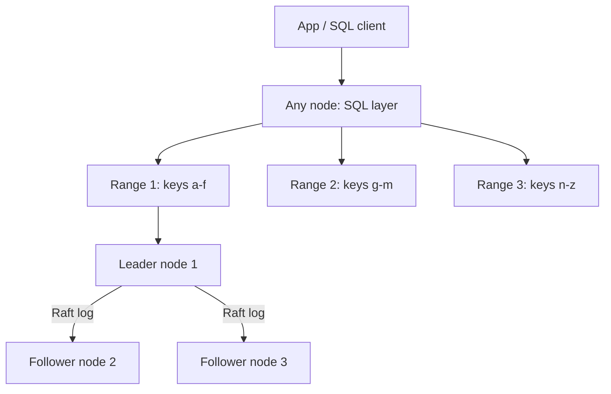
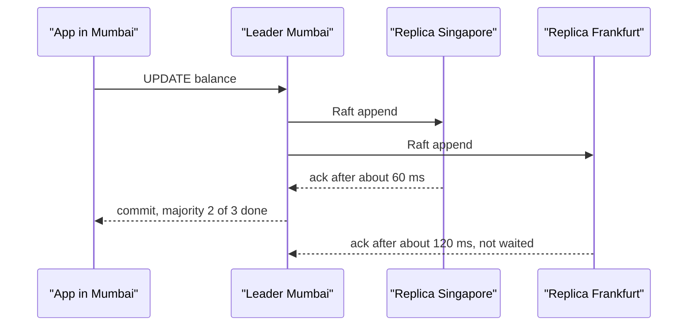

# NewSQL / Distributed SQL

NewSQL = SQL + ACID transactions + horizontal scale, all three together. Postgres gets stuck on one machine; Cassandra scales but gives up joins and transactions. Spanner, CockroachDB, YugabyteDB and TiDB sit in between. This page helps when the interview question is: "global payments or a multi-region app that needs strong consistency and scale."

## ⭐ The problem: SQL guarantees + horizontal scale

**In one line:** single-node SQL has ACID but limited scale; NoSQL has scale but weak transactions/joins. NewSQL tries to give both.

| Option | What you get | What you lose |
|---|---|---|
| Single Postgres + replicas | ACID, joins, rich SQL | writes stuck on one leader, one region |
| Manually sharded MySQL | write scale | cross-shard transactions and joins move into the app |
| Cassandra / DynamoDB | massive scale, multi-region | no joins, limited transactions, eventual consistency by default |
| **NewSQL** | SQL + ACID + auto-sharding + multi-region | consensus latency on every write, ops complexity, cost |

> **Real example:** a Paytm or Razorpay style payments ledger running in both India and Southeast Asia. A balance must never go negative (ACID), and payments must keep working if one region goes down (multi-region). With manual sharding you would write the cross-shard two-phase commit yourself. NewSQL gives it inside the DB.

**Interview tip:** do not call NewSQL "magic". Say: "It picks the CP side of CAP. During a partition the minority side rejects writes, but data is never wrong."

**Common mistake:** assuming NewSQL is as fast as Postgres. Even a single-row write needs a consensus round trip, so latency is higher.

## ⭐ How it works: ranges, Raft, distributed transactions

**In one line:** split each table into key-range chunks (range / tablet / region), replicate each chunk to 3 or 5 replicas with Raft, and run a 2PC-like protocol for multi-range transactions.

Building blocks:
1. **Ranges / tablets:** data is sorted by primary key. A range splits at ~512 MB (CockroachDB default) and merges when load drops. This is automatic sharding.
2. **Raft per range:** every range has its own Raft group (3 replicas). One **leaseholder/leader** serves reads and writes. A write commits once a majority (2 of 3) has it in the log.
3. **Distributed transactions:** when a transaction touches many ranges, a transaction record is created, writes are first stored as "intents" (provisional), on commit the record flips to COMMITTED and intents are resolved. It is an optimized 2PC, and it recovers even if the coordinator crashes because its state is itself replicated in Raft.
4. **MVCC + timestamps:** every version has a timestamp. Snapshot reads and serializable isolation need clocks.
5. **SQL layer:** a stateless SQL layer on top plans the query and routes it to the right ranges. Any node can take a query.



### Clocks: TrueTime vs Hybrid Logical Clocks

A distributed DB needs timestamps to decide "which transaction happened first", but machine clocks drift.

| Approach | Used by | How |
|---|---|---|
| **TrueTime** | Google Spanner | GPS + atomic clocks in every datacenter. `TT.now()` returns an interval `[earliest, latest]`, uncertainty ~1–7 ms. |
| **Hybrid Logical Clock (HLC)** | CockroachDB, YugabyteDB | physical time + logical counter. Assumes a max clock offset (default 500 ms); a read inside the uncertainty window restarts/retries. |
| **Timestamp Oracle (TSO)** | TiDB (PD server) | a central service hands out monotonic timestamps. Simple, but one extra hop and a bottleneck. |

**Interview tip:** "Why does Spanner need atomic clocks?" To keep clock uncertainty small and bounded. Commit wait only lasts as long as that uncertainty.

**Common mistake:** trusting NTP to be accurate. NTP can drift 100+ ms, which is why CockroachDB shuts a node down if its offset crosses the limit.

## ⭐ Google Spanner

**In one line:** Google's globally distributed SQL database that uses TrueTime to give **external consistency** (strict serializability).

- **TrueTime + commit wait:** a transaction gets timestamp `s = TT.now().latest`, then the leader waits until `TT.now().earliest > s`. Only then is the commit visible. So if T2 starts after T1 commits, T2's timestamp is larger than T1's, anywhere in the world.
- **External consistency:** real-time order = DB order. It is the transactional version of linearizability.
- **Splits + Paxos:** data lives in splits, each split is replicated by a Paxos group (Paxos, not Raft).
- **Interleaved tables:** child rows are stored physically with their parent (same split), so parent-child joins are local and fast.
- **Lock-free read-only transactions** at a past timestamp (stale reads) from any replica.
- Cloud Spanner is a managed service, with GoogleSQL and PostgreSQL dialects.

```sql
-- Spanner: interleaved table. Orders are stored together with their Customer
CREATE TABLE Customers (
  CustomerId INT64 NOT NULL,
  Name       STRING(100),
) PRIMARY KEY (CustomerId);

CREATE TABLE Orders (
  CustomerId INT64 NOT NULL,
  OrderId    INT64 NOT NULL,
  Amount     NUMERIC,
) PRIMARY KEY (CustomerId, OrderId),
  INTERLEAVE IN PARENT Customers ON DELETE CASCADE;

-- Stale read (10 sec old data) from any nearby replica, no locks
-- In the client library: read_timestamp / exact_staleness = 10s
```

**Interview tip:** never put a monotonically increasing value (timestamp, auto-increment) first in the primary key. All inserts land on one split = hotspot. Use UUIDv4 or a bit-reversed sequence.

**Common mistake:** treating interleaving like a foreign key. It is a physical layout decision, only for parent-child data that is always read together.

## ⭐ CockroachDB

**In one line:** a source-available, Spanner-inspired DB that speaks the **Postgres wire protocol**, runs on ranges + Raft + HLC, and works on commodity hardware/cloud without atomic clocks.

Features:
- **Postgres compatible:** `psql`, the Postgres JDBC driver and most ORMs work. Not every Postgres feature (some extensions, limited triggers).
- **Default isolation is SERIALIZABLE.** Conflicts return a `40001` retry error, so clients need a retry loop. (Newer versions also offer READ COMMITTED.)
- **Ranges:** automatic split/merge/rebalance. Add a node and data spreads by itself.
- **Survival goals:** declare at database level how much failure to survive: `ZONE` (one AZ fails) or `REGION` (a whole region fails, needs 5 replicas, slower writes).
- **Table locality (multi-region):** `REGIONAL BY ROW` (each row lives in its user's region), `REGIONAL BY TABLE` (the whole table in one home region), `GLOBAL` (fast reads everywhere, slow writes; for reference data).
- Change data capture (`CREATE CHANGEFEED`) into Kafka.

### Important commands

| Command | What it does | Example |
|---|---|---|
| `ALTER DATABASE ... PRIMARY REGION` | home region of a multi-region DB | `ALTER DATABASE pay PRIMARY REGION "ap-south-1";` |
| `ALTER DATABASE ... ADD REGION` | add a region | `ALTER DATABASE pay ADD REGION "ap-southeast-1";` |
| `ALTER DATABASE ... SURVIVE` | survival goal | `ALTER DATABASE pay SURVIVE REGION FAILURE;` |
| `ALTER TABLE ... SET LOCALITY` | table placement | `ALTER TABLE users SET LOCALITY REGIONAL BY ROW;` |
| `SHOW RANGES` | how many ranges a table is split into | `SHOW RANGES FROM TABLE payments;` |
| `AS OF SYSTEM TIME` | stale/follower read, lower latency | `SELECT * FROM t AS OF SYSTEM TIME '-10s';` |
| `CREATE CHANGEFEED` | CDC stream | `CREATE CHANGEFEED FOR payments INTO 'kafka://...';` |
| `SELECT ... FOR UPDATE` | row lock, fewer retries | `SELECT balance FROM accounts WHERE id=1 FOR UPDATE;` |

```sql
-- Multi-region payments DB
ALTER DATABASE pay PRIMARY REGION "ap-south-1";       -- Mumbai
ALTER DATABASE pay ADD REGION "ap-southeast-1";       -- Singapore
ALTER DATABASE pay ADD REGION "eu-west-1";
ALTER DATABASE pay SURVIVE REGION FAILURE;

CREATE TABLE accounts (
  id      UUID PRIMARY KEY DEFAULT gen_random_uuid(),  -- UUID: no hotspot
  user_id UUID NOT NULL,
  balance DECIMAL(18,2) NOT NULL CHECK (balance >= 0)
) LOCALITY REGIONAL BY ROW;  -- hidden crdb_region column, row lives in the user's region

CREATE TABLE currencies (code STRING PRIMARY KEY, name STRING)
  LOCALITY GLOBAL;           -- fast reads from every region

-- Transfer: the two rows may be in different ranges, still ACID
BEGIN;
UPDATE accounts SET balance = balance - 500 WHERE id = 'a1...';
UPDATE accounts SET balance = balance + 500 WHERE id = 'b2...';
COMMIT;  -- on 40001, retry the whole transaction
```

**Interview tip:** "CockroachDB defaults to SERIALIZABLE, so the app needs a retry loop." Saying this shows you have actually used it.

**Common mistake:** a `SERIAL` / auto-increment primary key. All inserts hit the last range = hot range. Use `gen_random_uuid()` or a hash-sharded index (`USING HASH`).

## YugabyteDB

**In one line:** the actual Postgres query layer (a fork) on top of distributed storage (DocDB, RocksDB based) where tablets are replicated with Raft.

- **YSQL** (Postgres compatible; it reuses Postgres code, so compatibility is higher than CockroachDB) and **YCQL** (Cassandra-like API).
- Tablets are hash or range sharded. By default the first PK column is hash sharded.
- Uses HLC. Also offers xCluster async replication (between regions, low latency, but eventual).
- When: you want to scale out a Postgres app that leans on extensions/stored procedures.

```sql
-- Yugabyte: hash vs range sharding is declared in the PK
CREATE TABLE orders (
  user_id  BIGINT,
  order_id BIGINT,
  amount   NUMERIC,
  PRIMARY KEY (user_id HASH, order_id ASC)   -- hash on user, orders sorted
) SPLIT INTO 16 TABLETS;
```

## TiDB and Vitess: scaling MySQL

| | TiDB | Vitess |
|---|---|---|
| What it is | MySQL-compatible distributed SQL (PingCAP) | sharding middleware on top of MySQL (born at YouTube, now PlanetScale) |
| Storage | TiKV (Raft per region, RocksDB) + TiFlash (columnar, HTAP) | real MySQL instances, one MySQL per shard |
| Sharding | automatic region split | define a vindex (shard key) in the VSchema, resharding tools |
| Transactions | distributed ACID (Percolator model, TSO) | single-shard ACID, cross-shard best-effort / optional 2PC |
| When | MySQL app that needs auto-scale + analytics | an existing large MySQL fleet, Slack/GitHub/YouTube scale |

**Interview tip:** "Vitess is not NewSQL, it is a sharding layer. It keeps MySQL and automates routing and resharding."

## ⭐ Comparison: Postgres vs NewSQL vs Cassandra

| | Postgres (single primary) | CockroachDB / Spanner / Yugabyte | Cassandra |
|---|---|---|---|
| Data model | relational | relational | wide-column, partition key based |
| Transactions | full ACID | full ACID, distributed, serializable | single-partition LWT (Paxos), costly |
| Joins | yes, fast | yes, network cost across ranges | no |
| Write scale | one leader | horizontal (each range has its own leader) | horizontal, leaderless |
| Consistency | strong (on the leader) | strong / linearizable | tunable, eventual by default |
| Write latency | ~1–5 ms | ~5–20 ms single region, 100+ ms cross-region | ~1–5 ms |
| Multi-region | async replicas, manual failover | built in, auto failover | built in, multi-DC |
| Ops | simple, mature | medium, newer tooling | medium-hard (compaction, repair) |
| Best for | 90% of apps | global ACID at scale | huge write-heavy, simple access |

## ⭐ The latency cost of consensus

**In one line:** every write must reach a majority of replicas, so write latency = the round trip from the leader to the nearest majority.

| Setup | Majority round trip | Typical write latency |
|---|---|---|
| 3 replicas, one region, 3 AZs | ~1–2 ms | ~5–10 ms |
| 3 regions: Mumbai, Singapore, Frankfurt | Mumbai → Singapore ~60 ms | ~70–150 ms |
| 5 replicas across continents | to the 2nd nearest region | 150 ms+ |

Ways to cut latency:
- **Keep the leaseholder near the user** (`REGIONAL BY ROW`). Reads are local; a write needs one remote ack for a majority.
- **Follower / stale reads** (`AS OF SYSTEM TIME '-10s'`, Spanner bounded staleness) where slightly old data is fine.
- **Keep transactions small** and touch few ranges. Cross-region multi-range transactions are the most expensive.
- **Batch writes** into one round trip.



**Interview tip:** say the numbers: "A consensus write is ~5–10 ms in one region and ~100 ms+ across regions. That is why we pin a home region."

## ⭐ When to use / when not

| Use it | Avoid it |
|---|---|
| Global payments / ledger: ACID + multi-region survival (Paytm, Stripe style) | A startup or normal app that fits in one Postgres + replicas (99% of cases) |
| Multi-region SaaS that needs data residency (EU data stays in the EU) | Analytics / OLAP: use [Columnar](12-columnar-olap.md) |
| Inventory / booking at large scale where overselling is not allowed | Ultra-low latency (<2 ms) writes or simple KV access: Redis / DynamoDB |
| You are about to shard Postgres by hand | Write-heavy append-only logs/metrics: Cassandra, a time-series DB |
| You need zero data loss on region failure (RPO = 0) | Tight budget: 3–5x replicas + license/cloud cost |

**Say:** "First Postgres + read replicas + caching. When we hit the single-primary write limit or need multi-region strong consistency, then CockroachDB/Spanner. The price is consensus latency."

## Where it shows up in system design

- [Payment System](../02-questions/t1-11-payment-system.md): strong consistency for the ledger, multi-region
- [BookMyShow](../02-questions/t1-05-bookmyshow.md): seat booking where double booking is not allowed
- [E-commerce Inventory](../02-questions/t2-24-ecommerce-inventory.md): stock decrement with ACID
- [Distributed KV Store](../02-questions/t2-20-distributed-kv-store.md): Raft/replication concepts
- Background: [Distributed Transactions](../01-topics/16-distributed-transactions.md), [CAP & Consistency](../01-topics/06-cap-consistency.md), [Sharding](../01-topics/04-sharding-consistent-hashing.md)

## Common mistakes

- Making NewSQL the default choice. Ops and latency cost without a need.
- Sequential primary keys: hot range. Use UUIDs or hash-sharded keys.
- Not writing retry logic. `40001` is normal under serializable.
- Making every table `GLOBAL`: writes become slow in every region.
- Expecting `SURVIVE REGION FAILURE` with fewer than 3 regions. A majority needs at least 3 regions.

## Checklist

- [ ] I can explain what problem NewSQL solves, compared with Postgres and Cassandra
- [ ] I can explain ranges/tablets, Raft per range and the write-intents distributed commit
- [ ] I can explain TrueTime, commit wait and external consistency in 2 lines
- [ ] I can explain the role of HLC and max clock offset, and TiDB's TSO approach
- [ ] I can write CockroachDB SQL for a multi-region DB, a survival goal and `REGIONAL BY ROW` / `GLOBAL` tables
- [ ] I can explain why a sequential primary key creates a hot range and how to fix it
- [ ] I can state consensus write latency numbers and 3 ways to reduce them
- [ ] I can say in one decision line when NewSQL is worth it and when it is overkill
