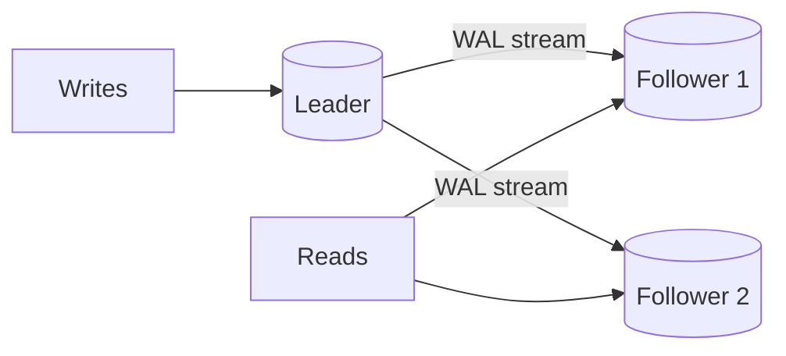
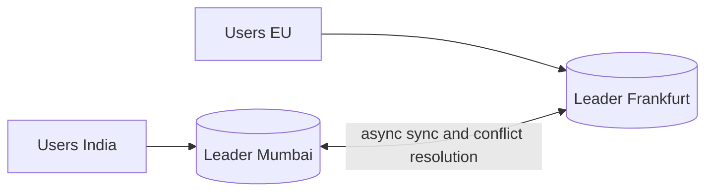
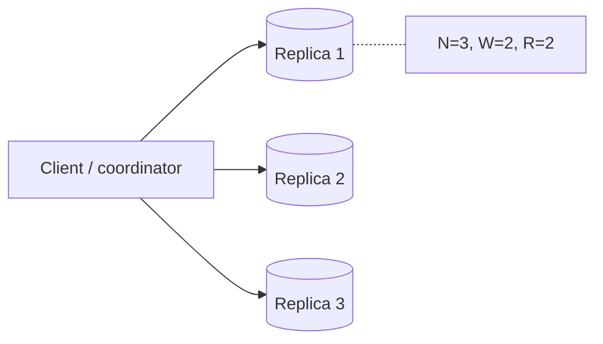
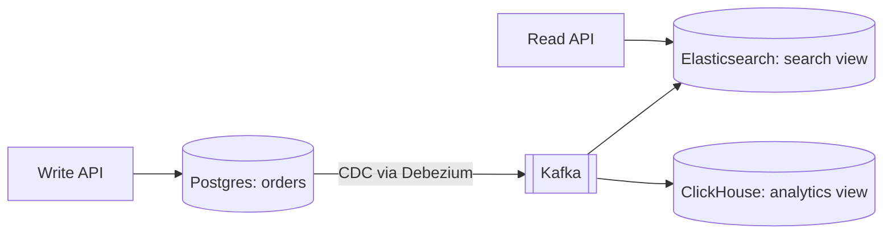
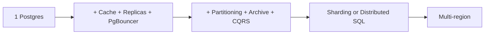

# Scaling Databases

App servers are stateless and easy to scale. The real bottleneck is the database. This page is the whole ladder you climb in an interview: bigger machine → read replicas → caching → partitioning → sharding → multi-region. Stating the trade-off at each step is what the interviewer checks.

## ⭐ Vertical vs horizontal scaling

**In one line:** vertical = a bigger machine (more CPU/RAM/IOPS); horizontal = spread load or data across more machines.

| | Vertical (scale up) | Horizontal (scale out) |
|---|---|---|
| How | `db.r6g.2xlarge` → `db.r6g.16xlarge` | replicas, shards, partitions |
| Code change | none | routing and consistency must be handled |
| Limit | hardware ceiling, cost grows exponentially | almost unlimited |
| Failure | one machine = single point of failure | one node down, the rest keep going |
| When | always the first step | when vertical runs out or you need HA |

> **Real example:** Zerodha ran on large Postgres machines for years. One modern machine (64 cores, 512 GB RAM, NVMe) lets Postgres handle ~10k–50k simple writes/sec and several TB of data comfortably.

**Interview tip:** "Scale vertically first, measure, then go horizontal." Jumping straight to sharding is a red flag.

**Common mistake:** naming sharding as the first step. Sharding is the last and most expensive step.

## ⭐ Read replicas and replication lag

**In one line:** the primary takes all writes, streams its WAL/binlog to replicas, and reads are spread over the replicas.

- Best for read-heavy apps (90% reads: feeds, catalog, profiles).
- **Async replication** (default): the primary does not wait. Fast, but a replica can fall behind (lag from ms to seconds). Primary crash = the last few writes are lost.
- **Sync replication:** commit only after at least one replica confirms. Zero data loss, but higher write latency. In Postgres: `synchronous_standby_names`.
- **Semi-sync** (MySQL): commit once one replica has received (not applied) the write.

### Replication lag problems and fixes

| Problem | Example | Fix |
|---|---|---|
| **Read-your-writes** broken | user updates profile, refresh shows the old one | read from the primary for X sec after the user's own writes; or keep the last-write LSN in the session and skip a replica until it has replayed that LSN |
| **Monotonic reads** broken | first request hits a fresh replica, second a stale one: data goes "back in time" | give each user a sticky replica (hash of user_id) |
| **Consistent prefix** broken | the reply appears before the question | keep related writes in the same partition, or use causal ordering |

```sql
-- On the primary: how far behind are the replicas
SELECT client_addr, state, sent_lsn, replay_lsn,
       replay_lag
FROM pg_stat_replication;

-- On a replica: how old is the last replayed transaction
SELECT now() - pg_last_xact_replay_timestamp() AS lag;
```

**Interview tip:** as soon as you say read replicas, add: "Because of replication lag, I'll send critical reads to the primary for read-your-writes."

**Common mistake:** thinking replicas scale writes. Replicas only scale reads; all writes still go to one primary.

## ⭐ Replication topologies: leader-follower, multi-leader, leaderless

**Leader-follower (single leader):** one leader takes writes, followers copy. Postgres, MySQL, MongoDB replica set. Simple, no conflicts.



**Multi-leader:** a leader in each region, both accept writes and sync with each other asynchronously. Low-latency multi-region writes, offline apps (Google Docs style). Problem: **write conflicts** (the same row changed in two places). Fixes: last-write-wins (risk of data loss), CRDTs, or app-level merge.



**Leaderless:** the client or a coordinator writes to N replicas and waits for W acks; reads from R replicas. If `W + R > N`, a read sees the latest write (quorum). Cassandra, DynamoDB, Riak. Repair: read repair, hinted handoff, anti-entropy (Merkle trees).



| | Leader-follower | Multi-leader | Leaderless |
|---|---|---|---|
| Write path | one leader | a leader per region | any W replicas |
| Conflicts | none | yes, must be resolved | yes, versions/LWW |
| Failover | promote a follower | another leader already exists | no failover needed |
| Examples | Postgres, MySQL | multi-region MySQL, CouchDB | Cassandra, DynamoDB |

## ⭐ Sharding strategies

**In one line:** split data across separate DB instances by a shard key, so both writes and storage scale.

| Strategy | How | Pros | Cons |
|---|---|---|---|
| **Range** | `user_id 1–1M` shard 1, `1M–2M` shard 2 | fast range queries, simple | hotspots (new users on the last shard), uneven |
| **Hash** | `hash(user_id) % N` or consistent hashing | even distribution | range queries hit every shard (scatter-gather), resharding hard with `% N` |
| **Directory / lookup** | lookup table: `tenant_id → shard` | flexible, tenants can be moved | lookup service = extra hop + SPOF, must be cached |
| **Geo** | India users → Mumbai shard, EU → Frankfurt | low latency, data residency (GDPR) | uneven load per region, slow cross-region queries |

### How to choose a shard key

- **High cardinality:** many distinct values (`user_id` yes, `country` no).
- **Even distribution:** no single key gets too much traffic.
- **Matches the query pattern:** most queries finish on one shard. Swiggy orders: shard by `customer_id` so "my orders" is single-shard; build a separate read model for the restaurant dashboard.
- **Avoid cross-shard transactions:** data that changes together lives on one shard (all of a tenant's data on one shard, common in SaaS).
- **Avoid monotonic keys** with range sharding (timestamp, auto-increment): all inserts land on the last shard.

**Interview tip:** when you name a shard key, justify two things: "Distribution stays even because ..., and the main query stays single-shard because ..."

**Common mistake:** not explaining the plan for joins, unique constraints and auto-increment IDs after sharding. Global IDs need a Snowflake-style [ID generator](../01-topics/17-unique-id-generation.md).

## ⭐ Resharding and consistent hashing

**In one line:** with `hash % N`, changing N moves almost every key; with consistent hashing only ~1/N of keys move.

- **Consistent hashing:** keys and nodes sit on one ring. A key goes to the next node clockwise. Adding a node moves only its neighbour's keys. Virtual nodes even out load. Details: [Sharding & Consistent Hashing](../01-topics/04-sharding-consistent-hashing.md).
- **Fixed many partitions:** create 1024 logical partitions up front and map them to 8 physical nodes. Adding a node moves a few partitions; the key → partition mapping never changes. (Cassandra vnodes, Elasticsearch shards, Vitess.)
- **Online resharding steps:** copy to new shards (snapshot + catch up with CDC) → dual write or replication → verify → switch reads → switch writes → clean up the old shard.

## ⭐ Hot partitions and their fixes

**In one line:** disproportionate traffic on one shard key (a celebrity, an IPL match, a flash-sale item) melts one shard while the rest sit idle.

| Fix | How | Trade-off |
|---|---|---|
| **Salting / key suffix** | `item_123#0` … `item_123#9`, writes go to a random suffix | reads must merge 10 places |
| **Split the hot range** | auto-split (DynamoDB, CockroachDB) or move that key to its own shard | easy only in range-based systems |
| **Cache in front** | serve hot reads from Redis/CDN | helps reads only |
| **Write buffering / aggregation** | sum counters in memory/Redis, flush to DB every 1 sec | small delay, risk of loss on crash |
| **Dedicated shard** | a celebrity/tenant gets its own shard | needs directory sharding |

```sql
-- Salting: spread an IPL match like counter over 16 rows
INSERT INTO like_counter (match_id, bucket, cnt)
VALUES ('ipl-final', floor(random() * 16)::int, 1)
ON CONFLICT (match_id, bucket) DO UPDATE SET cnt = like_counter.cnt + 1;

-- Read: add up all buckets
SELECT sum(cnt) FROM like_counter WHERE match_id = 'ipl-final';
```

Links: [Counting & Top-K](../01-topics/15-counting-top-k.md), [Flash Sale](../02-questions/t2-15-flash-sale.md).

## ⭐ Connection pooling

**In one line:** DB connections are expensive (in Postgres each connection is a process, ~5–10 MB), so reuse connections in the app and keep the total bounded.

- **App-side pool:** HikariCP (Java), `pg-pool` (Node), SQLAlchemy pool. Each app instance has its own pool.
- **Proxy pool:** PgBouncer, RDS Proxy, ProxySQL (MySQL). Multiplexes thousands of client connections onto a few hundred server connections.
- **PgBouncer modes:** `session` (one server connection for the whole client session), `transaction` (returned after each transaction, most common), `statement` (rare). In transaction mode be careful with session features (session-level prepared statements, `SET`, advisory locks).

**HikariCP sizing:** smaller pools are better. Formula (PostgreSQL wiki): `connections = (core_count * 2) + effective_spindle_count`. ~20 connections is enough for an 8-core DB. 50 app pods × 20 pool = 1000 connections → Postgres melts, so put PgBouncer in between.

```properties
# HikariCP (Spring Boot application.properties)
spring.datasource.hikari.maximum-pool-size=10
spring.datasource.hikari.minimum-idle=10
spring.datasource.hikari.connection-timeout=3000
spring.datasource.hikari.max-lifetime=1700000
```

```ini
; pgbouncer.ini
[databases]
orders = host=10.0.0.5 port=5432 dbname=orders
[pgbouncer]
pool_mode = transaction
max_client_conn = 5000
default_pool_size = 40
```

**Common mistake:** "Load went up, set the pool size to 200." More connections = context switching + lock contention, and throughput drops.

## ⭐ Caching in front of the DB

**In one line:** serve hot reads from Redis/Memcached so only misses reach the DB.

- **Cache-aside** (most common): on read, cache miss → DB → set cache with TTL. On write, update DB + delete cache.
- The cache absorbs 80–95% of read-heavy load. Watch out for stampedes, invalidation and hot keys.
- Details: [Caching](../01-topics/05-caching.md).

## CQRS and materialized read models

**In one line:** keep the write model (normalized, OLTP) separate from the read model (denormalized, shaped like the query); update the read model from CDC/events.

- Flipkart: orders live in Postgres (write); the "seller dashboard" reads a denormalized view in Elasticsearch/ClickHouse (read).
- For small cases in Postgres: `MATERIALIZED VIEW` + `REFRESH MATERIALIZED VIEW CONCURRENTLY`.
- Trade-off: the read model is eventually consistent.



## ⭐ Partitioning inside one DB

**In one line:** split one big table into many child tables inside the same DB (by date, region, hash). It is not sharding: same server, same transaction.

Benefits: partition pruning (a query reads only the relevant partitions), drop old data instantly with `DROP PARTITION` (no DELETE), smaller indexes, faster vacuum.

```sql
-- Postgres declarative partitioning: orders by month
CREATE TABLE orders (
  id          BIGINT GENERATED ALWAYS AS IDENTITY,
  customer_id BIGINT NOT NULL,
  amount      NUMERIC(12,2),
  created_at  TIMESTAMPTZ NOT NULL,
  PRIMARY KEY (id, created_at)          -- the partition key must be in the PK
) PARTITION BY RANGE (created_at);

CREATE TABLE orders_2026_09 PARTITION OF orders
  FOR VALUES FROM ('2026-09-01') TO ('2026-10-01');
CREATE TABLE orders_2026_10 PARTITION OF orders
  FOR VALUES FROM ('2026-10-01') TO ('2026-11-01');

CREATE INDEX ON orders (customer_id, created_at);  -- created on every partition

-- Pruning: only orders_2026_10 is scanned
EXPLAIN SELECT * FROM orders WHERE created_at >= '2026-10-01';

-- Archive old data: detach, export to S3, drop
ALTER TABLE orders DETACH PARTITION orders_2026_09 CONCURRENTLY;
DROP TABLE orders_2026_09;
```

Hash/list too: `PARTITION BY HASH (customer_id)` with `FOR VALUES WITH (MODULUS 8, REMAINDER 0)`, `PARTITION BY LIST (region)`. Use `pg_partman` to auto-create partitions.

**Common mistake:** not filtering on the partition key. Then every partition is scanned and you gain nothing.

## Cold data archiving

- 90% of queries hit the last 3 months of data. Keeping old data in the hot DB = bigger indexes, slow backups, expensive storage.
- Pattern: time-partition → detach the old partition → export as Parquet to [S3](15-object-storage.md) → query with Athena/Trino/BigQuery.
- In DynamoDB/Mongo: TTL auto-delete + archive from the stream.

## ⭐ Backups, PITR and failover

**Backups:**
- **Logical** (`pg_dump`, `mysqldump`): portable, slow, not for big DBs.
- **Physical** (`pg_basebackup`, EBS snapshots, pgBackRest): fast restore.
- **PITR (point-in-time recovery):** base backup + continuous WAL archive. "Yesterday at 3:42 PM someone ran `DELETE` without `WHERE`" → restore to 3:41. RDS keeps 1–35 days.
- State **RPO** (how much data you can lose) and **RTO** (how long to recover). Test restores regularly; an untested backup is no backup.

**Failover:**
- Health check fails → promote the most up-to-date replica → point clients at the new endpoint (DNS/VIP/proxy).
- Tools: Patroni (Postgres + etcd), RDS Multi-AZ (~60–120 sec), Orchestrator (MySQL).
- Avoid **split brain**: fence the old primary (STONITH), elect the leader through a consensus store.
- Promoting an async replica can lose the last few writes (RPO > 0).

```bash
# Promote a Postgres replica to primary
pg_ctl promote -D /var/lib/postgresql/data
# or via SQL (PG 12+)
psql -c "SELECT pg_promote();"
```

## ⭐ Practical commands and config

| Command / config | What it does | Example |
|---|---|---|
| `CREATE PUBLICATION` | source of logical replication (on the primary) | `CREATE PUBLICATION orders_pub FOR TABLE orders;` |
| `CREATE SUBSCRIPTION` | subscribe from another DB (migration, upgrade, CDC) | `CREATE SUBSCRIPTION orders_sub CONNECTION 'host=pg1 dbname=shop' PUBLICATION orders_pub;` |
| `pg_stat_replication` | replica state and lag | `SELECT client_addr, replay_lag FROM pg_stat_replication;` |
| `pg_last_xact_replay_timestamp()` | lag on a replica | `SELECT now() - pg_last_xact_replay_timestamp();` |
| `PARTITION BY RANGE` | declarative partitioning | `CREATE TABLE logs (...) PARTITION BY RANGE (ts);` |
| `ATTACH / DETACH PARTITION` | add/remove a partition | `ALTER TABLE logs DETACH PARTITION logs_2025;` |
| `synchronous_standby_names` | sync replication | `synchronous_standby_names = 'ANY 1 (r1, r2)'` |
| `wal_level = logical` | enable logical replication | in `postgresql.conf` |
| `pg_basebackup` | physical backup / new replica | `pg_basebackup -h pg1 -D /data -R -X stream` |
| `pg_promote()` | replica → primary | `SELECT pg_promote();` |
| `CHANGE REPLICATION SOURCE TO` | MySQL replica setup (8.0.23+) | `CHANGE REPLICATION SOURCE TO SOURCE_HOST='m1';` |
| `SHOW REPLICA STATUS` | MySQL lag (`Seconds_Behind_Source`) | `SHOW REPLICA STATUS\G` |

## ⭐ Scaling journey example: startup → 1M users → 100M

**Stage 1: launch (0–10k users).** One managed Postgres (RDS), daily backups + PITR, Multi-AZ. HikariCP in the app. That is all. Talking about sharding here is over-engineering.

**Stage 2: 1M users (~1k QPS peak).**
- Indexes for slow queries (`pg_stat_statements`), fix N+1.
- Scale vertically one size up.
- Redis cache-aside for hot reads (menu, profile).
- 1–2 read replicas; critical reads go to the primary for read-your-writes.
- PgBouncer, because the number of pods grew.
- Images/files on [S3 + CDN](15-object-storage.md), only the URL in the DB.

**Stage 3: 10M users (~10k QPS).**
- Big tables (orders, events) time-partitioned, old data archived to S3.
- Search in Elasticsearch, analytics in ClickHouse/BigQuery (via CDC). No reporting queries on the primary.
- Async work (notifications, emails) on Kafka/a queue.
- Separate DBs per service (orders DB, payments DB, users DB): vertical partitioning.

**Stage 4: 100M users (~100k+ QPS).**
- Write limit hit: shard the biggest tables (`customer_id` hash, 1024 logical shards) with Vitess/Citus, or migrate to CockroachDB/Spanner, or move high-write data to Cassandra/DynamoDB (chat messages, feeds).
- Multi-region: geo-sharding or a multi-region DB, a global ID generator.
- Hot key handling (salting, dedicated shards), CQRS read models.



**Say:** "At every stage I'll look at metrics before the next step: CPU, replication lag, p99 latency, connection count. Sharding comes when writes outgrow one primary."

## Where it shows up in system design

- [News Feed](../02-questions/t1-03-news-feed.md), [Instagram](../02-questions/t2-13-instagram.md): read replicas, cache, fan-out
- [WhatsApp](../02-questions/t1-04-whatsapp-chat.md), [Discord](../02-questions/t2-25-discord.md): message sharding by chat/channel
- [Flash Sale](../02-questions/t2-15-flash-sale.md), [Leaderboard](../02-questions/t2-16-leaderboard.md): hot partitions
- [Distributed KV Store](../02-questions/t2-20-distributed-kv-store.md): leaderless quorum, consistent hashing
- Topics: [Scaling Basics](../01-topics/01-scaling-basics.md), [Indexing & Replication](../01-topics/03-indexing-replication.md), [Sharding](../01-topics/04-sharding-consistent-hashing.md), [Caching](../01-topics/05-caching.md)

## Say this in the interview

> "I'll scale the DB in this order: indexes and vertical scale, then cache and read replicas, then partitioning and archiving, then splitting DBs per service, and finally sharding by `customer_id`. A metric decides the trigger for each step."

## Checklist

- [ ] I can explain the vertical vs horizontal trade-off and why vertical comes first
- [ ] I can name 3 replication lag problems and 2 fixes for read-your-writes
- [ ] I can compare leader-follower, multi-leader and leaderless (W + R > N)
- [ ] I can give the pros/cons of range, hash, directory and geo sharding and the rules for a good shard key
- [ ] I can explain fixing a hot partition with salting/splitting/caching
- [ ] I can explain PgBouncer modes and why HikariCP pools are kept small
- [ ] I can write Postgres declarative partitioning SQL and explain partition pruning
- [ ] I can explain PITR, RPO/RTO and the split-brain risk in failover
- [ ] I can walk through the scaling journey from startup to 100M users stage by stage
