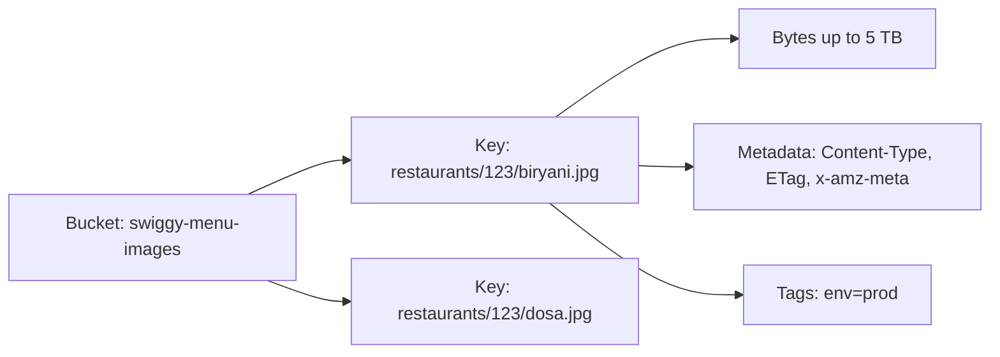
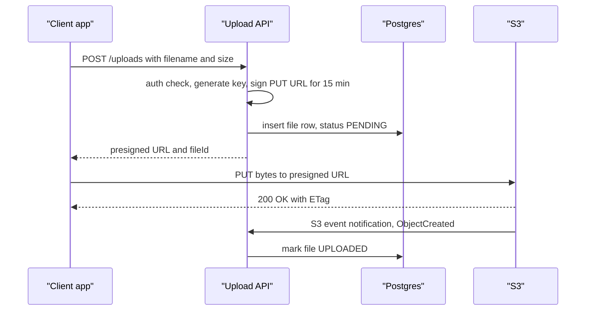
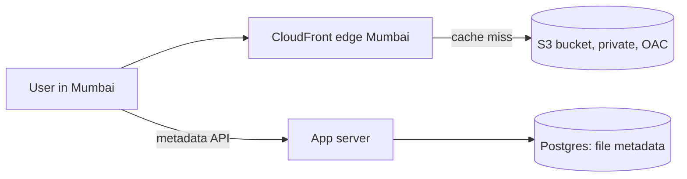

# Object Storage: S3

Photos, videos, PDFs, backups, logs: none of this goes into the database, it goes into object storage. Amazon S3 is the standard (GCS, Azure Blob and MinIO all work much like S3). In system design, almost every "upload" question brings in S3 + CDN + pre-signed URLs.

## ⭐ Object model: bucket, key, metadata

**In one line:** S3 is a flat key-value store where key = a string path, value = file bytes (up to 5 TB), plus metadata.

- **Bucket:** top-level container with a globally unique name, in one region (`swiggy-menu-images` in `ap-south-1`).
- **Key:** the full object name, e.g. `restaurants/123/menu/biryani.jpg`. Folders do not really exist; `/` is just part of the name and the console shows prefixes as folders.
- **Object:** data + **metadata** (system: `Content-Type`, `Content-Length`, `ETag`, `Last-Modified`; user: `x-amz-meta-uploaded-by`) + optional **tags** (for lifecycle/billing).
- **Immutable:** you cannot edit the middle of an object. Changing it = PUT the whole object again.
- Address: `s3://bucket/key` or `https://bucket.s3.ap-south-1.amazonaws.com/key`.



> **Real example:** a dish photo in the Swiggy app. The Postgres `menu_items` table stores only `image_key = 'restaurants/123/biryani.jpg'`; the actual image lives in S3 and reaches the user through the CloudFront CDN.

## ⭐ Why not store files in the DB

| BLOB in the DB | Object in S3 |
|---|---|
| DB size balloons, backups/replication slow down | DB stays small, metadata only |
| Every image read uses a DB connection and buffer cache | S3/CDN serves directly, no app server in the path |
| Expensive storage (SSD + replicas) | ~$0.023/GB-month Standard, even cheaper in archive |
| Streaming, range requests, CDN are hard | HTTP range GET, CDN, pre-signed URLs built in |
| Limited scale | practically unlimited objects |

Small things (avatar thumbnails <100 KB, low traffic) can live in the DB, but the default answer is: **blob in S3, metadata in the DB**.

**Interview tip:** "Video/image uploads will not go through the app server. The client uploads straight to S3 with a pre-signed URL." That one line solves both bandwidth and scale.

## ⭐ Durability, availability and consistency

| Number | Value | Meaning |
|---|---|---|
| Durability | **99.999999999%** (11 nines) | store 10M objects and expect to lose ~1 every 10,000 years. Data is stored redundantly across 3+ AZs |
| Availability (Standard) | 99.99% design | ~53 min of downtime possible per year |
| Availability (One Zone-IA) | 99.5% | data in one AZ only |
| Max object size | 5 TB | single PUT max 5 GB, multipart above that |
| Request rate | 3,500 PUT/s and 5,500 GET/s **per prefix** | spread across prefixes if you need more |

**Consistency:** since Dec 2020 S3 gives **strong read-after-write consistency**: right after a PUT/DELETE, GET and LIST show the new data, in all regions, at no extra cost. Overwrites/deletes used to be eventually consistent, and older books still say so.

- Concurrent writes to the same key: last writer wins (no locking). Conditional writes (`If-None-Match: *`, `If-Match: <etag>`) can prevent overwrites.
- Cross-Region Replication is async (minutes).

**Common mistake:** treating durability and availability as the same. Durability = data will not be lost; availability = you can access it right now.

## ⭐ Storage classes and lifecycle rules

| Class | When | Retrieval |
|---|---|---|
| **S3 Standard** | hot data, accessed daily | ms |
| **Intelligent-Tiering** | unknown access pattern; moves data automatically | ms (archive tiers optional) |
| **Standard-IA** | accessed now and then each month, 30-day minimum | ms, per-GB retrieval fee |
| **One Zone-IA** | data you can recreate (thumbnails) | ms, one AZ |
| **Glacier Instant Retrieval** | once a quarter, needed immediately | ms |
| **Glacier Flexible Retrieval** | backups, archive | minutes to 12 hours |
| **Glacier Deep Archive** | compliance, 7–10 years | 12–48 hours, cheapest (~$1/TB-month) |

**Lifecycle rules:** automatic transition and expiry by prefix/tag.

```json
{
  "Rules": [{
    "ID": "invoices-archive",
    "Filter": { "Prefix": "invoices/" },
    "Status": "Enabled",
    "Transitions": [
      { "Days": 30,  "StorageClass": "STANDARD_IA" },
      { "Days": 180, "StorageClass": "GLACIER" }
    ],
    "Expiration": { "Days": 2555 },
    "AbortIncompleteMultipartUpload": { "DaysAfterInitiation": 7 }
  }]
}
```

**Interview tip:** Paytm invoices: IA after 30 days, Glacier after 6 months, delete after 7 years (compliance). One rule cuts cost by 80%+.

## ⭐ Multipart upload

**In one line:** split a big file into parts (5 MB–5 GB, max 10,000 parts), upload them in parallel, retry only the failed part, and join them with a complete call at the end.

- Recommended above 100 MB, required above 5 GB.
- Parallel parts = faster uploads; resumable (YouTube/Dropbox style uploads on mobile networks).
- Remember every part's `ETag` and send them in `CompleteMultipartUpload`.
- Parts of incomplete uploads are billed too: add `AbortIncompleteMultipartUpload` to the lifecycle.
- For direct client uploads you can also issue a pre-signed URL per `UploadPart`.

## ⭐ Pre-signed URLs

**In one line:** the server uses its credentials to create a time-limited signed URL; the client PUTs/GETs straight to S3 with it, without AWS credentials and without the bytes passing through the app server.



- Keep expiry short (5–15 min for uploads, minutes to hours for downloads).
- The signature binds the method, key and content-type. For a size limit use a **presigned POST** with a `content-length-range` condition.
- Confirm upload completion with an S3 event (SNS/SQS/Lambda/EventBridge) or a client confirm call + `HeadObject`.
- Private downloads: keep the bucket private and issue a short pre-signed GET or a CloudFront signed URL per download.

**Common mistake:** making the bucket public so images show up. Keep Block Public Access on and serve through the CDN with Origin Access Control.

## Versioning

- When enabled on a bucket, every overwrite creates a new version (`VersionId`); a delete only adds a **delete marker**, so the old version can be restored.
- Protects against accidental deletes/ransomware. Required for Cross-Region Replication.
- Cost: storage for every version. Add `NoncurrentVersionExpiration` (e.g. 30 days) to the lifecycle.
- **Object Lock** (WORM): for compliance, cannot be deleted until the retention period ends.

## ⭐ Important API methods

| Method | What it does | Example |
|---|---|---|
| `PutObject` | upload an object (up to 5 GB) | `s3.put_object(Bucket=b, Key=k, Body=data, ContentType="image/jpeg")` |
| `GetObject` | download an object, partial with a `Range` header | `s3.get_object(Bucket=b, Key=k, Range="bytes=0-1023")` |
| `HeadObject` | metadata only (size, ETag, type), no body | `s3.head_object(Bucket=b, Key=k)` |
| `DeleteObject` | delete (a delete marker if versioning is on) | `s3.delete_object(Bucket=b, Key=k)` |
| `DeleteObjects` | delete up to 1000 in one call | `s3.delete_objects(Bucket=b, Delete={"Objects": [...]})` |
| `ListObjectsV2` | keys under a prefix, 1000 per page, next page via `ContinuationToken` | `s3.list_objects_v2(Bucket=b, Prefix="users/42/", Delimiter="/")` |
| `CreateMultipartUpload` | start a multipart upload, returns `UploadId` | `s3.create_multipart_upload(Bucket=b, Key=k)` |
| `UploadPart` | upload one part, returns `ETag` | `s3.upload_part(..., PartNumber=1, UploadId=uid, Body=chunk)` |
| `CompleteMultipartUpload` | join the parts into the final object | `s3.complete_multipart_upload(..., MultipartUpload={"Parts": parts})` |
| `AbortMultipartUpload` | cancel an incomplete upload, delete its parts | `s3.abort_multipart_upload(Bucket=b, Key=k, UploadId=uid)` |
| `generate_presigned_url` | signed GET/PUT URL (signed locally in the SDK, no API call) | `s3.generate_presigned_url("put_object", Params={...}, ExpiresIn=900)` |
| `CopyObject` | server-side copy (rename = copy + delete), up to 5 GB | `s3.copy_object(Bucket=b, Key=new, CopySource={"Bucket": b, "Key": old})` |

```python
import boto3

s3 = boto3.client("s3", region_name="ap-south-1")
BUCKET = "swiggy-menu-images"

# 1. Upload a small file with metadata
s3.put_object(Bucket=BUCKET, Key="restaurants/123/biryani.jpg",
              Body=open("biryani.jpg", "rb"), ContentType="image/jpeg",
              Metadata={"uploaded-by": "user-42"})

# 2. Check metadata only
head = s3.head_object(Bucket=BUCKET, Key="restaurants/123/biryani.jpg")
print(head["ContentLength"], head["ETag"])

# 3. All keys under a prefix, with pagination
token = None
while True:
    kwargs = {"Bucket": BUCKET, "Prefix": "restaurants/123/"}
    if token:
        kwargs["ContinuationToken"] = token
    page = s3.list_objects_v2(**kwargs)
    for obj in page.get("Contents", []):
        print(obj["Key"], obj["Size"])
    if not page.get("IsTruncated"):
        break
    token = page["NextContinuationToken"]

# 4. A 15 min upload URL for the client
url = s3.generate_presigned_url(
    "put_object",
    Params={"Bucket": BUCKET, "Key": "uploads/user-42/a1b2.jpg",
            "ContentType": "image/jpeg"},
    ExpiresIn=900)

# 5. Big file: multipart (manual steps)
mpu = s3.create_multipart_upload(Bucket=BUCKET, Key="videos/v1.mp4")
parts, part_no = [], 1
with open("v1.mp4", "rb") as f:
    while chunk := f.read(8 * 1024 * 1024):          # 8 MB parts
        r = s3.upload_part(Bucket=BUCKET, Key="videos/v1.mp4", PartNumber=part_no,
                           UploadId=mpu["UploadId"], Body=chunk)
        parts.append({"PartNumber": part_no, "ETag": r["ETag"]})
        part_no += 1
s3.complete_multipart_upload(Bucket=BUCKET, Key="videos/v1.mp4",
                             UploadId=mpu["UploadId"],
                             MultipartUpload={"Parts": parts})
# In real code s3.upload_file() does multipart + parallel threads for you
```

**Interview tip:** "S3 has no rename; it is `CopyObject` + `DeleteObject`. So design keys that never need to change (UUID based)."

**Common mistake:** using `ListObjectsV2` like a DB query ("all of a user's files ordered by size"). LIST is slow and paginated. Keep that metadata in a DB.

## ⭐ CDN in front of S3

- CloudFront (or Akamai/Cloudflare) caches at the edge: a Mumbai user gets the image from the Mumbai edge, and only cache misses reach S3.
- **Origin Access Control (OAC):** the bucket stays private, only CloudFront can read it.
- Cache-busting: when content changes use a new key (`biryani.v2.jpg` or a hash in the key); invalidations are slow and cost money.
- For video, HLS/DASH segments sit in S3 and stream through the CDN.
- Details: [Blob Storage & CDN](../01-topics/12-blob-storage-cdn.md).



## ⭐ Pattern: metadata in the DB, blob in S3

**In one line:** the DB holds the file row (owner, key, size, type, status, checksum), S3 holds the bytes. Queries are fast in the DB, bytes come from S3.

```sql
CREATE TABLE files (
  id          UUID PRIMARY KEY,
  owner_id    BIGINT NOT NULL,
  s3_key      TEXT NOT NULL UNIQUE,      -- uploads/{owner}/{uuid}
  size_bytes  BIGINT,
  mime_type   TEXT,
  sha256      TEXT,                      -- dedup and integrity
  status      TEXT NOT NULL DEFAULT 'PENDING',  -- PENDING, UPLOADED, DELETED
  created_at  TIMESTAMPTZ DEFAULT now()
);
CREATE INDEX ON files (owner_id, created_at DESC);
```

- Upload: row `PENDING` → pre-signed PUT → S3 event → `UPLOADED`.
- Delete: mark the row `DELETED` (soft) → an async job deletes from S3. Do it the other way round and you get dangling rows.
- Orphans: a periodic job cleans `PENDING` rows older than 24h and S3 objects with no row.
- Dedup (Dropbox): use the content hash (`sha256`) as the key, so the same file is never uploaded twice.

## GCS, Azure Blob, MinIO

| | Amazon S3 | Google Cloud Storage | Azure Blob Storage | MinIO |
|---|---|---|---|---|
| Container | bucket | bucket | storage account + container | bucket |
| Signed URL | pre-signed URL | signed URL | SAS token | pre-signed (S3 API) |
| Classes | Standard, IA, Glacier... | Standard, Nearline, Coldline, Archive | Hot, Cool, Cold, Archive | self-managed |
| Note | the standard API | always strongly consistent | block/append/page blobs | self-hosted, S3-compatible, on-prem/dev |

Many tools (Cloudflare R2, Backblaze B2, Ceph) offer an **S3-compatible API**, so boto3 code works by just changing the endpoint.

## ⭐ When to use / when not

| Use it | Avoid it |
|---|---|
| Images, videos, documents, user uploads | Small, frequently updated records (row-level updates) |
| Backups, logs, data lake (Parquet + Athena) | Low-latency (<10 ms) random reads: use a DB/cache |
| Static website assets + CDN | Appending/editing in the middle of a file (POSIX FS: EFS) |
| ML datasets, model files | Rich queries like "size > X order by date": keep them in a metadata DB |

## Where it shows up in system design

- [YouTube](../02-questions/t1-07-youtube.md): raw video via multipart upload, transcoded segments in S3, streamed through a CDN
- [Dropbox](../02-questions/t1-08-dropbox.md): chunking, content-hash dedup, metadata DB + blob store
- [Instagram](../02-questions/t2-13-instagram.md): photos in S3 + CDN, pre-signed upload
- [Distributed Logging](../02-questions/t2-26-distributed-logging.md): cold logs archived to S3
- Topic: [Blob Storage & CDN](../01-topics/12-blob-storage-cdn.md)

## Say this in the interview

> "Bytes in S3, metadata in Postgres. The client does a multipart upload straight to S3 with pre-signed URLs, an S3 event updates the status, and reads go through CloudFront from a private bucket. A lifecycle rule moves old files to IA/Glacier."

## Checklist

- [ ] I can explain bucket, key, metadata and "folders are not real"
- [ ] I can give 3 reasons why files are not stored in the DB
- [ ] I can explain 11 nines durability vs 99.99% availability and S3's strong read-after-write consistency
- [ ] I can design storage classes and a lifecycle rule (IA → Glacier → expire)
- [ ] I can explain the steps and benefits of multipart upload
- [ ] I can draw the full pre-signed URL upload flow as a sequence diagram
- [ ] I can explain when to use PutObject, GetObject, HeadObject, ListObjectsV2 pagination and CopyObject
- [ ] I can explain the metadata-in-DB + blob-in-S3 pattern and orphan cleanup
