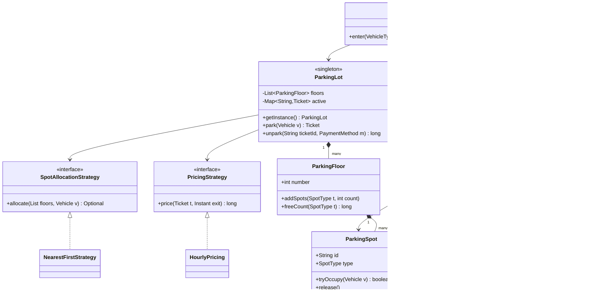

# Parking Lot

**In one line:** design a multi-floor parking lot: a vehicle arrives at a gate, gets the right spot and a ticket, and at exit the price is computed and paid. The interviewer checks clean entities, OCP (new vehicle or pricing without touching old code), and that **two gates never hand out the same spot**.

---

## Step 1: Clarify requirements

| You ask | Typical answer | Impact on design |
|---|---|---|
| "How many floors and gates?" | Multiple floors, 2+ entry and exit gates | Gates run in parallel → concurrency |
| "Vehicle types?" | Bike, Car, Truck, EV | `VehicleType` enum + Factory |
| "Spot types? Can a small vehicle use a bigger spot?" | SMALL, MEDIUM, LARGE, EV. Yes, fallback is fine | Each vehicle has a "fits" list (preference order) |
| "Pricing?" | Hourly per spot type. Some lots use a flat rate | `PricingStrategy` |
| "Payment modes?" | UPI, Card, Cash | `PaymentMethod` interface |
| "Display board?" | Free spots per type on every floor | Observer |
| "One lot or a chain of lots?" | One lot | Singleton (a chain needs a registry) |
| "Reservations / monthly pass?" | Not now | Out of scope, mention as extension |

**Functional:**
- Vehicle arrives at entry gate → assign a free compatible spot → issue a ticket.
- At exit, scan ticket → price from duration → payment → free the spot.
- Display board shows each floor's free count, updated live.
- If the lot is full, refuse clearly at entry.

**Out of scope:** online pre-booking, valet, number-plate cameras (ANPR), multi-lot chain.

> **Say:** "I'll first lay out entities and the class diagram, then code the park/unpark flow, and at the end handle the race between two gates."

## Step 2: Core entities

- **ParkingLot:** the whole system, a Singleton. Holds floors, active tickets, strategies.
- **ParkingFloor:** one floor, list of spots per type.
- **ParkingSpot:** id, floor, `SpotType`, which vehicle is parked right now.
- **Vehicle** (Bike, Car, Truck, ElectricCar): plate + `VehicleType`. Built by `VehicleFactory`.
- **Ticket:** id, vehicle, spot, entry time. The base for pricing at exit.
- **SpotAllocationStrategy:** which spot to give (nearest-first, fill floor by floor…).
- **PricingStrategy:** how much to charge (hourly, flat).
- **PaymentMethod:** UPI / Card / Cash.
- **SpotListener / DisplayBoard:** updated when a spot changes.
- **EntryGate / ExitGate:** thin classes that call the lot.

## Step 3: Class diagram



`FlatPricing`, `ExitGate`, `PaymentMethod` and the Vehicle subclasses are left out to keep the diagram small. They are in the code.

## Step 4: Why these design patterns

| Pattern | Where | Why | Alternative |
|---|---|---|---|
| [Strategy](../03-lld/05-behavioral.md) | `PricingStrategy` (hourly/flat), `SpotAllocationStrategy` | Weekend pricing or "fill upper floors first" without touching `ParkingLot` | `if (type == ...)` chain: every new rule reopens old code |
| [Factory](../03-lld/03-creational.md) | `VehicleFactory`, `ParkingFloor.addSpots` | The gate only knows type + plate. No `new Car()` scattered everywhere | Direct constructor calls: a new type changes every caller |
| [Singleton](../03-lld/03-creational.md) | `ParkingLot` | One physical lot, one source of truth for spots | Single instance via a DI container (better for testing) |
| [Observer](../03-lld/05-behavioral.md) | `DisplayBoard`, mobile app, analytics | The lot does not know who is listening. New listener = zero change | Board polls every second: wasteful and stale |

> **Say:** "I'll call it a Singleton, but in production I'd make it a single instance through DI, because a static Singleton is hard to mock in tests."

## Step 5: Code

Vehicles, spots and the factory:

```java
import java.time.*;
import java.util.*;
import java.util.concurrent.*;
import java.util.concurrent.atomic.*;

enum SpotType { SMALL, MEDIUM, LARGE, EV }

enum VehicleType {
    BIKE(List.of(SpotType.SMALL, SpotType.MEDIUM)),
    CAR(List.of(SpotType.MEDIUM, SpotType.LARGE)),
    TRUCK(List.of(SpotType.LARGE)),
    EV_CAR(List.of(SpotType.EV, SpotType.MEDIUM));

    final List<SpotType> fits;   // preference order: first is the best fit
    VehicleType(List<SpotType> fits) { this.fits = fits; }
}

abstract class Vehicle {
    final String plate; final VehicleType type;
    Vehicle(String plate, VehicleType type) { this.plate = plate; this.type = type; }
}
class Bike extends Vehicle { Bike(String p) { super(p, VehicleType.BIKE); } }
class Car extends Vehicle { Car(String p) { super(p, VehicleType.CAR); } }
class Truck extends Vehicle { Truck(String p) { super(p, VehicleType.TRUCK); } }
class ElectricCar extends Vehicle { ElectricCar(String p) { super(p, VehicleType.EV_CAR); } }

class VehicleFactory {
    static Vehicle create(VehicleType type, String plate) {
        return switch (type) {   // a new type makes the compiler point here
            case BIKE -> new Bike(plate);
            case CAR -> new Car(plate);
            case TRUCK -> new Truck(plate);
            case EV_CAR -> new ElectricCar(plate);
        };
    }
}

class ParkingSpot {
    final String id; final int floor; final SpotType type;
    private final AtomicReference<Vehicle> parked = new AtomicReference<>();
    ParkingSpot(String id, int floor, SpotType type) { this.id = id; this.floor = floor; this.type = type; }

    boolean isFree() { return parked.get() == null; }
    boolean tryOccupy(Vehicle v) { return parked.compareAndSet(null, v); } // CAS: only one of two gates wins
    void release() { parked.set(null); }
}

class ParkingFloor {
    final int number;
    private final Map<SpotType, List<ParkingSpot>> spots = new EnumMap<>(SpotType.class);
    ParkingFloor(int number) { this.number = number; }

    void addSpots(SpotType type, int count) {   // spot factory: id format lives in one place
        List<ParkingSpot> list = spots.computeIfAbsent(type, t -> new ArrayList<>());
        for (int i = 0; i < count; i++)
            list.add(new ParkingSpot("F" + number + "-" + type + "-" + (list.size() + 1), number, type));
    }
    List<ParkingSpot> spotsOf(SpotType t) { return spots.getOrDefault(t, List.of()); }
    long freeCount(SpotType t) { return spotsOf(t).stream().filter(ParkingSpot::isFree).count(); }
}
```

Strategies, ticket, payment, observer:

```java
record Ticket(String id, Vehicle vehicle, ParkingSpot spot, Instant entry) {}

interface SpotAllocationStrategy { Optional<ParkingSpot> allocate(List<ParkingFloor> floors, Vehicle v); }

class NearestFirstStrategy implements SpotAllocationStrategy {
    public Optional<ParkingSpot> allocate(List<ParkingFloor> floors, Vehicle v) {
        for (SpotType type : v.type.fits)            // best-fit type first
            for (ParkingFloor f : floors)            // floor 0 = closest to the gate
                for (ParkingSpot s : f.spotsOf(type))
                    if (s.isFree() && s.tryOccupy(v)) return Optional.of(s); // CAS failed = try next spot
        return Optional.empty();
    }
}

interface PricingStrategy { long price(Ticket t, Instant exit); }

class HourlyPricing implements PricingStrategy {
    private final Map<SpotType, Integer> ratePerHour;
    HourlyPricing(Map<SpotType, Integer> ratePerHour) { this.ratePerHour = ratePerHour; }
    public long price(Ticket t, Instant exit) {
        long mins = Duration.between(t.entry(), exit).toMinutes();
        long hours = Math.max(1, (mins + 59) / 60);  // first hour is full, the rest rounds up
        return hours * ratePerHour.get(t.spot().type);
    }
}

class FlatPricing implements PricingStrategy {
    private final long amount;
    FlatPricing(long amount) { this.amount = amount; }
    public long price(Ticket t, Instant exit) { return amount; }
}

interface PaymentMethod { boolean pay(long amount); }
class UpiPayment implements PaymentMethod {
    public boolean pay(long amount) { System.out.println("Paid via UPI Rs " + amount); return true; }
}

interface SpotListener { void onSpotChange(int floor, SpotType type, long free); }

class DisplayBoard implements SpotListener {
    public void onSpotChange(int floor, SpotType type, long free) {
        System.out.println("Board: floor " + floor + " " + type + " free=" + free);
    }
}
```

ParkingLot (Singleton), gates and the main flow:

```java
class ParkingLot {
    private static final ParkingLot INSTANCE = new ParkingLot();   // eager, thread-safe
    static ParkingLot getInstance() { return INSTANCE; }
    private ParkingLot() {}

    private final List<ParkingFloor> floors = new CopyOnWriteArrayList<>(); // index = floor number
    private final Map<String, Ticket> active = new ConcurrentHashMap<>();
    private final Set<String> platesInside = ConcurrentHashMap.newKeySet();
    private final List<SpotListener> listeners = new CopyOnWriteArrayList<>();
    private final AtomicLong seq = new AtomicLong();
    private volatile SpotAllocationStrategy allocator = new NearestFirstStrategy();
    private volatile PricingStrategy pricing = new FlatPricing(50);

    void addFloor(ParkingFloor f) { floors.add(f); }
    void addListener(SpotListener l) { listeners.add(l); }
    void setPricing(PricingStrategy p) { pricing = p; }
    void setAllocator(SpotAllocationStrategy a) { allocator = a; }

    Ticket park(Vehicle v) {
        if (!platesInside.add(v.plate)) throw new IllegalStateException("Already inside: " + v.plate);
        Optional<ParkingSpot> spot = allocator.allocate(floors, v);
        if (spot.isEmpty()) {
            platesInside.remove(v.plate);
            throw new IllegalStateException("Lot full for " + v.type);
        }
        Ticket t = new Ticket("T" + seq.incrementAndGet(), v, spot.get(), Instant.now());
        active.put(t.id(), t);
        notifyChange(spot.get());
        return t;
    }

    long unpark(String ticketId, PaymentMethod method) {
        Ticket t = active.remove(ticketId);          // atomic claim: one ticket cannot exit at two gates
        if (t == null) throw new IllegalArgumentException("Invalid or used ticket: " + ticketId);
        long amount = pricing.price(t, Instant.now());
        if (!method.pay(amount)) {
            active.put(ticketId, t);                 // payment failed: ticket goes back, spot stays occupied
            throw new IllegalStateException("Payment failed");
        }
        t.spot().release();
        platesInside.remove(t.vehicle().plate);
        notifyChange(t.spot());
        return amount;
    }

    private void notifyChange(ParkingSpot s) {
        long free = floors.get(s.floor).freeCount(s.type);
        listeners.forEach(l -> l.onSpotChange(s.floor, s.type, free));
    }
}

class EntryGate {
    Ticket enter(VehicleType type, String plate) {
        return ParkingLot.getInstance().park(VehicleFactory.create(type, plate));
    }
}

class ExitGate {
    long exit(String ticketId, PaymentMethod m) { return ParkingLot.getInstance().unpark(ticketId, m); }
}

public class ParkingLotDemo {
    public static void main(String[] args) throws Exception {
        ParkingLot lot = ParkingLot.getInstance();
        ParkingFloor f0 = new ParkingFloor(0);
        f0.addSpots(SpotType.SMALL, 2);
        f0.addSpots(SpotType.MEDIUM, 1);
        f0.addSpots(SpotType.LARGE, 1);
        f0.addSpots(SpotType.EV, 1);
        lot.addFloor(f0);
        lot.addListener(new DisplayBoard());
        lot.setPricing(new HourlyPricing(Map.of(
            SpotType.SMALL, 20, SpotType.MEDIUM, 40, SpotType.LARGE, 100, SpotType.EV, 60)));

        // two gates race for the same single MEDIUM spot
        ExecutorService pool = Executors.newFixedThreadPool(2);
        Future<Ticket> a = pool.submit(() -> new EntryGate().enter(VehicleType.CAR, "KA01AB1234"));
        Future<Ticket> b = pool.submit(() -> new EntryGate().enter(VehicleType.CAR, "MH12XY9999"));
        Ticket t1 = a.get(), t2 = b.get();
        System.out.println(t1.spot().id + " / " + t2.spot().id);  // different spots: MEDIUM and LARGE
        pool.shutdown();

        System.out.println("Paid: " + new ExitGate().exit(t1.id(), new UpiPayment()));
    }
}
```

## Step 6: Concurrency & edge cases

**Two gates, one spot (the main question):**
- Race: Gate A and Gate B both see spot F0-MEDIUM-1 as free and both assign it → double allocation.
- Fix: `tryOccupy` = `compareAndSet(null, vehicle)`. Check and occupy are one atomic step. The losing gate tries the next spot.
- Alternatives:
  - One global `synchronized park()`: correct and simple, but all gates are serialized. Fine for a small lot, say it out loud.
  - Per-floor lock: the middle ground.
  - In a DB: `UPDATE spot SET vehicle_id=? WHERE id=? AND vehicle_id IS NULL` (you win only if rows affected = 1) or `SELECT ... FOR UPDATE SKIP LOCKED`. Details: [Locks & contention](../01-topics/09-locks-and-contention.md).
- The `isFree()` check before CAS is only a cheap filter. CAS gives correctness.

**Edge cases:**
- **Lot full:** allocator returns `Optional.empty()` → show "Full" at the gate, keep the barrier closed.
- **Same plate enters twice:** `platesInside.add` returns false → reject (cloned plate or a mistake).
- **Same ticket at two exit gates:** `active.remove` is an atomic claim, the second gate gets "used ticket".
- **Payment fails:** ticket goes back into `active`, the spot is not freed, barrier stays closed.
- **Lost ticket:** look up the ticket by plate, or charge the daily maximum.
- **Time:** inject a `Clock` instead of `Instant.now()` so pricing is testable. Crossing midnight or a 3-day stay is handled by hourly pricing as is.
- **Stale display:** the listener gets the count with the event. With an async listener slight staleness is fine, the board is only informational, the spot's CAS is the truth.

## Step 7: Extensions

- **Add EV charging:** the `EV` spot already exists. For a charging fee, put a Decorator on pricing: `new ChargingFee(new HourlyPricing(...))`. `ParkingLot` stays the same.
- **Weekend / surge pricing:** a new `PricingStrategy`, or a `TimeBasedPricing` that picks an inner strategy by day.
- **New vehicle (bus):** enum value + class + factory case + `fits` list. Allocator and pricing are untouched.
- **"Fill floor 3 first" or "EV always gets an EV spot":** a new `SpotAllocationStrategy`.
- **Reservation / pre-booking:** a `RESERVED` state on the spot + expiry. The allocator skips reserved spots.
- **Multiple lots (a chain, e.g. mall + airport):** drop the Singleton, use a `Map<lotId, ParkingLot>` registry.
- **Fast allocation (10k spots):** a free pool per type as `ConcurrentLinkedQueue<ParkingSpot>`. Poll = O(1), offer on release.
- **Monthly pass:** a pass check inside `PricingStrategy`, or a `PassPricing` decorator.

## Step 8: Interview flow (45 min)

| Minute | What to do |
|---|---|
| 0–5 | Requirements table: vehicle/spot types, pricing, gates, out of scope |
| 5–10 | Entity list, who owns whom |
| 10–17 | Class diagram. Name Strategy/Factory/Observer/Singleton here |
| 17–35 | Code: `ParkingSpot.tryOccupy`, allocator, pricing, `park`/`unpark` |
| 35–40 | The two-gates race + CAS/lock/DB options |
| 40–45 | Extensions: EV, surge pricing, reservation. State the trade-offs |

## 2-minute recap

The lot is a Singleton with floors, and each floor has spots per type. A vehicle is built by `VehicleFactory`, and each type has a "fits" list (bike → SMALL or MEDIUM, EV → EV or MEDIUM). At entry, `SpotAllocationStrategy` finds a spot and locks it with a `tryOccupy` CAS, so two gates never give out the same spot. The ticket stores the entry time. At exit, `active.remove` claims the ticket atomically, `PricingStrategy` (hourly/flat) computes the amount, `PaymentMethod` pays, and on failure the ticket goes back. When a spot frees up, the display board updates through Observer. A new vehicle, pricing or allocation rule = a new class, old code untouched (OCP).

## Checklist

- [ ] I can state the requirements table and out-of-scope items in 5 minutes.
- [ ] I can draw the class diagram: Lot → Floor → Spot, Ticket, two strategies, listener.
- [ ] I can explain where and why each pattern (Strategy, Factory, Singleton, Observer) is used.
- [ ] I can write the `park` and `unpark` code without looking.
- [ ] I can explain the two-gates-same-spot race and compare CAS, locks and a DB conditional update.
- [ ] I can handle edge cases like lost ticket, payment failure, full lot and double exit.
- [ ] I can explain how EV charging, surge pricing and reservations fit into the design.
