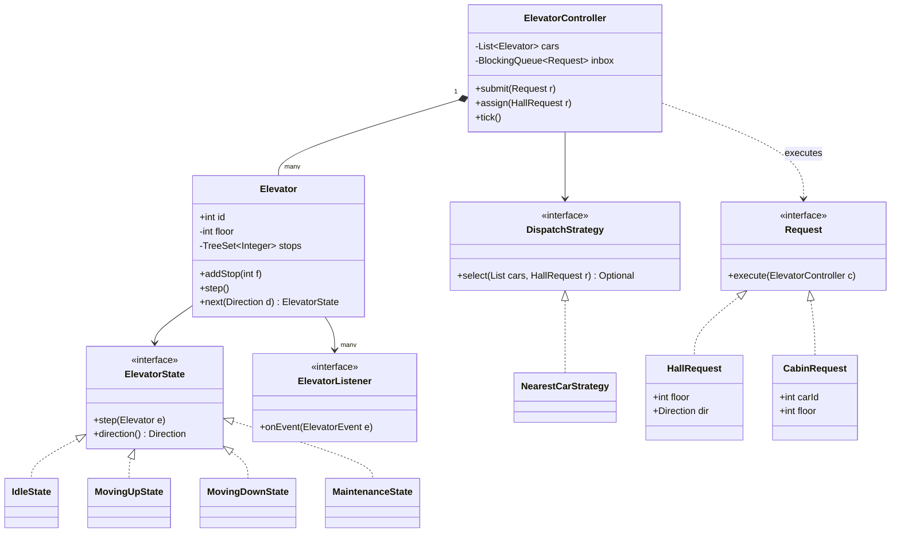

# Elevator System

**In one line:** design N elevators in a building: UP/DOWN buttons on each floor and floor buttons inside the cabin, the right car gets assigned, and each car serves its stops in a sensible order. The interviewer checks the state machine, the dispatch algorithm (SCAN/LOOK, nearest car), and clear thinking on concurrency and starvation.

---

## Step 1: Clarify requirements

| You ask | Typical answer | Impact on design |
|---|---|---|
| "How many cars and floors?" | 3–4 cars, floors 0 to 20 | `List<Elevator>`, floor range validation |
| "Where do requests come from?" | UP/DOWN on a floor (hall), floor number inside the cabin | Two request types → Command |
| "Who picks the car?" | A central controller | `DispatchStrategy` |
| "In what order does a car serve its stops?" | All stops in one direction, then reverse | LOOK algorithm, sorted stops |
| "Car states?" | Idle, moving up, moving down, maintenance | State pattern |
| "Doors?" | Open at a stop, close after a while. No moving while open | Door timer, safety check |
| "Displays?" | Each floor shows the car's current floor + direction | Observer |
| "Weight limit, fire mode, VIP car?" | Not now | Mention as extensions |

**Functional:**
- Hall request (floor + direction) → controller assigns the best car.
- Cabin request (car + floor) → becomes a stop for that car.
- A car serves stops in LOOK order, the door opens and closes at each stop.
- A car can go into maintenance, and its pending stops move to other cars.
- Displays receive every move/door event.

**Out of scope:** hardware motor control, weight sensor, fire/emergency mode, destination-dispatch kiosk.

> **Say:** "There are two levels of decisions: the controller decides which car (dispatch), and the car itself decides the order of its stops (LOOK). I'll keep them separate."

## Step 2: Core entities

- **ElevatorController:** owns all cars. Takes requests, dispatches, steps every car on each tick.
- **Elevator (car):** id, current floor, sorted stops, current state, door timer.
- **ElevatorState** (Idle, MovingUp, MovingDown, Maintenance): "what to do in one tick" differs per state.
- **Direction:** UP, DOWN, IDLE.
- **Request** (HallRequest, CabinRequest, MaintenanceRequest): a button press as an object (Command).
- **DispatchStrategy:** picks a car for a hall request (nearest car, zoning…).
- **ElevatorListener:** floor display, monitoring dashboard.
- **ElevatorEvent:** an immutable snapshot (car, floor, direction, door) sent to listeners.

## Step 3: Class diagram



`MaintenanceRequest` and `ElevatorEvent` are left out to keep the diagram small. They are in the code.

## Step 4: Why these design patterns

| Pattern | Where | Why | Alternative |
|---|---|---|---|
| [State](../03-lld/05-behavioral.md) | `IdleState`, `MovingUpState`, `MovingDownState`, `MaintenanceState` | Each state's behaviour lives in its own class. New state (fire mode) = new class | `switch (status)` in every method: a new state changes every method |
| [Strategy](../03-lld/05-behavioral.md) | `DispatchStrategy` (nearest car, zoning) | Lobby-heavy algorithm at 9 am in an office, energy-saving at night. Swap at runtime | Hardcoded `if` in the controller: hard to test and tune |
| [Observer](../03-lld/05-behavioral.md) | `ElevatorListener` (floor display, dashboard) | The car does not know how many displays exist | Displays poll every second: wasteful |
| [Command](../03-lld/05-behavioral.md) | `HallRequest`, `CabinRequest`, `MaintenanceRequest` | A button press is an object: queue it, log it, retry/re-dispatch it, execute it on one thread | Direct method calls: button threads touch car state directly → races |

> **Say:** "State and Strategy both use an interface + classes, but the difference is: the car changes its State itself (moving up → idle), while the Strategy is set from outside (the controller's dispatch algorithm)."

## Step 5: Code

Requests (Command), events (Observer) and states (State):

```java
import java.util.*;
import java.util.concurrent.*;

enum Direction { UP, DOWN, IDLE }

record ElevatorEvent(int carId, int floor, Direction dir, boolean doorOpen) {}
interface ElevatorListener { void onEvent(ElevatorEvent e); }

// Command: each button press is an object, executed on the controller thread
interface Request { void execute(ElevatorController c); }
record HallRequest(int floor, Direction dir) implements Request {
    public void execute(ElevatorController c) { c.assign(this); }
}
record CabinRequest(int carId, int floor) implements Request {
    public void execute(ElevatorController c) { c.car(carId).addStop(floor); }
}
record MaintenanceRequest(int carId) implements Request {
    public void execute(ElevatorController c) { c.maintenance(carId); }
}

interface ElevatorState {
    void step(Elevator e);       // what to do in one tick
    Direction direction();
}
class IdleState implements ElevatorState {
    public void step(Elevator e) { e.setState(e.next(Direction.UP)); }  // a stop arrived: start moving
    public Direction direction() { return Direction.IDLE; }
}
class MovingUpState implements ElevatorState {
    public void step(Elevator e) { e.move(+1); e.setState(e.next(Direction.UP)); }
    public Direction direction() { return Direction.UP; }
}
class MovingDownState implements ElevatorState {
    public void step(Elevator e) { e.move(-1); e.setState(e.next(Direction.DOWN)); }
    public Direction direction() { return Direction.DOWN; }
}
class MaintenanceState implements ElevatorState {
    public void step(Elevator e) { }   // nothing: the technician's job
    public Direction direction() { return Direction.IDLE; }
}
final class States {                   // states are stateless, so instances are shared
    static final ElevatorState IDLE = new IdleState(), UP = new MovingUpState(),
            DOWN = new MovingDownState(), MAINTENANCE = new MaintenanceState();
    private States() {}
}
```

Elevator (car) with LOOK and door handling:

```java
class Elevator {
    private static final int DOOR_TICKS = 3;
    final int id;
    private final int minFloor, maxFloor;
    private final List<ElevatorListener> listeners;
    private final TreeSet<Integer> stops = new TreeSet<>();  // sorted: higher/lower in O(log n)
    private volatile int floor;                               // volatile: displays/dispatcher can read it
    private volatile ElevatorState state = States.IDLE;
    private int doorTicks;                                    // > 0 means the door is open

    Elevator(int id, int minFloor, int maxFloor, List<ElevatorListener> listeners) {
        this.id = id; this.minFloor = minFloor; this.maxFloor = maxFloor;
        this.floor = minFloor; this.listeners = listeners;
    }

    int floor() { return floor; }
    int stopCount() { return stops.size(); }
    Direction direction() { return state.direction(); }
    boolean isAvailable() { return state != States.MAINTENANCE; }
    void setState(ElevatorState s) { state = s; }

    void addStop(int f) {
        if (f < minFloor || f > maxFloor || !isAvailable()) return;      // invalid floor or maintenance
        if (f == floor && (state == States.IDLE || doorTicks > 0)) { openDoor(); return; } // already here
        stops.add(f);                                                     // TreeSet: press 5 times, one stop
    }

    void step() {
        if (doorTicks > 0) {                 // door open means no moving (safety)
            if (--doorTicks == 0) publish(); // door closed
            return;
        }
        state.step(this);
    }

    void move(int delta) {                   // called only by state classes, door is closed
        floor += delta;
        if (stops.remove(floor)) openDoor(); else publish();
    }

    // LOOK: keep going while there is a stop ahead in the current direction, else reverse
    ElevatorState next(Direction preferred) {
        if (stops.remove(floor)) openDoor(); // a stop for this very floor was pending
        if (stops.isEmpty()) return States.IDLE;
        boolean above = stops.higher(floor) != null, below = stops.lower(floor) != null;
        if (preferred == Direction.UP && above) return States.UP;
        if (preferred == Direction.DOWN && below) return States.DOWN;
        return above ? States.UP : States.DOWN;
    }

    List<Integer> enterMaintenance() {       // hand back pending stops, the controller re-dispatches them
        List<Integer> orphan = new ArrayList<>(stops);
        stops.clear();
        state = States.MAINTENANCE;
        publish();
        return orphan;
    }

    private void openDoor() { doorTicks = DOOR_TICKS; publish(); }
    private void publish() {
        ElevatorEvent e = new ElevatorEvent(id, floor, direction(), doorTicks > 0);
        listeners.forEach(l -> l.onEvent(e));
    }
}
```

Dispatch strategy, controller and main:

```java
interface DispatchStrategy { Optional<Elevator> select(List<Elevator> cars, HallRequest r); }

class NearestCarStrategy implements DispatchStrategy {
    private final int floors;
    NearestCarStrategy(int floors) { this.floors = floors; }

    public Optional<Elevator> select(List<Elevator> cars, HallRequest r) {
        return cars.stream().filter(Elevator::isAvailable)
                .min(Comparator.comparingInt(c -> cost(c, r)));
    }

    private int cost(Elevator c, HallRequest r) {
        int d = Math.abs(c.floor() - r.floor());
        Direction dir = c.direction();
        boolean onTheWay = dir == Direction.IDLE || (dir == r.dir()
                && (dir == Direction.UP ? r.floor() >= c.floor() : r.floor() <= c.floor()));
        int base = onTheWay ? d : d + 2 * floors;  // going the other way: it finishes its sweep first
        return base + c.stopCount();               // small penalty for a busy car: load balancing
    }
}

class ElevatorController {
    private final List<Elevator> cars = new ArrayList<>();
    private final BlockingQueue<Request> inbox = new LinkedBlockingQueue<>(); // buttons: many threads
    private final Deque<HallRequest> pending = new ArrayDeque<>();            // no car was available yet
    private volatile DispatchStrategy strategy;

    ElevatorController(int n, int minFloor, int maxFloor, DispatchStrategy s, List<ElevatorListener> ls) {
        for (int i = 0; i < n; i++) cars.add(new Elevator(i, minFloor, maxFloor, ls));
        this.strategy = s;
    }

    void submit(Request r) { inbox.offer(r); }           // thread-safe, from any thread
    void setStrategy(DispatchStrategy s) { strategy = s; }
    Elevator car(int id) { return cars.get(id); }

    void assign(HallRequest r) {
        strategy.select(cars, r).ifPresentOrElse(c -> c.addStop(r.floor()), () -> pending.add(r));
    }

    void maintenance(int carId) {
        Elevator c = car(carId);
        for (int f : c.enterMaintenance())               // original direction unknown: approximate
            assign(new HallRequest(f, f > c.floor() ? Direction.UP : Direction.DOWN));
    }

    // Only one controller thread runs tick = single writer, no lock needed on Elevator
    void tick() {
        for (int i = pending.size(); i > 0; i--) assign(pending.poll()); // older requests first
        List<Request> batch = new ArrayList<>();
        inbox.drainTo(batch);
        batch.forEach(r -> r.execute(this));
        cars.forEach(Elevator::step);
    }
}

public class ElevatorDemo {
    public static void main(String[] args) {
        ElevatorListener lobbyDisplay = e -> System.out.println(e);  // Observer
        ElevatorController ctrl = new ElevatorController(2, 0, 10,
                new NearestCarStrategy(10), List.of(lobbyDisplay));

        ctrl.submit(new HallRequest(5, Direction.DOWN));  // DOWN pressed on floor 5 → car 0
        ctrl.submit(new HallRequest(2, Direction.UP));    // car 0 is busy (penalty) → car 1
        for (int t = 0; t < 4; t++) ctrl.tick();          // car 0 is now at floor 3, heading to 5
        ctrl.submit(new CabinRequest(1, 8));              // 8 pressed inside car 1
        ctrl.submit(new MaintenanceRequest(0));           // car 0 goes to service, floor 5 moves to car 1
        for (int t = 0; t < 20; t++) ctrl.tick();
        // Real system: call tick() every 500 ms via Executors.newSingleThreadScheduledExecutor()
    }
}
```

## Step 6: Concurrency & edge cases

**Concurrency model:**
- Buttons are pressed from different threads. They only call `submit()` (`LinkedBlockingQueue`, thread-safe).
- One controller thread runs `tick()` and is the only writer of all car state. So no lock on `Elevator`, no races. This is an actor/event-loop style model.
- `floor` and `state` are `volatile` so another thread (a dashboard) can read the latest value. Listeners get an immutable `ElevatorEvent` record.
- If each car has its own thread (a real hardware controller): make `Elevator` methods `synchronized` or use a `ReentrantLock`. The dispatcher reads a snapshot that may be one floor old. That is fine, the cost is a heuristic anyway.
- A slow listener (network display) will block the tick → use an async executor inside the listener.

**Starvation:**
- With **SSTF** (always the closest stop), far floors starve: if requests keep coming on middle floors, the person on floor 20 keeps waiting.
- **LOOK** (used here) reverses only after finishing every stop ahead in the current direction. Any stop waits at most ~2 sweeps. **SCAN** is the same but always goes to the last floor (wasted travel), LOOK reverses at the last request.
- Dispatcher level: the `pending` queue is retried **before** new requests on every tick (FIFO). For a stronger guarantee use aging: `cost - waitSeconds * k`, or force-assign the nearest free car once a max-wait SLA is crossed.
- Peak hour (9 am, everyone going up from the lobby): zoning (cars 0–1 serve floors 0–10, cars 2–3 serve 11–20) as a new `DispatchStrategy`.

**Edge cases:**
- **Same button pressed 5 times:** `TreeSet` dedups. If the hall button is already lit, do not create a new request.
- **Door open, someone presses the same floor:** the door timer resets (`openDoor()`), the car does not move.
- **Door obstruction sensor:** reset `doorTicks`. Moving only happens when `doorTicks == 0`.
- **Invalid floor / cabin request to a car in maintenance:** `addStop` ignores it (in reality the button is disabled).
- **Maintenance mid-trip:** first stop at the nearest floor and open the door, then maintenance. Pending stops go to other cars via `assign()`.
- **No car available (all in maintenance):** the request stays in `pending`, it is not dropped.
- **Car moving up is at floor 5 and someone presses 5:** the stop is added and served when the LOOK sweep comes back (stopping abruptly mid-move is not safe).

## Step 7: Extensions

- **Weight limit / overload:** a load sensor in `Elevator`, do not close the door when overloaded. You can also add an `OverloadState`.
- **Fire / emergency mode:** `EmergencyState`: clear all stops, go to the ground floor, open the door, ignore requests. The controller sends every car an `EmergencyRequest` (Command).
- **VIP / express car (only some floors):** `Set<Integer> servedFloors` in `Elevator`, the strategy filters on it.
- **Destination dispatch (enter your floor at a lobby kiosk):** add a destination to `HallRequest`, the strategy groups people with the same destination into one car. Only a new strategy + request type.
- **Time-of-day algorithm:** lobby priority in the morning, energy saving at night (park idle cars at the lobby). Swap at runtime with `setStrategy()`.
- **Undo / cancel a request:** requests are Command objects, so add a `CancelRequest` that removes the stop.
- **Audit / replay:** log every Command, and when a bug shows up, replay the same sequence to reproduce it.

## Step 8: Interview flow (45 min)

| Minute | What to do |
|---|---|
| 0–5 | Requirements: cars, floors, hall vs cabin request, states, out of scope |
| 5–10 | Entities + state the "two levels of decisions" (dispatch vs stop order) |
| 10–17 | Class diagram. Name State, Strategy, Command, Observer here |
| 17–35 | Code: `Elevator.step/move/next` (LOOK), states, `NearestCarStrategy.cost`, `tick()` |
| 35–41 | Concurrency (single writer + queue) and starvation (SSTF vs SCAN vs LOOK, aging) |
| 41–45 | Extensions: fire mode, VIP car, destination dispatch |

## 2-minute recap

The controller owns all cars. Every button press is a Command (`HallRequest`, `CabinRequest`) that goes into a `BlockingQueue`, and a single controller thread executes them in `tick()`, so there are no races on car state. For a hall request, `DispatchStrategy` picks a car: nearest car, cheap if it is on the way, a penalty if it is going the other way, a small penalty if it is busy. Inside a car, stops live in a `TreeSet` and LOOK runs: if there is a stop ahead in the current direction keep going, else reverse, so no stop starves (unlike SSTF). Car behaviour uses the State pattern: Idle, MovingUp, MovingDown, Maintenance. The car never moves while the door is open. Every move/door event goes to displays through Observer. In maintenance, the car's pending stops are re-dispatched to other cars.

## Checklist

- [ ] I can explain the difference between hall and cabin requests and the flow of each.
- [ ] I can draw the class diagram: Controller, Elevator, states, dispatch strategy, requests, listener.
- [ ] I can explain State vs Strategy using this problem as the example.
- [ ] I can code the LOOK `next()` logic and door handling without looking.
- [ ] I can compare SSTF, SCAN and LOOK and explain how starvation is prevented.
- [ ] I can explain the nearest-car cost function (on the way, opposite direction, load).
- [ ] I can explain the single-writer controller + queue concurrency model and the per-car lock alternative.
- [ ] I can explain how extensions like fire mode, VIP car and maintenance fit into the design.
