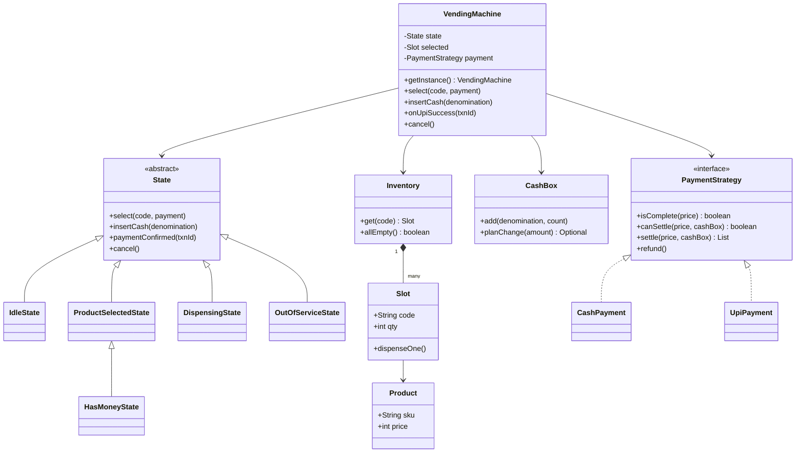

# Vending Machine

Design a vending machine that lets you select a product, takes payment in cash (coins/notes) or UPI, dispenses the product and returns change. The interviewer checks: did you use the **State pattern** properly or write a `switch` jungle, **money never goes missing** (cancel, no change, jam), and did you keep money in `double` or not.

## Step 1: Clarify requirements

| You ask | Typical answer | Impact on design |
|---|---|---|
| How do people pay? Coins, notes, UPI? | Coins + notes + UPI | `PaymentStrategy`: `CashPayment`, `UpiPayment` |
| What is the flow: money first or product first? | Select first, then pay (UPI needs the amount first) | Idle → ProductSelected → HasMoney → Dispensing |
| Do we return change? Which coins? | Yes, in coins (₹1, 2, 5, 10) | `CashBox` keeps count per denomination, plans change |
| What if there is no change? | Do not sell, return the money | Check change **before** dispensing |
| Until when can the user cancel? | Until dispensing starts | Cancel is rejected in `Dispensing` |
| One machine or a fleet? | One machine, one process | Singleton (per process); fleet is an extension |
| Ordering from a remote/app (kiosk API)? | Maybe as a follow-up | One session at a time, `synchronized` entry points |
| Admin: refill, collect cash, maintenance? | Yes, basic | `OutOfServiceState`, `refill()` |

**Functional:**
- Product list with price and stock (slot codes like `A1`).
- Select → pay (cash coin by coin, or UPI QR) → dispense → change.
- Cancel/refund: the same coins held in escrow go back.
- An out-of-stock product cannot be selected. Everything sold out → machine goes `OutOfService`.
- Admin: refill a slot, load coins into the cash box, maintenance mode.

**Out of scope:** card payment hardware, multi-item cart, remote inventory dashboard, pricing offers.

## Step 2: Core entities

- `Product`: sku, name, price (`int` rupees, never `double`).
- `Slot`: code (`A1`), product, quantity. One product type per slot.
- `Inventory`: map of code → Slot. Stock check and decrement.
- `Denomination`: enum of ₹1/2/5/10 coins and ₹20/50/100 notes.
- `CashBox`: count per denomination. Plans change without touching anything.
- `PaymentStrategy`: `CashPayment` (holds coins in escrow), `UpiPayment` (QR + webhook).
- `State`: `IdleState`, `ProductSelectedState`, `HasMoneyState`, `DispensingState`, `OutOfServiceState`.
- `VendingMachine`: the context. Current state, selected slot, current payment. Singleton.

## Step 3: Class diagram



## Step 4: Why these design patterns

| Pattern | Where | Why | Alternative |
|---|---|---|---|
| [State](../03-lld/05-behavioral.md) | `IdleState`, `ProductSelectedState`, `HasMoneyState`, `DispensingState`, `OutOfServiceState` | What each button means depends on the state. Invalid actions are rejected automatically. New state = new class | `enum` + `switch` in every method: 5 states × 4 actions = 20 branches, one bug spreads everywhere |
| [Strategy](../03-lld/05-behavioral.md) | `PaymentStrategy`: Cash, UPI | A new payment mode (card, wallet) does not change the state machine | `if (mode == UPI)` inside every state |
| [Singleton](../03-lld/03-creational.md) | `VendingMachine.getInstance()` | One physical machine = one controller process. Two objects = two owners of the same motor/cash box | Inject one instance via DI (better for tests) |
| Escrow (domain idea) | `CashPayment`'s coin list | On cancel the same coins go back, so change is never a question | Dropping coins straight into the cash box: cancel needs change, which can fail |

## Step 5: Code

Model, inventory and cash box. Money is `int` rupees (use `long` paise if you need paise).

```java
import java.util.*;

enum Denomination {
    COIN_1(1), COIN_2(2), COIN_5(5), COIN_10(10), NOTE_20(20), NOTE_50(50), NOTE_100(100);
    final int value;
    Denomination(int value) { this.value = value; }
}

record Product(String sku, String name, int price) {}

class Slot {
    final String code;
    final Product product;
    private int qty;
    Slot(String code, Product product, int qty) { this.code = code; this.product = product; this.qty = qty; }
    boolean isEmpty() { return qty == 0; }
    void dispenseOne() {
        if (qty == 0) throw new IllegalStateException("Out of stock: " + code);
        qty--;
    }
    void refill(int n) { qty += n; }
}

class Inventory {
    private final Map<String, Slot> slots = new HashMap<>();
    void addSlot(Slot s) { slots.put(s.code, s); }
    Slot get(String code) {
        Slot s = slots.get(code);
        if (s == null) throw new IllegalArgumentException("Invalid code " + code);
        return s;
    }
    boolean allEmpty() { return slots.values().stream().allMatch(Slot::isEmpty); }
}

class CashBox {
    private final EnumMap<Denomination, Integer> counts = new EnumMap<>(Denomination.class);
    void add(Denomination d, int n) { counts.merge(d, n, Integer::sum); }
    void addAll(List<Denomination> ds) { ds.forEach(d -> add(d, 1)); }
    void removeAll(List<Denomination> ds) { ds.forEach(d -> counts.merge(d, -1, Integer::sum)); }

    // Plan only: does not touch the cash box. Empty = cannot give this much change
    Optional<List<Denomination>> planChange(int amount) {
        List<Denomination> out = new ArrayList<>();
        Denomination[] ds = Denomination.values();
        for (int i = ds.length - 1; i >= 0 && amount > 0; i--) {   // biggest coin first (greedy)
            int use = Math.min(amount / ds[i].value, counts.getOrDefault(ds[i], 0));
            for (int k = 0; k < use; k++) out.add(ds[i]);
            amount -= use * ds[i].value;
        }
        return amount == 0 ? Optional.of(out) : Optional.empty();
    }
}
```

Payment strategies. Cash coins stay in escrow until the sale is final.

```java
interface PaymentStrategy {
    boolean isComplete(int price);
    boolean canSettle(int price, CashBox box);       // can we give change?
    List<Denomination> settle(int price, CashBox box); // sale is final, returns change
    void refund();
}

class CashPayment implements PaymentStrategy {
    private final List<Denomination> escrow = new ArrayList<>();
    void insert(Denomination d) { escrow.add(d); }
    int paid() { return escrow.stream().mapToInt(d -> d.value).sum(); }
    public boolean isComplete(int price) { return paid() >= price; }
    public boolean canSettle(int price, CashBox box) { return box.planChange(paid() - price).isPresent(); }
    public List<Denomination> settle(int price, CashBox box) {
        List<Denomination> change = box.planChange(paid() - price).orElseThrow();
        box.addAll(escrow);          // escrow is now the machine's money
        box.removeAll(change);
        escrow.clear();
        return change;
    }
    public void refund() { System.out.println("Returning coins: " + escrow); escrow.clear(); }
}

interface UpiGateway { String createQr(int amount); void refund(String txnId); }

class UpiPayment implements PaymentStrategy {
    private final UpiGateway gateway;
    private String txnId;
    private boolean paid;
    UpiPayment(UpiGateway gateway) { this.gateway = gateway; }
    void start(int price) { txnId = gateway.createQr(price); }   // QR on screen
    boolean confirm(String id) { if (id.equals(txnId)) paid = true; return paid; }
    public boolean isComplete(int price) { return paid; }
    public boolean canSettle(int price, CashBox box) { return true; } // exact amount, no change
    public List<Denomination> settle(int price, CashBox box) { return List.of(); }
    public void refund() { if (paid) gateway.refund(txnId); }
}
```

States. The base class rejects every action by default; each state overrides only its valid actions.

```java
abstract class State {
    protected final VendingMachine m;
    State(VendingMachine m) { this.m = m; }
    void select(String code, PaymentStrategy p) { reject("select"); }
    void insertCash(Denomination d) { reject("insertCash"); }
    void paymentConfirmed(String txnId) { reject("paymentConfirmed"); }
    void cancel() { reject("cancel"); }
    private void reject(String op) {
        throw new IllegalStateException(op + " not allowed in " + getClass().getSimpleName());
    }
}

class IdleState extends State {
    IdleState(VendingMachine m) { super(m); }
    @Override void select(String code, PaymentStrategy p) {
        Slot slot = m.inventory.get(code);
        if (slot.isEmpty()) throw new IllegalStateException("Out of stock: " + code);
        m.selected = slot;
        m.payment = p;
        if (p instanceof UpiPayment upi) upi.start(slot.product.price());
        m.setState(m.productSelected);
    }
}

class ProductSelectedState extends State {
    ProductSelectedState(VendingMachine m) { super(m); }
    @Override void insertCash(Denomination d) {
        if (!(m.payment instanceof CashPayment cash)) throw new IllegalStateException("Cash not accepted in UPI mode");
        cash.insert(d);
        if (cash.isComplete(m.selected.product.price())) m.completeSale();
        else m.setState(m.hasMoney);
    }
    @Override void paymentConfirmed(String txnId) {
        if (m.payment instanceof UpiPayment upi && upi.confirm(txnId)) m.completeSale();
    }
    @Override void cancel() { m.payment.refund(); m.reset(); }
}

class HasMoneyState extends ProductSelectedState {   // money in escrow: cancel = refund
    HasMoneyState(VendingMachine m) { super(m); }
}

class DispensingState extends State {                // motor running: reject everything
    DispensingState(VendingMachine m) { super(m); }
}

class OutOfServiceState extends State {              // sold out or maintenance
    OutOfServiceState(VendingMachine m) { super(m); }
}
```

The machine (context + Singleton) and the main flow.

```java
final class VendingMachine {
    private static volatile VendingMachine instance;
    static VendingMachine getInstance() {
        if (instance == null) {
            synchronized (VendingMachine.class) {
                if (instance == null) instance = new VendingMachine();
            }
        }
        return instance;
    }

    final Inventory inventory = new Inventory();
    final CashBox cashBox = new CashBox();
    final State idle = new IdleState(this), productSelected = new ProductSelectedState(this),
            hasMoney = new HasMoneyState(this), dispensing = new DispensingState(this),
            outOfService = new OutOfServiceState(this);
    private State state = idle;
    Slot selected;
    PaymentStrategy payment;

    private VendingMachine() {}

    // Every entry point is synchronized: buttons, coin slot and UPI webhook come from different threads
    public synchronized void select(String code, PaymentStrategy p) { state.select(code, p); }
    public synchronized void insertCash(Denomination d) { state.insertCash(d); }
    public synchronized void onUpiSuccess(String txnId) { state.paymentConfirmed(txnId); }
    public synchronized void cancel() { state.cancel(); }
    public synchronized void setMaintenance(boolean on) {
        if (on && state != idle) throw new IllegalStateException("Sale in progress");
        if (on) state = outOfService; else reset();
    }

    void setState(State s) { state = s; }

    void completeSale() {
        int price = selected.product.price();
        if (!payment.canSettle(price, cashBox)) {       // no exact change: cancel sale, refund
            System.out.println("Change unavailable, refunding");
            payment.refund();
            reset();
            return;
        }
        state = dispensing;
        selected.dispenseOne();                          // motor; if it fails, refund (Step 6)
        List<Denomination> change = payment.settle(price, cashBox);
        System.out.println("Dispensed " + selected.product.name() + ", change " + change);
        reset();
    }

    void reset() {
        selected = null;
        payment = null;
        state = inventory.allEmpty() ? outOfService : idle;
    }

    public static void main(String[] args) {
        VendingMachine vm = VendingMachine.getInstance();
        vm.inventory.addSlot(new Slot("A1", new Product("COKE", "Coke", 40), 2));
        vm.cashBox.add(Denomination.COIN_10, 5);
        vm.cashBox.add(Denomination.COIN_5, 5);

        vm.select("A1", new CashPayment());
        vm.insertCash(Denomination.NOTE_20);             // 20 < 40, HasMoney
        vm.insertCash(Denomination.NOTE_50);             // 70 >= 40: dispense, change 3 x COIN_10

        UpiGateway fake = new UpiGateway() {
            public String createQr(int amount) { return "TXN-1"; }
            public void refund(String txnId) { System.out.println("UPI refund " + txnId); }
        };
        vm.select("A1", new UpiPayment(fake));
        vm.onUpiSuccess("TXN-1");                        // dispense; stock 0, OutOfService
    }
}
```

## Step 6: Concurrency & edge cases

- **Exact change unavailable:** `canSettle` is checked before dispensing. If it fails → refund the escrow, no sale. Better UX: when the cash box is low, show "Exact change only" and accept only notes less than or equal to the price.
- **Greedy change limit:** with unlimited Indian coins (1, 2, 5, 10) greedy is optimal. With limited counts greedy can fail (need 6, box has {5, 2, 2, 2}: greedy takes 5 and gets stuck, while 2+2+2 works). Fix: bounded coin-change DP for small amounts.
- **Escrow:** inserted coins do not go into the cash box until the sale is final. On cancel the same coins go back, with no change risk.
- **Dispense jam:** motor/sensor failure → exception. Dispense happens before `settle`, so refund, mark the slot faulty, alert the admin. The order matters: check change → dispense → settle.
- **Late UPI webhook:** the customer cancelled or timed out, then payment success arrives → in `Idle`, `paymentConfirmed` is rejected; in that case auto-refund by txnId (idempotent, one refund per txnId).
- **Duplicate UPI webhook:** `txnId` match + state check. The second webhook lands in `Idle`, so no second sale.
- **Timeout:** no action for 60s in ProductSelected/HasMoney → `cancel()` (from a scheduler thread, through the same synchronized method).
- **Concurrent buyers (kiosk API / app orders):** a physical machine does one sale at a time. All entry points are `synchronized`, and `select` is allowed only in `Idle`, so a second buyer gets `IllegalStateException` (HTTP 409 "busy"). For remote orders keep a session id + TTL lock so an abandoned session does not block the machine forever.
- **Money type:** `int` rupees / `long` paise. `double` gives the 0.1 + 0.2 bug.
- **Refill during a sale:** admin actions only in `OutOfService`/maintenance.

## Step 7: Extensions

- **Card/wallet:** a new `PaymentStrategy`. States untouched.
- **Fleet of machines (Swiggy/office kiosks):** drop the Singleton, one instance per `machineId`. Inventory sync to a central server, low-stock alerts (Observer), remote price updates.
- **Multi-item cart:** turn `selected` into a `Cart`, check change on the total. Partial refund if part of the dispense fails.
- **Discounts/combos:** a `PricingStrategy` computes the price instead of the slot's fixed price.
- **Audit trail:** every sale is a `Transaction` record (txnId, paid, change, status) → reconciliation, disputes.
- **Hardware abstraction:** `Dispenser`, `CoinAcceptor` interfaces. Inject real hardware or a simulator (testability).

## Step 8: Interview flow (45 min)

| Minute | What to do |
|---|---|
| 0–5 | Requirements: payment modes, flow order, change policy, cancel rule |
| 5–10 | Entities + list of states, talk through the transitions (Idle → Selected → HasMoney → Dispensing → Idle) |
| 10–15 | Class diagram: State hierarchy, PaymentStrategy, CashBox |
| 15–35 | Code: State base class, 2–3 states, CashPayment escrow, the order inside `completeSale` |
| 35–42 | Edge cases: no change, jam, late UPI, concurrency |
| 42–45 | Extensions + trade-offs (Singleton vs DI) |

## 2-minute recap

A vending machine is the textbook case for the State pattern: Idle, ProductSelected, HasMoney, Dispensing, OutOfService. The base `State` rejects every action by default and each state overrides only its valid actions. Payment is a `PaymentStrategy` (Cash, UPI), so a new mode does not touch the state machine. Cash stays in escrow, and cancel returns the same coins. The sale order is fixed: first check that change is possible, then dispense, then settle; no change means refund. Money is `int`/`long`. Entry points are `synchronized` and select works only in Idle, so concurrent buyers get "busy". The machine controller is a Singleton, but a fleet needs `machineId` + DI.

## Checklist

- [ ] I can list all the states and their transitions without looking
- [ ] I can explain why the State pattern beats a `switch` for this problem
- [ ] I can code both the Cash and the UPI flow through PaymentStrategy
- [ ] I can explain escrow and the cancel/refund logic
- [ ] I can explain the exact-change-unavailable case and the limits of greedy
- [ ] I can justify the order in `completeSale` (check → dispense → settle)
- [ ] I can explain how to handle concurrent buyers and late/duplicate UPI webhooks
