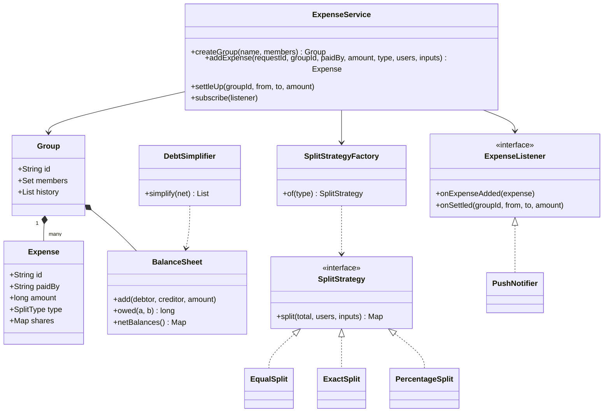

# Splitwise

Design an expense-sharing app: add expenses in a group, split them equally/exactly/by percentage, show who owes whom, settle up and simplify debts. The interviewer checks: is the split logic extensible (**Strategy**), is the **money exact to the paisa** (rounding, sum = total), the balance data structure, and the debt-simplification algorithm.

## Step 1: Clarify requirements

| You ask | Typical answer | Impact on design |
|---|---|---|
| Which split types? | Equal, exact, percentage | `SplitStrategy` + `SplitStrategyFactory` |
| One payer per expense or many? | One (multi-payer is an extension) | `Expense.paidBy` is a single user |
| 1:1 expenses outside groups? | Yes, but groups first | 1:1 = an implicit two-member group |
| Currency? Rounding? | INR, exact to the paisa | Amounts are `long` paise, leftover paise distributed deterministically |
| How to show balances? | "B owes A ₹300" pairwise + net | `BalanceSheet` pairwise map, net derived from it |
| Do we need simplify debts? | Yes, at group level | Net balances + two heaps (greedy) |
| Edit/delete expense? | Yes | History is immutable, reversal entry |
| Notifications? | On expense add/settle | Observer: `ExpenseListener` |

**Functional:**
- Users, groups, adding members.
- `addExpense(group, paidBy, amount, splitType, participants, inputs)`.
- Balances: pairwise (who owes whom) and net (how much to get/give).
- Settle up: record that A paid B.
- Simplify debts: a plan with as few transfers as possible.
- Expense history per group.

**Out of scope:** actual payment (UPI collect link is only an extension), multi-currency, receipt OCR, auth.

## Step 2: Core entities

- `User`: id, name, email.
- `Group`: id, members, expense history, its own `BalanceSheet`.
- `Expense`: immutable record. id, paidBy, amount (paise), type, final shares map.
- `SplitType`: enum EQUAL, EXACT, PERCENTAGE.
- `SplitStrategy`: total + participants + inputs → each user's share (paise). `EqualSplit`, `ExactSplit`, `PercentageSplit`.
- `SplitStrategyFactory`: type → strategy.
- `BalanceSheet`: `owes[a][b]` = how much a owes b.
- `ExpenseService`: entry point. Validation, locking, idempotency, notifying listeners.
- `ExpenseListener`: Observer. Push/email notifier.
- `DebtSimplifier` + `Transfer`: net balances → near-minimum transfers.

## Step 3: Class diagram



## Step 4: Why these design patterns

| Pattern | Where | Why | Alternative |
|---|---|---|---|
| [Strategy](../03-lld/05-behavioral.md) | `SplitStrategy`: Equal, Exact, Percentage | A new split type (shares/ratio, adjustment) = a new class. `ExpenseService` does not change | `switch (type)` inside the service, editing the service for every new type |
| [Factory](../03-lld/03-creational.md) | `SplitStrategyFactory.of(type)` | The caller knows only the enum. Strategies are stateless, one instance each is reused | Caller does `new EqualSplit()` itself: the client gets tied to concrete classes |
| [Observer](../03-lld/05-behavioral.md) | `ExpenseListener`: push, email, activity feed | Add/remove notification channels without touching core logic. Fired outside the lock | Calling `pushService.send()` inside the service: tight coupling, a slow channel slows the core |
| Immutable ledger (domain idea) | `Expense` record + history | Edit/delete = reversal entry. Audit and balance recompute are possible | Overwriting balances: history is lost, bugs cannot be debugged |

## Step 5: Code

Model. All amounts are `long` paise (₹100.50 = 10050).

```java
import java.time.Instant;
import java.util.*;
import java.util.concurrent.ConcurrentHashMap;
import java.util.concurrent.CopyOnWriteArrayList;
import java.util.concurrent.atomic.AtomicLong;

record User(String id, String name, String email) {}

enum SplitType { EQUAL, EXACT, PERCENTAGE }

record Expense(String id, String groupId, String paidBy, long amount, String description,
               SplitType type, Map<String, Long> shares, Instant createdAt) {}

class Group {
    final String id, name;
    final Set<String> members = ConcurrentHashMap.newKeySet();
    final List<Expense> history = new CopyOnWriteArrayList<>();
    final BalanceSheet balances = new BalanceSheet();
    final Map<String, Expense> byRequestId = new HashMap<>();   // idempotency, guarded by the group lock
    Group(String id, String name) { this.id = id; this.name = name; }
}
```

Split strategies and the factory. Every strategy's output must sum to **exactly** the total.

```java
interface SplitStrategy {
    // inputs: paise for EXACT, basis points for PERCENTAGE (12.5% = 1250), ignored for EQUAL
    Map<String, Long> split(long total, List<String> users, Map<String, Long> inputs);
}

class EqualSplit implements SplitStrategy {
    public Map<String, Long> split(long total, List<String> users, Map<String, Long> inputs) {
        long base = total / users.size(), extra = total % users.size();
        Map<String, Long> out = new LinkedHashMap<>();
        for (int i = 0; i < users.size(); i++) out.put(users.get(i), base + (i < extra ? 1 : 0));
        return out;   // ₹100 / 3 = 3334 + 3333 + 3333 paise, sum = 10000
    }
}

class ExactSplit implements SplitStrategy {
    public Map<String, Long> split(long total, List<String> users, Map<String, Long> amounts) {
        Map<String, Long> out = new LinkedHashMap<>();
        long sum = 0;
        for (String u : users) {
            long a = amounts.getOrDefault(u, -1L);
            if (a < 0) throw new IllegalArgumentException("Missing/negative amount for " + u);
            out.put(u, a);
            sum += a;
        }
        if (sum != total) throw new IllegalArgumentException("Splits " + sum + " != total " + total);
        return out;
    }
}

class PercentageSplit implements SplitStrategy {
    public Map<String, Long> split(long total, List<String> users, Map<String, Long> bps) {
        long sumBps = 0;
        for (String u : users) {
            long p = bps.getOrDefault(u, -1L);
            if (p < 0) throw new IllegalArgumentException("Missing/negative percent for " + u);
            sumBps += p;
        }
        if (sumBps != 10_000) throw new IllegalArgumentException("Percentages must sum to 100");
        Map<String, Long> out = new LinkedHashMap<>();
        long assigned = 0;
        for (String u : users) {
            long share = total * bps.get(u) / 10_000;   // floor
            out.put(u, share);
            assigned += share;
        }
        // paise left after flooring (fewer than users.size()) go 1 each to the first users
        long left = total - assigned;
        for (int i = 0; left > 0; i++, left--) out.merge(users.get(i), 1L, Long::sum);
        return out;
    }
}

final class SplitStrategyFactory {
    private static final SplitStrategy EQUAL = new EqualSplit(), EXACT = new ExactSplit(),
            PERCENT = new PercentageSplit();   // stateless, so shared
    static SplitStrategy of(SplitType type) {
        return switch (type) {
            case EQUAL -> EQUAL;
            case EXACT -> EXACT;
            case PERCENTAGE -> PERCENT;
        };
    }
}
```

Balance sheet, observer and service. All balance updates of a group happen inside the group lock.

```java
class BalanceSheet {
    // owes[a][b] > 0: a owes b this much. Invariant: owes[a][b] == -owes[b][a]
    private final Map<String, Map<String, Long>> owes = new HashMap<>();
    void add(String debtor, String creditor, long amount) {
        if (debtor.equals(creditor) || amount == 0) return;
        owes.computeIfAbsent(debtor, k -> new HashMap<>()).merge(creditor, amount, Long::sum);
        owes.computeIfAbsent(creditor, k -> new HashMap<>()).merge(debtor, -amount, Long::sum);
    }
    long owed(String a, String b) { return owes.getOrDefault(a, Map.of()).getOrDefault(b, 0L); }
    Map<String, Long> netBalances() {   // + = gets back, - = owes
        Map<String, Long> net = new HashMap<>();
        owes.forEach((u, row) -> net.put(u, -row.values().stream().mapToLong(Long::longValue).sum()));
        return net;
    }
}

interface ExpenseListener {
    void onExpenseAdded(Expense e);
    void onSettled(String groupId, String from, String to, long amount);
}

class PushNotifier implements ExpenseListener {
    public void onExpenseAdded(Expense e) { System.out.println("Push: " + e.description() + " " + e.shares()); }
    public void onSettled(String g, String from, String to, long amt) { System.out.println("Push: " + from + " paid " + to + " " + amt); }
}

class ExpenseService {
    private final Map<String, Group> groups = new ConcurrentHashMap<>();
    private final List<ExpenseListener> listeners = new CopyOnWriteArrayList<>();
    private final AtomicLong seq = new AtomicLong();

    Group createGroup(String name, List<String> members) {
        Group g = new Group("G" + seq.incrementAndGet(), name);
        g.members.addAll(members);
        groups.put(g.id, g);
        return g;
    }
    void subscribe(ExpenseListener l) { listeners.add(l); }

    Expense addExpense(String requestId, String groupId, String paidBy, long amount, String desc,
                       SplitType type, List<String> users, Map<String, Long> inputs) {
        Group g = group(groupId);
        if (amount <= 0 || users.isEmpty()) throw new IllegalArgumentException("Invalid expense");
        if (!g.members.contains(paidBy) || !g.members.containsAll(users))
            throw new IllegalArgumentException("Non-member in expense");
        Map<String, Long> shares = SplitStrategyFactory.of(type).split(amount, users, inputs);
        if (shares.values().stream().mapToLong(Long::longValue).sum() != amount)   // safety net
            throw new IllegalStateException("Shares do not add up to total");
        Expense e;
        synchronized (g) {
            Expense dup = g.byRequestId.get(requestId);
            if (dup != null) return dup;                  // double tap / retry: same result
            e = new Expense("E" + seq.incrementAndGet(), groupId, paidBy, amount, desc, type,
                    Map.copyOf(shares), Instant.now());
            shares.forEach((u, s) -> g.balances.add(u, paidBy, s));
            g.history.add(e);
            g.byRequestId.put(requestId, e);
        }
        listeners.forEach(l -> l.onExpenseAdded(e));     // outside the lock
        return e;
    }

    void settleUp(String groupId, String from, String to, long amount) {
        Group g = group(groupId);
        synchronized (g) {
            long due = g.balances.owed(from, to);
            if (amount <= 0 || amount > due) throw new IllegalArgumentException("Due is only " + due);
            g.balances.add(from, to, -amount);
        }
        listeners.forEach(l -> l.onSettled(groupId, from, to, amount));
    }

    Map<String, Long> netBalances(String groupId) {
        Group g = group(groupId);
        synchronized (g) { return g.balances.netBalances(); }
    }

    private Group group(String id) {
        Group g = groups.get(id);
        if (g == null) throw new NoSuchElementException("Group " + id);
        return g;
    }
}
```

Debt simplification (greedy, two heaps) and main.

```java
record Transfer(String from, String to, long amount) {}

class DebtSimplifier {
    static List<Transfer> simplify(Map<String, Long> net) {
        Comparator<Map.Entry<String, Long>> biggestFirst = (a, b) -> Long.compare(b.getValue(), a.getValue());
        PriorityQueue<Map.Entry<String, Long>> creditors = new PriorityQueue<>(biggestFirst);
        PriorityQueue<Map.Entry<String, Long>> debtors = new PriorityQueue<>(biggestFirst);
        net.forEach((u, v) -> {
            if (v > 0) creditors.add(Map.entry(u, v));
            else if (v < 0) debtors.add(Map.entry(u, -v));   // store debt as positive
        });
        List<Transfer> out = new ArrayList<>();
        while (!creditors.isEmpty() && !debtors.isEmpty()) {
            var c = creditors.poll();
            var d = debtors.poll();
            long x = Math.min(c.getValue(), d.getValue());
            out.add(new Transfer(d.getKey(), c.getKey(), x));
            if (c.getValue() > x) creditors.add(Map.entry(c.getKey(), c.getValue() - x));
            if (d.getValue() > x) debtors.add(Map.entry(d.getKey(), d.getValue() - x));
        }
        return out;   // every step zeroes at least one person: at most n-1 transfers
    }

    public static void main(String[] args) {
        ExpenseService svc = new ExpenseService();
        svc.subscribe(new PushNotifier());
        Group goa = svc.createGroup("Goa trip", List.of("aman", "bhavya", "chirag"));

        svc.addExpense("r1", goa.id, "aman", 90_000, "Dinner", SplitType.EQUAL,
                List.of("aman", "bhavya", "chirag"), Map.of());          // B and C each owe A 300
        svc.addExpense("r2", goa.id, "bhavya", 60_000, "Cab", SplitType.PERCENTAGE,
                List.of("bhavya", "chirag"), Map.of("bhavya", 5_000L, "chirag", 5_000L)); // C owes B 300
        svc.addExpense("r2", goa.id, "bhavya", 60_000, "Cab", SplitType.PERCENTAGE,
                List.of("bhavya", "chirag"), Map.of("bhavya", 5_000L, "chirag", 5_000L)); // retry: no-op

        Map<String, Long> net = svc.netBalances(goa.id);   // aman +60000, bhavya 0, chirag -60000
        System.out.println(simplify(net));                 // [chirag -> aman 60000]: 1 transfer instead of 3
    }
}
```

## Step 6: Concurrency & edge cases

- **Rounding paise:** ₹100 / 3 = 3334 + 3333 + 3333. Give leftover paise in a deterministic order (the participant list order), not randomly, or two servers will build different balances. Never `double`.
- **Percentage:** take basis points (`int`), not a float like `33.33%`. Sum must be exactly 10000. After flooring, the leftover is less than the number of participants; give 1 paisa each.
- **Validation:** exact split sum = total, no negative share, all participants are group members, payer is a member, amount > 0. Final safety check in the service: sum of shares = amount (catches a buggy new strategy too).
- **Concurrency on balances:** one expense touches several users' balances. A group-level lock (`synchronized (g)`) stops two parallel expenses from causing lost updates. Notifications go outside the lock.
- **In a DB:** insert the expense + update balance rows in one transaction. Lock rows in sorted userId order (`SELECT ... FOR UPDATE`) to avoid deadlocks, or use an optimistic `version` column + retry.
- **Idempotency:** the client sends a `requestId`. Double tap / network retry returns the same expense, balances do not grow twice.
- **Settle up:** check `amount <= due` inside the lock (check-then-act race). If overpaying is allowed, the debt flips direction: a product decision, ask the interviewer.
- **Edit/delete expense:** reversal of the old expense (negate shares) + apply the new one, in one lock/transaction. History shows both.
- **User leaves a group:** only when their net balance is 0.
- **Simplify debts:** greedy gives at most n-1 transfers. The exact minimum is NP-hard (finding zero-sum subsets); bitmask DP works for groups of 10–20, but greedy is enough.

## Step 7: Extensions

- **New split type (shares 2:1:1, adjustment):** a new `SplitStrategy` + enum value + one line in the factory.
- **Multiple payers:** turn `Expense.paidBy` into `Map<userId, paid>`. Net per user = paid − share, same ledger.
- **Multi-currency:** a `Money(amount, currency)` value object, store the FX rate at expense time, balances per currency.
- **Recurring expense (rent, Netflix):** a scheduler that creates expenses from a template (same `addExpense`, requestId = templateId + month).
- **Settle via UPI:** UPI collect/intent link on settle up. Call `settleUp` only on the payment-success webhook (idempotent by txnId).
- **Activity feed / email digest:** a new `ExpenseListener`. At scale, make listeners async via Kafka events.
- **Scale:** derive balances from the expense log (event sourcing), cache a materialized balance table. Shard by group id.

## Step 8: Interview flow (45 min)

| Minute | What to do |
|---|---|
| 0–5 | Requirements: split types, rounding, simplify needed or not, edit/delete |
| 5–10 | Entities; state the money-in-paise decision up front |
| 10–15 | Class diagram: SplitStrategy + Factory, BalanceSheet, Listener |
| 15–30 | Code: 3 strategies (with rounding), `addExpense`, `BalanceSheet.add` |
| 30–38 | Simplify debts: net balances + two heaps, dry run on an example |
| 38–43 | Concurrency (group lock, DB row lock order), idempotency, edit = reversal |
| 43–45 | Extensions: multi-payer, multi-currency |

## 2-minute recap

Splitwise has three core parts: split, balance, simplify. Splitting is a `SplitStrategy` (Equal, Exact, Percentage) obtained from `SplitStrategyFactory`, and every strategy's output equals the total exactly. Money is `long` paise, percentages are basis points, leftover paise go 1 each in a deterministic order. `BalanceSheet` keeps pairwise `owes[a][b]` (anti-symmetric), and net is derived from it. Expenses are immutable, edit/delete = reversal. A group-level lock prevents lost updates, `requestId` prevents duplicate expenses, and notifications go through Observer outside the lock. Simplify debts: compute net balances, put creditors and debtors in two max-heaps, match the biggest with the biggest, at most n-1 transfers.

## Checklist

- [ ] I can code equal, exact and percentage splits with rounding
- [ ] I can explain why money is `long` paise and percentages are basis points
- [ ] I can show how to add a new split type with Strategy + Factory
- [ ] I can explain the relation between the pairwise balance sheet and net balances
- [ ] I can dry run the two-heap debt simplification and state the n-1 bound
- [ ] I can explain concurrency for balance updates (group lock, DB lock order) and idempotency
- [ ] I can explain handling edit/delete of an expense with a reversal entry
- [ ] I can explain why Observer notifications fire outside the lock
