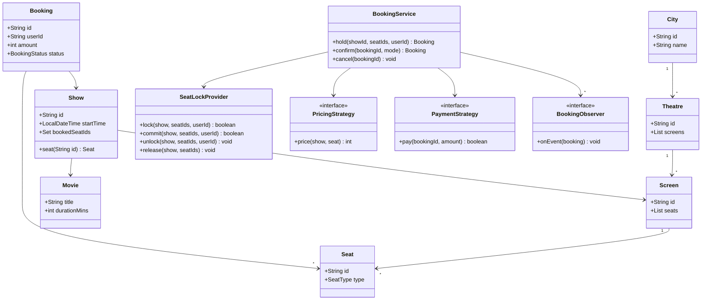

# BookMyShow LLD

**In one line:** model city → theatre → screen → show → seat, lock seats for a short time, and confirm the booking after payment. The interviewer checks: clean classes, pluggable pricing/payment, and **one seat is never sold to two people** (concurrency).

> This is LLD (classes, objects, locks in one JVM). For the distributed version (Redis TTL, DB constraint, virtual queue) see [BookMyShow HLD](../02-questions/t1-05-bookmyshow.md).

## Step 1: Clarify requirements

| You ask | Typical answer | Impact on design |
|---|---|---|
| "Multiple cities, theatres, screens?" | Yes | `City → Theatre → Screen → Seat` hierarchy |
| "Seat types with different prices?" | Silver, Gold, Recliner | `SeatType` enum + `PricingStrategy` |
| "Does price change on weekend/prime time?" | Yes, weekend +20% | Wrap the strategy to add a rule |
| "How long is a seat held?" | 10 min | `expiresAt` in `SeatLock`, lazy expiry |
| "Payment modes?" | UPI, Card | `PaymentStrategy` + `PaymentFactory` |
| "Cancellation allowed?" | Yes, seat becomes free again | `cancel()` releases seats + refund |
| "Notifications?" | SMS/email on confirm/cancel | Observer |
| "Single process or distributed?" | Single process, thread-safe | Per-show lock, `ConcurrentHashMap` |

**Functional:**
- List shows (by movie, city), show the seat map.
- User selects seats → seats locked for 10 min.
- Payment success → booking CONFIRMED, seats BOOKED.
- Lock expires → seats available again, booking EXPIRED.
- Cancel → seats freed, refund, notification.

**Out of scope:** search ranking, reviews, food & beverages, coupons, real payment gateway, multi-server deployment.

## Step 2: Core entities

- **City**: id, name. Holds theatres.
- **Theatre**: in one city, many screens.
- **Screen**: physical audi, fixed seat layout.
- **Seat**: row, col, `SeatType` (SILVER/GOLD/RECLINER). A seat belongs to the screen, not the show.
- **Movie**: title, duration.
- **Show**: movie + screen + start time. Booked seats are tracked here (the same seat has a different status in each show).
- **SeatLock**: which user locked it, until when (`expiresAt`).
- **Booking**: user, show, seats, amount, status (PENDING/CONFIRMED/CANCELLED/EXPIRED).
- **SeatLockProvider**: seat lock/unlock/commit, per-show thread-safety.
- **BookingService**: facade for the hold → confirm → cancel flow.
- **PricingStrategy / PaymentStrategy / BookingObserver**: pluggable behaviour.

## Step 3: Class diagram



## Step 4: Why these design patterns

| Pattern | Where | Why | Alternative |
|---|---|---|---|
| [Strategy](../03-lld/05-behavioral.md) | `PricingStrategy` (seat type, weekend) | New pricing rule = new class, `BookingService` untouched | `if (weekend) ... else if (recliner)` chain, edited for every rule |
| [Strategy](../03-lld/05-behavioral.md) | `PaymentStrategy` (UPI, Card) | Pick payment mode at runtime | `switch` scattered everywhere |
| [Factory](../03-lld/03-creational.md) | `PaymentFactory.of(mode)` | Client should not know concrete classes, creation in one place | Caller does `new UpiPayment()` itself |
| [Observer](../03-lld/05-behavioral.md) | `BookingObserver` (SMS, email, analytics) | Booking logic decoupled from notifications, add listeners without edits | Direct `smsService.send()` inside `BookingService` |
| [Decorator](../03-lld/04-structural.md) (bonus) | `WeekendPricing` wraps base pricing | Rules stack: weekend + prime time | A separate class for every combination |
| [Facade](../03-lld/04-structural.md) | `BookingService` | One simple API for the controller; lock + price + pay + notify inside | Controller orchestrates all classes itself |

## Step 5: Code

Models and enums:

```java
import java.time.*;
import java.util.*;
import java.util.concurrent.*;

enum SeatType { SILVER, GOLD, RECLINER }
enum BookingStatus { PENDING, CONFIRMED, CANCELLED, EXPIRED }
enum PaymentMode { UPI, CARD }

record City(String id, String name) {}
record Movie(String id, String title, int durationMins) {}
record Seat(String id, int row, int col, SeatType type) {}
record Screen(String id, List<Seat> seats) {}
record Theatre(String id, City city, List<Screen> screens) {}

class Show {
    final String id;
    final Movie movie;
    final Screen screen;
    final LocalDateTime startTime;
    // only SeatLockProvider changes this (inside the show's monitor)
    final Set<String> bookedSeatIds = ConcurrentHashMap.newKeySet();

    Show(String id, Movie movie, Screen screen, LocalDateTime startTime) {
        this.id = id; this.movie = movie; this.screen = screen; this.startTime = startTime;
    }
    Seat seat(String seatId) {
        return screen.seats().stream().filter(s -> s.id().equals(seatId)).findFirst()
                .orElseThrow(() -> new IllegalArgumentException("Seat not found: " + seatId));
    }
}

class Booking {
    final String id = UUID.randomUUID().toString();
    final String userId;
    final Show show;
    final List<Seat> seats;
    final int amount;
    volatile BookingStatus status = BookingStatus.PENDING;
    volatile PaymentMode paidWith;                          // refund via the same mode

    Booking(String userId, Show show, List<Seat> seats, int amount) {
        this.userId = userId; this.show = show; this.seats = seats; this.amount = amount;
    }
    List<String> seatIds() { return seats.stream().map(Seat::id).toList(); }
}
```

Strategy, Factory, Observer:

```java
interface PricingStrategy { int price(Show show, Seat seat); }
class SeatTypePricing implements PricingStrategy {
    private final Map<SeatType, Integer> base =
            Map.of(SeatType.SILVER, 150, SeatType.GOLD, 250, SeatType.RECLINER, 450);
    public int price(Show show, Seat seat) { return base.get(seat.type()); }
}
class WeekendPricing implements PricingStrategy {          // wraps another strategy
    private final PricingStrategy inner;
    WeekendPricing(PricingStrategy inner) { this.inner = inner; }
    public int price(Show show, Seat seat) {
        int p = inner.price(show, seat);
        DayOfWeek d = show.startTime.getDayOfWeek();
        return (d == DayOfWeek.SATURDAY || d == DayOfWeek.SUNDAY) ? p + p / 5 : p;  // weekend +20%
    }
}

interface PaymentStrategy {
    boolean pay(String bookingId, int amount);
    default void refund(String bookingId, int amount) { System.out.println("Refund Rs " + amount); }
}
class UpiPayment implements PaymentStrategy {
    public boolean pay(String bookingId, int amount) { System.out.println("UPI Rs " + amount); return true; }
}
class CardPayment implements PaymentStrategy {
    public boolean pay(String bookingId, int amount) { System.out.println("Card Rs " + amount); return true; }
}
class PaymentFactory {
    static PaymentStrategy of(PaymentMode mode) {
        return switch (mode) {
            case UPI -> new UpiPayment();
            case CARD -> new CardPayment();
        };
    }
}

interface BookingObserver { void onEvent(Booking booking); }
class SmsNotifier implements BookingObserver {
    public void onEvent(Booking b) { System.out.println("SMS to " + b.userId + ": booking " + b.status); }
}
```

Seat lock (the core of concurrency):

```java
record SeatLock(String userId, Instant expiresAt) {
    boolean isActive(Instant now) { return now.isBefore(expiresAt); }
}

class SeatLockProvider {
    private final Duration ttl;
    // showId -> (seatId -> lock). Inner map is touched only inside that show's monitor.
    private final Map<String, Map<String, SeatLock>> locks = new ConcurrentHashMap<>();

    SeatLockProvider(Duration ttl) { this.ttl = ttl; }
    private Map<String, SeatLock> of(Show show) { return locks.computeIfAbsent(show.id, k -> new HashMap<>()); }
    // all-or-nothing: lock only if every seat is free
    boolean lock(Show show, List<String> seatIds, String userId) {
        Map<String, SeatLock> m = of(show);
        synchronized (m) {                                   // per-show lock: different shows run in parallel
            Instant now = Instant.now();
            for (String id : seatIds) {
                if (show.bookedSeatIds.contains(id)) return false;
                SeatLock l = m.get(id);
                if (l != null && l.isActive(now) && !l.userId().equals(userId)) return false;
            }
            Instant exp = now.plus(ttl);                     // expired lock = free (lazy expiry)
            for (String id : seatIds) m.put(id, new SeatLock(userId, exp));
            return true;
        }
    }
    // after payment: is the lock still mine? then atomically mark BOOKED
    boolean commit(Show show, List<String> seatIds, String userId) {
        Map<String, SeatLock> m = of(show);
        synchronized (m) {
            Instant now = Instant.now();
            for (String id : seatIds) {
                SeatLock l = m.get(id);
                if (l == null || !l.isActive(now) || !l.userId().equals(userId)) return false;
            }
            for (String id : seatIds) { m.remove(id); show.bookedSeatIds.add(id); }
            return true;
        }
    }
    // PENDING cancel: remove only my locks (after expiry the seat may belong to someone else)
    void unlock(Show show, List<String> seatIds, String userId) {
        Map<String, SeatLock> m = of(show);
        synchronized (m) {
            for (String id : seatIds) m.computeIfPresent(id, (k, l) -> l.userId().equals(userId) ? null : l);
        }
    }
    // CONFIRMED cancel: booked seats become free again
    void release(Show show, List<String> seatIds) {
        Map<String, SeatLock> m = of(show);
        synchronized (m) { seatIds.forEach(show.bookedSeatIds::remove); }
    }
    // from a background job (ScheduledExecutorService): only frees memory, correctness comes from the lazy check
    void purgeExpired() {
        Instant now = Instant.now();
        for (Map<String, SeatLock> m : locks.values()) {
            synchronized (m) { m.values().removeIf(l -> !l.isActive(now)); }
        }
    }
}
```

BookingService and the main flow:

```java
class BookingService {
    private final Map<String, Show> shows = new ConcurrentHashMap<>();
    private final Map<String, Booking> bookings = new ConcurrentHashMap<>();
    private final List<BookingObserver> observers = new CopyOnWriteArrayList<>();
    private final SeatLockProvider lockProvider;
    private final PricingStrategy pricing;

    BookingService(SeatLockProvider lockProvider, PricingStrategy pricing) {
        this.lockProvider = lockProvider; this.pricing = pricing;
    }
    void addShow(Show s) { shows.put(s.id, s); }
    void subscribe(BookingObserver o) { observers.add(o); }
    private void publish(Booking b) { observers.forEach(o -> o.onEvent(b)); }

    Booking hold(String showId, List<String> seatIds, String userId) {
        Show show = Objects.requireNonNull(shows.get(showId), "Show not found");
        List<Seat> seats = seatIds.stream().map(show::seat).toList();   // fail early on an invalid seat
        if (!lockProvider.lock(show, seatIds, userId))
            throw new IllegalStateException("Seat already taken");
        int amount = seats.stream().mapToInt(s -> pricing.price(show, s)).sum();
        Booking b = new Booking(userId, show, seats, amount);
        bookings.put(b.id, b);
        return b;
    }
    Booking confirm(String bookingId, PaymentMode mode) {
        Booking b = bookings.get(bookingId);
        synchronized (b) {                                   // double click = one payment
            if (b.status != BookingStatus.PENDING) return b; // idempotent
            if (!lockProvider.lock(b.show, b.seatIds(), b.userId)) { // re-lock = TTL extend
                b.status = BookingStatus.EXPIRED;            // someone else took the seat, not charged
                publish(b); return b;
            }
            PaymentStrategy payment = PaymentFactory.of(mode);
            if (!payment.pay(b.id, b.amount))                // keep the lock, user can retry
                throw new IllegalStateException("Payment failed");
            if (!lockProvider.commit(b.show, b.seatIds(), b.userId)) {
                payment.refund(b.id, b.amount);              // lock expired during payment
                b.status = BookingStatus.EXPIRED;
            } else {
                b.paidWith = mode;
                b.status = BookingStatus.CONFIRMED;
            }
        }
        publish(b);
        return b;
    }
    void cancel(String bookingId) {
        Booking b = bookings.get(bookingId);
        synchronized (b) {
            if (b.status == BookingStatus.CONFIRMED) {
                lockProvider.release(b.show, b.seatIds());
                PaymentFactory.of(b.paidWith).refund(b.id, b.amount);
            } else if (b.status == BookingStatus.PENDING) {
                lockProvider.unlock(b.show, b.seatIds(), b.userId);
            } else return;                                   // already CANCELLED/EXPIRED
            b.status = BookingStatus.CANCELLED;
        }
        publish(b);
    }
}

public class BookMyShowDemo {
    public static void main(String[] args) {
        City blr = new City("c1", "Bengaluru");
        Screen audi1 = new Screen("audi1", List.of(new Seat("A1", 1, 1, SeatType.SILVER),
                new Seat("A2", 1, 2, SeatType.SILVER), new Seat("R1", 5, 1, SeatType.RECLINER)));
        Theatre pvr = new Theatre("t1", blr, List.of(audi1));
        Show show = new Show("sh1", new Movie("m1", "Jawan", 165), audi1,
                LocalDateTime.of(2026, 10, 10, 21, 0));      // Saturday

        BookingService svc = new BookingService(new SeatLockProvider(Duration.ofMinutes(10)),
                new WeekendPricing(new SeatTypePricing()));
        svc.addShow(show);
        svc.subscribe(new SmsNotifier());

        Booking rahul = svc.hold("sh1", List.of("A1", "A2"), "rahul");
        System.out.println("Amount: " + rahul.amount);           // 360 (150*2 + 20%)
        try { svc.hold("sh1", List.of("A2"), "priya"); }
        catch (IllegalStateException e) { System.out.println("priya: " + e.getMessage()); } // Seat already taken
        svc.confirm(rahul.id, PaymentMode.UPI);                  // SMS: CONFIRMED
        svc.cancel(rahul.id);                                    // refund + SMS: CANCELLED
        System.out.println(svc.hold("sh1", List.of("A2"), "priya").status); // PENDING, got it now
    }
}
```

## Step 6: Concurrency & edge cases

- **Two people, one seat:** the check and the put in `lock()` sit inside one `synchronized (showMap)`. Check-then-act is atomic, so no race. The lock is **per show**, not global: the Jawan rush does not block Pushpa bookings.
- **`ConcurrentHashMap.computeIfAbsent`**: if two threads create the map for a new show at the same time, only one map is created and everyone syncs on it.
- **ReentrantLock alternative:** `Map<String, ReentrantLock>` per show. Benefits: timeout via `tryLock(200, ms)` and a fairness option. `synchronized` waits forever. Mention both in the interview, pick one.
- **Why not seat-level locks?** For a multi-seat booking (A1, A2), locking seats one by one risks deadlock (user1: A1→A2, user2: A2→A1). Fix: lock seat ids in sorted order. A per-show lock is simpler, and contention within one show is small.
- **Lock expiry:** `expiresAt` is checked lazily (`isActive`), so correctness holds even if the cleanup job runs late. `purgeExpired()` is only for memory (`ScheduledExecutorService` every 30 sec).
- **Lock expires during payment:** `confirm()` calls `lock()` again before paying: if the lock is still mine or free, the TTL is extended, otherwise EXPIRED without charging. If it still expires during payment, `commit()` fails → refund + EXPIRED.
- **A PENDING cancel must not free someone else's seat:** `unlock()` removes only locks whose `userId` matches. `bookedSeatIds` is touched only on a CONFIRMED cancel (`release()`).
- **Double click on Pay:** `synchronized (booking)` + PENDING status check. The second call returns the same booking, no double charge.
- **Payment fails:** we keep the lock, so the user can retry within the TTL.
- **Invalid seat id / show id:** `hold()` fails before taking any lock, so no half-taken locks remain.
- **Slow observer (SMS API):** notifications are sent outside the lock. In production use an async executor or a queue.
- **Same user selects the seat again:** the lock is refreshed (`userId` matches), no error.

## Step 7: Extensions

- **"Add coupons / offers":** a new `CouponPricing implements PricingStrategy` that wraps the base. `BookingService` stays the same.
- **"Wallet / Netbanking":** a new `PaymentStrategy` + one case in `PaymentFactory`.
- **"Send email + push too":** a new `BookingObserver`, call `subscribe()`.
- **"Show a live seat map":** compute `SeatStatus` (AVAILABLE/LOCKED/BOOKED) from `bookedSeatIds` + active locks. On change, push over WebSocket through an observer.
- **"Run on multiple servers":** make the in-memory `SeatLockProvider` an interface, add `RedisSeatLockProvider` (`SET NX PX`) + a DB unique constraint. That is the [HLD design](../02-questions/t1-05-bookmyshow.md).
- **"Partial cancellation (1 of 2 seats)":** `cancel(bookingId, seatIds)`, recompute amount, release only those seats.
- **"Dynamic pricing (fuller show, higher price)":** an `OccupancyPricing` strategy that looks at `show.bookedSeatIds.size()`.

## Step 8: Interview flow (45 min)

| Minutes | What to do |
|---|---|
| 0–5 | Requirements table: seat types, hold time, payment modes, cancel, single process |
| 5–10 | Name entities, City → Theatre → Screen → Seat, why Show is separate (seat status per show) |
| 10–17 | Class diagram + patterns: Strategy (pricing, payment), Factory, Observer |
| 17–35 | Code: models → `SeatLockProvider.lock/commit` → `BookingService.hold/confirm/cancel` |
| 35–42 | Concurrency: per-show lock, lazy expiry, expiry during payment, double click |
| 42–45 | Extensions: coupons, Redis lock for multi-server |

## 2-minute recap

Hierarchy: City → Theatre → Screen → Seat; Show = Movie + Screen + time, and booked seats are tracked on the show because one seat has a different status in each show. Flow: `hold()` locks seats for 10 min (all-or-nothing, per-show `synchronized`, lazy `expiresAt` check), price comes from `PricingStrategy` (seat type + weekend wrapper), `confirm()` gets a strategy from `PaymentFactory` and pays, then `commit()` atomically checks that the lock is still mine and marks seats BOOKED, otherwise refund. `cancel()` on CONFIRMED releases seats + refund (same payment mode); on PENDING it removes only its own locks. Observers send SMS/email. Concurrency: per-show lock (not global), `ConcurrentHashMap.computeIfAbsent`, sync on the booking for idempotent confirm, ReentrantLock `tryLock` as the alternative. For multi-server, swap the lock provider for Redis.

## Checklist

- [ ] I can explain the City → Theatre → Screen → Seat → Show hierarchy and why booked seats live on Show
- [ ] I can draw the class diagram in 10 min (≤ 12 classes)
- [ ] I can code PricingStrategy (seat type + weekend wrapper) and PaymentStrategy + PaymentFactory
- [ ] I can separate notifications from booking logic with Observer
- [ ] I can write the all-or-nothing per-show `synchronized` seat lock and explain why there is no race
- [ ] I can explain lock expiry (lazy check + purge job) and how expiry during payment is handled
- [ ] I can compare `synchronized` vs `ReentrantLock` vs seat-level locks (deadlock, sorted order)
- [ ] I can describe the multi-server extension (Redis lock + DB constraint)
