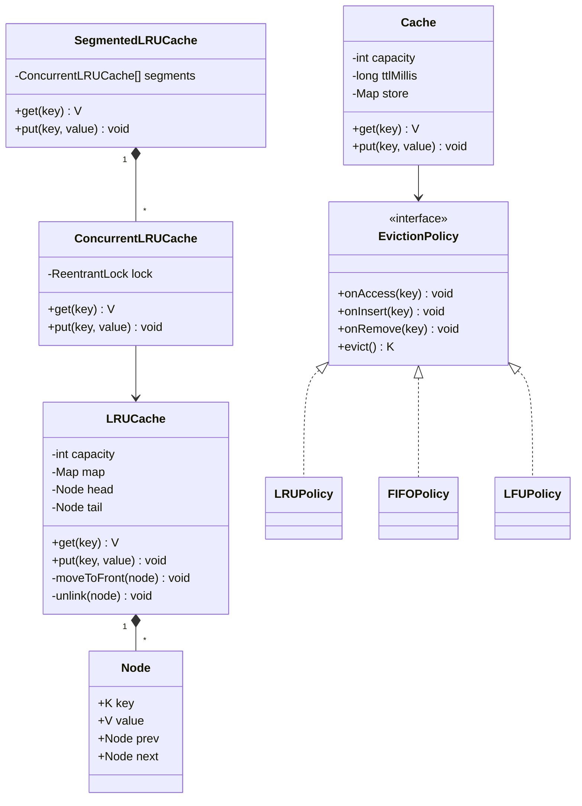

# LRU Cache

**In one line:** a fixed-capacity cache where `get` and `put` are both O(1), and when it is full the **least recently used** key is evicted. The interviewer checks: can you write HashMap + doubly linked list from scratch without pointer bugs, and handle follow-ups (thread-safety, TTL, LFU).

## Step 1: Clarify requirements

| You ask | Typical answer | Impact on design |
|---|---|---|
| "Is capacity a count or bytes?" | Count (entries) | Evict when `map.size() == capacity` |
| "Does `get` also update recency?" | Yes | `get` also moves the node to the front |
| "`put` on an existing key?" | Update value + make recent | No new node, move the old one |
| "What to return on a miss?" | `null` (or -1 on LeetCode) | Generic `V`, `null` = miss |
| "Multi-threaded?" | Yes, as a follow-up | Lock / segments |
| "Need TTL?" | Follow-up | `expiresAt` in the entry, lazy expiry |
| "Can the eviction policy change?" | LRU now, LFU/FIFO later | `EvictionPolicy` Strategy |
| "Can I use a library?" | From scratch first | `LinkedHashMap` only as an alternative |

**Functional:**
- `get(key)`: return the value and make the key most recent. O(1).
- `put(key, value)`: insert/update. If full, evict the LRU. O(1).
- Capacity fixed in the constructor, reject `capacity <= 0`.

**Out of scope:** distributed cache, persistence, size-in-bytes accounting, write-through to DB.

## Step 2: Core entities

- **Node**: key, value, prev, next. We keep the key so that on eviction we can also remove it from the map.
- **Doubly linked list**: recency order. Near head = most recent, near tail = LRU. Sentinel `head`/`tail` remove null checks.
- **HashMap<K, Node>**: key to node in O(1).
- **LRUCache**: joins the two above, exposes `get`/`put`.
- **EvictionPolicy** (Strategy): to plug in LRU/LFU/FIFO.
- **Cache**: storage + policy + TTL, the generic version.

## Step 3: Class diagram



## Step 4: Why these design patterns

| Pattern | Where | Why | Alternative |
|---|---|---|---|
| [Strategy](../03-lld/05-behavioral.md) | `EvictionPolicy` (LRU/LFU/FIFO) | Storage + TTL code stays the same, only "who gets evicted" changes | A separate cache class per policy, duplicate code |
| Wrapper / [Proxy](../03-lld/04-structural.md) | `ConcurrentLRUCache` wraps `LRUCache` | Thread-safety is a separate layer, core logic stays simple | Mixing locks into every method |
| Composition | Map + list kept inside LRUCache | Map and list always stay in sync, nobody outside touches them | Extending `LinkedList` (wrong abstraction) |

## Step 5: Code

HashMap + doubly linked list, from scratch:

```java
import java.util.HashMap;
import java.util.Map;

public class LRUCache<K, V> {
    // near head = most recent, near tail = least recent
    private static final class Node<K, V> {
        final K key;
        V value;
        Node<K, V> prev, next;
        Node(K key, V value) { this.key = key; this.value = value; }
    }

    private final int capacity;
    private final Map<K, Node<K, V>> map = new HashMap<>();
    private final Node<K, V> head = new Node<>(null, null);   // sentinel
    private final Node<K, V> tail = new Node<>(null, null);   // sentinel

    public LRUCache(int capacity) {
        if (capacity <= 0) throw new IllegalArgumentException("capacity must be > 0");
        this.capacity = capacity;
        head.next = tail;
        tail.prev = head;
    }

    public V get(K key) {
        Node<K, V> node = map.get(key);
        if (node == null) return null;          // miss
        moveToFront(node);                      // hit = now the most recent
        return node.value;
    }

    public void put(K key, V value) {
        Node<K, V> node = map.get(key);
        if (node != null) {                     // update + make recent
            node.value = value;
            moveToFront(node);
            return;
        }
        if (map.size() == capacity) {           // full: tail.prev is the LRU
            Node<K, V> lru = tail.prev;
            unlink(lru);
            map.remove(lru.key);                // this is why the node keeps the key
        }
        Node<K, V> fresh = new Node<>(key, value);
        addFirst(fresh);
        map.put(key, fresh);
    }

    public int size() { return map.size(); }

    private void addFirst(Node<K, V> n) {
        n.prev = head;
        n.next = head.next;
        head.next.prev = n;
        head.next = n;
    }

    private void unlink(Node<K, V> n) {
        n.prev.next = n.next;
        n.next.prev = n.prev;
        n.prev = n.next = null;                 // helps GC + catches stale pointer bugs
    }

    private void moveToFront(Node<K, V> n) { unlink(n); addFirst(n); }

    public static void main(String[] args) {
        LRUCache<Integer, String> c = new LRUCache<>(2);
        c.put(1, "one");
        c.put(2, "two");
        c.get(1);                               // order: 1, 2 (2 is now LRU)
        c.put(3, "three");                      // 2 evict
        System.out.println(c.get(2));           // null
        System.out.println(c.get(1));           // one
        System.out.println(c.get(3));           // three
    }
}
```

`LinkedHashMap` alternative (when the interviewer says "library allowed"):

```java
import java.util.LinkedHashMap;
import java.util.Map;

class LinkedLRU<K, V> extends LinkedHashMap<K, V> {
    private final int capacity;

    LinkedLRU(int capacity) {
        super(16, 0.75f, true);                 // accessOrder = true: get() also changes the order
        this.capacity = capacity;
    }

    @Override
    protected boolean removeEldestEntry(Map.Entry<K, V> eldest) {
        return size() > capacity;               // called after every put
    }
}
```

Thread-safe versions:

```java
import java.util.concurrent.locks.ReentrantLock;

class ConcurrentLRUCache<K, V> {
    private final LRUCache<K, V> lru;
    private final ReentrantLock lock = new ReentrantLock();

    ConcurrentLRUCache(int capacity) { lru = new LRUCache<>(capacity); }

    // get() also changes the list, so a ReadWriteLock read lock would be wrong here
    V get(K key) {
        lock.lock();
        try { return lru.get(key); } finally { lock.unlock(); }
    }

    void put(K key, V value) {
        lock.lock();
        try { lru.put(key, value); } finally { lock.unlock(); }
    }
}

// N segments, each with its own lock: ~N times less contention, LRU only per segment
class SegmentedLRUCache<K, V> {
    private final ConcurrentLRUCache<K, V>[] segments;

    @SuppressWarnings("unchecked")
    SegmentedLRUCache(int capacity, int segmentCount) {
        segments = new ConcurrentLRUCache[segmentCount];
        int perSegment = Math.max(1, capacity / segmentCount);
        for (int i = 0; i < segmentCount; i++) segments[i] = new ConcurrentLRUCache<>(perSegment);
    }

    private ConcurrentLRUCache<K, V> segmentFor(K key) {
        return segments[Math.floorMod(key.hashCode(), segments.length)];
    }

    V get(K key) { return segmentFor(key).get(key); }
    void put(K key, V value) { segmentFor(key).put(key, value); }
}
```

Pluggable eviction with Strategy + TTL:

```java
import java.util.*;

interface EvictionPolicy<K> {
    void onAccess(K key);
    void onInsert(K key);
    void onRemove(K key);
    K evict();                                   // which key to remove
}

class LRUPolicy<K> implements EvictionPolicy<K> {
    private final LinkedHashSet<K> order = new LinkedHashSet<>();   // first = least recent
    public void onAccess(K key) { order.remove(key); order.add(key); }
    public void onInsert(K key) { order.add(key); }
    public void onRemove(K key) { order.remove(key); }
    public K evict() { K k = order.iterator().next(); order.remove(k); return k; }
}

class FIFOPolicy<K> implements EvictionPolicy<K> {
    private final LinkedHashSet<K> order = new LinkedHashSet<>();
    public void onAccess(K key) { }                                  // access does not change the order
    public void onInsert(K key) { order.add(key); }
    public void onRemove(K key) { order.remove(key); }
    public K evict() { K k = order.iterator().next(); order.remove(k); return k; }
}

class Cache<K, V> {
    private record Entry<T>(T value, long expiresAt) {}

    private final int capacity;
    private final long ttlMillis;
    private final Map<K, Entry<V>> store = new HashMap<>();
    private final EvictionPolicy<K> policy;

    Cache(int capacity, long ttlMillis, EvictionPolicy<K> policy) {
        this.capacity = capacity; this.ttlMillis = ttlMillis; this.policy = policy;
    }

    synchronized V get(K key) {
        Entry<V> e = store.get(key);
        if (e == null) return null;
        if (System.currentTimeMillis() > e.expiresAt()) {           // lazy expiry
            store.remove(key);
            policy.onRemove(key);
            return null;
        }
        policy.onAccess(key);
        return e.value();
    }

    synchronized void put(K key, V value) {
        if (store.containsKey(key)) {
            policy.onAccess(key);
        } else {
            if (store.size() == capacity) store.remove(policy.evict());
            policy.onInsert(key);
        }
        store.put(key, new Entry<>(value, System.currentTimeMillis() + ttlMillis));
    }
}
// usage: new Cache<String, String>(1000, 60_000, new LRUPolicy<>())  or new FIFOPolicy<>()
```

**Complexity:**

| Operation | HashMap + DLL | LinkedHashMap | Cache + LRUPolicy (LinkedHashSet) | Naive (list scan) |
|---|---|---|---|---|
| `get` | O(1) | O(1) | O(1) | O(n) |
| `put` | O(1) | O(1) | O(1) | O(n) |
| evict | O(1) | O(1) | O(1) | O(n) |
| Space | O(capacity) | O(capacity) | O(capacity), two structures | O(capacity) |

## Step 6: Concurrency & edge cases

- **`HashMap` + list are not thread-safe:** two threads doing `moveToFront` at once break the pointers (a cycle or a lost node). One lock must guard both structures together.
- **Why not a ReadWriteLock:** in LRU, `get` is also a write (it changes the order). With a read lock, two readers can corrupt the list.
- **`ConcurrentHashMap` alone is not enough:** the map is safe, but the combined map + list update is not atomic.
- **Segmenting:** pick the segment with `hash(key) % N`, each segment has its own lock. Throughput goes up, but eviction is no longer "global LRU", only approximate per-segment LRU. If hot keys land in one segment, that segment sees contention.
- **Production:** use Caffeine (`Caffeine.newBuilder().maximumSize(..)`): lock-free reads, accesses recorded in a buffer and reordered in batches, W-TinyLFU policy.
- **Edge cases:** capacity 1 (every new put evicts the old one), same key put again and again (size must not grow), `null` key (HashMap allows it, but you cannot tell a `null` value from a miss: use `Optional` or `containsKey`), reject capacity 0.
- **With TTL:** expired entries hold capacity until someone calls `get`. Fix: remove expired entries before evicting, or a background sweeper (`ScheduledExecutorService`), or an expiry-sorted `PriorityQueue`.
- **Pointer bug checklist:** in `unlink` connect the neighbours first, in `addFirst` do not forget `head.next.prev`, on eviction do `map.remove(lru.key)`.

## Step 7: Extensions

- **"We need LFU":** `key → value`, `key → freq`, `freq → LinkedHashSet<key>` (LRU order within the same freq), and `minFreq`. On access, move the key from bucket `freq` to `freq+1`; if the `minFreq` bucket becomes empty, `minFreq++`. On a new insert, `minFreq = 1`. Evict = first element of the `minFreq` bucket. All O(1). In this design it is just a new `LFUPolicy implements EvictionPolicy`.
- **"FIFO / Random":** a new policy class, `Cache` stays the same.
- **"Per-key TTL":** `put(key, value, ttl)`, each `Entry` has its own `expiresAt`.
- **"Size in bytes":** a `Weigher` interface, track `currentWeight`, keep evicting while `> maxWeight`.
- **"Callback on eviction (write-back, metrics)":** `RemovalListener` = Observer.
- **"Distributed":** spread keys across nodes with consistent hashing, a local LRU on each node. Redis `maxmemory-policy allkeys-lru` (approximate LRU, sampling). See [Caching](../01-topics/05-caching.md).

## Step 8: Interview flow (45 min)

| Minutes | What to do |
|---|---|
| 0–4 | Requirements: capacity unit, get updates recency, miss value, threads |
| 4–8 | Why HashMap + DLL: map = O(1) lookup, DLL = O(1) reorder/remove. Describe it: head = MRU, tail = LRU |
| 8–25 | Code from scratch: Node, sentinels, `addFirst`, `unlink`, `get`, `put`. Dry run with capacity 2 |
| 25–30 | Complexity table, edge cases, `LinkedHashMap` alternative |
| 30–38 | Thread-safety: ReentrantLock, why not ReadWriteLock, segmenting |
| 38–45 | Follow-ups: TTL, EvictionPolicy Strategy, LFU structure |

## 2-minute recap

LRU = HashMap<K, Node> + doubly linked list. The map gives the node in O(1), the list can remove or move a node to the front in O(1). MRU near head, LRU near tail; sentinel head/tail remove null checks. `get`: if found, move the node to the front. `put`: if it exists, update value + move to front; if new and full, remove `tail.prev` (the node keeps its key so it can also be removed from the map), then add at the front. Shortcut: `LinkedHashMap(accessOrder=true)` + `removeEldestEntry`. Thread-safety: one ReentrantLock (get also mutates, so no read lock), segments for more throughput. TTL: `expiresAt` in the entry, lazy expiry + sweeper. Pluggable policy: `EvictionPolicy` Strategy (LRU/FIFO/LFU). LFU: freq buckets + `minFreq`, all O(1).

## Checklist

- [ ] I can write the HashMap + doubly linked list LRU from scratch in 15 min without pointer bugs
- [ ] I can explain why we use sentinel head/tail and why the node stores the key
- [ ] I can write the `LinkedHashMap` (accessOrder + removeEldestEntry) version
- [ ] I can build a thread-safe version and explain why a ReadWriteLock is wrong here
- [ ] I can explain the segmenting trade-off (throughput vs global LRU)
- [ ] I can add TTL (lazy expiry + sweeper)
- [ ] I can swap LRU/FIFO/LFU with the `EvictionPolicy` Strategy and describe the O(1) LFU structure
- [ ] I can state the complexity table (get, put, evict, space)
