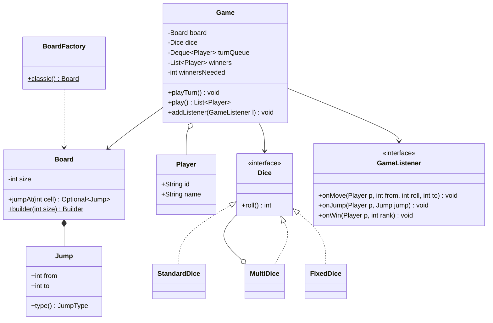

# Snake & Ladder

Design a configurable Snake & Ladder game: board, snakes, ladders, players, dice and turn order. The interviewer checks that you separate entities cleanly, keep the dice pluggable, validate the board, and make the game loop **testable** (by injecting the random dice).

## Step 1: Clarify requirements

| You ask | Typical answer | Impact on design |
|---|---|---|
| Is the board fixed at 100? | Configurable (10x10 default) | `size` in `Board`, nothing hardcoded |
| How many dice? | One by default, could be 2 | `Dice` interface (Strategy), `MultiDice` |
| How many players? | 2 to 4+ | Round-robin turns via `Deque<Player>` |
| What if a roll goes past the last cell? | Move cancelled, stay put (exact landing) | Overshoot rule in `playTurn()` |
| Does the game end at the first winner? | Yes by default; extension: top-k winners | `winnersNeeded` parameter |
| Extra turn on a 6? | Not now, may come as an extension | Keep the turn rule separate |
| Snake/ladder chains allowed (ladder top on a snake head)? | No | Validation in the Builder |
| UI / network multiplayer? | No, core logic only | Push events out via Observer |

**Functional:**
- Build a board: size, snakes (head → tail), ladders (bottom → top).
- Players roll the dice in turn and move their token.
- Snake head sends you down, ladder bottom takes you up.
- Whoever lands exactly on the last cell wins. Keep a list of winners until the game ends.
- Game events (move, jump, win) reach logs/UI.

**Out of scope:** GUI, online multiplayer, persistence, betting.

## Step 2: Core entities

- `Board`: size + a map of jumps. Immutable, built by a Builder.
- `Jump`: one snake or ladder, `from → to`. `to < from` means snake.
- `Player`: id + name. `Game` holds the position, not the player.
- `Dice`: interface, `roll()`. `StandardDice`, `MultiDice`, `CrookedDice`, `FixedDice` (test).
- `Game`: turn queue, positions, winners, listeners. The whole game loop lives here.
- `GameListener`: event subscriber (console logger, UI, analytics).
- `BoardFactory`: preset boards (classic, later random).

## Step 3: Class diagram



## Step 4: Why these design patterns

| Pattern | Where | Why | Alternative |
|---|---|---|---|
| [Strategy](../03-lld/05-behavioral.md) | `Dice` | Swap normal, crooked, 2-dice, fixed (test) without touching `Game` | `if (diceType == ...)` chain, edit `Game` for every new dice |
| [Builder](../03-lld/03-creational.md) | `Board.Builder` | Add snakes/ladders one by one, validate in `build()`, get an immutable `Board` | Big constructor `Board(size, List, List)`, validation scattered |
| [Factory](../03-lld/03-creational.md) | `BoardFactory.classic()` | Preset boards in one place, client does not memorise jumps | Hand-building the board in every test/main |
| [Observer](../03-lld/05-behavioral.md) | `GameListener` | Add logging, UI, sound, analytics without touching `Game` | `System.out.println` inside `Game`, hard to assert in tests |
| Dependency injection | `Game(board, dice, ...)` | Inject `FixedDice` for deterministic tests | `new Random()` inside `Game`, flaky tests |

## Step 5: Code

Dice (Strategy) and Board (Builder + Factory):

```java
import java.util.*;

interface Dice { int roll(); }

final class StandardDice implements Dice {
    private final int faces;
    private final Random random;
    StandardDice(int faces, Random random) { this.faces = faces; this.random = random; }
    public int roll() { return 1 + random.nextInt(faces); }
}

final class MultiDice implements Dice {            // sum of 2 or more dice
    private final List<Dice> dice;
    MultiDice(List<Dice> dice) { this.dice = List.copyOf(dice); }
    public int roll() { return dice.stream().mapToInt(Dice::roll).sum(); }
}

final class CrookedDice implements Dice {          // even only: 2, 4, 6
    private final Random random;
    CrookedDice(Random random) { this.random = random; }
    public int roll() { return 2 * (1 + random.nextInt(3)); }
}

final class FixedDice implements Dice {            // for tests: predetermined values
    private final Deque<Integer> values;
    FixedDice(Integer... values) { this.values = new ArrayDeque<>(List.of(values)); }
    public int roll() { return values.removeFirst(); }
}

enum JumpType { SNAKE, LADDER }

record Jump(int from, int to) {
    JumpType type() { return to > from ? JumpType.LADDER : JumpType.SNAKE; }
}

final class Board {
    private final int size;
    private final Map<Integer, Jump> jumps;          // from-cell -> jump
    private Board(int size, Map<Integer, Jump> jumps) { this.size = size; this.jumps = jumps; }

    int size() { return size; }
    Optional<Jump> jumpAt(int cell) { return Optional.ofNullable(jumps.get(cell)); }
    static Builder builder(int size) { return new Builder(size); }

    static final class Builder {
        private final int size;
        private final Map<Integer, Jump> jumps = new HashMap<>();
        private Builder(int size) {
            if (size < 4) throw new IllegalArgumentException("Board too small");
            this.size = size;
        }
        Builder snake(int head, int tail) {
            if (head <= tail) throw new IllegalArgumentException("Snake head must be above its tail");
            return add(new Jump(head, tail));
        }
        Builder ladder(int bottom, int top) {
            if (bottom >= top) throw new IllegalArgumentException("Ladder must go up");
            return add(new Jump(bottom, top));
        }
        private Builder add(Jump j) {
            if (j.from() <= 1 || j.from() >= size || j.to() < 1 || j.to() > size)
                throw new IllegalArgumentException("Cell off the board or on start/end: " + j);
            if (jumps.containsKey(j.from()))
                throw new IllegalArgumentException("Only one jump per cell: " + j.from());
            boolean chain = jumps.containsKey(j.to())
                    || jumps.values().stream().anyMatch(x -> x.to() == j.from());
            if (chain) throw new IllegalArgumentException("Jump chains not allowed: " + j);
            jumps.put(j.from(), j);
            return this;
        }
        Board build() { return new Board(size, Map.copyOf(jumps)); }
    }
}

final class BoardFactory {
    static Board classic() {
        return Board.builder(100)
                .ladder(4, 14).ladder(9, 31).ladder(28, 84).ladder(71, 91)
                .snake(17, 7).snake(54, 34).snake(87, 24).snake(98, 79)
                .build();
    }
}
```

Players, events (Observer) and the game loop:

```java
record Player(String id, String name) {}

interface GameListener {                            // default no-op: override only what you need
    default void onMove(Player p, int from, int roll, int to) {}
    default void onJump(Player p, Jump jump) {}
    default void onWin(Player p, int rank) {}
}

final class ConsoleListener implements GameListener {
    public void onMove(Player p, int from, int roll, int to) {
        System.out.printf("%s rolled %d: %d -> %d%n", p.name(), roll, from, to);
    }
    public void onJump(Player p, Jump j) { System.out.println("  " + j.type() + " " + j.from() + " -> " + j.to()); }
    public void onWin(Player p, int rank) { System.out.println(p.name() + " finished #" + rank); }
}

final class Game {
    private final Board board;
    private final Dice dice;
    private final Deque<Player> turnQueue;
    private final Map<Player, Integer> positions = new HashMap<>();
    private final List<Player> winners = new ArrayList<>();
    private final List<GameListener> listeners = new ArrayList<>();
    private final int winnersNeeded;

    Game(Board board, Dice dice, List<Player> players, int winnersNeeded) {
        if (players.size() < 2) throw new IllegalArgumentException("At least 2 players");
        if (winnersNeeded < 1 || winnersNeeded >= players.size())
            throw new IllegalArgumentException("winnersNeeded must be 1..players-1");
        this.board = board;
        this.dice = dice;
        this.turnQueue = new ArrayDeque<>(players);
        this.winnersNeeded = winnersNeeded;
        players.forEach(p -> positions.put(p, 0));   // 0 = not on the board yet
    }

    void addListener(GameListener l) { listeners.add(l); }
    boolean isOver() { return winners.size() >= winnersNeeded; }
    int positionOf(Player p) { return positions.get(p); }

    void playTurn() {
        if (isOver()) throw new IllegalStateException("Game is already over");
        Player p = turnQueue.pollFirst();
        int from = positions.get(p);
        int roll = dice.roll();
        int landed = from + roll > board.size() ? from : from + roll;   // overshoot: stay put
        listeners.forEach(l -> l.onMove(p, from, roll, landed));

        Optional<Jump> jump = board.jumpAt(landed);
        jump.ifPresent(j -> listeners.forEach(l -> l.onJump(p, j)));
        int end = jump.map(Jump::to).orElse(landed);
        positions.put(p, end);

        if (end == board.size()) {
            winners.add(p);
            int rank = winners.size();
            listeners.forEach(l -> l.onWin(p, rank));
        } else {
            turnQueue.addLast(p);                     // round-robin: back of the line
        }
    }

    List<Player> play() {
        while (!isOver()) playTurn();
        return List.copyOf(winners);
    }
}
```

Usage and a deterministic test (injected dice):

```java
public class SnakeAndLadder {
    public static void main(String[] args) {
        Dice dice = new MultiDice(List.of(new StandardDice(6, new Random()), new StandardDice(6, new Random())));
        Game game = new Game(BoardFactory.classic(), dice,
                List.of(new Player("1", "Asha"), new Player("2", "Ravi"), new Player("3", "Kabir")), 2);
        game.addListener(new ConsoleListener());
        System.out.println("Winners: " + game.play());
    }
}

// JUnit 5: FixedDice makes every roll known, so the result is known too
class GameTest {
    @org.junit.jupiter.api.Test
    void ladderSnakeAndExactWin() {
        Player a = new Player("a", "A"), b = new Player("b", "B");
        Board board = Board.builder(10).ladder(2, 8).snake(9, 3).build();
        Game game = new Game(board, new FixedDice(1, 4, 1, 5, 2), List.of(a, b), 1);
        // A:0->1, B:0->4, A:1->2 ladder->8, B:4->9 snake->3, A:8->10 win
        org.junit.jupiter.api.Assertions.assertEquals(List.of(a), game.play());
        org.junit.jupiter.api.Assertions.assertEquals(3, game.positionOf(b));
    }
}
```

## Step 6: Concurrency & edge cases

- **Concurrency:** one game is single-threaded (turn-based). For an online version, give each game one owner thread/actor, or make `playTurn()` `synchronized`. The board is immutable, so many games can share one `Board`.
- **Overshoot:** at 97 with a roll of 5 you do not go to 102, you stay at 97. Keep the rule in its own method/strategy if a "bounce back" variant is needed.
- **Jump chain:** a ladder top on a snake head causes loops or confusion. Rejected in the Builder.
- **Jump on start/end:** no snake head on cell 1 or the last cell. A snake on the last cell means nobody can win.
- **Snake → ladder cycle:** blocking chains also blocks cycles.
- **Invalid config:** `winnersNeeded >= players` or a single player fails fast in the constructor.
- **`playTurn()` after game over:** `IllegalStateException`, never silently ignored.
- **Dice range:** with `MultiDice` the max roll can exceed a small board. Validate or warn.
- **Listener exception:** one crashing listener must not stop the game. In production, wrap each listener call in try-catch.

## Step 7: Extensions

- **Crooked dice:** a new `Dice` implementation (`CrookedDice`), zero change in `Game`. Call this out as the Strategy payoff.
- **Multiple winners / ranking:** `winnersNeeded` already exists. A winner leaves the queue, the rest keep playing.
- **Extra turn on 6, turn cancelled on three 6s:** add a `TurnRule` strategy that decides whether the player goes to the front or the back of the queue. `Game` just calls the rule.
- **Random board:** `BoardFactory.random(size, snakes, ladders, Random)` that uses the Builder. You get validation for free; retry on rejection.
- **New cell types (power-up, skip turn, teleport):** generalise `Jump` into a `Cell` interface: `int apply(int pos, Player p)`. Snake/ladder become implementations.
- **Undo / replay:** record each turn as a `Move` (Command). Keep a list for both replay and undo.
- **UI / multiplayer:** a new `GameListener` that pushes events over WebSocket. Core logic unchanged.
- **Save / resume:** state is just `positions`, `turnQueue`, `winners`. Serialise them.

## Step 8: Interview flow (45 min)

| Minute | What to do |
|---|---|
| 0–5 | Requirements table: board size, dice count, overshoot rule, winners, extra turn |
| 5–10 | Name entities, draw the class diagram (`Game`, `Board`, `Jump`, `Dice`, `Player`, `GameListener`) |
| 10–15 | Justify patterns: Dice = Strategy, Board = Builder, events = Observer |
| 15–32 | Code: `Dice` + `Board.Builder` validation, then `Game.playTurn()` |
| 32–37 | Write one test with `FixedDice`, say "the game loop is testable" |
| 37–42 | Edge cases: overshoot, chains, invalid config |
| 42–45 | Extensions: crooked dice, multiple winners, extra turn on 6 |

## 2-minute recap

In Snake & Ladder the `Board` is immutable and built by a Builder that validates every snake/ladder: range, one jump per cell, no chains. Snakes and ladders are the same `Jump(from, to)` record; direction gives the type. `Dice` is a Strategy interface, so normal, 2-dice, crooked and the test `FixedDice` swap in without changing `Game`. `Game` runs round-robin turns from a `Deque<Player>`, keeps positions in a map, leaves the player in place on overshoot, and adds whoever lands exactly on the last cell to the winners list. `winnersNeeded` handles multiple winners. Events go out through an Observer (`GameListener`), so logging/UI never touch the core. Injected dice make the game loop deterministic to test.

## Checklist

- [ ] I can clarify board size, dice count, overshoot rule and number of winners in requirements.
- [ ] I can draw the class diagram in 10 minutes (`Game`, `Board`, `Jump`, `Dice`, `Player`, `GameListener`).
- [ ] I can explain why Dice is a Strategy and how crooked dice would be added.
- [ ] I can write the Board Builder validations (range, duplicate, chain).
- [ ] I can write `playTurn()` from memory: roll, overshoot, jump, win, queue.
- [ ] I can write a deterministic unit test by injecting `FixedDice`.
- [ ] I can explain how the design absorbs multiple winners and an extra turn on 6.
