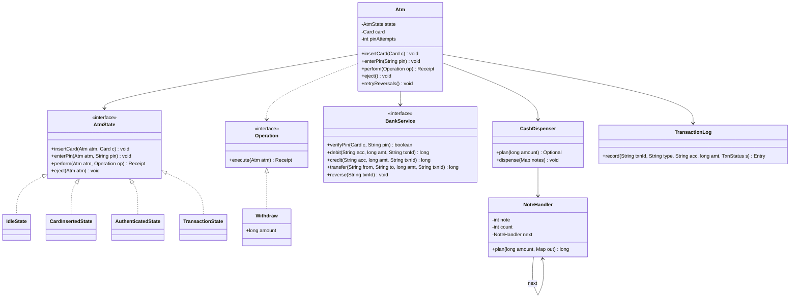

# ATM

Design the software for an ATM: card + PIN, balance, withdraw, deposit, transfer, and a cash dispenser that hands out notes. The interviewer checks that you model the ATM states cleanly (State pattern), split notes with Chain of Responsibility, and handle the money edge cases correctly (ATM low on cash, daily limit, network failure mid-way).

## Step 1: Clarify requirements

| You ask | Typical answer | Impact on design |
|---|---|---|
| Which operations? | Balance, withdraw, deposit, transfer | Each operation is an `Operation` strategy |
| Which notes? | 2000, 500, 200, 100 | Dispenser chain, amount must be a multiple of 100 |
| Who checks balance/limits? | The bank (core banking), not the ATM | `BankService` interface, ATM is just a client |
| How many wrong PINs? | Card blocked after 3 | Attempt counter in `CardInsertedState` |
| Daily withdrawal limit? | Yes, e.g. 25,000/day | Atomic check inside bank `debit()` |
| Multiple transactions per session? | Yes, until the card is ejected | Return to `Authenticated` state |
| Network fails after debit? | Money auto-reversed | txnId + idempotent `reverse()` + log |
| Users per ATM at a time? | One | ATM methods `synchronized`, concurrency lives at the bank |

**Functional:**
- Insert card, verify PIN, block card after 3 wrong PINs.
- Balance inquiry, withdraw, deposit, transfer.
- Note breakup on withdraw (big notes first); refuse if the ATM lacks cash.
- Log every transaction (audit + reconciliation).
- Reversal on network/hardware failure.

**Out of scope:** card reader/keypad drivers, the bank's internal ledger design, UI screens, cardless (UPI) withdrawal.

## Step 2: Core entities

- `Atm`: the context. Holds current state, card, PIN attempts, bank, dispenser, log.
- `AtmState`: interface. `IdleState`, `CardInsertedState`, `AuthenticatedState`, `TransactionState`.
- `Card`: card number + linked account.
- `Operation`: one transaction type (Strategy). `BalanceInquiry`, `Withdraw`, `Deposit`, `Transfer`.
- `BankService`: interface to talk to the bank. Verify PIN, debit, credit, transfer, reverse.
- `CashDispenser`: cassettes (note → count). Breakup via a chain of `NoteHandler`s.
- `NoteHandler`: one link in the chain, owns one denomination.
- `TransactionLog`: append-only log, one entry per status change.
- `Receipt`: txnId, type, amount, balance after.

## Step 3: Class diagram



`Deposit`, `Transfer` and `BalanceInquiry` also implement `Operation` (left out to keep the diagram small).

## Step 4: Why these design patterns

| Pattern | Where | Why | Alternative |
|---|---|---|---|
| [State](../03-lld/05-behavioral.md) | `Idle → CardInserted → Authenticated → Transaction` | Allowed actions differ per state. Withdraw without a card, or eject mid-transaction, is rejected automatically | `enum` in `Atm` + `switch` in every method; a new state means editing every method |
| [Chain of Responsibility](../03-lld/05-behavioral.md) | `NoteHandler` 2000 → 500 → 200 → 100 | Each handler gives its notes and passes the rest on. A new note (50) = a new link | One big loop over a hardcoded array. Works, but interviewers expect CoR |
| [Strategy](../03-lld/05-behavioral.md) | `Operation` (Withdraw, Deposit, Transfer, Balance) | New transaction types (mini statement, PIN change) without touching state classes | `switch` inside `perform(type, ...)` |
| Interface / DI | `BankService`, `CashHardware` | Test with a fake bank and fake hardware; in prod an ISO 8583 / NPCI client | HTTP calls inside the ATM, untestable |
| Append-only log | `TransactionLog` | After a crash or timeout the log tells what happened; reconciliation runs off it | In-memory status only, lost on restart |

The dispenser order can also become a Strategy (greedy "big notes first" vs "save the 100s") if the interviewer asks.

## Step 5: Code

Models, bank interface and transaction log:

```java
import java.util.*;
import java.util.concurrent.*;

record Card(String number, String accountId) {}
record Receipt(String txnId, String type, long amount, long balanceAfter) {}

class AtmException extends RuntimeException { AtmException(String m) { super(m); } }
class BankException extends RuntimeException { BankException(String m) { super(m); } }       // low funds, limit crossed
class BankTimeoutException extends BankException { BankTimeoutException(String m) { super(m); } } // outcome unknown

interface BankService {
    boolean verifyPin(Card card, String pin);
    void blockCard(Card card);
    long balance(String accountId);
    long debit(String accountId, long amount, String txnId);   // idempotent on txnId, daily limit checked here
    long credit(String accountId, long amount, String txnId);
    long transfer(String from, String to, long amount, String txnId);
    void reverse(String txnId);                                 // idempotent; no-op if the debit never happened
}

interface CashHardware { void eject(Map<Integer, Integer> notes); }   // throws on jam

enum TxnStatus { STARTED, SUCCESS, FAILED, REVERSAL_PENDING, REVERSED }

final class TransactionLog {          // append-only; in prod on local disk + synced to the bank
    record Entry(String txnId, String type, String accountId, long amount, TxnStatus status, long at) {}
    private final List<Entry> entries = new CopyOnWriteArrayList<>();

    Entry record(String txnId, String type, String acc, long amount, TxnStatus status) {
        Entry e = new Entry(txnId, type, acc, amount, status, System.currentTimeMillis());
        entries.add(e);
        return e;
    }
    List<Entry> history() { return List.copyOf(entries); }
}
```

Cash dispenser (Chain of Responsibility + greedy):

```java
final class NoteHandler {
    private final int note;
    private int count;
    private final NoteHandler next;
    NoteHandler(int note, int count, NoteHandler next) { this.note = note; this.count = count; this.next = next; }

    long plan(long amount, Map<Integer, Integer> out) {        // greedy: take what fits, pass the rest
        int use = (int) Math.min(amount / note, count);
        if (use > 0) out.put(note, use);
        long rest = amount - (long) use * note;
        return (rest == 0 || next == null) ? rest : next.plan(rest, out);
    }
    void take(Map<Integer, Integer> plan) {
        count -= plan.getOrDefault(note, 0);
        if (next != null) next.take(plan);
    }
}

final class CashDispenser {
    private final NoteHandler head;
    private final CashHardware hardware;

    CashDispenser(Map<Integer, Integer> cassettes, CashHardware hardware) {   // note -> count
        NoteHandler h = null;
        for (int note : new TreeMap<>(cassettes).keySet())   // smallest to largest, so the largest is head
            h = new NoteHandler(note, cassettes.get(note), h);
        this.head = h;
        this.hardware = hardware;
    }
    synchronized Optional<Map<Integer, Integer>> plan(long amount) {          // does not change counts
        Map<Integer, Integer> out = new LinkedHashMap<>();
        return head != null && head.plan(amount, out) == 0 ? Optional.of(out) : Optional.empty();
    }
    synchronized void dispense(Map<Integer, Integer> notes) {
        hardware.eject(notes);        // notes out first, only then reduce counts
        head.take(notes);
    }
}
```

States and the ATM context:

```java
interface Operation { Receipt execute(Atm atm); }   // Strategy: one class per transaction type

interface AtmState {
    default void insertCard(Atm atm, Card card) { throw invalid("insertCard"); }
    default void enterPin(Atm atm, String pin) { throw invalid("enterPin"); }
    default Receipt perform(Atm atm, Operation op) { throw invalid("perform"); }
    default void eject(Atm atm) { throw invalid("eject"); }
    private AtmException invalid(String action) {
        return new AtmException(action + " not allowed in " + getClass().getSimpleName());
    }
}

final class IdleState implements AtmState {
    public void insertCard(Atm atm, Card card) {
        atm.card = card;
        atm.pinAttempts = 0;
        atm.state = new CardInsertedState();
    }
}

final class CardInsertedState implements AtmState {
    private static final int MAX_PIN_ATTEMPTS = 3;
    public void enterPin(Atm atm, String pin) {
        if (atm.bank.verifyPin(atm.card, pin)) { atm.state = new AuthenticatedState(); return; }
        if (++atm.pinAttempts >= MAX_PIN_ATTEMPTS) {
            atm.bank.blockCard(atm.card);
            atm.reset();                                    // retain card, back to Idle
            throw new AtmException("3 wrong PINs: card blocked");
        }
        throw new AtmException("Wrong PIN");
    }
    public void eject(Atm atm) { atm.reset(); }
}

final class AuthenticatedState implements AtmState {
    public Receipt perform(Atm atm, Operation op) {
        atm.state = new TransactionState();               // no eject or second txn mid-way
        try { return op.execute(atm); }
        finally { atm.state = new AuthenticatedState(); }  // session stays open for the next txn
    }
    public void eject(Atm atm) { atm.reset(); }
}

final class TransactionState implements AtmState {}     // all defaults: reject

final class Atm {
    final BankService bank;
    final CashDispenser dispenser;
    final TransactionLog log;
    final Queue<TransactionLog.Entry> pendingReversals = new ConcurrentLinkedQueue<>();
    AtmState state = new IdleState();
    Card card;
    int pinAttempts;

    Atm(BankService bank, CashDispenser dispenser, TransactionLog log) {
        this.bank = bank; this.dispenser = dispenser; this.log = log;
    }
    synchronized void insertCard(Card c) { state.insertCard(this, c); }
    synchronized void enterPin(String pin) { state.enterPin(this, pin); }
    synchronized Receipt perform(Operation op) { return state.perform(this, op); }
    synchronized void eject() { state.eject(this); }
    void reset() { card = null; pinAttempts = 0; state = new IdleState(); }

    void retryReversals() {                               // a scheduler runs this every 30s
        for (int i = pendingReversals.size(); i > 0; i--) {
            TransactionLog.Entry e = pendingReversals.poll();
            try {
                bank.reverse(e.txnId());                  // idempotent, safe to retry
                log.record(e.txnId(), e.type(), e.accountId(), e.amount(), TxnStatus.REVERSED);
            } catch (BankException ex) {
                pendingReversals.add(e);                  // network still down, try later
            }
        }
    }
}
```

Operations (Strategy), with the full safe withdraw flow:

```java
record BalanceInquiry() implements Operation {
    public Receipt execute(Atm atm) {
        return new Receipt(UUID.randomUUID().toString(), "BALANCE", 0, atm.bank.balance(atm.card.accountId()));
    }
}

record Withdraw(long amount) implements Operation {
    public Receipt execute(Atm atm) {
        if (amount <= 0 || amount % 100 != 0) throw new AtmException("Amount must be a multiple of 100");
        Map<Integer, Integer> notes = atm.dispenser.plan(amount)          // 1. check ATM cash first
                .orElseThrow(() -> new AtmException("ATM lacks enough cash or the right notes"));
        String acc = atm.card.accountId(), txnId = UUID.randomUUID().toString();
        atm.log.record(txnId, "WITHDRAW", acc, amount, TxnStatus.STARTED);
        long balance;
        try {
            balance = atm.bank.debit(acc, amount, txnId);                 // 2. balance + daily limit
        } catch (BankTimeoutException e) {                                // unknown whether debit happened
            atm.pendingReversals.add(atm.log.record(txnId, "WITHDRAW", acc, amount, TxnStatus.REVERSAL_PENDING));
            throw new AtmException("Network issue. If debited, it will be auto-reversed");
        } catch (BankException e) {
            atm.log.record(txnId, "WITHDRAW", acc, amount, TxnStatus.FAILED);
            throw new AtmException(e.getMessage());
        }
        try {
            atm.dispenser.dispense(notes);                                // 3. only now hand out cash
        } catch (RuntimeException e) {                                    // jam: debited, no cash out
            atm.pendingReversals.add(atm.log.record(txnId, "WITHDRAW", acc, amount, TxnStatus.REVERSAL_PENDING));
            atm.retryReversals();
            throw new AtmException("Cash not dispensed, refund in progress");
        }
        atm.log.record(txnId, "WITHDRAW", acc, amount, TxnStatus.SUCCESS);
        return new Receipt(txnId, "WITHDRAW", amount, balance);
    }
}

record Deposit(Map<Integer, Integer> notes) implements Operation {     // notes go to a deposit bin, not dispensed
    public Receipt execute(Atm atm) {
        long amount = notes.entrySet().stream().mapToLong(e -> (long) e.getKey() * e.getValue()).sum();
        String acc = atm.card.accountId(), txnId = UUID.randomUUID().toString();
        atm.log.record(txnId, "DEPOSIT", acc, amount, TxnStatus.STARTED);
        long balance = atm.bank.credit(acc, amount, txnId);            // safe to retry with the same txnId
        atm.log.record(txnId, "DEPOSIT", acc, amount, TxnStatus.SUCCESS);
        return new Receipt(txnId, "DEPOSIT", amount, balance);
    }
}

record Transfer(String toAccount, long amount) implements Operation {
    public Receipt execute(Atm atm) {
        String acc = atm.card.accountId(), txnId = UUID.randomUUID().toString();
        atm.log.record(txnId, "TRANSFER", acc, amount, TxnStatus.STARTED);
        long balance = atm.bank.transfer(acc, toAccount, amount, txnId); // bank updates both sides in one DB txn
        atm.log.record(txnId, "TRANSFER", acc, amount, TxnStatus.SUCCESS);
        return new Receipt(txnId, "TRANSFER", amount, balance);
    }
}

// Usage:
// Atm atm = new Atm(bank, new CashDispenser(Map.of(2000, 10, 500, 40, 200, 50, 100, 100), hw), new TransactionLog());
// atm.insertCard(new Card("4111...", "ACC1")); atm.enterPin("1234");
// atm.perform(new Withdraw(2700));   // 2000x1 + 500x1 + 200x1
// atm.eject();
```

## Step 6: Concurrency & edge cases

- **One ATM, one user:** `Atm`'s public methods are `synchronized`. `TransactionState` blocks eject or a second txn mid-way.
- **Concurrent account updates:** the same account hit from two ATMs + UPI at once. Lock at the bank, not at the ATM. Atomic conditional update in the DB:

```java
// Bank side (pseudo): one statement, no race
// UPDATE accounts SET balance = balance - :amt, withdrawn_today = withdrawn_today + :amt
//  WHERE id = :acc AND balance >= :amt AND withdrawn_today + :amt <= :dailyLimit
// 0 rows affected -> insufficient funds or limit crossed

// In-memory version: lock ordering in transfer, no deadlock
void transfer(Account a, Account b, long amt) {
    Account first = a.id().compareTo(b.id()) < 0 ? a : b;
    Account second = first == a ? b : a;
    synchronized (first) { synchronized (second) { a.debit(amt); b.credit(amt); } }
}
```

- **Daily limit:** checked at the bank, in the same atomic update. Checking at the ATM lets two ATMs bypass the limit.
- **ATM low on cash:** `plan()` runs first, before the debit. No cash means no bank call at all.
- **Greedy can fail:** need 600, ATM has 500x1, 200x3, 100x0. Greedy takes 500, 100 is left, fail. But 200x3 works. Fix: if greedy fails, run a small backtracking/DP (few note types, cheap). With unlimited notes greedy is always right because all are multiples of 100.
- **Network failure mid-withdrawal:** debit timeout = outcome unknown. **Do not** dispense. Log `REVERSAL_PENDING`, retry `reverse()` with the same txnId. The bank's `reverse` is idempotent; if the debit never happened it is a no-op.
- **Debited, then note jam:** dispense fails → reversal. Partial dispense (some notes came out) → the hardware sensor reports the count, keep the debit for that much and reverse the rest. This is the reconciliation job's work.
- **ATM crashes mid-way:** on restart scan the log: entries `STARTED` with no `SUCCESS/FAILED` → ask the bank for the txnId status, reverse if needed.
- **Idempotency:** every bank call carries an ATM-generated `txnId`. Retries never double-debit.
- **Wrong PIN:** block after 3 attempts. Keep the counter at the bank too, otherwise pull the card and try 3 more at another ATM.
- **Session timeout:** no input for 30s → auto eject, `Idle`. Card left behind gets retained.
- **Deposit:** the machine rejects fake/torn notes; credit only accepted notes.

## Step 7: Extensions

- **New note (50) or retired note (2000):** add/remove one link in the chain. Rest of the code unchanged.
- **Mini statement / PIN change:** a new `Operation`. States and `Atm` unchanged.
- **Cardless (UPI QR) withdrawal:** `QrScannedState` in place of `CardInsertedState`, a different auth strategy (`PinAuth`, `OtpAuth`, `BiometricAuth`).
- **"Save the 100s" policy:** make the dispenser order a `DispenseStrategy`, or a backtracking search that minimises 100s.
- **Low cash alert:** Observer on the dispenser: count below threshold → alert bank ops.
- **Multiple banks (interbank):** a switch (NPCI) client behind `BankService`. ATM code unchanged.
- **Admin mode (cash refill):** `MaintenanceState`, admin card only. Normal users rejected.
- **Fee on the 6th withdrawal:** a bank-side rule. The ATM only shows it on the receipt.

## Step 8: Interview flow (45 min)

| Minute | What to do |
|---|---|
| 0–5 | Requirements table: operations, notes, PIN attempts, daily limit, who checks what |
| 5–10 | Entities + state diagram: `Idle → CardInserted → Authenticated → Transaction` |
| 10–15 | Class diagram, patterns: State, CoR (dispenser), Strategy (operations) |
| 15–30 | Code: `AtmState` + states, `NoteHandler` chain, `Withdraw.execute()` |
| 30–38 | Edge cases: low cash, atomic daily limit, timeout → reversal, txnId idempotency |
| 38–42 | Greedy failure case and its fix |
| 42–45 | Extensions: new note, cardless, admin mode |

## 2-minute recap

An ATM is a State machine: `Idle → CardInserted → Authenticated → Transaction → Authenticated`, back to `Idle` on eject. Each state implements only its allowed actions; everything else is rejected by default. Transactions (`Withdraw`, `Deposit`, `Transfer`, `BalanceInquiry`) are `Operation` strategies, so adding a type is easy. The cash dispenser is a Chain of Responsibility 2000 → 500 → 200 → 100 that builds a greedy breakup: first only a plan (counts unchanged), then dispense. Balance and daily limit are checked by the bank in `BankService` with one atomic update, not at the ATM, so concurrent ATMs/UPI cannot race. Withdraw order: cash plan → debit (with txnId) → dispense → log. On a debit timeout, never hand out cash; log `REVERSAL_PENDING` and retry an idempotent `reverse(txnId)`. The append-only transaction log drives crash recovery and reconciliation.

## Checklist

- [ ] I can explain the 4 ATM states and their transitions with a diagram.
- [ ] I can show in code how the State pattern rejects an invalid action (withdraw without PIN).
- [ ] I can write the 2000/500/200/100 greedy breakup with a `NoteHandler` chain.
- [ ] I can explain when greedy fails (limited notes) and how to fix it.
- [ ] I can explain the safe withdraw order (plan → debit → dispense → log) and why.
- [ ] I can walk through txnId + idempotent reversal on a network failure mid-withdrawal.
- [ ] I can explain why the daily limit and concurrent updates must be atomic at the bank.
- [ ] I can explain how a new note, a new operation or cardless mode fits the design.
