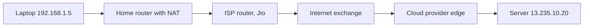
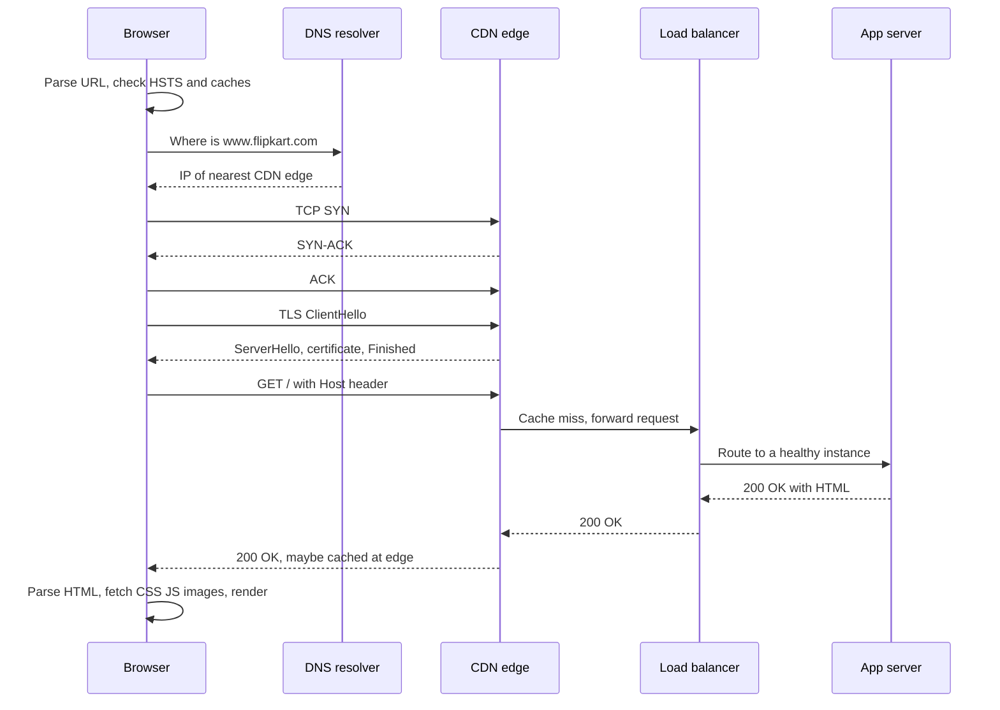
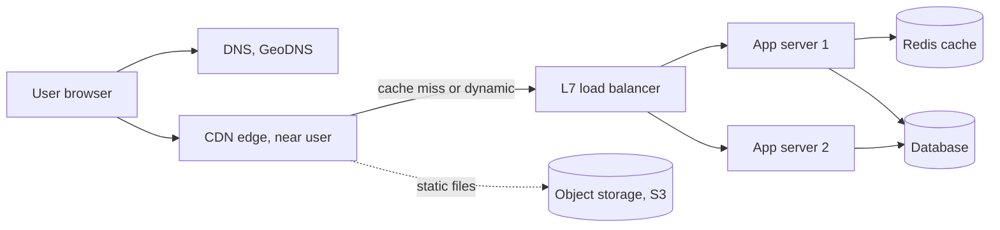

# How the Internet Works

The internet is a network of networks that moves small chunks of data (packets) from one IP address to another, hop by hop, with no central controller. Interviewers use "what happens when you type a URL" to see whether you can walk the whole stack: layers, IP and routing, ports, NAT, DNS, TCP, TLS, HTTP and what the browser does with the response. Every later page in this section (TCP, HTTP, DNS, TLS) zooms into one step of that path.

## ⭐ Layers: OSI vs TCP/IP

**In one line:** networking is split into layers; each layer solves one problem and only talks to the layer directly above and below it.

> **Example:** a Swiggy order is like a parcel. The app writes the order (application), it gets sealed into a box with a tracking number (transport), a delivery address goes on it (network), and the delivery boy carries it down one road at a time (link and physical).

| OSI layer | TCP/IP layer | What it does | Protocols / examples | Unit |
|---|---|---|---|---|
| 7 Application | Application | What the app wants to say | HTTP, HTTPS, DNS, SMTP, FTP, SSH, gRPC, WebSocket | Message |
| 6 Presentation | Application | Encoding, encryption, compression | TLS, JSON, UTF-8, gzip | Message |
| 5 Session | Application | Opening and keeping a conversation | TLS sessions, RPC sessions | Message |
| 4 Transport | Transport | Process-to-process delivery, ports, reliability | TCP, UDP, QUIC (on UDP) | Segment / datagram |
| 3 Network | Internet | Addressing and routing across networks | IP (v4, v6), ICMP, BGP, OSPF | Packet |
| 2 Data link | Link | Delivery to the next hop on the same network | Ethernet, Wi-Fi (802.11), ARP | Frame |
| 1 Physical | Link | Bits on the wire / air | Copper, fibre, radio | Bits |

- **Encapsulation:** going down, each layer adds its own header. HTTP data → TCP header (ports, seq) → IP header (src/dst IP) → Ethernet header (MAC addresses). Going up, each layer strips its header.
- OSI is the 7-layer teaching model. The real internet runs on the 4-layer **TCP/IP** model; layers 5–7 are just "the application".
- **L4 vs L7 load balancer** comes straight from this table: L4 sees only IP + port (fast, no content awareness), L7 reads HTTP (path, headers, cookies) and can route `/api` and `/images` differently.

**Interview tip:** "Which layer does TLS live in?" Between transport and application. Saying "presentation layer in OSI terms, but in practice a library on top of TCP" is a clean answer.

**Common mistake:** memorising all 7 OSI names but not being able to say which layer a router (L3), a switch (L2) or an L7 load balancer works at.

## ⭐ IP addresses, packets and routing

**In one line:** every device has an IP address; data is cut into packets, each with a source and destination IP, and routers forward each packet to the next hop using their routing tables.

- **IPv4:** 32 bits, `142.250.183.4`, ~4.3 billion addresses (ran out long ago). **IPv6:** 128 bits, `2404:6800:4009:80b::2004`, effectively unlimited.
- **CIDR:** `10.0.0.0/16` means the first 16 bits are the network, so 65,536 addresses. Used for VPC subnets and firewall rules.
- **Private ranges** (not routable on the public internet): `10.0.0.0/8`, `172.16.0.0/12`, `192.168.0.0/16`.
- **Packet:** IP header (src IP, dst IP, TTL, protocol) + payload. Typical max size on Ethernet (**MTU**) is 1500 bytes, so a 2 MB image becomes ~1,400 packets.
- **Routing:** each router looks at the destination IP, finds the longest matching prefix in its table and sends the packet to the next hop. Packets of one stream can take different paths and arrive out of order.
- **IP is best-effort:** no guarantee of delivery, order or no duplicates. TCP adds that on top.
- **TTL** (hop limit) drops a packet after N hops so loops do not live forever. `traceroute` uses this to list each hop.
- **BGP** is how big networks (ISPs like Jio, Airtel, cloud providers) tell each other "I can reach these IP ranges". A bad BGP announcement can take a whole company offline.

**Interview tip:** "How does a packet find its way?" Each router only knows the next hop for a prefix, not the whole path. Routing is a chain of local decisions.

**Common mistake:** saying IP guarantees delivery. It does not; reliability is a transport-layer job.

## MAC addresses, ARP, switches and routers

**In one line:** IP gets a packet to the right network; inside that network, the frame is delivered to a MAC address (the network card's hardware address), found via ARP.

| Device | Layer | Looks at | Job |
|---|---|---|---|
| Switch | L2 | MAC address | Forward frames inside one LAN |
| Router | L3 | IP address | Forward packets between networks |
| L4 load balancer | L4 | IP + port | Spread TCP/UDP connections |
| L7 load balancer / proxy | L7 | HTTP path, headers | Route, terminate TLS, cache |

- **ARP:** "who has 192.168.1.1? tell 192.168.1.5". The router replies with its MAC, and your laptop sends frames for the internet to that MAC.
- MAC addresses change at every hop (each link has its own frame); source and destination IPs stay the same end to end (except where NAT rewrites them).

## ⭐ Ports and sockets

**In one line:** an IP address picks the machine, a port (16-bit number, 0–65535) picks the process on that machine.

| Port | Service |
|---|---|
| 22 | SSH |
| 53 | DNS (UDP, and TCP for big answers) |
| 80 | HTTP |
| 443 | HTTPS (and HTTP/3 over UDP 443) |
| 3306 / 5432 | MySQL / PostgreSQL |
| 6379 | Redis |
| 9092 | Kafka |

- A TCP connection is identified by the **4-tuple**: (src IP, src port, dst IP, dst port). That is why one server port 443 can hold lakhs of connections at once.
- The client side gets a random **ephemeral port** (Linux default range 32768–60999).
- **Socket** = the OS handle for one end of that connection. A server `listen`s on a port and `accept`s new sockets.

**Common mistake:** thinking a server is limited to 65,535 connections because there are 65,535 ports. The limit is per 4-tuple, so the real limits are memory and file descriptors.

## NAT

**In one line:** Network Address Translation lets many devices with private IPs share one public IP by rewriting addresses and ports at the router.

- Your laptop `192.168.1.5:51000` sends a packet. The home router rewrites it to `49.36.x.x:62001` and remembers the mapping. The reply comes back to `62001` and the router forwards it to your laptop.
- **Carrier-grade NAT (CGNAT):** mobile ISPs put thousands of users behind one public IP. That is why IP-based rate limiting can block a whole office or a whole mobile tower.
- Cloud: private subnets reach the internet through a **NAT gateway**; nothing outside can open a connection in.
- NAT breaks direct peer-to-peer connections. Video calls use **STUN/TURN** (WebRTC) to get around it.

**Interview tip:** "Why should rate limiting not be only per IP?" Because of NAT and CGNAT many real users share one IP. Prefer user ID or API key, with IP as a fallback. See [Rate limiting](../01-topics/11-rate-limiting.md).

## ⭐ What happens when you type a URL in the browser

**In one line:** the browser resolves the name to an IP (DNS), opens a connection (TCP), secures it (TLS), sends an HTTP request, the server (behind CDN and load balancer) builds a response, and the browser parses and renders it.

> **Example:** you type `https://www.flipkart.com/` and press Enter.

Step by step:

1. **Parse the URL:** scheme `https`, host `www.flipkart.com`, port 443 (default), path `/`. If you typed `flipkart.com`, the browser may add `https://` from the **HSTS** list.
2. **Caches first:** the browser checks its HTTP cache (maybe the page is fresh and no network is needed) and its DNS cache.
3. **DNS:** browser cache → OS cache (`/etc/hosts`) → recursive resolver (ISP or `8.8.8.8`) → root → `.com` TLD → Flipkart's authoritative name server. The answer is often a CNAME to a CDN, which returns the IP of an edge close to you. See [DNS](./04-dns.md).
4. **TCP:** 3-way handshake (SYN, SYN-ACK, ACK) to port 443. One round trip (RTT). See [TCP vs UDP](./02-tcp-udp.md).
5. **TLS:** TLS 1.3 handshake, one more RTT. Browser checks the certificate chain and the hostname, and both sides derive symmetric keys. See [TLS](./05-tls.md).
6. **HTTP request:** `GET / HTTP/2` with headers (`Host`, `Cookie`, `Accept-Encoding`, `User-Agent`). See [HTTP](./03-http.md).
7. **CDN edge:** serves static files (JS, CSS, images) from cache; dynamic HTML goes to origin. See [Blob storage & CDN](../01-topics/12-blob-storage-cdn.md).
8. **Load balancer:** terminates TLS (often), picks a healthy app server (round robin, least connections), adds `X-Forwarded-For`. See [Scaling basics](../01-topics/01-scaling-basics.md).
9. **App server:** auth via cookie/token, reads cache (Redis), queries DB, renders HTML or JSON.
10. **Response:** status `200`, headers (`Content-Type`, `Cache-Control`, `Set-Cookie`), compressed body.
11. **Browser render:** parse HTML → DOM, CSS → CSSOM, combine into render tree → layout → paint → composite. `<script>` without `defer`/`async` blocks parsing. Every ``, `<link>`, `<script>` triggers more requests (reusing the same connection on HTTP/2).
12. **Connection stays open** (keep-alive) for the next requests.

Latency budget (Mumbai user, server in Mumbai, ~10 ms RTT): DNS 0–50 ms (cached is 0), TCP 1 RTT, TLS 1.3 1 RTT, request/response 1 RTT + server time. With HTTP/3 (QUIC) TCP and TLS merge into 1 RTT; with 0-RTT resumption, 0.

**Interview tip:** say the steps in order out loud, name one detail per step (CNAME to CDN, SYN/SYN-ACK/ACK, cert chain check, Host header, LB health checks, critical rendering path), then offer to go deep on whichever step they like.

**Common mistake:** skipping DNS caching and the CDN, and drawing the browser talking straight to "the server". In real systems the first hop is almost always a CDN edge or a load balancer.

## ⭐ Where CDN and load balancer sit in the path

| Component | Job in the path | Layer |
|---|---|---|
| DNS / GeoDNS | Turns name into IP, can send each user to the nearest region | Application |
| CDN edge | Caches static (and some dynamic) content close to users, absorbs DDoS, terminates TLS near the user | L7 |
| Load balancer | Spreads traffic across healthy servers, TLS termination, health checks | L4 or L7 |
| API gateway | Auth, rate limiting, routing to microservices | L7 |
| App server | Business logic | L7 |

- CDN reduces RTT (the edge is 5 ms away instead of 150 ms) and offloads origin. IPL live score pages are served mostly from the CDN.
- Load balancer gives horizontal scaling and failover. See [Scaling basics](../01-topics/01-scaling-basics.md) and [Blob storage & CDN](../01-topics/12-blob-storage-cdn.md).

**Common mistake:** putting the CDN behind the load balancer in a diagram. The CDN is the edge; the load balancer sits in front of your servers in your region.

## Where it shows up in system design

- [Scaling basics](../01-topics/01-scaling-basics.md): load balancers, stateless servers
- [Blob storage & CDN](../01-topics/12-blob-storage-cdn.md): edge caching for static content
- [Rate limiting](../01-topics/11-rate-limiting.md): why IP-based limits break behind NAT
- [Numbers cheatsheet](../01-topics/21-numbers-cheatsheet.md): RTT and latency numbers
- [URL shortener](../02-questions/t1-01-url-shortener.md) and [YouTube](../02-questions/t1-07-youtube.md): CDN and redirect paths

## Checklist

- [ ] I can draw the OSI and TCP/IP layers and name protocols at each layer
- [ ] I can explain IP addressing, CIDR, packets and hop-by-hop routing
- [ ] I can explain ports, the 4-tuple, ephemeral ports and how NAT rewrites them
- [ ] I can walk through "what happens when you type a URL" from DNS to render without notes
- [ ] I can place the CDN, load balancer and API gateway correctly in the request path
- [ ] I can estimate how many round trips a fresh HTTPS page load costs
