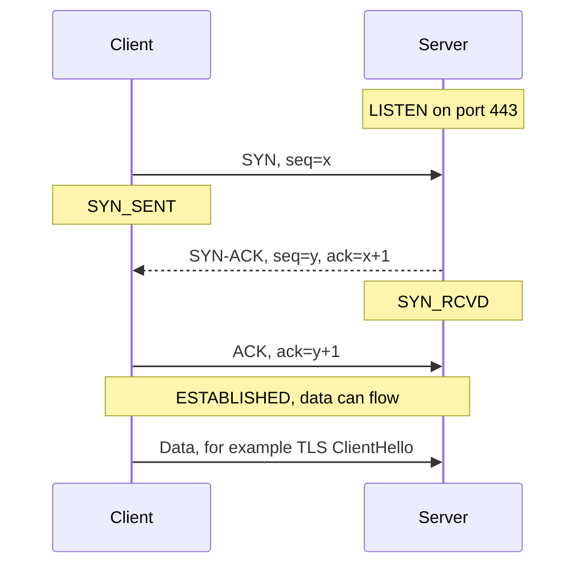
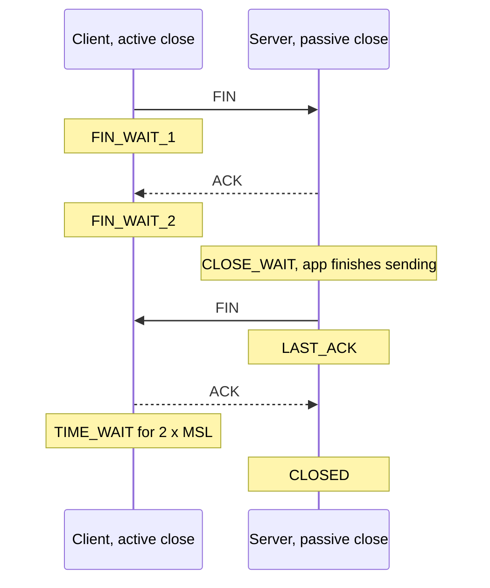

# TCP vs UDP

TCP and UDP are the two main transport protocols. TCP gives an ordered, reliable byte stream with a connection, flow control and congestion control. UDP just sends independent datagrams with almost no overhead and no guarantees. Interviewers ask about the 3-way handshake, how TCP stays reliable, flow vs congestion control, TIME_WAIT, head-of-line blocking, and when you would pick UDP (DNS, video calls, gaming, QUIC).

## ⭐ TCP 3-way handshake

**In one line:** before sending data, client and server exchange SYN, SYN-ACK, ACK to agree on starting sequence numbers and confirm both directions work.



- **Why 3 and not 2?** Both sides must pick an **initial sequence number (ISN)** and get it acknowledged. Two messages would confirm only one side's ISN, and an old delayed SYN could open a ghost connection.
- ISNs are random, which makes it hard to inject fake packets into a connection.
- Cost: **1 RTT** before the first byte of data. Mumbai to US-East is ~200 ms RTT, so the handshake alone is 200 ms. That is why CDNs terminate connections close to the user.
- The SYN also carries options: **MSS** (max segment size), **window scale**, **SACK permitted**, timestamps.
- **SYN flood:** attacker sends lots of SYNs and never ACKs, filling the server's half-open queue. Defence: **SYN cookies** (server encodes state in its ISN and keeps nothing until the ACK arrives).
- **TCP Fast Open** lets a returning client send data inside the SYN, saving an RTT (rarely relied on in practice).

**Interview tip:** draw the three arrows with seq and ack numbers. Saying "ack = x+1 because SYN consumes one sequence number" shows you actually understand it.

**Common mistake:** saying the handshake "exchanges encryption keys". That is TLS, which runs after TCP.

## ⭐ TCP 4-way close and TIME_WAIT

**In one line:** each direction is closed separately with FIN and ACK, so a close usually takes four segments; the side that closes first sits in TIME_WAIT for 2×MSL before freeing the connection.



- **Why four?** TCP is full duplex. When the client says "I am done sending" (FIN), the server may still have data to send. So ACK and FIN from the server are often separate. If the server has nothing left, it can combine them (FIN-ACK), making it three.
- **TIME_WAIT** (on the side that closed first) lasts 2×MSL (Linux: 60 s). Two reasons: resend the final ACK if it was lost, and let old delayed packets of this 4-tuple die so they do not confuse a new connection with the same ports.
- **Problem at scale:** a service that opens a new outbound connection per request (to a DB, Redis or another service) piles up tens of thousands of TIME_WAIT sockets and runs out of **ephemeral ports**. Fix: connection pooling and keep-alive, not hacks.
- **CLOSE_WAIT piling up** means your app received FIN but never called `close()`. That is a bug in your code (leaked connections).
- **RST** is the abrupt close: "this connection does not exist" or "abort now". No TIME_WAIT for the receiver.

**Interview tip:** "Many TIME_WAIT sockets on your API server, what do you do?" Reuse connections (pooling, keep-alive to upstreams), let the client close first where possible, and only then think of `net.ipv4.tcp_tw_reuse`.

**Common mistake:** confusing TIME_WAIT (normal, on the active closer) with CLOSE_WAIT (your app forgot to close).

## TCP header: the fields that matter

| Field | Why it matters |
|---|---|
| Source / destination port | Which process on each side (part of the 4-tuple) |
| Sequence number | Byte offset of this segment's first byte |
| Acknowledgment number | Next byte expected from the other side |
| Flags: SYN, ACK, FIN, RST, PSH | Open, acknowledge, close, abort, push to app |
| Window | Receive window (rwnd) for flow control |
| Checksum | Detects corruption |
| Options | MSS, window scale, SACK, timestamps |

- `tcpdump -i any port 443` or Wireshark show these fields live. Seeing `[S]`, `[S.]`, `[.]` is the handshake; `[F.]` is FIN, `[R]` is RST.

## ⭐ Reliability: sequence numbers, ACKs, retransmission

**In one line:** TCP numbers every byte, the receiver acknowledges what it has received, and the sender resends anything not acknowledged in time.

- **Sequence number** = byte offset in the stream. **ACK number** = "I have everything up to here, send byte N next" (cumulative).
- **Retransmission timeout (RTO):** computed from measured RTT (smoothed RTT + variance). No ACK before RTO → resend and double the timeout (exponential backoff).
- **Fast retransmit:** 3 duplicate ACKs for the same number means one segment is missing but later ones arrived. Resend it right away without waiting for RTO.
- **SACK** (selective ACK): receiver says exactly which ranges it has, so the sender resends only the holes.
- **Checksum** in every segment catches corruption. **Reordering:** receiver buffers out-of-order segments and hands bytes to the app only in order.
- Result: the app sees an ordered, gap-free byte stream. It does **not** see message boundaries. Two `send()` calls may arrive as one `recv()`, so protocols on top of TCP need length prefixes or delimiters (HTTP uses `Content-Length` or chunked encoding).

**Common mistake:** thinking TCP preserves message boundaries. It is a byte stream.

## ⭐ Flow control vs congestion control

**In one line:** flow control protects the **receiver** from being overwhelmed; congestion control protects the **network** from being overwhelmed.

| | Flow control | Congestion control |
|---|---|---|
| Protects | Receiver's buffer | Routers and links in between |
| Signal | Receiver advertises **rwnd** (receive window) in every ACK | Sender infers congestion from loss or delay |
| Who sets the limit | Receiver | Sender's own **cwnd** (congestion window) |
| Effective send limit | min(rwnd, cwnd) bytes in flight | min(rwnd, cwnd) bytes in flight |
| Zero case | rwnd = 0 means "stop", sender sends window probes | Loss means cut cwnd |

Congestion control phases (classic Reno / CUBIC):
1. **Slow start:** cwnd starts small (Linux: 10 segments, ~14 KB) and **doubles every RTT** until loss or `ssthresh`. Name is misleading; it grows exponentially.
2. **Congestion avoidance:** above `ssthresh`, grow by ~1 segment per RTT (additive increase).
3. **On loss:** triple dup ACK → halve cwnd (multiplicative decrease, AIMD). Timeout → back to slow start.
- **CUBIC** is the Linux default. **BBR** (Google) models bandwidth and RTT instead of waiting for loss; good on lossy mobile networks.
- **Bandwidth-delay product:** to fill a 100 Mbps link with 100 ms RTT you need ~1.25 MB in flight. That needs window scaling.

**Interview tip:** "Why is the first page load on a new connection slow even on fast internet?" Slow start: the first RTT can only carry ~14 KB. That is why keeping critical HTML/CSS small and reusing warm connections matters.

**Common mistake:** using "flow control" and "congestion control" as synonyms.

## ⭐ Head-of-line blocking

**In one line:** because TCP delivers bytes strictly in order, one lost packet blocks everything behind it, even data that already arrived.

- HTTP/1.1: one request at a time per connection, so a slow response blocks the next one (**application-level HOL**). Browsers opened 6 connections per host to work around it.
- HTTP/2 fixes app-level HOL with multiplexed streams on one connection, but **TCP-level HOL** gets worse: one lost packet stalls all streams.
- **QUIC / HTTP/3** runs on UDP and does per-stream ordering, so a loss in stream 3 does not block stream 5. See [HTTP](./03-http.md).

**Common mistake:** saying HTTP/2 completely solved head-of-line blocking. It moved it down to TCP.

## ⭐ UDP and when to use it

**In one line:** UDP sends standalone datagrams: no connection, no handshake, no ordering, no retransmission, no congestion control, just ports and a checksum on top of IP.

- Header is 8 bytes (TCP is 20–60). Message boundaries are preserved: one `send` = one datagram.
- Packets may be lost, duplicated or reordered. If the app needs any of that fixed, it does it itself.

| Use case | Why UDP |
|---|---|
| **DNS** | One small question, one small answer. A 3-way handshake would triple the time. Retry on timeout is enough. |
| **Video / voice calls** (WhatsApp calls, Zoom, WebRTC) | A late packet is useless. Better to skip a frame than to stall waiting for a retransmit. |
| **Live streaming at low latency** | Same reason; adaptive bitrate absorbs loss. |
| **Online gaming** (BGMI, Valorant) | Send the latest position 30–60 times per second; old positions do not matter. |
| **QUIC / HTTP/3** | Builds its own reliability, encryption and congestion control in user space on UDP, avoiding TCP HOL and kernel upgrade cycles. |
| **Metrics, logs** (StatsD, syslog) | Fire and forget; losing a few samples is fine. |
| **DHCP, NTP, SNMP** | Simple request/response on local networks. |

**Interview tip:** "Why does WhatsApp use UDP for calls but TCP (or similar) for messages?" Calls care about latency, losing 20 ms of audio is fine. Messages must arrive exactly once and in order.

**Common mistake:** "UDP is unreliable so never use it for anything important". QUIC carries a big share of Google and YouTube traffic over UDP. You just build reliability where you need it.

## ⭐ TCP vs UDP table

| | TCP | UDP |
|---|---|---|
| Connection | Yes, 3-way handshake | No |
| Reliability | ACKs, retransmission | None |
| Ordering | Guaranteed byte order | No |
| Message boundaries | No (byte stream) | Yes (datagrams) |
| Flow / congestion control | Yes | No (app must be polite) |
| Header size | 20–60 bytes | 8 bytes |
| Latency to first byte | 1 RTT handshake | 0 |
| Broadcast / multicast | No | Yes |
| Examples | HTTP/1.1, HTTP/2, SSH, SMTP, DB connections, Kafka | DNS, VoIP, video calls, games, QUIC, DHCP |

## ⭐ Keep-alive and connection pooling

**In one line:** setting up a TCP + TLS connection costs 2 RTTs and CPU, so reuse connections instead of opening one per request.

- **HTTP keep-alive:** HTTP/1.1 connections stay open by default (`Connection: keep-alive`) for the next request. HTTP/2 goes further and sends many requests at once on one connection.
- **TCP keepalive** (different thing): the OS sends small probes on an idle connection to detect a dead peer. Default is 2 hours on Linux; usually tuned down. Load balancers and NAT boxes drop idle connections (AWS ALB 60 s idle timeout), so clients should keep pools alive or handle resets.
- **Connection pooling:** app keeps N open connections to a DB, Redis or an upstream service and lends them per request. Benefits: no handshake per request, no TIME_WAIT buildup, bounded load on the DB.
- Postgres creates a process per connection, so 2,000 app pods × 20 connections would kill it. Use **PgBouncer** or RDS Proxy in front.
- Pool size: start around (cores × 2) for DBs; too big just moves the queue into the DB.

```python
# requests: one Session = one connection pool, reused across calls
import requests
s = requests.Session()  # keep-alive and pooling
for order_id in order_ids:
    s.get(f"https://api.internal/orders/{order_id}", timeout=2)
```

**Interview tip:** "Latency to a downstream service jumped and you see thousands of TIME_WAIT sockets." Answer: a client is not reusing connections; add pooling / keep-alive and set sensible idle timeouts below the LB's.

**Common mistake:** creating a new HTTP client or DB connection inside every request handler.

## Where it shows up in system design

- [Real-time communication](../01-topics/08-real-time-communication.md): long-lived TCP connections for WebSockets
- [WhatsApp chat](../02-questions/t1-04-whatsapp-chat.md): persistent connections, UDP for calls
- [YouTube](../02-questions/t1-07-youtube.md): streaming, QUIC
- [Scaling basics](../01-topics/01-scaling-basics.md): L4 load balancers, connection limits
- [Numbers cheatsheet](../01-topics/21-numbers-cheatsheet.md): RTTs across regions

## Checklist

- [ ] I can draw the 3-way handshake with seq and ack numbers and explain why it needs three messages
- [ ] I can draw the 4-way close and explain TIME_WAIT vs CLOSE_WAIT
- [ ] I can explain how TCP stays reliable: seq numbers, cumulative ACKs, RTO, fast retransmit, SACK
- [ ] I can contrast flow control (rwnd) with congestion control (cwnd, slow start, AIMD)
- [ ] I can explain head-of-line blocking at HTTP/1.1, HTTP/2 and how QUIC removes it
- [ ] I can pick TCP or UDP for a given use case and justify it
- [ ] I can explain keep-alive and connection pooling and the problems they solve
