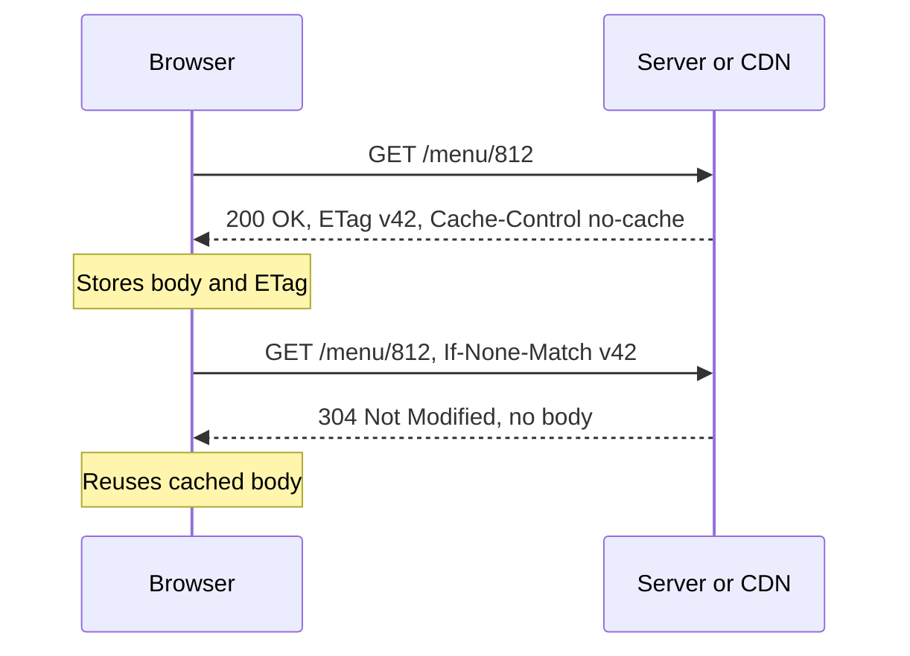

# HTTP, HTTPS & HTTP/2/3

HTTP is the request/response protocol of the web: a client sends a method, a path, headers and maybe a body; the server replies with a status code, headers and a body. HTTPS is the same thing inside TLS. Interviewers check methods and idempotency, status codes, caching and auth headers, cookies vs sessions vs JWT, CORS, and the classic "HTTP/1.1 vs HTTP/2 vs HTTP/3" comparison.

## ⭐ Request and response anatomy

**In one line:** a request is method + path + version + headers + optional body; a response is version + status code + headers + optional body.

```http
POST /v1/orders HTTP/1.1
Host: api.swiggy.com
Authorization: Bearer eyJhbGciOi...
Content-Type: application/json
Idempotency-Key: 7f3c-91ab
Content-Length: 58

{"restaurantId": 812, "items": [{"id": 31, "qty": 2}]}
```

```http
HTTP/1.1 201 Created
Location: /v1/orders/99812
Content-Type: application/json
Cache-Control: no-store

{"orderId": 99812, "status": "PLACED"}
```

- HTTP is **stateless**: each request carries everything needed (cookie, token). State lives in cookies, tokens or a server-side store.
- HTTP/1.1 is text; HTTP/2 and HTTP/3 send the same semantics as binary frames.

## ⭐ Methods and idempotency

**In one line:** **safe** methods do not change server state; **idempotent** methods give the same end state whether you call them once or ten times.

| Method | Use | Safe | Idempotent | Body |
|---|---|---|---|---|
| GET | Read a resource | Yes | Yes | No |
| HEAD | Like GET, headers only | Yes | Yes | No |
| OPTIONS | Which methods are allowed, CORS preflight | Yes | Yes | No |
| POST | Create, or trigger an action | No | **No** | Yes |
| PUT | Replace the whole resource at this URL | No | Yes | Yes |
| PATCH | Partial update | No | Not guaranteed | Yes |
| DELETE | Remove | No | Yes | Usually no |

- Idempotency matters because of **retries**: networks time out, clients and proxies retry. Retrying GET/PUT/DELETE is safe; retrying POST can create two orders or charge twice.
- Make POST safe to retry with an **Idempotency-Key** header: the server stores key → result and returns the same result for a repeat. See [Idempotency & retries](../01-topics/10-idempotency-retries.md).
- `PATCH {"op": "increment", "field": "qty"}` is not idempotent; `PATCH {"qty": 3}` is.
- Idempotent means same **state**, not same **response**: the second DELETE may return 404.

**Interview tip:** "PUT vs POST?" PUT targets a known URL and replaces it (idempotent), POST asks the server to create something under a collection (not idempotent).

**Common mistake:** using GET for actions with side effects (`GET /deleteUser?id=5`). Crawlers, prefetchers and caches will call it.

## ⭐ Status codes

**In one line:** first digit tells the class: 2xx success, 3xx redirect, 4xx client did something wrong, 5xx server failed.

| Code | Meaning | When you see it |
|---|---|---|
| 200 OK | Success with body | Normal GET |
| 201 Created | Resource created | POST that created an order, with `Location` header |
| 202 Accepted | Accepted, processing later | Async jobs: video upload, report generation |
| 204 No Content | Success, no body | DELETE, or PUT with nothing to return |
| 301 Moved Permanently | Permanent redirect, cacheable | http to https, old domain |
| 302 Found | Temporary redirect | Login redirect, URL shortener for analytics |
| 304 Not Modified | Your cached copy is still valid | Conditional GET with `If-None-Match` |
| 307 / 308 | Temporary / permanent redirect, keep method and body | Redirecting a POST safely |
| 400 Bad Request | Malformed input | Validation failure |
| 401 Unauthorized | Not authenticated (no or bad credentials) | Missing or expired token |
| 403 Forbidden | Authenticated but not allowed | User tries to view another user's order |
| 404 Not Found | No such resource | Wrong ID |
| 405 Method Not Allowed | Method not supported on this path | DELETE on a read-only resource |
| 409 Conflict | State conflict | Seat already booked, version mismatch |
| 412 Precondition Failed | `If-Match` ETag did not match | Optimistic locking on update |
| 422 Unprocessable Entity | Well-formed but semantically invalid | Business rule failed |
| 429 Too Many Requests | Rate limited, with `Retry-After` | See [Rate limiting](../01-topics/11-rate-limiting.md) |
| 500 Internal Server Error | Bug or unhandled exception | |
| 502 Bad Gateway | Proxy/LB got a bad response from upstream | App crashed or closed connection |
| 503 Service Unavailable | Overloaded or in maintenance | Load shedding, with `Retry-After` |
| 504 Gateway Timeout | Proxy/LB timed out waiting for upstream | Slow DB query behind the app |

**Interview tip:** "401 vs 403?" 401 = who are you? (authenticate). 403 = I know who you are, and the answer is no. "502 vs 504?" Upstream gave garbage or dropped the connection vs upstream was too slow.

**Common mistake:** returning `200` with `{"error": ...}` in the body. Clients, retries, monitoring and caches all rely on the status code.

## ⭐ Important headers

| Header | Direction | What it does | Example |
|---|---|---|---|
| `Host` | Request | Which site (many sites share one IP) | `Host: www.zomato.com` |
| `Content-Type` | Both | Body format | `application/json` |
| `Accept-Encoding` / `Content-Encoding` | Both | Compression | `gzip, br` |
| `Cache-Control` | Response (and request) | Who can cache and for how long | `public, max-age=86400` |
| `ETag` | Response | Version fingerprint of the resource | `ETag: "v42-a1b2"` |
| `If-None-Match` | Request | "Send only if changed from this ETag" | returns 304 if same |
| `If-Match` | Request | "Update only if still this version" | 412 if changed |
| `Last-Modified` / `If-Modified-Since` | Both | Time-based validation | older alternative to ETag |
| `Cookie` / `Set-Cookie` | Request / response | Browser state | `Set-Cookie: sid=abc; HttpOnly; Secure; SameSite=Lax` |
| `Authorization` | Request | Credentials | `Bearer <JWT>`, `Basic base64(user:pass)` |
| `Location` | Response | Redirect target or created resource | `/v1/orders/99812` |
| `Retry-After` | Response | When to retry (429, 503) | `Retry-After: 30` |
| `X-Forwarded-For` | Request (added by proxies) | Original client IP | `X-Forwarded-For: 49.36.1.2` |
| `Strict-Transport-Security` | Response | HSTS, always use HTTPS | `max-age=31536000` |

**Cache-Control values:**
- `max-age=N`: fresh for N seconds. `s-maxage`: same but only for shared caches (CDN).
- `public` (CDN may cache) vs `private` (only the user's browser, e.g. a profile page).
- `no-cache`: you may store it but must revalidate (ETag) before use. `no-store`: never store (payments, OTP pages).
- `immutable`: never revalidate. Use for hashed assets like `app.3f9a1c.js` with `max-age=31536000`.



**CORS (Cross-Origin Resource Sharing):**
- Browsers block JavaScript on `app.paytm.com` from reading responses from `api.paytm.com` unless the API allows it (same-origin policy: scheme + host + port must match).
- Server opts in with `Access-Control-Allow-Origin: https://app.paytm.com` (and `-Allow-Methods`, `-Allow-Headers`, `-Allow-Credentials`).
- "Non-simple" requests (PUT/DELETE, JSON body, custom headers) trigger a **preflight** `OPTIONS` first. Cache it with `Access-Control-Max-Age`.
- CORS is enforced by the **browser** only. curl and servers ignore it. It is not an API security mechanism.

**Common mistake:** `Access-Control-Allow-Origin: *` together with cookies. Browsers reject that combination; with credentials you must echo a specific allowed origin.

## ⭐ Cookies vs sessions vs JWT

**In one line:** a cookie is the browser's storage-and-send mechanism; a session is server-side state looked up by an ID (usually in a cookie); a JWT is a signed token that carries the user's claims itself.

| | Server-side session | JWT (stateless token) |
|---|---|---|
| What the client holds | Random session ID (`sid=abc`) | Signed token: header.payload.signature |
| Where state lives | Server store (Redis, DB) | Inside the token |
| Lookup per request | Yes, one Redis GET | No, just verify the signature |
| Logout / revoke | Delete the session, instant | Hard: wait for expiry, or keep a denylist |
| Size | ~32 bytes | Hundreds of bytes to KBs on every request |
| Scaling | Needs shared store (not sticky sessions) | Any server with the public key can verify |
| Good for | Web apps, banking, instant revoke | Service-to-service, mobile APIs, short-lived access tokens |

- **Cookie flags:** `HttpOnly` (JS cannot read, blocks token theft via XSS), `Secure` (HTTPS only), `SameSite=Lax/Strict` (CSRF protection), `Domain`, `Path`, `Max-Age`.
- **Common pattern:** short-lived JWT access token (15 min) + long-lived refresh token (stored server-side, revocable). Best of both.
- JWT is **signed, not encrypted** (by default). Anyone can base64-decode the payload. Never put secrets in it.
- Store tokens in `HttpOnly` cookies rather than `localStorage` on the web (XSS can read localStorage).

**Interview tip:** "How would you log out a user everywhere with JWTs?" Keep access tokens short, revoke the refresh token in the DB, and for urgent cases keep a small denylist of token IDs (`jti`) in Redis until expiry.

**Common mistake:** calling JWT "more secure" than sessions. It is more scalable for verification, and harder to revoke.

## ⭐ HTTP/1.1 vs HTTP/2 vs HTTP/3

| | HTTP/1.1 (1997) | HTTP/2 (2015) | HTTP/3 (2022) |
|---|---|---|---|
| Transport | TCP | TCP | **QUIC over UDP** |
| Format | Text | Binary frames | Binary frames |
| Requests per connection | One at a time (keep-alive reuses the connection) | Many concurrent **streams** (multiplexing) | Many independent streams |
| Head-of-line blocking | Yes, at HTTP level | Fixed at HTTP level, **still at TCP level** | Gone: loss only blocks its own stream |
| Header compression | None (repeated cookies every time) | **HPACK** | **QPACK** |
| Server push | No | Yes, but **deprecated** (Chrome removed it); use `103 Early Hints` / preload | Not used |
| Handshake cost (new) | TCP 1 RTT + TLS 1–2 RTT | Same as 1.1 | **1 RTT** (transport + TLS 1.3 combined), 0-RTT on resume |
| Connection migration | No | No | Yes: connection ID survives Wi-Fi to 4G switch |
| Browser workarounds | 6 connections per host, domain sharding, sprites, bundling | Not needed (and harmful) | Not needed |
| Encryption | Optional | Optional in spec, required by browsers | Always (TLS 1.3 built in) |

- **Multiplexing:** HTTP/2 splits each request/response into frames tagged with a stream ID and interleaves them on one TCP connection.
- **HTTP/3 wins** on mobile and lossy networks (Jio 4G in a moving train): no TCP HOL, faster setup, survives network change.
- Inside data centres, HTTP/2 (gRPC) is still the norm; HTTP/3 matters most at the edge.

**Interview tip:** walk the evolution as "each version fixes the previous one's bottleneck": 1.1 fixed connection-per-request with keep-alive, 2 fixed one-request-at-a-time with multiplexing, 3 fixed TCP head-of-line blocking by moving to QUIC.

**Common mistake:** saying HTTP/2 server push is the way to speed up pages. It was deprecated because it often pushed what was already cached.

## HTTPS

- HTTPS = HTTP over TLS on port 443. Gives encryption, integrity and server authentication. Details in [TLS](./05-tls.md).
- Usually terminated at the CDN or load balancer; traffic inside the VPC may be plain HTTP or re-encrypted (mTLS).

## REST vs gRPC, WebSockets and SSE (pointers)

- **REST** (JSON over HTTP/1.1 or 2, resource URLs, status codes) for public APIs; **gRPC** (Protobuf over HTTP/2, streaming, generated clients) for internal service-to-service calls. See [API design](../01-topics/19-api-design.md).
- **WebSockets** (HTTP `Upgrade` to a full-duplex TCP channel) for chat and live games; **SSE** (`text/event-stream`, server to client only) for live scores and LLM token streaming; **long polling** as fallback. See [Real-time communication](../01-topics/08-real-time-communication.md).

## ⭐ curl examples

```bash
# Show request and response headers (verbose)
curl -v https://www.flipkart.com/ -o /dev/null

# Only response headers
curl -I https://www.zomato.com/

# Follow redirects (http to https, 301 chain)
curl -L http://paytm.com

# POST JSON with auth and idempotency key
curl -X POST https://api.example.com/v1/orders \
  -H "Authorization: Bearer $TOKEN" \
  -H "Content-Type: application/json" \
  -H "Idempotency-Key: 7f3c-91ab" \
  -d '{"restaurantId": 812, "items": [{"id": 31, "qty": 2}]}'

# Conditional GET with ETag, expect 304
curl -i -H 'If-None-Match: "v42-a1b2"' https://api.example.com/menu/812

# Force HTTP/2 or HTTP/3
curl --http2 -I https://www.google.com
curl --http3 -I https://www.google.com

# Timing breakdown: DNS, TCP connect, TLS, first byte, total
curl -o /dev/null -s -w "dns=%{time_namelookup} tcp=%{time_connect} tls=%{time_appconnect} ttfb=%{time_starttransfer} total=%{time_total}\n" https://www.swiggy.com/
```

**Interview tip:** the `-w` timing line is the fastest way to answer "the site is slow, where is the time going?" It splits DNS, TCP, TLS and server time.

## Where it shows up in system design

- [API design](../01-topics/19-api-design.md): REST, gRPC, pagination, versioning
- [Idempotency & retries](../01-topics/10-idempotency-retries.md): idempotent methods, Idempotency-Key
- [Caching](../01-topics/05-caching.md) and [Blob storage & CDN](../01-topics/12-blob-storage-cdn.md): Cache-Control, ETag
- [Rate limiting](../01-topics/11-rate-limiting.md): 429 and Retry-After
- [URL shortener](../02-questions/t1-01-url-shortener.md): 301 vs 302 redirect choice
- [Real-time communication](../01-topics/08-real-time-communication.md): WebSockets, SSE, long polling

## Checklist

- [ ] I can list HTTP methods and say which are safe and which are idempotent, and why it matters for retries
- [ ] I can explain the common status codes, including 401 vs 403, 301 vs 302, and 502 vs 503 vs 504
- [ ] I can explain Cache-Control, ETag and a 304 conditional request
- [ ] I can explain CORS and the preflight request, and why it is a browser-only control
- [ ] I can compare server-side sessions with JWT and set the right cookie flags
- [ ] I can compare HTTP/1.1, HTTP/2 and HTTP/3 on transport, multiplexing, HOL blocking and header compression
- [ ] I can use curl to inspect headers, follow redirects and break down request timing
