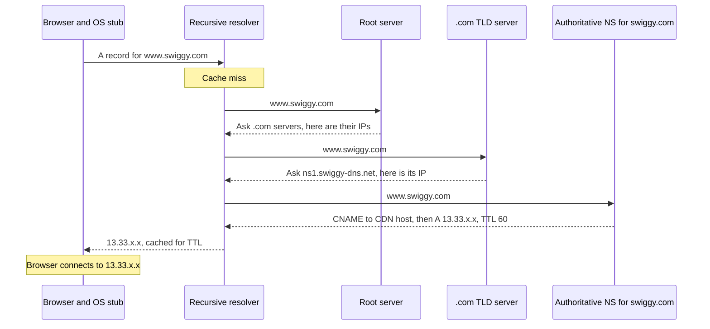

# DNS

DNS (Domain Name System) is the internet's distributed, cached phone book: it turns names like `www.swiggy.com` into IP addresses. It is hierarchical (root → TLD → authoritative), heavily cached (TTL at every layer) and is also a traffic-steering tool (GeoDNS, weighted records, failover). Interviewers ask for the resolution flow, record types, how TTL and caching work, how DNS is used for load balancing and why "DNS changes take time to propagate".

## ⭐ The DNS hierarchy and who does what

**In one line:** your device asks a recursive resolver, which walks the tree from the root servers to the TLD servers to the domain's authoritative server, then caches the answer.

| Player | Role | Examples |
|---|---|---|
| **Stub resolver** | Small client in your OS; asks one recursive resolver and caches | `getaddrinfo()`, systemd-resolved |
| **Recursive resolver** | Does the full lookup on your behalf, caches heavily | ISP resolver (Jio, Airtel), Google `8.8.8.8`, Cloudflare `1.1.1.1` |
| **Root servers** | Know where each TLD's servers are | 13 named roots (a to m), hundreds of anycast instances |
| **TLD servers** | Know the authoritative servers for each domain under `.com`, `.in`, `.org` | Verisign for `.com`, NIXI for `.in` |
| **Authoritative server** | Holds the actual records for the domain | Route 53, Cloudflare DNS, NS1 |

- The names form a tree read right to left: `www.swiggy.com.` → root (`.`) → `com` → `swiggy` → `www`.
- **Zone:** the part of the tree one authority manages. `swiggy.com` zone may delegate `api.swiggy.com` to another provider.

## ⭐ Resolution flow

**In one line:** stub → recursive → root → TLD → authoritative, each step pointing to the next, then the answer flows back and is cached at every layer.



- **Recursive vs iterative:** the stub makes a **recursive** query ("give me the final answer"). The resolver makes **iterative** queries to root/TLD/authoritative ("tell me who to ask next").
- **Referrals:** root and TLD do not know the answer; they return NS records (plus "glue" A records) for the next level.
- In practice the resolver almost always has `.com` and often `swiggy.com` NS records cached, so a real lookup is usually 0–1 network hops from the resolver.
- Transport: UDP port 53 by default; TCP for responses that do not fit (large records, DNSSEC) and zone transfers. Modern privacy options: **DoH** (DNS over HTTPS) and **DoT** (DNS over TLS).

**Interview tip:** in "what happens when you type a URL", say "browser cache, OS cache, resolver cache, and only on a miss root → TLD → authoritative". Most lookups never leave the resolver.

**Common mistake:** saying the browser talks to root servers. Only recursive resolvers do.

## ⭐ Record types

| Type | Maps | Example | Notes |
|---|---|---|---|
| **A** | Name → IPv4 | `www.swiggy.com A 13.33.10.20` | Multiple A records = simple round robin |
| **AAAA** | Name → IPv6 | `www.swiggy.com AAAA 2600:9000::1` | |
| **CNAME** | Name → another name (alias) | `www.swiggy.com CNAME d1x.cloudfront.net` | Not allowed at the zone apex (`swiggy.com` itself); cannot coexist with other records on the same name |
| **ALIAS / ANAME** | Apex → name, resolved by provider | `swiggy.com ALIAS my-lb.elb.amazonaws.com` | Provider-specific (Route 53 Alias, Cloudflare CNAME flattening) |
| **MX** | Domain → mail servers, with priority | `paytm.com MX 10 mx1.google.com` | Lower number = preferred |
| **TXT** | Name → free text | SPF, DKIM, DMARC, domain verification | `v=spf1 include:_spf.google.com ~all` |
| **NS** | Zone → its authoritative name servers | `swiggy.com NS ns-1.awsdns-01.org` | Delegation |
| **SOA** | Zone metadata | Primary NS, serial, negative-cache TTL | One per zone |
| **SRV** | Service → host + port + priority + weight | `_sip._tcp.example.com SRV 10 60 5060 sip1.example.com` | Used by SIP, XMPP, Kubernetes, Consul |
| **PTR** | IP → name (reverse DNS) | `20.10.33.13.in-addr.arpa PTR host.example.com` | Mail servers check it |
| **CAA** | Which CAs may issue certs | `swiggy.com CAA 0 issue "amazon.com"` | See [TLS](./05-tls.md) |

**Interview tip:** "Why can't I CNAME my root domain to a load balancer?" The apex must have SOA and NS records, and a CNAME cannot coexist with other records. Use your DNS provider's ALIAS/flattening feature.

**Common mistake:** pointing a CNAME chain three levels deep. Every hop is another lookup on a cold cache.

## ⭐ TTL and caching layers

**In one line:** every record has a TTL (seconds) telling resolvers how long they may cache it; there are caches at almost every layer.


| Layer | Typical behaviour |
|---|---|
| Application / runtime | JVM caches successful lookups (can be forever if a security manager is set; set `networkaddress.cache.ttl`), Node does not cache by default |
| Browser | Chrome caches ~1 min regardless of larger TTLs |
| OS | systemd-resolved, macOS mDNSResponder; `/etc/hosts` overrides everything |
| Recursive resolver | Respects TTL (some clamp min/max) |
| Authoritative | Source of truth; you set TTL here |

- **TTL trade-off:** long TTL (1 day) = fewer queries, faster, resilient if DNS provider has issues, but slow changes. Short TTL (30–60 s) = fast failover and migrations, more queries and more dependency on DNS being up.
- **Before a migration:** lower the TTL (say from 86400 to 60) at least one old-TTL period in advance, do the switch, then raise it again.
- Clients that hold long-lived connections (DB pools, gRPC channels) do not re-resolve until they reconnect, whatever the TTL is.

**Common mistake:** setting TTL to 60 s on the day of migration and expecting everyone to switch in a minute. Resolvers still hold the old record for the old TTL.

## ⭐ DNS for load balancing, GeoDNS and failover

**In one line:** the authoritative server can return different answers per query (rotating IPs, by user location, by weight, only healthy targets), which makes DNS the first layer of traffic routing.

| Technique | How it works | Use |
|---|---|---|
| **Round robin** | Several A records; order rotated | Crude spreading; no health awareness |
| **Weighted** | 90% of answers point to v1, 10% to v2 | Canary, gradual region migration |
| **GeoDNS / latency-based** | Answer depends on the resolver's location (or EDNS Client Subnet) | Send Chennai users to Mumbai region, US users to Virginia |
| **Failover** | Health checks; if primary is down, return secondary | Active-passive multi-region DR |
| **Anycast** (not DNS records, but related) | Same IP announced from many locations via BGP; network routes to the nearest | Used by DNS providers and CDNs themselves (`1.1.1.1`) |

- DNS load balancing is **coarse**: caching means clients keep using old answers for TTL seconds, and you cannot see server load. Pair it with real load balancers inside each region. See [Scaling basics](../01-topics/01-scaling-basics.md).
- CDNs use DNS heavily: your `CNAME` to `d1x.cloudfront.net` gets resolved to an edge near the resolver. See [Blob storage & CDN](../01-topics/12-blob-storage-cdn.md).
- **Service discovery** inside clusters is also DNS: Kubernetes gives every Service a name like `orders.default.svc.cluster.local`, and SRV records include ports.

**Interview tip:** "How do you route users to the nearest region in a multi-region design?" GeoDNS or latency-based DNS (Route 53) to pick the region, then an L7 load balancer inside the region, with health-checked failover records for disaster recovery.

**Common mistake:** relying on DNS round robin as your only load balancer. One dead IP still gets its share of traffic until the TTL expires and clients retry.

## ⭐ dig examples

```bash
# Basic A lookup
dig www.swiggy.com

# Just the answer
dig +short www.swiggy.com

# Specific record types
dig paytm.com MX +short
dig zomato.com TXT +short
dig flipkart.com NS +short
dig www.google.com AAAA +short

# Ask a specific resolver
dig @1.1.1.1 www.swiggy.com
dig @8.8.8.8 www.swiggy.com

# Walk the full chain yourself: root, TLD, authoritative
dig +trace www.swiggy.com

# Ask the authoritative server directly (bypass caches, see the real TTL)
dig @ns-1.awsdns-01.org www.swiggy.com

# Reverse lookup
dig -x 8.8.8.8 +short
```

What to read in the output:
- `ANSWER SECTION`: records and **remaining TTL** (counts down if it came from a cache).
- `status: NOERROR` (found), `NXDOMAIN` (name does not exist), `SERVFAIL` (resolver could not get an answer, often DNSSEC or authoritative down).
- `Query time` and `SERVER` tell you which resolver answered and how fast.

## ⭐ Common issues

| Issue | What is happening | Fix |
|---|---|---|
| **"Propagation" delay** | No push exists; old answers live in caches until their TTL expires | Lower TTL well before changes; verify with `dig @authoritative` |
| **Negative caching** | `NXDOMAIN` is cached too, for the SOA minimum / negative TTL | Create the record before anyone queries it; keep SOA negative TTL small (60–300 s) |
| **Stale client caches** | JVM or app caches ignore TTL; long-lived pools never re-resolve | Set JVM `networkaddress.cache.ttl`, recycle connections periodically |
| **DNS provider outage** | Authoritative down means new lookups fail everywhere once caches expire | Two DNS providers (secondary NS), reasonable TTLs |
| **Slow lookups** | Cold cache + long CNAME chains | Fewer hops, `dns-prefetch` / `preconnect` hints in HTML |
| **DNS as a single point of failure inside clusters** | CoreDNS overloaded, ndots search domains multiplying queries | Use FQDNs with trailing dot, node-local DNS cache |
| **Hijacking / spoofing** | Fake answers injected into a cache | DNSSEC (signed records), DoH/DoT to the resolver |

**Interview tip:** "We changed the IP but some users still hit the old server." Explain TTL caching at resolver, OS, browser and app layers, keep the old server alive until the old TTL has fully expired, and check client runtimes that cache forever.

**Common mistake:** saying "DNS propagation takes 24–48 hours" as if it is a fixed rule. It is exactly as long as the TTL that was cached, plus misbehaving caches.

## Quick answers

| Question | Short answer |
|---|---|
| Why is DNS mostly UDP? | One small request and response; a TCP handshake would add an RTT. TCP is used for big answers and zone transfers. |
| Why does DNS scale to the whole internet? | Hierarchy (delegation) spreads ownership, and caching with TTL absorbs almost all queries before they reach authoritative servers. |
| What happens if the authoritative server is down? | Cached answers keep working until TTL expires, then lookups fail. That is why you run two providers. |
| How do CDNs pick the nearest edge? | Your CNAME points to the CDN, whose DNS answers with an edge near the resolver (GeoDNS) or uses an anycast IP. |

## Where it shows up in system design

- [Scaling basics](../01-topics/01-scaling-basics.md): DNS in front of load balancers
- [Blob storage & CDN](../01-topics/12-blob-storage-cdn.md): CNAME to CDN, edge selection
- [Reliability & observability](../01-topics/20-reliability-observability.md): multi-region failover
- [Microservices patterns](../01-topics/23-microservices-patterns.md): service discovery
- [Web crawler](../02-questions/t1-12-web-crawler.md): DNS resolution becomes a bottleneck, so cache it

## Checklist

- [ ] I can explain the roles of stub, recursive resolver, root, TLD and authoritative servers
- [ ] I can draw the resolution flow and say where caching short-circuits it
- [ ] I can explain A, AAAA, CNAME, MX, TXT, NS and SRV records, and why CNAME is not allowed at the apex
- [ ] I can explain TTL trade-offs and how to lower TTL safely before a migration
- [ ] I can explain DNS-based load balancing, GeoDNS, weighted and failover records, and their limits
- [ ] I can use dig to query specific types, specific resolvers and trace the chain
- [ ] I can explain propagation delay and negative caching
