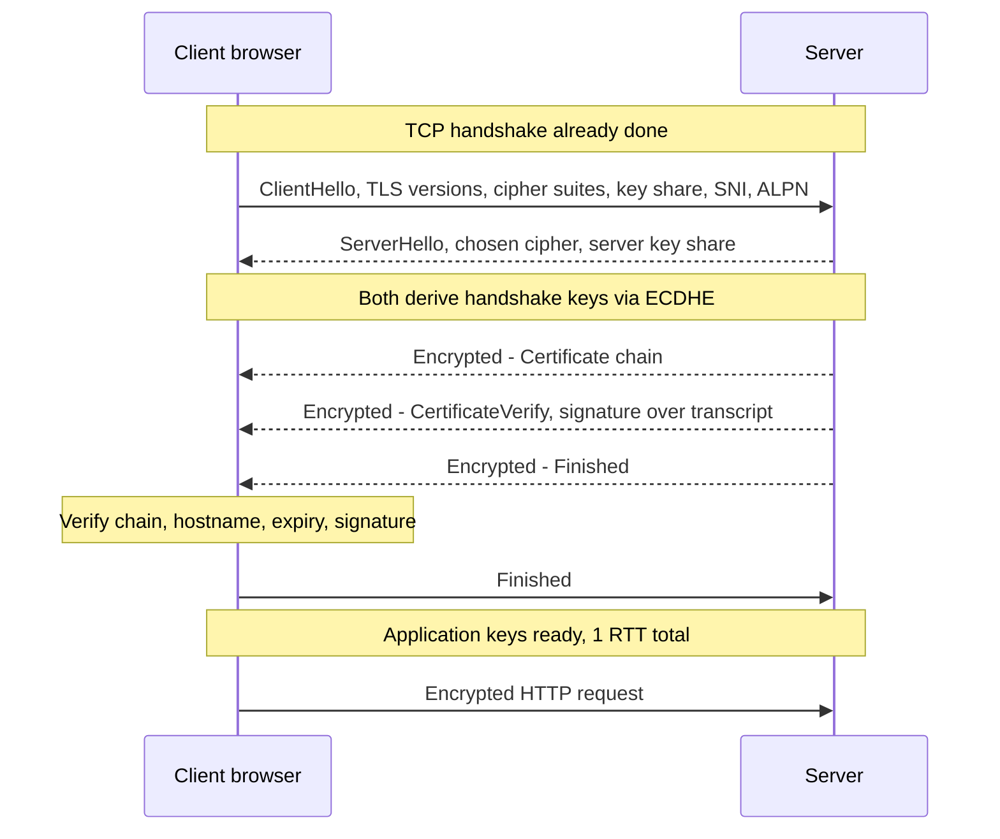
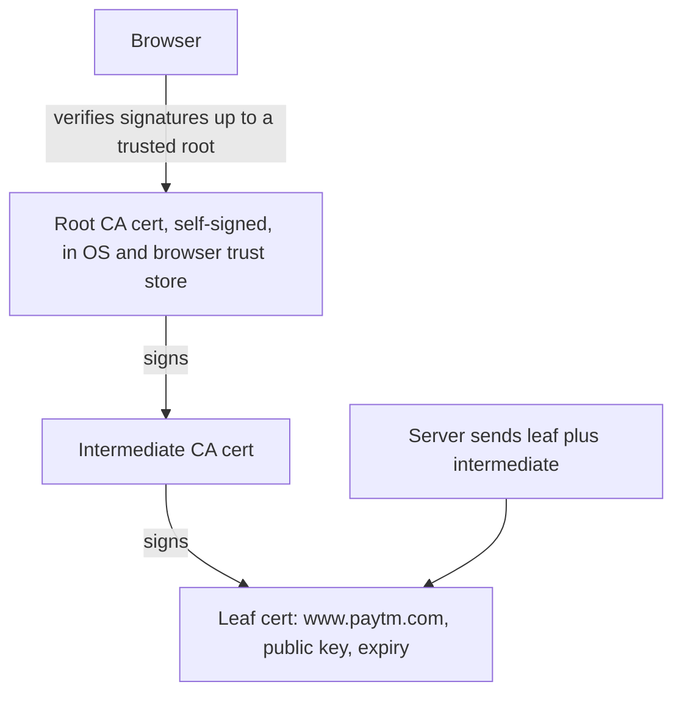
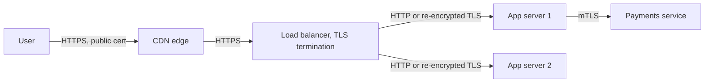

# TLS & Certificates

TLS (Transport Layer Security, the successor of SSL) is what puts the "S" in HTTPS. It sits on top of TCP (or inside QUIC) and gives three guarantees: nobody can read the traffic, nobody can change it undetected, and you are really talking to the server you think you are. Interviewers ask why TLS exists, how the TLS 1.3 handshake works, how certificates and the chain of trust work, symmetric vs asymmetric crypto, where TLS is terminated in a real system, and mTLS between services.

## ⭐ Why TLS: the three guarantees

**In one line:** TLS gives **confidentiality** (encryption), **integrity** (tamper detection) and **authentication** (proof of server identity, optionally client identity).

> **Example:** on public Wi-Fi at an airport, you open the Paytm app. Without TLS anyone on that Wi-Fi can read your token, change the payee in the request, or run a fake "paytm" server. TLS stops all three.

| Guarantee | Protects against | Mechanism |
|---|---|---|
| Confidentiality | Eavesdropping (Wi-Fi sniffing, ISP snooping) | Symmetric encryption (AES-GCM, ChaCha20-Poly1305) |
| Integrity | Modification in transit | AEAD authentication tag on every record |
| Authentication | Impersonation, man-in-the-middle | Certificates signed by a trusted CA + signature over the handshake |

- TLS also gives **forward secrecy** (with ephemeral key exchange): if the server's private key leaks next year, recorded traffic from today still cannot be decrypted.
- Versions: SSL 2/3 and TLS 1.0/1.1 are broken or deprecated. Use **TLS 1.2** (minimum) and **TLS 1.3** (preferred).

**Common mistake:** saying HTTPS "hides which site you visit". The IP and usually the hostname (SNI) are visible; the path, headers and body are encrypted.

## ⭐ Symmetric vs asymmetric crypto: who does what

**In one line:** asymmetric crypto (slow, public/private key pairs) is used only during the handshake to authenticate and agree on a secret; symmetric crypto (fast, one shared key) encrypts all the actual data.

| | Asymmetric (public key) | Symmetric |
|---|---|---|
| Keys | Pair: public (share freely) + private (secret) | One shared secret key |
| Speed | Slow (100–1000x slower) | Very fast, hardware-accelerated (AES-NI) |
| Algorithms | RSA, ECDSA, Ed25519 (signatures); ECDHE, X25519 (key exchange) | AES-128/256-GCM, ChaCha20-Poly1305 |
| Role in TLS | Prove identity (cert + signature), agree on a shared secret (ECDHE) | Encrypt and authenticate every byte of application data |

- **Key exchange (ECDHE):** both sides send a public value; each combines it with its own private value and both get the same secret, without the secret ever crossing the wire. A fresh pair every connection = forward secrecy.
- **Signatures:** the server signs the handshake transcript with its certificate's private key, proving it owns the certificate.
- **Hashing** (SHA-256) is used in signatures, key derivation (HKDF) and integrity.

**Interview tip:** "Why not use RSA to encrypt all data?" Too slow and has message size limits. Use asymmetric once to set up a symmetric key, then symmetric for bulk data. This is called hybrid encryption.

**Common mistake:** saying "the server encrypts data with its private key". Private keys sign; data is encrypted with the derived symmetric session keys.

## ⭐ TLS 1.3 handshake

**In one line:** the client sends its supported ciphers and a key share in the first message, the server replies with its key share, certificate and a signature, and after one round trip both sides have the same session keys.



Step by step:
1. **ClientHello:** supported TLS versions and cipher suites, a random value, a **key share** (guessing X25519), **SNI** (`server_name: www.paytm.com`, so a server hosting many sites picks the right cert), **ALPN** (`h2`, `http/1.1`).
2. **ServerHello:** picks the cipher and sends its own key share. Both sides now compute the shared secret (ECDHE) and derive handshake keys. Everything after this is encrypted.
3. **Certificate + CertificateVerify:** the server sends its cert chain and signs the handshake so far with its private key.
4. **Finished** (both sides): a MAC over the entire transcript, so any tampering with earlier messages is detected.
5. **Data:** encrypted with application keys derived from the secret.

TLS 1.3 vs 1.2:

| | TLS 1.2 | TLS 1.3 |
|---|---|---|
| Handshake | 2 RTT | **1 RTT** |
| Resumption | Session IDs / tickets, 1 RTT | PSK tickets, **0-RTT** early data possible |
| Key exchange | RSA key transport allowed (no forward secrecy) | Only ephemeral (EC)DHE, forward secrecy always |
| Ciphers | Many, including weak (CBC, RC4, SHA-1) | 5 AEAD suites only |
| Certificate | Sent in plaintext | Encrypted |

- **0-RTT** sends the request in the first flight on resumption, but that data can be **replayed** by an attacker. Only allow it for idempotent requests (GET), never for "place order".

**Interview tip:** "How many round trips before the first byte on a fresh HTTPS connection?" TCP 1 + TLS 1.3 1 + request 1 = 3 RTT to first response byte (TLS 1.2 adds one more). HTTP/3 merges TCP and TLS into one.

**Common mistake:** describing the TLS 1.2 "client encrypts pre-master secret with server's RSA key" flow as how TLS works today. TLS 1.3 removed RSA key transport.

## ⭐ Certificates and chain of trust

**In one line:** a certificate binds a public key to a domain name and is signed by a Certificate Authority (CA); the browser trusts it if it can follow signatures up to a root CA that is already in its trust store.



What a certificate (X.509) contains: subject / **SAN** (Subject Alternative Names: `paytm.com`, `*.paytm.com`), public key, issuer, validity period (not before / not after), serial number, the CA's signature.

What the client checks:
1. Chain: each cert is signed by the next one up, ending at a **root in the trust store**.
2. **Hostname** matches a SAN entry (wildcard `*.paytm.com` covers `www.paytm.com`, not `a.b.paytm.com`).
3. Not expired, not yet-valid issues (clock skew on devices causes real errors).
4. Not **revoked** (OCSP, OCSP stapling, CRLs; in practice browsers lean on short-lived certs).
5. Server proved it holds the private key (CertificateVerify signature).

- Root CA private keys are kept offline; **intermediates** do the daily signing so a compromise can be contained.
- Server must send the **intermediate** too. Missing intermediate = works on some browsers (which cache it), fails on Android or curl.
- **Domain validation (DV):** CA checks you control the domain via an HTTP file or a DNS TXT record (ACME protocol). **Let's Encrypt** issues free 90-day certs automatically; AWS ACM handles renewal for load balancers.
- **CAA DNS record** limits which CAs may issue for your domain. **Certificate Transparency** logs make every issued cert public so mis-issuance is detected.
- **Self-signed cert:** fine for internal testing, browsers will warn because no trusted root signed it.

**Interview tip:** "How does the browser know the server is really Paytm?" Chain of trust to a root it already trusts + hostname matches SAN + server proved possession of the private key by signing the handshake.

**Common mistake:** letting certs expire. Big outages have come from an expired cert on an internal service. Automate renewal and alert 30 days before expiry.

## ⭐ HTTPS termination at the load balancer

**In one line:** TLS is usually decrypted at the CDN or load balancer (TLS termination), and traffic inside the private network is either plain HTTP or re-encrypted.



| Option | How | Pros | Cons |
|---|---|---|---|
| **Termination at LB** | LB holds the cert, forwards plain HTTP | Central cert management, LB can read HTTP (L7 routing, WAF), app CPU saved | Traffic inside VPC is plaintext |
| **Re-encryption** (TLS bridging) | LB decrypts, then new TLS to backends | L7 features + encrypted everywhere | More CPU, internal certs to manage |
| **Passthrough** | L4 LB forwards encrypted bytes, app terminates | End-to-end encryption, LB never sees data | No L7 routing, every app manages certs |

- Terminating close to the user (CDN edge) cuts handshake latency: TLS round trips go to an edge 5 ms away instead of a region 150 ms away.
- After termination, pass the client info in headers: `X-Forwarded-For`, `X-Forwarded-Proto: https`.
- Compliance (PCI-DSS for card data, RBI guidelines) often requires encryption in transit inside the network too, which pushes you to re-encryption or mTLS.

**Interview tip:** in an HLD diagram, say "TLS terminates at the LB, internal traffic is mTLS through the service mesh" in one line. It shows you thought about it.

**Common mistake:** app generating `http://` redirect URLs after TLS termination because it does not check `X-Forwarded-Proto`.

## ⭐ mTLS between services

**In one line:** in mutual TLS both sides present certificates, so the server also verifies who the client is; used for zero-trust service-to-service authentication.

- Normal TLS: only the server proves identity. mTLS: server sends `CertificateRequest`, client sends its cert and signs the transcript.
- Each service gets an identity cert (e.g. SPIFFE ID `spiffe://swiggy/ns/prod/sa/orders`), issued by an **internal CA**, short-lived (hours), rotated automatically.
- **Service mesh** (Istio, Linkerd) does this transparently with sidecar proxies: apps talk plain HTTP to localhost, the sidecar handles mTLS and policies ("only `checkout` may call `payments`"). See [Microservices patterns](../01-topics/23-microservices-patterns.md).
- Also used for B2B APIs: banks and payment gateways (UPI partners) often require client certificates.

**Interview tip:** "How do you authenticate internal service calls?" mTLS via a service mesh for service identity, plus a token (JWT) for end-user identity propagated in headers. Network location ("it's inside the VPC") is not authentication.

**Common mistake:** trusting any request from inside the VPC. One compromised pod then has access to everything.

## HSTS

**In one line:** `Strict-Transport-Security` tells the browser "only ever use HTTPS for this domain", closing the window where a first `http://` request can be hijacked.

```http
Strict-Transport-Security: max-age=31536000; includeSubDomains; preload
```

- Without HSTS, typing `paytm.com` first goes over plain HTTP and gets a 301 to HTTPS. An attacker on the network can intercept that first request (**SSL stripping**).
- With HSTS, the browser rewrites to HTTPS internally for `max-age` seconds and refuses to let users click through cert errors.
- **Preload list:** browsers ship with a list of HSTS domains, so even the very first visit is HTTPS.
- Be careful with `includeSubDomains`: every subdomain must support HTTPS, or it becomes unreachable.

## ⭐ Common interview questions

| Question | Short answer |
|---|---|
| SSL vs TLS? | SSL is the old, broken name. Everything today is TLS 1.2/1.3; "SSL cert" just means a TLS certificate. |
| What does TLS protect? | Confidentiality, integrity, authentication. Not which IP you connect to, and SNI shows the hostname (ECH aims to hide it). |
| Why both symmetric and asymmetric? | Asymmetric to authenticate and agree on a key, symmetric because it is fast for bulk data. |
| What is forward secrecy? | Ephemeral ECDHE keys per session, so a leaked server private key cannot decrypt past traffic. |
| How does a MITM fail against HTTPS? | It cannot present a valid cert for the domain signed by a trusted CA, so the browser shows an error. |
| How do corporate proxies inspect HTTPS? | They install their own root CA on company laptops and re-sign certs on the fly. Same reason **certificate pinning** exists in banking apps. |
| What is SNI? | Hostname in ClientHello so one IP can serve many certs (CDNs, shared LBs). |
| TLS cost? | 1 extra RTT (1.3) and some CPU for the handshake; bulk encryption is cheap with AES-NI. Reuse connections and use session resumption. |
| What is 0-RTT and its risk? | Sending data in the first flight on resumption; it can be replayed, so only for idempotent requests. |
| How do you debug TLS? | `openssl s_client`, `curl -v`, check chain, SAN, expiry. |

```bash
# See the cert chain, protocol and cipher the server negotiates
openssl s_client -connect www.paytm.com:443 -servername www.paytm.com </dev/null

# Expiry dates and SANs of the leaf cert
openssl s_client -connect www.paytm.com:443 -servername www.paytm.com </dev/null 2>/dev/null \
  | openssl x509 -noout -dates -ext subjectAltName

# Handshake details from curl
curl -vI https://www.paytm.com 2>&1 | grep -E "SSL connection|subject|issuer|expire"
```

## Where it shows up in system design

- [Scaling basics](../01-topics/01-scaling-basics.md): TLS termination at the load balancer
- [Blob storage & CDN](../01-topics/12-blob-storage-cdn.md): TLS at the edge, signed URLs
- [Microservices patterns](../01-topics/23-microservices-patterns.md): service mesh and mTLS
- [API design](../01-topics/19-api-design.md): auth over HTTPS
- [Payment system](../02-questions/t1-11-payment-system.md): encryption in transit, mTLS with banks

## Checklist

- [ ] I can explain the three guarantees of TLS and what HTTPS does not hide
- [ ] I can explain where asymmetric and symmetric crypto are used in TLS and why
- [ ] I can draw the TLS 1.3 handshake and say how it differs from TLS 1.2
- [ ] I can explain the certificate chain of trust and what the browser verifies
- [ ] I can compare TLS termination, re-encryption and passthrough at the load balancer
- [ ] I can explain mTLS for service-to-service auth and how a service mesh provides it
- [ ] I can explain HSTS, forward secrecy and the risk of 0-RTT
