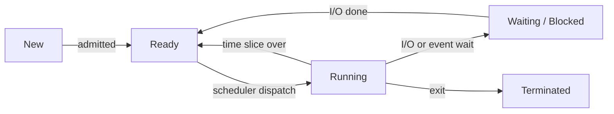
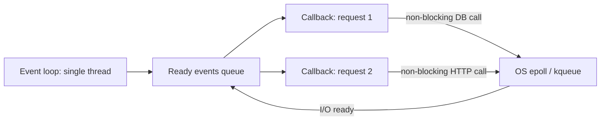

# Processes & Threads

A process is a running program with its own address space. A thread is a line of execution inside that process that shares its memory. "Process vs thread", context switches, IPC, scheduling and "multithreading or async?" come up in nearly every backend interview. This page covers all of it, crisply.

## ⭐ Process vs thread

**In one line:** a process is a box of isolated memory and resources; a thread is a worker inside that box that shares the heap, code and open files, but has its own stack and registers.

> **Example:** Chrome runs each tab in a separate process, so one tab crashing leaves the others alive. Inside one tab, rendering, JS and networking run on separate threads that share the same memory.

| | Process | Thread |
|---|---|---|
| Memory | Own address space (code, heap, stack) | Shares heap, code, globals; only stack + registers are its own |
| Creation cost | Expensive (page tables, PCB, resources) | Cheap (just a stack + TCB) |
| Context switch | Expensive (address space changes, TLB flush) | Cheap (same address space) |
| Isolation | Strong: one crash does not kill another | Weak: one thread's segfault kills the whole process |
| Communication | Needs IPC (pipe, socket, shared memory) | Directly via shared variables (but needs locks) |
| Example | Chrome tabs, Postgres backend per connection | Tomcat request threads, JVM GC threads |

**Interview tip:** "When a process, when a thread?" Need isolation and crash safety (untrusted code, separate services)? Process. Need fast data sharing and low overhead (parallel requests in one server)? Threads.

**Common mistake:** saying "threads have separate memory". Only the stack is separate; the heap is shared, which is exactly why race conditions happen.

## ⭐ Process states

**In one line:** a process moves through New → Ready → Running → Waiting → Terminated; the scheduler moves it between Ready and Running.



- **Ready:** can run as soon as it gets a CPU; sits in the ready queue.
- **Running:** on a CPU right now. One per core at a time.
- **Waiting/Blocked:** waiting for disk, network, a lock or sleep. Not asking for CPU.
- Running → Ready = **preemption** (timer interrupt). Running → Waiting = it blocked itself.

**Interview tip:** a waiting process never goes straight to Running; when its I/O completes it first goes back to the Ready queue.

**Common mistake:** treating Ready and Waiting as the same. Ready needs only a CPU; Waiting is waiting for an event.

## PCB (Process Control Block)

**In one line:** the PCB is the kernel data structure holding a process's full "identity card", so it can be paused and later resumed exactly where it left off.

What a PCB holds:
- PID, parent PID, state
- Program counter and CPU registers (saved here on a context switch)
- Memory info: page table pointer, limits
- Open files table, sockets
- Scheduling info: priority, time used
- On Linux this is `task_struct`. Threads get their own `task_struct` too (a Linux thread is a lightweight process that shares memory).

**Interview tip:** "What exactly is saved on a context switch?" Registers, program counter and stack pointer go into the PCB/TCB; on a process switch the page table base register (CR3) changes too.

## ⭐ Context switch cost

**In one line:** a context switch saves one thread/process's state and loads another's; it is pure overhead, no useful work happens during it.

- **Direct cost:** save/restore registers, enter kernel mode, run the scheduler. Microseconds (~1–5 µs).
- **Indirect cost (the real pain):** CPU caches and the TLB go cold. A new process uses a different address space, so the TLB is flushed and data gets evicted from L1/L2.
- A thread switch (same process) is cheaper than a process switch: same address space, no TLB flush.
- A server with 10,000 threads spends more time switching and less time working. Hence thread pools and event loops.

**Interview tip:** "More threads = more throughput?" No. For CPU-bound work, threads ≈ cores. Beyond that you only add switching and cache misses.

**Common mistake:** counting only the direct cost and forgetting cache/TLB pollution.

## User threads vs kernel threads

**In one line:** kernel threads are scheduled by the OS; user threads are scheduled by a library/runtime in user space, and the kernel does not even know they exist.

| Model | Meaning | Pro | Con |
|---|---|---|---|
| 1:1 (kernel threads) | Each user thread = one kernel thread | True multi-core parallelism, one blocking does not stop others | Expensive to create and switch, scales to thousands only |
| N:1 (green threads) | Many user threads on one kernel thread | Very cheap | One blocking syscall stops all, no multi-core |
| M:N (hybrid) | M user threads on N kernel threads | Cheap + parallel | Complex runtime |

**Common mistake:** assuming user-level threads automatically use multiple cores. In N:1 they use one core.

## Threads in Java and Go

**In one line:** a Java platform thread is a 1:1 OS thread; Java 21 virtual threads and Go goroutines are M:N and make millions of concurrent tasks cheap.

- **Java platform thread:** `new Thread(...)` is one OS thread with a ~1 MB stack. That is why we use an `ExecutorService` thread pool.
- **Java virtual threads (Java 21):** the JVM runs them on a few carrier OS threads. On blocking I/O the virtual thread parks and the carrier is freed. You can create millions.
- **Go goroutines:** growable stack starting at ~2 KB, run M:N by the Go runtime scheduler (G-M-P model). They communicate over channels.
- Details and code: [Java Concurrency](../04-java/14-concurrency.md).

```java
// Java 21: 10,000 blocking tasks on just a few OS threads
try (var ex = java.util.concurrent.Executors.newVirtualThreadPerTaskExecutor()) {
    for (int i = 0; i < 10_000; i++) {
        int id = i;
        ex.submit(() -> {
            Thread.sleep(100);          // the virtual thread parks, not the OS thread
            return id;
        });
    }
} // close() waits for all tasks
```

**Interview tip:** virtual threads are for I/O-bound work, not CPU-bound. For CPU-bound work, cores are the limit.

## ⭐ IPC: Inter-process communication

**In one line:** processes have separate memory, so sending data needs OS mechanisms: pipes, shared memory, message queues, sockets.

| Mechanism | How | Speed | When to use |
|---|---|---|---|
| Pipe / named pipe (FIFO) | Write on one end, read on the other, byte stream | Medium | Parent-child, shell `ls \| grep` |
| Shared memory | Both processes map the same physical pages | Fastest (no copy) | Large data, low latency; you handle sync (semaphore) |
| Message queue | Kernel queue of structured messages | Medium | Decoupled, need message boundaries |
| Socket (Unix/TCP) | Byte stream or datagram, local or network | Unix socket fast, TCP slower | Different machines, client-server (Postgres, Docker daemon) |
| Signals | Small notification (SIGTERM, SIGKILL) | Fast, but no data | Stopping or reloading a process |

**Interview tip:** "Fastest IPC?" Shared memory, because nothing is copied through the kernel. But synchronization is your responsibility.

**Common mistake:** using shared memory without a lock/semaphore and then hitting race conditions.

## ⭐ CPU scheduling algorithms

**In one line:** the scheduler decides which process in the Ready queue gets the CPU next; the goals are throughput, low waiting time, fairness and fast response.

| Algorithm | How | Pro | Con |
|---|---|---|---|
| FCFS | First come first served, non-preemptive | Simple, fair order | Convoy effect: one long job blocks everyone |
| SJF / SRTF | Shortest burst first (SRTF = preemptive version) | Minimum average waiting time (optimal) | Burst time unknown in advance; long jobs starve |
| Round Robin | Each process gets a fixed time quantum, then goes to the back | Fair, good response time | Small quantum = many switches; large = behaves like FCFS |
| Priority | Highest priority first (preemptive or not) | Important work first | Starvation; fix = **aging** (raise priority as it waits) |
| MLFQ | Several queues with different priority/quantum; CPU-heavy sinks, I/O-heavy stays up | SJF-like behaviour without knowing bursts, interactive is fast | Hard to tune, can be gamed |

- Linux **CFS** (Completely Fair Scheduler) tracks each task's "virtual runtime" and runs the lowest one (red-black tree). Replaced by EEVDF from Linux 6.6.
- Metrics: turnaround time = finish − arrival, waiting time = turnaround − burst, response time = first run − arrival.

**Interview tip:** "How do you pick the Round Robin quantum?" Much larger than the context switch cost (10–100 ms typical), yet small enough that interactive apps feel snappy.

**Common mistake:** calling SJF practical. Burst times are unknown; real OSes approximate it with MLFQ/CFS.

## ⭐ fork / exec

**In one line:** `fork()` creates a copy of the current process (the child); `exec()` loads a new program into the current process. A shell combines both to run commands.

```c
pid_t pid = fork();            // now two processes are running
if (pid == 0) {
    // child: fork() returned 0
    execlp("ls", "ls", "-l", NULL);   // child's memory is replaced by "ls"
    _exit(1);                  // only reached if exec failed
} else {
    // parent: fork() returned the child's PID
    int status;
    waitpid(pid, &status, 0);  // reap the child, otherwise it becomes a zombie
}
```

- `fork()` is called once and **returns twice**: 0 in the child, child PID in the parent, -1 on error.
- Modern fork uses **copy-on-write**: pages are shared until someone writes. That is why fork is cheap. ([Memory Management](07-memory-management.md))
- `exec` does not create a new process; the PID stays, code/heap/stack are replaced.

**Interview tip:** "How does a shell run `ls`?" fork → exec("ls") in the child → the parent calls `wait`.

## Zombie and orphan processes

**In one line:** a zombie is a dead child whose exit status the parent has not yet read with `wait()`; an orphan is a live child whose parent died first.

| | Zombie | Orphan |
|---|---|---|
| What happened | Child exited, parent did not `wait()` | Parent exited, child still running |
| Resources | Only a process table entry (PID) | A normal running process |
| Who handles it | Parent must `wait()`, or kill the parent | `init`/`systemd` (PID 1) adopts and reaps it |
| In `ps` | State `Z`, `<defunct>` | Parent PID shows 1 |

**Interview tip:** zombies do not eat memory but can exhaust PIDs. Fix: a `SIGCHLD` handler in the parent that calls `waitpid`. `kill -9` does nothing to a zombie; it is already dead.

**Common mistake:** in a container your app is PID 1 and does not reap children, so zombies pile up. Use `tini` or `--init`.

## ⭐ Multiprocessing vs multithreading vs async I/O

**In one line:** for CPU-bound work use multiple processes/threads (use the cores); for many I/O-bound connections use an async event loop (one thread, non-blocking I/O).



| | Multiprocessing | Multithreading | Async I/O (event loop) |
|---|---|---|---|
| Parallelism | True multi-core | Multi-core (if the language allows) | Concurrency on one core |
| Memory | Separate per process, higher | Shared, lower | Lowest |
| Best for | CPU-bound, isolation (Python ML, Nginx workers) | Mixed work, shared state (Java servers) | Thousands of idle/slow connections (Node.js, chat, proxies) |
| Risk | IPC overhead | Race conditions, deadlocks | One CPU-heavy callback blocks the whole loop |

- **Concurrency** = many tasks making progress together (interleaved). **Parallelism** = many tasks truly running at once on different cores.
- In Python the GIL means `multiprocessing` for CPU-bound and `asyncio` for I/O.
- Nginx/Node: a few processes (one per core) × an event loop in each. Best of both.
- This is the backbone of real-time systems like chat: [Real-time communication](../01-topics/08-real-time-communication.md), [WhatsApp](../02-questions/t1-04-whatsapp-chat.md).

**Interview tip:** "10 lakh WebSocket connections on one server?" Thread-per-connection will not work (1 MB stack × 10 lakh). Use an event loop + epoll, or virtual threads/goroutines.

**Common mistake:** doing CPU-heavy work (image resize, huge JSON parse) on the event loop. Offload it to a worker thread/process.

## Where it shows up in system design

- [Scaling basics](../01-topics/01-scaling-basics.md): vertical scaling, threads vs cores
- [Real-time communication](../01-topics/08-real-time-communication.md) and [WhatsApp chat](../02-questions/t1-04-whatsapp-chat.md): event loop, millions of connections
- [Job scheduler](../02-questions/t2-18-job-scheduler.md): worker pools, priority scheduling
- [Locks & contention](../01-topics/09-locks-and-contention.md): shared state across threads

## Checklist

- [ ] I can compare process vs thread on memory, cost, isolation and communication
- [ ] I can draw the process states and say when each transition happens
- [ ] I can explain the direct and indirect (cache, TLB) cost of a context switch
- [ ] I can list IPC mechanisms and say which is fastest and why
- [ ] I can give pros/cons of FCFS, SJF, Round Robin, Priority, MLFQ and the fix for starvation
- [ ] I can explain the fork/exec flow and zombie vs orphan
- [ ] I can choose multiprocessing, multithreading or async for CPU-bound vs I/O-bound work
