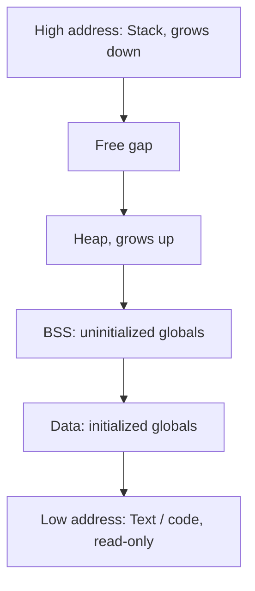
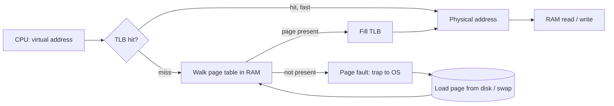

# Memory Management

The OS gives every process the illusion of a large, private, contiguous memory, while real RAM is small and shared by all processes. Virtual memory, paging, the TLB, page faults and page replacement are classic interview questions. Stack vs heap, cache locality and the OOM killer also matter for production debugging.

## ⭐ Stack vs heap

**In one line:** the stack holds local variables of function calls, automatic and fast; the heap holds data allocated at runtime that outlives the function that created it.

| | Stack | Heap |
|---|---|---|
| Holds | Local variables, function args, return address | Objects created with `new`/`malloc` |
| Allocation | Move the stack pointer, very fast | Allocator searches for a free block, slower |
| Who frees it | Automatic on function return | Programmer (`free`) or the garbage collector |
| Size | Small, fixed per thread (Linux ~8 MB, Java ~1 MB) | Large, up to RAM/limit |
| Sharing | One per thread | Shared by all threads |
| Error | Stack overflow (deep recursion) | Memory leak, fragmentation, OOM |

**Interview tip:** "What happens with infinite recursion?" Each call adds a stack frame; once the stack limit is crossed you get a stack overflow (`StackOverflowError` in Java).

**Common mistake:** saying "objects live on the stack". In Java objects live on the heap; the stack holds only primitives and references (escape analysis sometimes optimizes this).

## ⭐ Virtual memory and why

**In one line:** each process uses virtual addresses; the MMU (hardware) translates them to physical RAM addresses through the page table.

Why we need it:
- **Isolation:** process A cannot even see process B's memory. Same virtual address, different physical page.
- **Large address space:** the program sees 128 TB even with 16 GB of RAM. Rarely used pages live on disk (swap).
- **Simple programming:** every process has the same layout (code low, stack high); the linker does not care about physical addresses.
- **Sharing:** shared libraries (libc) sit in RAM once, and every process's page table points to them.
- **Lazy loading:** a page comes into RAM only when touched (demand paging).

**Interview tip:** virtual memory is not just "more memory than RAM". The main win is isolation and protection (read-only code, non-executable stack).

## ⭐ Paging: page table, TLB, page fault

**In one line:** memory is split into fixed-size blocks (virtual = pages, physical = frames, typically 4 KB); the page table maps pages to frames, and the TLB caches those translations.

- **Virtual address = page number + offset.** With 4 KB pages the low 12 bits are the offset, the rest is the page number.
- **Page table entry:** frame number + bits: present, dirty, accessed, read/write, user/kernel.
- **Multi-level page table:** 4 levels on x86-64. A single flat table would be huge on 64-bit; multi-level builds only the parts in use.
- **TLB:** a small cache inside the CPU (hundreds to a few thousand entries). Hit rate ~99%. A miss means a page table walk (several memory reads).
- **Page fault:** the page is not in RAM. The OS loads it from disk/swap, updates the page table and re-runs the instruction.
  - **Minor fault:** the page is in RAM but not mapped (e.g. COW, first touch). Cheap.
  - **Major fault:** must read from disk. Milliseconds, very expensive.
  - If the address is invalid, the fault becomes a **segmentation fault** and the process is killed.
- **Huge pages** (2 MB/1 GB): cover more memory with fewer TLB entries. Useful for databases and the JVM (`-XX:+UseLargePages`).

**Interview tip:** "Is a page fault always bad?" No. With demand paging every new page arrives via a minor fault the first time. Major faults (disk) are the bad ones.

**Common mistake:** treating a page fault as an error. It is a normal mechanism; a segfault happens only when the address itself is invalid.

## Segmentation

**In one line:** dividing memory into logical, variable-size segments (code, data, stack), each with a base + limit.

- Pro: matches the programmer's view, per-segment protection.
- Con: **external fragmentation** (holes of different sizes). Paging uses a fixed size, so no external fragmentation (only internal, in the last page).
- Modern x86-64 has mostly disabled segmentation (flat model); paging is the real mechanism.

**Interview tip:** "Paging vs segmentation?" Paging = fixed size, no external fragmentation, invisible to the programmer. Segmentation = variable size, logical, external fragmentation.

## ⭐ Page replacement: FIFO, LRU, Optimal

**In one line:** when RAM is full and a new page is needed, some page must be evicted; the algorithm picks which one (the victim).

| Algorithm | How | Pro | Con |
|---|---|---|---|
| FIFO | Evict the page loaded earliest | Simple | Can evict a hot page; **Belady's anomaly** (more frames, more faults) |
| LRU | Evict the page unused for the longest time | Good with locality, best in practice | Exact LRU is expensive (update on every access) |
| Optimal (OPT/MIN) | Evict the page that will be used furthest in the future | Minimum faults, theoretical best | Needs the future; only a benchmark |
| Clock / second chance | LRU approximation: check accessed bit, if 1 clear it and move on | Cheap, close to LRU | Not exact |

Example: frames = 3, references = `7 0 1 2 0 3 0 4`
- FIFO: 7,0,1 (3 faults) → 2 replaces 7 → 0 hit → 3 replaces 0 → 0 replaces 1 → 4 replaces 2. Total **7 faults**.
- LRU: 7,0,1 → 2 replaces 7 → 0 hit → 3 replaces 1 → 0 hit → 4 replaces 2. Total **6 faults**.

- Linux uses active/inactive lists (an LRU approximation).
- Same idea in application caches: [LRU Cache LLD](../06-lld-problems/06-lru-cache.md), [Caching](../01-topics/05-caching.md).

**Interview tip:** "Why doesn't the OS use exact LRU?" Updating a timestamp/list on every memory access is far too expensive in hardware. Hence the accessed bit + Clock algorithm.

**Common mistake:** attributing Belady's anomaly to LRU. It happens with FIFO; LRU and Optimal are "stack algorithms" and never show it.

## ⭐ Thrashing

**In one line:** the processes' working sets do not fit in RAM, so the system spends most of its time swapping pages in and out and real work nearly stops.

- Symptoms: CPU utilization drops, disk I/O at 100%, page fault rate through the roof.
- Old schedulers saw idle CPU and added more processes, making thrashing worse.
- Fix: run fewer processes (degree of multiprogramming), add RAM, use the **working set model** or page-fault-frequency control, set memory limits (cgroups).
- In production: a Kubernetes pod near its memory limit thrashing on swap/page cache, or a bad split between Elasticsearch heap and OS cache.

**Interview tip:** "CPU at 10% but the server is slow?" Check `si/so` (swap in/out) and major faults in `vmstat`. It may be thrashing.

## Memory-mapped files

**In one line:** `mmap()` maps a file into the process's virtual address space; you read/write the file like an array and the OS brings data in via page faults.

- With `read()` data is copied kernel buffer → user buffer. With mmap there is no copy; the page cache is mapped directly.
- Used by: databases (LMDB, MongoDB's old MMAPv1, Kafka index files), loading shared libraries, shared memory between processes.
- Risk: I/O errors arrive as SIGBUS, and you have less control over when data hits disk (needs `msync`). That is why many DBs keep their own buffer pool.

**Interview tip:** Kafka relies on zero-copy (`sendfile`) and the page cache; mmap and page cache questions come up there: [Message queues & Kafka](../01-topics/07-message-queues-kafka.md).

## ⭐ Copy-on-write (COW)

**In one line:** two processes share the same physical page read-only; a copy of the page is made only when one of them writes to it.

- Makes `fork()` cheap: the child does not copy all memory up front. If `exec` follows right after fork, no copy ever happens.
- **Redis BGSAVE** depends on it: fork, the child writes a snapshot to disk, the parent keeps taking writes. Under heavy writes many pages get copied and memory can approach 2x.
- Filesystems (ZFS, Btrfs) and Java's `CopyOnWriteArrayList` use the same idea.

**Interview tip:** "Why does Redis memory spike during a snapshot?" COW: every page the parent modifies gets copied.

## ⭐ CPU cache hierarchy and locality

**In one line:** there is a huge speed gap between CPU and RAM, so L1/L2/L3 caches sit in between; code is fast when its data access pattern has locality.

| Level | Typical size | Latency |
|---|---|---|
| Register | bytes | ~0.3 ns |
| L1 (per core) | 32–64 KB | ~1 ns |
| L2 (per core) | 256 KB – 2 MB | ~4 ns |
| L3 (shared) | 8–64 MB | ~10–20 ns |
| RAM | GBs | ~80–100 ns |
| SSD | TBs | ~100 µs |

- Data moves in **cache lines** (64 bytes).
- **Temporal locality:** data used now will be used again soon (a loop variable).
- **Spatial locality:** nearby data will be used soon (array traversal).
- Traversing an array row-wise can be many times faster than column-wise. ArrayList beats LinkedList because it is contiguous.
- **False sharing:** two threads write different variables that sit on the same cache line; the line ping-pongs between cores. Fix: padding (Java `@Contended`).
- Numbers to remember: [Numbers cheatsheet](../01-topics/21-numbers-cheatsheet.md).

**Interview tip:** "Same Big-O, so why is an array faster than a LinkedList?" Cache locality. LinkedList nodes are scattered, so every step is a cache miss.

## OOM killer

**In one line:** when Linux runs out of memory and reclaim fails, the OOM killer sends SIGKILL to one process (the one with the highest "badness" score).

- The score is mostly memory usage; tune with `/proc/<pid>/oom_score_adj` (-1000 = never kill).
- Linux **overcommits**: `malloc` succeeds and real RAM is assigned only when touched. That is why OOM shows up later.
- In containers, crossing the cgroup memory limit gets the container OOMKilled (Kubernetes exit code 137).
- Debug: `dmesg | grep -i oom`.

**Common mistake:** setting JVM `-Xmx` equal to the container limit. Besides the heap, metaspace, thread stacks and direct buffers use memory too, and the container gets OOMKilled. Keep the heap at ~70–75%.

## GC languages pointer

**In one line:** in Java, Go and Python the programmer does not free memory; the garbage collector finds unreachable objects and reclaims heap memory.

- To the OS the JVM is just a process that mmaps a large heap; the GC does its work inside it.
- Generational GC (young/old), stop-the-world pauses, G1/ZGC: [JVM & Memory](../04-java/11-jvm-memory.md).
- GC languages still leak: keep adding objects to a static map and never remove them.

## Where it shows up in system design

- [Caching](../01-topics/05-caching.md) and [LRU Cache LLD](../06-lld-problems/06-lru-cache.md): the same LRU/FIFO eviction policies
- [Message queues & Kafka](../01-topics/07-message-queues-kafka.md): page cache, zero-copy, sequential I/O
- [Distributed KV store](../02-questions/t2-20-distributed-kv-store.md): RAM vs disk, memory limits
- [Numbers cheatsheet](../01-topics/21-numbers-cheatsheet.md): cache, RAM, disk latencies

## Checklist

- [ ] I can explain stack vs heap and the process memory layout
- [ ] I can say why virtual memory is needed (isolation, sharing, demand paging)
- [ ] I can draw address translation: page table, TLB hit/miss, page fault (minor vs major)
- [ ] I can count page faults for FIFO, LRU, Optimal and explain Belady's anomaly
- [ ] I can explain thrashing, how to spot it and how to fix it
- [ ] I can explain copy-on-write and mmap, and their role in Redis/Kafka
- [ ] I can explain the cache hierarchy, locality and false sharing
- [ ] I can explain the OOM killer and the JVM heap sizing mistake in containers
