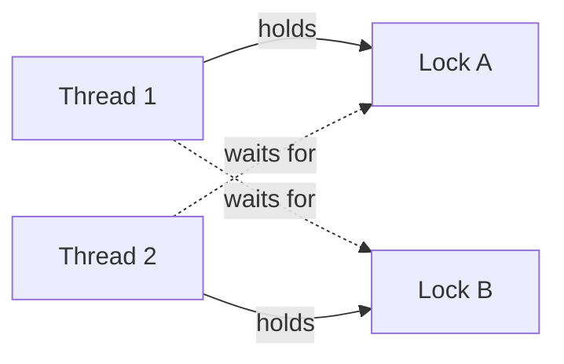

# Synchronization & Deadlocks

When several threads touch shared data they must coordinate, or the data gets corrupted. The coordination tools (mutex, semaphore, monitor), used badly, cause deadlock, livelock or starvation. "Mutex vs semaphore", producer-consumer and "the 4 deadlock conditions" are asked in almost every interview.

## ⭐ Race condition and critical section

**In one line:** a race condition happens when the result depends on the order threads run in; a critical section is the part of code that touches shared data and must be run by only one thread at a time.

> **Example:** two people book the last seat on BookMyShow at the same moment. Both read "seat is free", both book it. One seat, two tickets.

```java
class Counter {
    int count = 0;
    void inc() { count++; }   // not atomic: read, add, write are three steps
}
// Thread A: read 5     Thread B: read 5
// Thread A: write 6    Thread B: write 6   -> one increment lost
```

Three requirements for a critical section solution:
- **Mutual exclusion:** only one thread inside at a time.
- **Progress:** if nobody is inside, one of the waiting threads must be able to enter; threads outside must not block the decision.
- **Bounded waiting:** no thread waits forever.

**Interview tip:** `count++` looks like one instruction but is read-modify-write. Fix: a lock, or an atomic (`AtomicInteger`, CAS).

**Common mistake:** locking only the write and not the read. Check-then-act (`if (free) book()`) is one whole critical section.

## ⭐ Mutex vs semaphore vs monitor vs spinlock

**In one line:** a mutex is a lock with one owner; a semaphore is a counter that lets N threads in; a monitor is lock + condition variables at the language level; a spinlock loops instead of sleeping.

| | Mutex | Binary semaphore | Counting semaphore | Monitor | Spinlock |
|---|---|---|---|---|---|
| What it is | Lock with ownership | Value 0/1 | Value 0..N | Lock + condition variables, language construct | Busy-wait lock |
| Ownership | Yes, only the locker unlocks | No, anyone can signal | No | Yes (implicit) | Yes |
| How many inside | 1 | 1 | N | 1 | 1 |
| How it waits | Thread sleeps (blocks) | Block | Block | Block | Loops on the CPU |
| Use | Protect shared data | Signaling (an event happened) | Resource pool (DB connections, rate limit) | Java `synchronized` + `wait/notify` | Kernel, tiny critical sections, multi-core |

- **Mutex vs binary semaphore:** both allow one inside, but a mutex has an owner (only the locker may unlock, priority inheritance is possible). A semaphore is for signaling: thread A calls `signal`, thread B calls `wait`.
- A **spinlock** is good when the lock is held for only a few nanoseconds; the sleep/wake context switch costs more than spinning. Useless on a single core.
- Java: `synchronized` and `ReentrantLock` = mutex/monitor, `Semaphore` = counting semaphore. Details: [Java Concurrency](../04-java/14-concurrency.md).

```java
// Counting semaphore: at most 10 concurrent DB calls
Semaphore permits = new Semaphore(10);
void query() throws InterruptedException {
    permits.acquire();          // blocks if 0
    try { db.run(); }
    finally { permits.release(); }
}
```

**Interview tip:** "Are a mutex and a binary semaphore the same?" No. Ownership is the difference: a mutex is for locking, a semaphore is for signaling and counting.

**Common mistake:** forgetting to unlock in `finally`. If an exception is thrown, the lock is never released.

## ⭐ Condition variables

**In one line:** a condition variable lets a thread sleep until a condition becomes true, releasing the lock so another thread can change that condition.

- Operations: `wait()` (release lock + sleep, re-acquire the lock on wake-up), `signal()/notify()` (wake one), `broadcast()/notifyAll()` (wake all).
- Always wait **while holding the lock** and **inside a `while` loop**, not an `if`. Why: **spurious wakeups** happen, or someone else changed the condition before you woke up.

```java
synchronized (lock) {
    while (!ready) {    // while, not if
        lock.wait();    // releases the lock and sleeps
    }
    // ready is true, continue
}
```

**Common mistake:** writing `if (!ready) wait();`. On a spurious wakeup the thread proceeds in the wrong state.

## ⭐ Producer-consumer (bounded buffer)

**In one line:** producers put items into a buffer, consumers take them out; a producer waits when the buffer is full, a consumer waits when it is empty.

> **Example:** Swiggy's order service puts orders on a queue, delivery-assignment workers take them off. Kafka and a thread pool's task queue follow the same pattern.

Classic semaphore solution (pseudo):

```text
empty = Semaphore(N)    // empty slots
full  = Semaphore(0)    // filled slots
mutex = Mutex()

producer:                    consumer:
  wait(empty)                  wait(full)
  lock(mutex)                  lock(mutex)
  buffer.add(item)             item = buffer.remove()
  unlock(mutex)                unlock(mutex)
  signal(full)                 signal(empty)
```

In Java with condition variables:

```java
class BoundedBuffer<T> {
    private final Queue<T> q = new ArrayDeque<>();
    private final int cap;
    private final ReentrantLock lock = new ReentrantLock();
    private final Condition notFull = lock.newCondition();
    private final Condition notEmpty = lock.newCondition();

    BoundedBuffer(int cap) { this.cap = cap; }

    void put(T x) throws InterruptedException {
        lock.lock();
        try {
            while (q.size() == cap) notFull.await();
            q.add(x);
            notEmpty.signal();
        } finally { lock.unlock(); }
    }

    T take() throws InterruptedException {
        lock.lock();
        try {
            while (q.isEmpty()) notEmpty.await();
            T x = q.poll();
            notFull.signal();
            return x;
        } finally { lock.unlock(); }
    }
}
```

- In real code use `ArrayBlockingQueue` / `LinkedBlockingQueue`; this is what they do inside.

**Interview tip:** in the semaphore version the order matters. If the producer takes `mutex` first and then `wait(empty)`, it sleeps holding the mutex when the buffer is full, and the consumer can never get in: deadlock.

## Readers-writers problem

**In one line:** many readers may read at once, but a writer needs exclusive access.

- **Readers-preference:** while any reader is inside, new readers keep coming in; the writer can starve.
- **Writers-preference:** when a writer is waiting, new readers are held back; readers can starve.
- Java: `ReentrantReadWriteLock` (has a fair mode), `StampedLock` (optimistic reads).

```java
ReadWriteLock rw = new ReentrantReadWriteLock();
String get(String k) {
    rw.readLock().lock();            // many readers together
    try { return map.get(k); } finally { rw.readLock().unlock(); }
}
void put(String k, String v) {
    rw.writeLock().lock();           // single writer
    try { map.put(k, v); } finally { rw.writeLock().unlock(); }
}
```

**Interview tip:** use an RW lock for read-heavy data (config, product catalog cache). With many writes a plain mutex is often just as fast.

## ⭐ Deadlock: 4 Coffman conditions

**In one line:** a deadlock is a group of threads where each one waits for something held by another thread in the group; nobody moves forward.



A deadlock happens only when **all four** hold at the same time:

| Condition | Meaning | How to break it |
|---|---|---|
| Mutual exclusion | A resource is held by one at a time | Make it shareable (read-only data, lock-free structures) |
| Hold and wait | Hold one resource while waiting for another | Request everything at once, or never request while holding |
| No preemption | A held resource cannot be forcibly taken | `tryLock` with timeout; on failure release your locks |
| Circular wait | A cycle of waits T1 → T2 → ... → T1 | **Lock ordering**: everyone takes locks in one global order |

```java
// Deadlock: transfer(a, b) and transfer(b, a) at the same time
void transfer(Account from, Account to, int amt) {
    synchronized (from) {
        synchronized (to) { from.debit(amt); to.credit(amt); }
    }
}
```

**Interview tip:** "4 deadlock conditions?" Name each with one line, then say "in practice the easiest one to break is circular wait, with lock ordering".

## Prevention, avoidance, detection, recovery

**In one line:** prevention = remove one condition by design; avoidance = check on every request that the system stays safe; detection = let it happen and find the cycle; recovery = kill a victim or roll back.

| Approach | How | Cost | Where |
|---|---|---|---|
| Prevention | Break one of the 4 conditions (lock ordering, acquire all at once) | Less concurrency, but simple | Application code |
| Avoidance | Banker's algorithm: grant a request only if a safe state remains | Max need must be known up front, expensive | Theory, some embedded systems |
| Detection | Build a wait-for graph, look for a cycle | Periodic check | Databases (Postgres, MySQL InnoDB) |
| Recovery | Abort/roll back a victim, or preempt a resource | Wasted work | DB aborts a transaction and you retry |
| Ignore (ostrich) | Do nothing, it is rare | Zero | Most general-purpose OSes |

**Banker's algorithm (brief):** each process declares its maximum need. On a request the OS pretends to grant it, then checks whether there is some order in which every process can get its max need and finish (a **safe state**). If yes, grant; if not, make it wait. Safe state = deadlock is impossible; unsafe = deadlock is possible (not certain).

- Databases detect deadlocks and abort one transaction (`ERROR: deadlock detected`); the app should retry: [Idempotency & retries](../01-topics/10-idempotency-retries.md).

**Common mistake:** calling an unsafe state a deadlock. Unsafe only means "no guarantee".

## ⭐ Lock ordering

**In one line:** all threads always take locks in one fixed global order (e.g. ascending account id), so circular wait cannot happen.

```java
void transfer(Account a, Account b, int amt) {
    Account first  = a.id < b.id ? a : b;   // always the smaller id first
    Account second = a.id < b.id ? b : a;
    synchronized (first) {
        synchronized (second) { a.debit(amt); b.credit(amt); }
    }
}
```

- Alternative: `tryLock(timeout)`; if you cannot get both, release what you have, random backoff, retry.
- Do not do slow work (network call, DB call) inside a lock; the shorter the locks, the less deadlock and contention.

**Interview tip:** whenever two accounts must be locked, as in a Paytm wallet transfer or a Splitwise settlement, say "lock in id order" right away.

## Livelock and starvation

**In one line:** livelock = threads are busy changing state but nobody makes progress; starvation = one thread never gets the resource because others always get ahead.

| | Deadlock | Livelock | Starvation |
|---|---|---|---|
| Thread state | Blocked, sleeping | Running, burning CPU | Others run, one lags |
| Progress | Nobody | Nobody | Others yes, one no |
| Example | Two threads holding each other's lock | Two people in a corridor stepping to the same side repeatedly | Low-priority thread, writer under readers-preference |
| Fix | Lock ordering, timeout | Random backoff | Fair locks, aging, FIFO queue |

- Java `new ReentrantLock(true)` = fair lock (FIFO): less starvation but lower throughput.

## Dining philosophers

**In one line:** 5 philosophers at a round table with 5 forks between them; eating needs both neighbouring forks. If everyone picks up the left fork first, everyone waits for the right one: deadlock.

Solutions:
- **Resource ordering:** number the forks, each philosopher picks up the lower number first. The last philosopher ends up reversing the order, so the cycle breaks.
- **Allow only 4 to sit** (semaphore(4)): at least one gets both forks.
- **Pick up both or none** (through a waiter/arbitrator, or `tryLock` on both).
- Plain "put the fork down and retry if you cannot get the other" without a random delay = livelock.

**Interview tip:** this problem is the easiest way to explain lock ordering and breaking hold-and-wait.

## Distributed lock pointer

**In one line:** a mutex works only inside one process; for a lock across many servers you use Redis, ZooKeeper/etcd or a DB row lock.

- New problems: the lock holder crashes (needs a TTL/lease), the lease expires during a GC pause (needs a fencing token), network partitions.
- Details and BookMyShow seat locking: [Locks & contention](../01-topics/09-locks-and-contention.md), [BookMyShow](../02-questions/t1-05-bookmyshow.md).

**Common mistake:** relying on one JVM's `synchronized` in a multi-instance deployment. Each instance has its own lock, so protection is zero.

## Where it shows up in system design

- [Locks & contention](../01-topics/09-locks-and-contention.md): optimistic vs pessimistic, distributed locks
- [BookMyShow](../02-questions/t1-05-bookmyshow.md) and [Flash sale](../02-questions/t2-15-flash-sale.md): race conditions on seats/stock
- [Payment system](../02-questions/t1-11-payment-system.md): locking two accounts without deadlock
- [Message queues & Kafka](../01-topics/07-message-queues-kafka.md): producer-consumer at system scale

## Checklist

- [ ] I can give a race condition example and the 3 requirements of a critical section
- [ ] I can explain the difference and use of mutex, semaphore (binary/counting), monitor and spinlock
- [ ] I can explain why we wait inside a `while` loop with a condition variable
- [ ] I can write producer-consumer and readers-writers in code/pseudo-code
- [ ] I can state the 4 Coffman conditions and how to break each one
- [ ] I can compare prevention, avoidance (Banker's), detection and recovery
- [ ] I can fix the transfer deadlock with lock ordering and tell it apart from livelock/starvation
- [ ] I can give dining philosophers solutions and say when a distributed lock is needed
