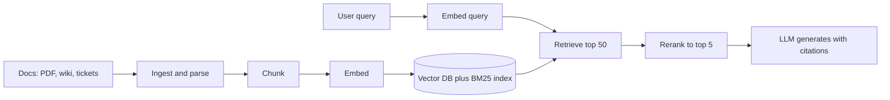

# What is RAG

RAG (Retrieval-Augmented Generation) means: before the LLM writes an answer, find the relevant text in your own documents and put it in the prompt. The model answers from the given context, not from memory. Interviewers ask: why RAG, how it differs from fine-tuning, what the pipeline steps are, and where RAG fails.

## ⭐ What RAG is and why you need it

**In one line:** RAG = search + LLM; retrieve relevant chunks first, then tell the LLM "answer only from this context".

> **Example:** A company HR policy bot. An employee asks "how many days of paternity leave do I get?". The LLM has never seen your company's policy. RAG pulls the right paragraph from the policy PDF into the prompt, and the LLM writes the answer with a citation.

Why an LLM alone is not enough:
- **Knowledge cutoff:** the model does not know data from after training.
- **Private data:** it has never seen your internal docs, tickets or contracts.
- **Hallucination:** it gives a confident answer even when it does not know.
- **No citations:** the user cannot verify where the answer came from.

What RAG gives you:
- Fresh data → update the doc, re-index it, no retraining.
- Grounded answers → every answer comes with a source (doc, page).
- Access control → users only get chunks they are allowed to see.

**Interview tip:** "RAG does not change the model's knowledge; it hands the model the right open-book notes on every query."

**Common mistake:** thinking RAG makes hallucination zero. If the wrong chunk is retrieved, the LLM will give a wrong answer confidently.

## ⭐ RAG vs fine-tuning vs long context

**In one line:** RAG = give new *knowledge*; fine-tuning = teach *behaviour/style*; long context = stuff everything into the prompt.

| | RAG | Fine-tuning | Long context |
|---|---|---|---|
| What it teaches | facts, fresh docs | format, tone, task skill | whatever is in the prompt |
| Data update | re-index, minutes | retrain, hours to days | send it every request |
| Citations | yes, easy | no | possible, hard |
| Cost per query | retrieval + small prompt | cheap inference | many tokens, expensive |
| Large corpus (GBs) | yes | no | does not fit the context |
| Access control | per-chunk filter | no | manual |

- Long context problems: token cost and latency, plus **lost-in-the-middle** (the model ignores text in the middle).
- Fine-tuning is not a reliable way to memorise facts; it still hallucinates.
- In practice you combine: RAG for knowledge + a little fine-tuning for format, or plain long context for a tiny corpus (a few docs).

**Interview tip:** "If the data changes or is private, RAG. If the output style/format must change, fine-tune. If the corpus is tiny (one or two docs), long context is simplest."

**Common mistake:** saying "we need a chatbot over company docs, let's fine-tune". The docs change every week and you get no citations.

## ⭐ The full pipeline: ingest to generate

**In one line:** offline, split docs, embed and store them; online, fetch relevant chunks for the query, rerank them, give them to the LLM.

Offline (indexing):
- **Ingest:** extract text from PDF/HTML/Confluence, OCR, cleaning, handle tables.
- **Chunk:** split text into 300–800 token pieces, with metadata. → [Chunking](03-chunking.md)
- **Embed:** create a vector per chunk (same model that will run on queries). → [Semantic search](02-semantic-search.md)
- **Store:** vector DB (HNSW index) + optional BM25 index. → [Vector databases](../05-db/11-vector.md)

Online (query):
- **Retrieve:** embed the query, fetch top 20–50 candidates (dense or hybrid). → [Hybrid search](04-hybrid-search.md)
- **Rerank:** re-score candidates precisely with a cross-encoder, keep top 3–5. → [Reranking](05-reranking.md)
- **Generate:** prompt = instructions + chunks + question; "do not go beyond the context, cite sources".

**Interview tip:** in a design round, describe the pipeline in two halves: "indexing path is offline/async, query path is latency-critical". This shows clarity.

**Common mistake:** drawing only the query path and forgetting ingestion (parsing, re-indexing, deletes).

## ⭐ Why RAG fails (and where the fix is)

**In one line:** most RAG failures come from retrieval, not the LLM: the right chunk was never found, or it was found but in the wrong position or only half of it.

| Failure | What happens | Fix (page) |
|---|---|---|
| Chunk cut mid-way | half a table/argument, LLM fills the gap | [Chunking](03-chunking.md), [PageIndex](06-pageindex.md) |
| Exact term missed | error code, SKU, section no. not found | [Hybrid search](04-hybrid-search.md) |
| Right chunk at position 4–5 | LLM gives it less weight | [Reranking](05-reranking.md) |
| Vague or multi-part query | retrieval brings the wrong thing | [Advanced retrieval](07-advanced-retrieval.md) |
| Multi-page / cross-reference | "the table on the previous page" breaks | [PageIndex](06-pageindex.md) |
| Nothing is measured | no idea if a change helped or hurt | [RAG evaluation](08-rag-evaluation.md) |
| Slow in prod, 429s, timeouts | blocking ingestion, rate limits | [Production RAG API](09-production-rag-api.md) |
| Stale data, leaks | stale index, missing ACL filter | [Production RAG API](09-production-rag-api.md) |

- Debug order: first check **whether the answer was in the retrieved chunks**. If not → retrieval problem. If yes → prompt/generation problem.

**Interview tip:** "I would measure retrieval and generation separately: recall@k for retrieval, faithfulness for the answer."

**Common mistake:** reacting to bad answers by trying a bigger LLM or a new prompt without looking at the retrieved context.

## Read more

- [Vector databases](../05-db/11-vector.md): embeddings, HNSW, filtering, pgvector. Read the details here.
- [Search: Elasticsearch](../05-db/08-search.md): inverted index and BM25.
- [RAG lab](/viewinter/agents/labs/rag): run a PDF-chat RAG in the browser.
- Next: [Semantic search](02-semantic-search.md), [Chunking](03-chunking.md).

## Checklist

- [ ] I can explain what RAG is and why an LLM alone is not enough
- [ ] I can say when to use RAG vs fine-tuning vs long context
- [ ] I can draw the ingest → chunk → embed → store → retrieve → rerank → generate pipeline
- [ ] I can explain the offline indexing path and online query path separately
- [ ] I can list the main RAG failure modes and their fixes
- [ ] I can debug a bad answer as a retrieval vs generation problem
