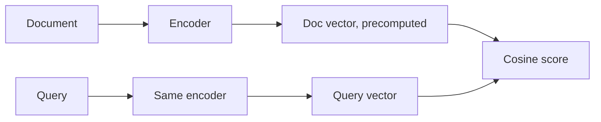

# Semantic Search

Semantic search matches **meaning**, not words. Turn both data and query into embeddings (vectors), then fetch the vectors closest to the query. This is the retrieval step of RAG. Interviewers ask: when keyword search fails, how embeddings work, what a bi-encoder is, and how you would pick an embedding model.

## ⭐ Keyword vs semantic search

**In one line:** keyword search (BM25, `LIKE`) looks for the same words; semantic search looks for the same *meaning*, even if the words differ.

> **Example:** A user on the Swiggy support bot types "food came cold, want my money back". The help doc title is "Refund for cold or spoiled food". Keyword search finds few shared words; semantic search puts the two close together.

- **Semantic gap:** data is stored in the DB, but you cannot query it the way a human understands "similar". `WHERE tags LIKE '%smiling person%'` misses look-alike photos.
- Use semantic search when: meaning/context matters ("songs like Golden Brown"), there are synonyms/paraphrases, the data is unstructured (text, image, audio).
- Use keyword search when: exact identifiers (`ERR_CONN_RESET`, SKU, order id, section number), names, jargon.

| | Keyword (BM25) | Semantic (dense vectors) |
|---|---|---|
| Matches | exact tokens | meaning |
| Synonyms | misses | catches |
| Error codes, SKUs | strong | weak, they get blurred |
| Explainable | yes | hard |
| Infra | inverted index, CPU | embedding model + vector index |

**Interview tip:** "Dense and sparse fail in different ways, so production systems combine them (hybrid)." → [Hybrid search](04-hybrid-search.md)

**Common mistake:** treating semantic search as a strict upgrade of keyword search. On product codes it does worse.

## ⭐ Embeddings intuition

**In one line:** an embedding model turns any text/image into a fixed-length list of numbers; things close in meaning land close in vector space.

- Lower layers of the model capture basic features (words, edges); higher layers capture abstract meaning ("1980s psychedelic rock vibe").
- The output has **fixed length**: `all-MiniLM-L6-v2` → 384 dims, OpenAI `text-embedding-3-small` → 1536 dims.
- Closeness is measured with cosine similarity. Metrics, memory math and dimensions in detail → [Vector databases](../05-db/11-vector.md).
- Pick the model by modality: text → Sentence Transformers/BERT, image+text → CLIP, audio → CLAP/wav2vec.

Two phases:
- **Ingestion:** embed each item → store vector + metadata (source, date, tags) in the vector DB.
- **Query:** embed the query with the **same model** → ANN search → top-K by similarity → optional metadata filter / rerank.

**Interview tip:** "Semantic search turns meaning into math, stores it smartly, and finds neighbours fast."

**Common mistake:** embedding queries and docs with different models. They live in different vector spaces, so the scores are meaningless.

## ⭐ Bi-encoder: why retrieval is so fast

**In one line:** a bi-encoder encodes query and document **separately**, so document vectors can be built ahead of time (offline); at query time only the query is encoded.

- Benefit: searches tens of millions of documents in milliseconds (with an ANN index).
- Cost: query and doc words are never "seen" together, only gist-to-gist comparison. So ranking is imprecise.
- A cross-encoder (query + doc fed into the model together) is more accurate but needs one forward pass per candidate, so it only runs on the top 50. → [Reranking](05-reranking.md)
- How ANN (HNSW, IVF) works → [Vector databases](../05-db/11-vector.md).

**Interview tip:** "Stage 1 bi-encoder for recall, Stage 2 cross-encoder for precision."

**Common mistake:** assuming the bi-encoder's top-1 is always right. Embedding models are not trained to rank.

## Choosing an embedding model

**In one line:** choose by evaluating on your own data and queries; the leaderboard (MTEB) is only a starting point.

| Factor | What to check |
|---|---|
| Quality | recall@k on your golden set |
| Language | Hindi/Hinglish users → multilingual model (e5, bge-m3) |
| Dimensions | fewer dims = less memory, faster search |
| Max input tokens | must be larger than your chunk size |
| Hosting | API (OpenAI, Cohere) vs self-host (bge, e5, MiniLM) |
| Cost / rate limits | per-token API cost, 429s |
| Domain | domain models do better for legal/medical/code |

- A small local model (`all-MiniLM-L6-v2`) is fast and free; API models usually give better quality.
- Change the model → you must **re-embed the whole corpus**. Keep the `embedding_model` version in metadata.

**Interview tip:** "I would build a golden set of 50–100 real queries, compare recall@5 for 2–3 models, then pick based on cost/latency."

**Common mistake:** picking a model only by leaderboard rank without testing on your domain.

## Read more

- [Vector databases](../05-db/11-vector.md): cosine/dot/L2, exact vs ANN, HNSW, pgvector. Read the details here.
- [Search: Elasticsearch](../05-db/08-search.md): BM25 and the inverted index.
- [Hybrid search](04-hybrid-search.md), [Reranking](05-reranking.md).
- [RAG lab](/viewinter/agents/labs/rag): try semantic retrieval yourself.

## Checklist

- [ ] I can explain keyword vs semantic search and when to use which
- [ ] I can explain what an embedding is and the two phases, ingestion and query
- [ ] I can explain why a bi-encoder is fast and why it is imprecise
- [ ] I can say why the same embedding model must be used for queries and docs
- [ ] I can list the factors for choosing an embedding model and how to evaluate it
