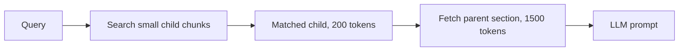

# Chunking

Chunking = splitting documents into small pieces that get embedded and retrieved. A big part of RAG quality is decided here: if a chunk is cut badly, the right answer is never retrieved. Interviewers ask: what strategies exist, how you pick chunk size, why overlap, and what parent-child is. The basic pipeline (size range, overlap, metadata, updates) is in the "chunking and embedding pipeline" section of [Vector databases](../05-db/11-vector.md); read it there. This page goes beyond it.

## ⭐ Chunking strategies

**In one line:** fixed-size is the simplest, recursive is the most common default, semantic and structure-aware are smarter but costlier.

> **Example:** A company leave policy PDF. Cut at a fixed 500 tokens and the "Maternity leave" heading lands in one chunk and its table in the next. Structure-aware chunking keeps the heading and table together.

| Strategy | How it splits | When to use |
|---|---|---|
| Fixed-size | every N tokens, with overlap | uniform text, quick baseline |
| Recursive | paragraph → line → sentence → word, up to size limit | default for most text |
| Semantic | where topic shifts in sentence embeddings | long mixed-topic docs |
| Structure-aware | headings, sections, tables, code blocks | Markdown, HTML, wiki, PDFs with headings |
| Page-level | one page = one unit | reports, contracts, specs → [PageIndex](06-pageindex.md) |

- **Fixed-size:** cheap and predictable, but cuts sentences/tables in the middle.
- **Recursive:** first tries to split on a big separator (`\n\n`); if the chunk is still too big, uses a smaller separator. Respects natural boundaries better.
- **Semantic:** compare embeddings of consecutive sentences; split where similarity drops sharply. Extra embedding cost at ingestion.
- **Structure-aware:** use the document's own structure. Never cut a table or code block.

```python
from langchain_text_splitters import RecursiveCharacterTextSplitter

splitter = RecursiveCharacterTextSplitter(
    chunk_size=2000,          # characters, roughly 500 tokens
    chunk_overlap=200,
    separators=["\n\n", "\n", ". ", " "],
)
chunks = splitter.split_text(policy_text)
```

**Interview tip:** "I would start with a recursive splitter, split on headings if the documents are structured, and compare on an eval set."

**Common mistake:** using one fixed-size chunker for every document type (FAQ, contract, code).

## ⭐ Chunk size and overlap trade-off

**In one line:** small chunk = precise match but little context; big chunk = full context but a blurred embedding and noise in the prompt.

| | Small chunks (100–300 tokens) | Big chunks (800–1500 tokens) |
|---|---|---|
| Retrieval precision | high, sharp embedding | lower, several topics mixed |
| Context for LLM | often partial, it fills gaps | full argument/table |
| Number of chunks | more, more storage | fewer |
| Good for | factoid Q ("how many leave days?") | "explain", "compare" type Q |

- Common default: roughly **300–800 tokens**, **10–20%** overlap (e.g. 512 tokens, 50 overlap).
- **Why overlap:** a sentence on the boundary appears in both chunks, so it is not lost to the cut. Too much overlap = duplicate chunks, more storage and cost.
- Do not make chunks larger than the embedding model's **max input**; otherwise they are silently truncated.
- Do not guess the size: measure recall@k for 2–3 sizes. → [RAG evaluation](08-rag-evaluation.md)

**Interview tip:** "Chunk size depends on query type: small for short factual queries, larger for explanatory ones. The final number comes from eval."

**Common mistake:** assuming "bigger chunk = more context = better". A big chunk's embedding becomes an average of several topics and does not get retrieved.

## ⭐ Parent-child (small-to-big) chunking

**In one line:** search over small child chunks (precise match), but give the LLM their larger parent chunk/section (full context).



- Only child embeddings go in the index; each child has a `parent_id` in its metadata.
- After retrieval, fetch the parent text by `parent_id`; if several children of one parent match, dedupe.
- Variants: **sentence window** (matched sentence + 2–3 sentences before and after), page-level retrieval with paragraph serving ([PageIndex](06-pageindex.md)).
- Trade-off: more tokens in the prompt; a very large parent raises cost and noise.

**Interview tip:** "If you need both precision and context, do not compromise on chunk size; use parent-child: search small, serve big."

**Common mistake:** also embedding the parents and putting them in the same index; then the big parents pollute the results.

## Metadata to keep with every chunk

**In one line:** metadata enables filtering, citations and parent lookup; the basic list ([doc_id, tenant, ACL, updated_at](../05-db/11-vector.md)) is on the vector DB page.

RAG-specific extras:
- `section_title` / heading path ("HR Policy > Leave > Maternity"): also prepend it to the chunk text, which gives a better embedding.
- `page_number`: for a "page 14" citation.
- `parent_id`, `chunk_index`: for parent-child and fetching neighbouring chunks.
- `content_type`: text / table / code, for different handling.
- Prepending a short doc-level context ("This chunk is from the Risk section of the FY24 annual report") improves retrieval (contextual chunking).

**Interview tip:** "I would prepend each chunk's heading path, so even a chunk like 'its limit is 10 days' matches its topic."

**Common mistake:** storing chunks without their heading; chunks full of "this" and "its" lose all meaning.

## Read more

- [Vector databases: chunking and embedding pipeline](../05-db/11-vector.md): size range, overlap, metadata, updates, chunk ids. Read the details here.
- [PageIndex](06-pageindex.md): using the page as the unit, for tables/cross-references.
- [Advanced retrieval](07-advanced-retrieval.md): small-to-big and contextual compression.
- [RAG lab](/viewinter/agents/labs/rag): change the chunk size and compare answers.

## Checklist

- [ ] I can explain the difference between fixed, recursive, semantic and structure-aware chunking
- [ ] I can explain the chunk size and overlap trade-off
- [ ] I can explain how I would decide chunk size using eval
- [ ] I can draw parent-child (small-to-big) retrieval
- [ ] I can say which metadata and heading context to keep with each chunk
