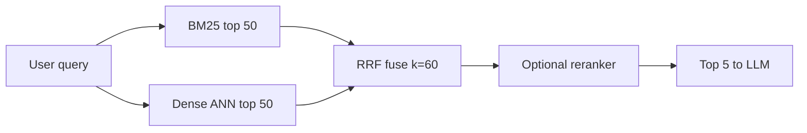

# Hybrid Search

Hybrid search means running one query through both a **dense (vector)** retriever and a **sparse (keyword: BM25/SPLADE)** retriever, then **fusing** the two result lists. Interviewers ask because vector-only search misses exact tokens like error codes, SKUs and clause numbers, and "what is RRF, why k=60" is a classic follow-up.

Embedding and BM25 basics are already on the site: [Vector databases](../05-db/11-vector.md) and [Search: Elasticsearch](../05-db/08-search.md). This page covers only the RAG angle.

## ⭐ Dense vs sparse: why you need both

**In one line:** dense captures **meaning**, sparse captures **exact words**, and they fail in different places, so together they give the best coverage.

> **Example:** a bot over Swiggy's internal API docs. Query: "What are the retry semantics for `ERR_CONN_RESET_4XX`?" Dense search returns "connection handling best practices" pages; the section that contains the exact code ranks **11th**. BM25 puts it at #1. The reverse: for "what happens when the gateway can't reach upstream?" BM25 fails and dense finds the right page instantly.

- **Dense** (embeddings, e.g. 768-dim): "car" ≈ "automobile". Strong for synonyms, paraphrase, conceptual questions.
- **Dense's problem:** an identifier is an irreducible token; its specificity gets "averaged out" in the embedding. This is the **vocabulary mismatch problem**. Not a bug, a design trade-off.
- **Sparse** (BM25): inverted index, exact token match. Strong for codes, SKUs (`SKU-7821-B`), legal clauses (`Section 4(b)(iii)`), version strings, proper nouns.
- **Sparse's problem:** no understanding of meaning. "car reliability" will not match "vehicle dependability".
- Analogy: dense = a friend who read the whole book and points you to the right section; sparse = the index at the back of the book, which understands nothing but finds every exact occurrence.
- They fail in **orthogonal** ways → for a mixed corpus (prose + identifiers), hybrid is the default architecture.

**Interview tip:** "Dense and sparse have different failure modes, so I run both in parallel and fuse with RRF. For a corpus with product or error codes, never dense-only."

**Common mistake:** assuming a good embedding model will also catch exact IDs. It won't, especially new or internal codes.

## BM25 and SPLADE, briefly

**In one line:** BM25 is classic keyword scoring (TF + IDF + length normalization); SPLADE is a transformer that produces a sparse vector and also does **term expansion** with synonyms.

- **BM25's 3 ingredients:**
  - **TF with saturation:** the first mention matters most; the 100th mention adds little over the 10th. `k1 ≈ 1.2–2.0`.
  - **IDF:** rare term = high weight. `ERR_CONN_RESET_4XX` has a very high IDF, "the" almost zero.
  - **Length normalization:** `b ≈ 0.75`. 3 hits in 50 words > 3 hits in 5,000 words.
- BM25: fast, explainable, no GPU, Elasticsearch's default.
- **SPLADE:** a vocab-size (30k+ dims) sparse vector, mostly zeros. The weights are **learned**. "car" also puts weight on vehicle and automobile.
- Example "HTTP connection timeout": BM25 matches exact tokens; dense finds networking-delay docs; SPLADE matches exact tokens + `socket`, `TCP`, `503`, `keepalive`.
- **SPLADE's cons:** transformer inference on the query (roughly 100–300ms); no learned expansion for new out-of-vocabulary codes, where BM25 is better.
- Production tip: precompute document SPLADE vectors at index time (Qdrant supports sparse vectors natively), encode only the query at query time.

| | BM25 | SPLADE | Dense |
|---|---|---|---|
| What it matches | exact tokens | tokens + learned synonyms | meaning |
| New codes/IDs | best | weak (no expansion) | weak |
| Synonyms | no | yes (trained terms) | yes |
| Cost | cheap, CPU | transformer inference | embedding + ANN |

## ⭐ Reciprocal Rank Fusion (RRF)

**In one line:** forget the scores, use only the **rank**: `RRF(d) = Σ 1 / (k + rank(d))`, default **k = 60**.

- **Why the naive approach breaks:** BM25 scores run 0–15, cosine 0.6–0.95; the distributions have different shapes, and outliers wreck min-max normalization. Adding them directly is wrong.
- RRF needs no normalization, so it is robust and tuning-free.
- **Worked example (k=60):** Dense: A1, B2, C3, D4. Sparse: C1, D2, E3, A4.
  - A = 1/61 + 1/64 = 0.0320
  - C = 1/63 + 1/61 = **0.0323**
  - D = 1/64 + 1/62 = 0.0318
  - B = 1/62 = 0.0161, E = 1/63 = 0.0159
  - Final: **C → A → D → B → E**. C is high in both lists, so it beats A (only dense's #1). **Agreement beats one system's love.**
- **Why k=60:** it smooths the rank cliff. Rank 1 = 1/61 ≈ 0.0164, rank 10 = 1/70 ≈ 0.0143. With k=0, rank 1 = 1.0 and rank 2 = 0.5, far too steep. The original RRF paper found 60 works well empirically.
- **Small corpus (≈50–300 docs/pages):** use k = 10–20. In the author's 80-document pilot, hybrid with k=60 did worse than dense-only; switching to k=10 fixed it.

```python
def rrf(ranked_lists, k=60):
    scores = {}
    for results in ranked_lists:            # e.g. [bm25_ids, dense_ids]
        for rank, doc_id in enumerate(results, start=1):
            scores[doc_id] = scores.get(doc_id, 0) + 1 / (k + rank)
    return sorted(scores, key=scores.get, reverse=True)
```



**Interview tip:** "RRF uses only ranks, so the different scales of BM25 and cosine stop mattering. k=60 is the default; on a small corpus I lower k to 10–20."

**Common mistake:** adding BM25 and cosine scores without normalization, or blindly keeping k=60 on a 100-document corpus.

## Weighted fusion and other options

**In one line:** use weighted fusion when you trust one retriever more; otherwise **"RRF, always, until data says otherwise."**

- **Linear interpolation:** `score = α·dense + (1−α)·sparse` (normalized scores). Respects magnitude, but normalization is fragile and α must be tuned. Weaviate's `alpha` is this.
- Outlier bug: if one doc repeats a term 200 times, min-max squashes every other doc toward 0. RRF is immune.
- **Weighted RRF / candidate skew:** for jargon-heavy corpora (legal, API docs, logs), give sparse more candidates, e.g. sparse top-100, dense top-30. Reverse it for conversational corpora.
- **CombSUM / CombMNZ:** sum of normalized scores (MNZ boosts docs found by several systems). In practice RRF matches or beats them.
- **Learned fusion:** a small model (logistic regression) over features + scores. Consider it once you have thousands of labeled query-relevance pairs.

## ⭐ When to use which

| Situation | Choice |
|---|---|
| Natural-language FAQ, paraphrase heavy | Dense (hybrid optional) |
| Codes, SKUs, error IDs, legal clauses | Hybrid, weight sparse higher |
| Mixed prose + identifiers (most company docs) | Hybrid: BM25 + dense + RRF |
| Need synonyms but also exact match | SPLADE + dense |
| Small corpus (< 300 docs) | Hybrid, RRF k = 10–20 |
| Thousands of labeled pairs | Try learned fusion |

- Production lessons:
  - Run BM25 and dense **in parallel** (`asyncio.gather`). Roughly BM25 40–60ms, ANN 80–120ms → parallel ≈ 120ms, sequential ≈ 180ms.
  - **Index sync:** the BM25 index and the vector index are separate artifacts; updates/deletes must hit both atomically. Stale BM25 = weird bugs. Elasticsearch/OpenSearch can hold both in one place.
  - Measure: 50 real queries, Precision@5 and MRR before/after. The author's result: **MRR 0.41 (dense) → 0.67 (hybrid)**.
- Next step after hybrid: [Reranking](05-reranking.md).

**Interview tip:** "For most teams BM25 + dense + RRF is the destination. SPLADE or learned fusion only when the eval set shows a gain."

**Common mistake:** forgetting the BM25 index in the re-index pipeline, so vectors are fresh but the keyword index is stale.

## Read more

- [Vector databases](../05-db/11-vector.md): embeddings, ANN, the short version of hybrid. Details there.
- [Search: Elasticsearch](../05-db/08-search.md): inverted index and BM25 scoring.
- [Reranking](05-reranking.md): how to raise precision after hybrid.
- [RAG lab](/viewinter/agents/labs/rag): run a PDF-chat RAG in the browser.

## Checklist

- [ ] I can explain the different failure modes of dense and sparse with an example
- [ ] I can explain BM25's TF saturation, IDF and length normalization
- [ ] I can say how SPLADE differs from BM25 and when not to use it
- [ ] I can write the RRF formula and compute a small example by hand
- [ ] I can explain why k=60 and why to lower k on a small corpus
- [ ] I can justify choosing RRF vs weighted fusion
