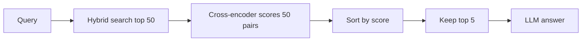

# Reranking

Reranking means a cheap retriever first brings back many candidates, then a **smarter, query-aware model** re-scores them and puts them in the right order. Interviewers ask because "bi-encoder vs cross-encoder", "two-stage retrieval" and "how many candidates will you rerank" are standard RAG design questions.

## ⭐ The problem: recall is fine, position 1 is wrong

**In one line:** vector search gets the right chunk into the top-5 but often puts it at position 3–5; the LLM needs the right thing at position 1.

> **Example:** an HR policy bot. "Can leave be encashed during the notice period?" The right paragraph is in the top-5 but at #4; #1 is a generic "leave policy overview". The LLM hedges or answers wrongly. Changing chunking, the embedding model and the prompt did nothing; logging the **position** of the gold chunk revealed the real problem.

- Embedding models are **not trained to rank**; they are trained for semantic similarity. ANN is optimized for **recall**, not precision.
- Every document was encoded independently, without knowing the query, so cosine is a "blunt instrument". The order of the top-20 is largely noise.
- Analogy: the net catches the right fish, but which one lands first is random.
- The real metric: **precision at position 1**, not just recall@k.

**Interview tip:** "Retrieval is for recall, reranking is for precision. I log the gold chunk's rank to tell whether the problem is retrieval or ranking."

**Common mistake:** expecting precise ranking from a bi-encoder (embedding search).

## ⭐ Two-stage: retrieve → rerank → truncate → generate

**In one line:** in Stage 1 cast a wide net (N = 50) for recall; in Stage 2 use a cross-encoder to ruthlessly pick the top K = 3–7.



- **N (candidates):** typically **50**; going above 100 rarely helps and only adds latency.
- **K (to the LLM):** **3–7**. Default ratio **N=50 → K=5 (10:1)**.
- **N >> K is essential:** with N=10, K=5 the reranker has no room to reshuffle. Minimum N = 30–50.
- Stage 1 should ideally be hybrid (dense + BM25 + RRF), see [Hybrid Search](04-hybrid-search.md).
- Assemble the context in reranked order with the best chunk on top (LLMs "lose the middle" and ignore what is buried there).
- **Debug:** low NDCG@5? Gold answer not in the top-50 → retrieval problem. In the top-50 but scored low → reranker problem.

**Interview tip:** "I retrieve the top 50, rerank with a cross-encoder and pass the top 5 to the LLM. Large N for recall, small K for precision and token cost."

**Common mistake:** reranking the top-5 down to the top-3. With so few candidates the reranker can't change much.

## ⭐ Bi-encoder vs cross-encoder

**In one line:** a bi-encoder encodes query and doc **separately** (fast, can be precomputed); a cross-encoder feeds them **together** into one model (slow, but much more accurate).

| | Bi-encoder | Cross-encoder |
|---|---|---|
| Input | query, doc separately | `[CLS] query [SEP] doc [SEP]` together |
| Interaction | only cosine of vectors | cross-attention on every token |
| Precompute docs? | yes, offline | no, per query |
| Scale | millions of docs, in ms | only ~50–100 candidates |
| Use | Stage 1 retrieval | Stage 2 reranking |

- Cross-encoder output: one relevance score (typically a sigmoid on [CLS]), better calibrated than cosine.
- Example: it matches "side effects of metformin in diabetic patients over 65" to a doc with exactly that clinical context at the term level; a bi-encoder only compares the "gist".
- Why not cross-encoders everywhere: **O(N) forward passes per query**. Over 10M docs it would take minutes. So the two complement each other.

```python
from sentence_transformers import CrossEncoder

model = CrossEncoder("cross-encoder/ms-marco-MiniLM-L-6-v2", max_length=512)

def rerank(query, candidates, top_k=5):
    pairs = [(query, c["text"]) for c in candidates]   # original user query!
    scores = model.predict(pairs, batch_size=32)
    for c, s in zip(candidates, scores):
        c["rerank_score"] = float(s)
    return sorted(candidates, key=lambda c: c["rerank_score"], reverse=True)[:top_k]
```

**Interview tip:** "The bi-encoder gives scale, the cross-encoder gives precision. They are not replacements for each other; they are two stages of the pipeline."

**Common mistake:** saying you'll search the whole corpus with a cross-encoder.

## Options: open-source, Cohere Rerank, FlashRank, LLM

**In one line:** start with FlashRank (cheap, fast); if you need a higher quality ceiling use a cross-encoder or Cohere; use LLM reranking only for high-stakes cases.

| Option | Latency (N=50, roughly) | When |
|---|---|---|
| MiniLM cross-encoder, CPU | 100–250ms | self-host, no API cost |
| Same, GPU | < 50ms | you already have a GPU |
| FlashRank (quantized, CPU) | 15–30ms | tight SLA, CPU-only infra |
| Cohere Rerank API | 150–400ms + network | no ops, early stage |
| LLM listwise (RankGPT) | 2–5 s | medical/legal, offline batch |

- **Open-source:** `ms-marco-MiniLM-L-6-v2` (fast default), `bge-reranker-v2-m3` (multilingual, heavier, consider it for Hindi/regional docs), `ms-marco-electra-base` (better but 3–4x slower). Works offline/air-gapped.
- **Cohere Rerank:** send query + doc strings, get ordered scores back. Gotchas: doc length limit → truncation; p99 spikes under load; per-call cost grows at millions of queries/day. Keep a **local fallback + circuit breaker**.
- **FlashRank:** small quantized models, ~20ms on CPU. Roughly 85–90% of cross-encoder quality. TinyBERT is 2x faster but much weaker on complex queries; benchmark it.
- **LLM reranking (RankGPT):** give the LLM the passages and let it output the order. Highest ceiling, but roughly $0.01–0.03/query and seconds of latency. Not a default.

## When reranking isn't worth it + common mistakes

- **Skip it when:** the corpus is small and the answer already comes at #1; the latency budget is so tight that even 20ms is too much (autocomplete); the reranker's domain differs (MS MARCO web data vs legal/medical/code) and your eval shows no gain.
- After hybrid search, the extra gain from reranking is smaller than over a dense-only baseline. The author saw **~12–18 points of NDCG@5** in some pipelines, and only 2 points for 200ms in others.
- **Mistakes:**
  - Passing the rewritten/HyDE query to the reranker. Always pass the **original user query**.
  - 512-token **silent truncation**: the reranker never sees the relevant second half of a long chunk. Truncate explicitly and log it.
  - Deciding without an eval: build 50–100 (query, expected doc) pairs and compare NDCG@5 / MRR before and after.
- For the cost/latency side see [Caching](../01-topics/05-caching.md) and [Reliability & observability](../01-topics/20-reliability-observability.md).

**Interview tip:** "Start with FlashRank, measure NDCG@5 before/after, then decide whether you need Cohere's quality or FlashRank's speed. Under a sub-200ms SLA you can even skip reranking for short queries."

**Common mistake:** treating the reranker as a free lunch and not checking its effect on p95 latency.

## Read more

- [Hybrid Search](04-hybrid-search.md): BM25 + dense + RRF for Stage 1.
- [Vector databases](../05-db/11-vector.md): bi-encoder embeddings and ANN. Details there.
- [Caching](../01-topics/05-caching.md): caching rerank results for repeated queries.
- [RAG lab](/viewinter/agents/labs/rag): run a RAG in the browser.

## Checklist

- [ ] I can explain two-stage retrieval (recall, then precision)
- [ ] I can explain the difference and trade-off between bi-encoder and cross-encoder
- [ ] I can justify numbers like N=50 → K=5
- [ ] I can choose between cross-encoder, Cohere, FlashRank and an LLM reranker by latency
- [ ] I can say when reranking should be skipped
- [ ] I can measure reranking impact with NDCG@5 / MRR
