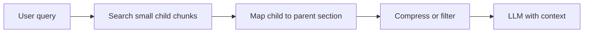

# Advanced Retrieval

Basic RAG means: embed the query, fetch the top-k chunks, hand them to the LLM. It breaks on real users' messy questions. Advanced retrieval techniques fix the query, fetch context of the right size, and show it to the LLM the right way. Interviewers ask: "How would you improve retrieval quality without changing the embedding model?"

## ⭐ Query side: rewriting, multi-query, HyDE

**In one line:** don't search the user's question as-is; make it search-friendly first.

> **Example:** on a Swiggy support bot a user types "yesterday's order still not here, money back?" That raw text can miss the "refund policy for undelivered orders" chunk.

- **Query rewriting:** have an LLM turn the query into a clean, standalone search query. In chat, complete follow-ups like "and that one?" from history (`"and that one?" → "refund rule for Premium plan"`).
- **Multi-query:** the LLM generates 3–5 phrasings, retrieve with each, merge with [RRF](04-hybrid-search.md). Recall goes up; cost is 3–5x retrieval calls.
- **Query decomposition:** split a complex question into sub-questions ("compare Q3 vs Q4 revenue" → two lookups).
- **HyDE (Hypothetical Document Embeddings):** the LLM first writes a *fake answer*; embed that answer and search with it. Answer-like text sits closer to real answer chunks than the question does.
- **Step-back prompting:** derive a more general question from a specific one ("80C limit in 2023?" → "what are the 80C rules?").

| Technique | When to use | Cost |
|---|---|---|
| Rewriting | Chat follow-ups, messy queries | 1 small LLM call |
| Multi-query | Low recall, ambiguous query | 3–5x retrieval |
| HyDE | Short query, long technical docs | 1 LLM call, hallucinated text risk |
| Decomposition | Multi-hop, comparison questions | N retrievals |

**Interview tip:** "The cheapest win is query rewriting, especially in chat. I add multi-query or HyDE only when eval shows low recall@k."
**Common mistake:** applying HyDE to every query. If the LLM doesn't know the domain, the fake answer steers the search the wrong way, and latency goes up.

## ⭐ Chunk side: parent-child (small-to-big) and contextual compression

**In one line:** *search* with small chunks (precise match), but *give* the LLM the bigger parent chunk (full context).

- **Parent-child / small-to-big:** embed 100–200 token child chunks and store a `parent_id` with each. Match on the child; the LLM gets the 1000–2000 token parent. A direct answer to the chunk-size dilemma ([Chunking](03-chunking.md)).
- **Sentence window:** add N sentences before and after the matched sentence. Same idea, smaller scale.
- **Contextual compression:** after retrieval, drop irrelevant sentences (extract with an LLM or a small model). Fewer tokens, less noise.
- **Contextual retrieval:** at indexing time, prepend 1–2 lines of context to each chunk ("This chunk is from the risk section of HDFC's 2024 annual report"). The chunk makes sense on its own.
- For long, structured documents, use a tree-based approach: [PageIndex](06-pageindex.md).

**Interview tip:** "Small chunks for precision, big context for comprehension; parent-child gives both."
**Common mistake:** making parents too big; 5 parents x 3000 tokens fills the context window, raising cost and lost-in-the-middle risk.

## Agentic RAG and GraphRAG (short)

- **Agentic RAG:** the LLM decides whether to retrieve, which tool or index to use, and searches again if results are weak. Loop: `plan → retrieve → check → retrieve again → answer`.
- Upside: multi-hop questions, multiple sources (docs + SQL + API). Downside: 2–5x latency, unpredictable cost, harder to debug.
- **Self-RAG / Corrective RAG:** grade the retrieved chunks; if they are poor, rewrite the query or fall back to web search.
- **GraphRAG:** extract entities and relations into a knowledge graph and build community summaries. Good for global questions like "what are the main themes across this whole dataset?", where top-k chunks are not enough.
- GraphRAG's cost: many LLM calls at indexing, and updating the graph is expensive. Not a default choice.

**Interview tip:** "Start with a simple pipeline plus eval. Go agentic only when questions are truly multi-step."

## ⭐ Giving context: lost-in-the-middle and citations

**In one line:** LLMs pay the least attention to information in the middle of the context, so both order and quantity matter.

- **Lost in the middle:** research showed models use information at the start and end best and miss what's in the middle. Stuffing more chunks can make answers worse.
- Fix: [rerank](05-reranking.md) and send only the top 3–5; put the most relevant at the start (or end).
- **Citations:** give each chunk an id (`[1] hr-policy.pdf p.12`) and tell the prompt "write the source id after each claim". Show clickable sources in the UI.
- Verify citations: check that each quoted id was actually in the context. Needed for both trust and debugging.
- Tell the prompt: "If the answer isn't in the context, say you don't know." This is the cheapest hallucination guard.

**Interview tip:** "A bigger top-k isn't free: cost, latency and lost-in-the-middle. I retrieve 50, rerank, and send 5 with citations."
**Common mistake:** dumping 20 chunks into the LLM thinking "more context = better answer".

## Read more

- [Vector databases](../05-db/11-vector.md): embeddings, ANN, metadata filters. Read the details here.
- [Hybrid Search](04-hybrid-search.md): RRF, for merging multi-query results.
- [Reranking](05-reranking.md): the retrieve-then-rerank pattern.
- [PageIndex](06-pageindex.md): tree retrieval for structured long docs.
- [RAG lab](/viewinter/agents/labs/rag): run a PDF-chat RAG in the browser.

## Checklist

- [ ] I can explain the difference and trade-offs between query rewriting, multi-query and HyDE
- [ ] I can draw parent-child (small-to-big) retrieval
- [ ] I can explain the difference between contextual compression and contextual retrieval
- [ ] I can say when agentic RAG and GraphRAG are worth it
- [ ] I can explain lost-in-the-middle and its fix
- [ ] I can explain how to add and verify citations
