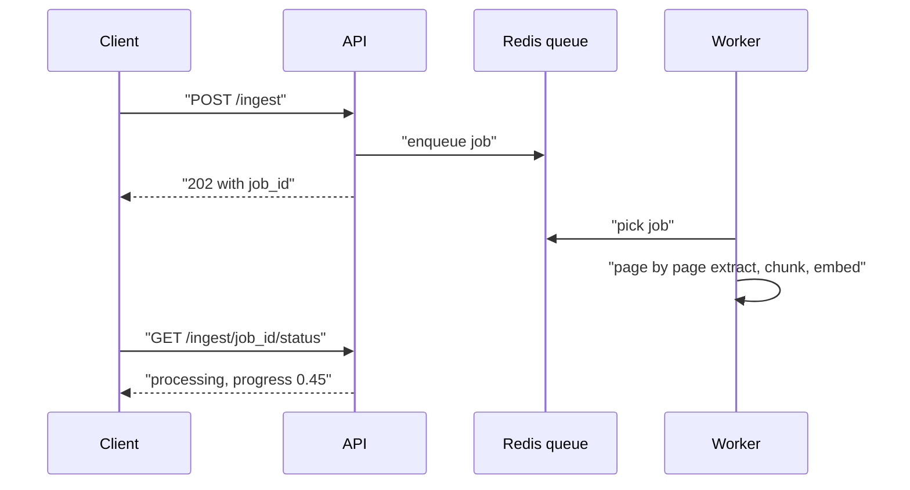

# Production RAG API

A localhost demo and production are far apart: a 400-page PDF upload times out at 60s, a half-indexed document gets queried, three users at once trigger embedding API 429s, and a scanned PDF OOMs a worker silently. This page shows how to turn RAG from "a demo dressed up as a product" into a real service. Interviewers use exactly this to check backend sense.

## ⭐ Async ingestion queue

**In one line:** never ingest inside the upload request; put a job on a queue and return `202 Accepted` + `job_id` immediately.

> **Example:** on a legal-tech app a 200-page PDF + OCR takes 3–4 min (10+ min for dense scans). Nginx/ALB cut the request at 60s, Cloudflare at 100s.

- `POST /ingest` → `{job_id, status: "queued"}` in under 100ms. `GET /ingest/{id}/status` → progress, pages processed. Optional webhook on completion.
- Queue options: **Celery + Redis** (battle-tested, heavy), **ARQ** (light, async), **Dramatiq** (in between), **BullMQ** (Node).
- **Partial failure:** if OCR fails on page 47, don't fail the whole job. Keep per-page status so the other 199 pages stay queryable.
- Don't put PDF bytes on the queue; send a file path or S3 reference (Redis message size and memory).
- Keep jobs idempotent: a client retry must not create a duplicate job writing conflicting state ([Idempotency](../01-topics/10-idempotency-retries.md)).

**Interview tip:** "No single timeout can serve both normal requests and 10-minute ingestion, so: async job + status endpoint."
**Common mistake:** synchronous ingestion; the client disconnects, retries, and two jobs write partial chunks into the vector DB.

## ⭐ Streaming with SSE

**In one line:** retrieval + rerank alone take ~0.5–1.3s, so stream progress events and tokens so the screen never looks blank.

- Event order: `progress(retrieving)` → `progress(reranking)` → `context` (sources) → `progress(generating)` → `token`... → `done` / `error`.
- **SSE vs WebSocket:** RAG is one-way (server → client). SSE is HTTP-native, passes proxies/CDNs, and the browser `EventSource` auto-reconnects. Use WebSockets only if you need bidirectional traffic ([Real-time communication](../01-topics/08-real-time-communication.md)).
- **Buffering is the killer:** Nginx `proxy_buffering off;` + header `X-Accel-Buffering: no`, or all tokens arrive at once at the end.
- Check `request.is_disconnected()` on each chunk; if the user left, stop generating, or you pay for tokens nobody reads.
- The LLM client's default timeout (httpx 5s) is too short for streams; set a long one.

**Interview tip:** "For users the most important number is time-to-first-token, not total time."

## Rate limits, batching and embedding cache

- 200 pages ≈ 800 chunks; one call per chunk = 429s. Fix: **batch** (~8000 tokens/batch), cap concurrency with a **semaphore** (e.g. 10), **exponential backoff + jitter** on 429. Jitter prevents retry storms. Details: [Rate limiting](../01-topics/11-rate-limiting.md).
- Last-resort fallback: a local embedding model (e.g. `all-MiniLM-L6-v2`), slightly lower quality but no rate limits. Careful: don't mix vectors from different models in the same index.
- **Large PDFs:** PyMuPDF uses 2–5x the file size in memory. Read with a page-by-page generator (memory ~1–2 pages), send scanned pages (< 50 chars of text) to OCR, validate size up front.
- **Embedding cache:** in the notes ~28% of chunks were duplicates (disclaimers, boilerplate). Key = `SHA-256(normalize(text) | model_name | model_version)`; switching models invalidates the cache automatically.
- Two layers: in-process LRU (sub-ms) → Redis (2–5ms). Store vectors as raw float32 bytes (~6KB vs ~30KB JSON for 1536 dims).

## ⭐ Caching, guardrails and access control

**In one line:** save cost with answer caching, defend against prompt injection, and show users only the chunks they are allowed to see.

- **Exact cache:** normalized query + filters + index version → answer. Cheap, but low hit rate.
- **Semantic cache:** if a past query's embedding is close (cosine > ~0.95), return its answer. Big savings on FAQ-style traffic; a bad threshold returns wrong answers. The cache key must include tenant/user role ([Caching](../01-topics/05-caching.md)).
- **Prompt injection:** retrieved docs can also say "ignore previous instructions". Mark context as data (delimiters), put rules in the system prompt, check outputs, give tools least privilege.
- **Guardrails:** PII/abuse filter on input, a "supported by context?" check on output, polite refusal for off-topic questions.
- **Access control / multi-tenancy:** put `tenant_id`, `acl_groups` metadata on every chunk; apply a **pre-filter** during retrieval, not after the LLM. Separate namespace/index for large tenants ([metadata filter](../05-db/11-vector.md)).
- **Freshness / re-indexing:** on doc update → delete old chunks + upsert new ones (by doc_id). Use content hashes to re-embed only changed chunks. Embedding model change → full re-index into a new index, then switch an alias (blue-green).

**Interview tip:** "The permission check is a filter inside retrieval; the LLM never receives a chunk the user can't see."
**Common mistake:** all tenants' data in one index without filters, relying on "we'll tell the LLM not to show it".

## Cost, latency budget and observability

| Stage | Rough latency |
|---|---|
| Query embed + retrieval | 100–350 ms |
| Cross-encoder rerank | 200–500 ms |
| LLM first token | 0.5–1.5 s |

- Log per request: `retrieval_ms`, `rerank_ms`, `llm_ttft_ms`, `total_ms`, chunks retrieved/after rerank, cache hit, input/output tokens, `request_id`.
- Ingestion: pages/sec per worker, cache hit rate, **queue depth**, worker OOM restarts.
- **Alert on:** rate-limit errors > 5%, queue depth > 100, OOM kills. **Track weekly:** cache hit rate, avg retrieval latency, token cost per query.
- Cost levers: fewer chunks to the LLM, a smaller model for simple queries, semantic cache, embedding cache.
- **Deploy:** API and workers in separate containers. The API scales on HTTP load, workers on queue depth (KEDA). Worker memory limit ~2GB; let the orchestrator restart on OOM. Graceful shutdown: on SIGTERM stop taking new jobs, finish running ones.
- Priority order from the notes: async ingestion → streaming → rate limits → memory → caching (an optimization, last).

## Read more

- [Caching](../01-topics/05-caching.md), [Rate limiting](../01-topics/11-rate-limiting.md), [Reliability and observability](../01-topics/20-reliability-observability.md)
- [Message queues](../01-topics/07-message-queues-kafka.md): for the ingestion queue.
- [Vector databases](../05-db/11-vector.md): namespaces, metadata pre-filter. Read the details here.
- [Hybrid Search](04-hybrid-search.md), [Reranking](05-reranking.md): stages of the query pipeline.
- [RAG lab](/viewinter/agents/labs/rag)

## Checklist

- [ ] I can explain async ingestion (202 + job_id + status) and partial failure handling
- [ ] I can explain SSE streaming events, SSE vs WebSocket and the buffering issue
- [ ] I can explain batching, semaphores, and backoff + jitter for rate limits
- [ ] I can explain the embedding cache key and the risk of a semantic cache
- [ ] I can explain the multi-tenant access-control pre-filter and prompt injection defence
- [ ] I can state the latency budget and which metrics to alert on
