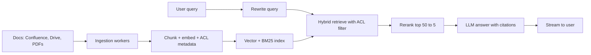

# RAG Interview Q&A

This page is for revision: a common HLD question ("design a RAG chatbot over company docs") in short steps, then rapid-fire Q&A. Each answer is 2–3 lines, the way you should say it in an interview. See the linked pages for detail.

## ⭐ Design: RAG chatbot over company docs

**In one line:** two pipelines: offline ingestion (docs → chunks → index) and online query (query → retrieve → rerank → LLM with citations), plus permissions and eval.

> **Example:** a 5,000-employee company with Confluence + Google Drive + HR PDFs. "What is my notice period?" needs a correct, cited answer, and an intern must not see the salary-band doc.

1. **Requirements:** how many docs/users, freshness (minutes or days?), latency (first token < ~2s), permissions, languages.
2. **Ingestion:** connectors + change webhooks → async queue → parse (OCR for scans) → structure-aware chunking ~300–800 tokens → embed (with cache) → upsert with `doc_id, tenant, acl_groups, updated_at`. ([Production RAG API](09-production-rag-api.md))
3. **Index:** vector (HNSW) + BM25, or one DB that does both. At small scale pgvector is enough ([Vector databases](../05-db/11-vector.md)).
4. **Query:** rewrite (chat history) → hybrid retrieve top-50 with ACL pre-filter → [rerank](05-reranking.md) to 5 → prompt "only from context, give citations, say if you don't know".
5. **Serve:** SSE streaming, per-tenant semantic cache, per-user rate limit.
6. **Eval and monitor:** golden set (recall@k, nDCG, faithfulness), thumbs up/down, latency/cost dashboards ([RAG Evaluation](08-rag-evaluation.md)).
7. **Scale/trade-offs:** scale workers on queue depth, blue-green re-index, agentic only for multi-hop.

**Interview tip:** bring up permissions and eval yourself; most candidates forget them, and they are the senior signal.
**Common mistake:** saying "LangChain + Pinecone" and stopping, with no ingestion, ACL or eval.

## ⭐ Rapid-fire: fundamentals

**Q1. RAG vs fine-tuning vs long context?**
RAG = fresh, private knowledge + citations, cheap data updates. Fine-tuning = teaches style/format/behaviour, weak for facts and expensive to update. Long context = simple for a small corpus, but cost/latency on every query and lost-in-the-middle. Usually RAG + some prompt engineering is enough.

**Q2. Why does the LLM still hallucinate with RAG?**
Retrieval brought wrong or partial context, the context conflicts, or the model fell back on its training knowledge. Fix: better retrieval + rerank, a "say you don't know" prompt, citations, faithfulness eval.

**Q3. How do you choose chunk size?**
By doc type and query type: small for FAQs, larger with overlap for policy/legal. Typically 300–800 tokens, 10–20% overlap. Decide finally by recall@k on the golden set. ([Chunking](03-chunking.md))

**Q4. When hybrid search?**
When queries contain exact terms: error codes, SKUs, names, acronyms. Dense misses them, BM25 catches them; merge with RRF. ([Hybrid Search](04-hybrid-search.md))

**Q5. When do you add a reranker, and when not?**
When the right chunk is in the top-50 but not the top-5. Skip it when the corpus is small, the latency budget is very tight, or eval shows negligible gain. Rerank 30–50 candidates, not 5.

**Q6. Bi-encoder vs cross-encoder?**
A bi-encoder embeds query and doc separately: fast, pre-computable (retrieval). A cross-encoder reads both together: accurate but slow (reranking only).

**Q7. What if you need to change the embedding model?**
Old and new vectors aren't comparable. Re-embed everything into a new index, run eval, then switch an alias. Include the model version in the cache key.

## ⭐ Rapid-fire: production and design

**Q8. How do you handle multi-tenant permissions?**
Tenant/ACL metadata on every chunk, pre-filter during retrieval; a separate namespace for large tenants. Don't rely on the LLM prompt.

**Q9. Docs keep changing; how do you keep it fresh?**
Change webhooks/CDC → delete old chunks by doc_id + upsert new ones, re-embed only changed chunks using content hashes. Recency boost via `updated_at` metadata.

**Q10. How do you reduce latency?**
Stream tokens (TTFT matters), semantic cache, a smaller rerank model, fewer chunks to the LLM, run retrieval and history rewrite in parallel where possible.

**Q11. How do you reduce cost?**
Embedding cache (dedupe boilerplate), semantic answer cache, fewer context tokens, a smaller model for simple queries, batched embeddings.

**Q12. Prompt injection via documents?**
Treat retrieved text as untrusted data: delimiters, system rules, output checks, least-privilege tools, human confirmation for sensitive actions.

**Q13. How do you measure quality?**
Golden set: recall@k/nDCG for retrieval, faithfulness/answer relevance for generation (RAGAS, LLM-as-judge), thumbs + A/B in production. ([RAG Evaluation](08-rag-evaluation.md))

**Q14. When is a vector DB not needed?**
A few thousand chunks: pgvector or in-memory is enough. A very small corpus: put it all in long context. ([Vector databases](../05-db/11-vector.md))

**Q15. When agentic RAG or GraphRAG?**
Agentic: multi-hop, multiple sources, retries needed. GraphRAG: global questions like "themes across the whole dataset". Both are expensive; use them after a simple pipeline + eval. ([Advanced Retrieval](07-advanced-retrieval.md))

## Read more

- [What is RAG](01-what-is-rag.md), [Semantic Search](02-semantic-search.md), [Chunking](03-chunking.md)
- [Hybrid Search](04-hybrid-search.md), [Reranking](05-reranking.md), [PageIndex](06-pageindex.md)
- [Advanced Retrieval](07-advanced-retrieval.md), [RAG Evaluation](08-rag-evaluation.md), [Production RAG API](09-production-rag-api.md)
- [RAG lab](/viewinter/agents/labs/rag): try it yourself.

## Checklist

- [ ] I can draw and explain the company-docs RAG chatbot HLD in 7 steps
- [ ] I can explain RAG vs fine-tuning vs long context in 30 seconds
- [ ] I can state the reasons for hallucination and their fixes
- [ ] I can justify chunk size, hybrid and rerank decisions
- [ ] I can answer questions on permissions, freshness, latency and cost
- [ ] I can say how I'd measure quality, naming the metrics
