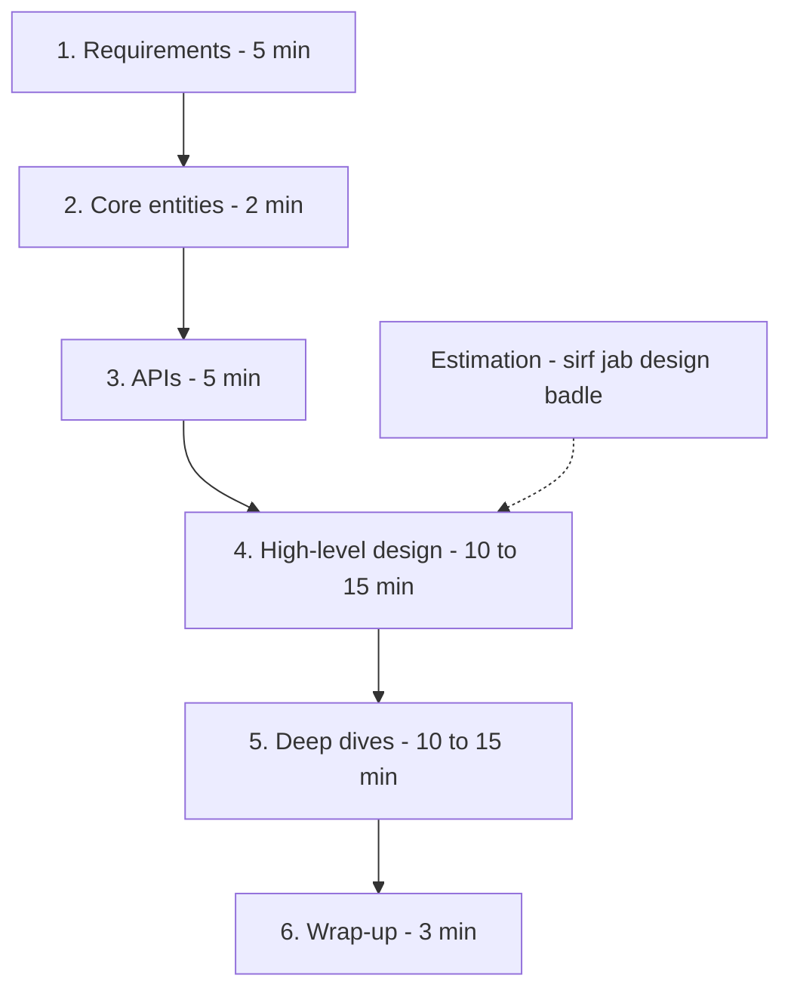

# Interview Framework

**Ek line me:** 45 min ke HLD round ko ek fixed structure me chalao (requirements → entities → API → HLD → deep dives → wrap-up), taaki tum conversation drive karo aur interviewer ke har scoring box me tick lage.

> **Example:** Interviewer bolta hai "Design WhatsApp". Weak candidate seedha boxes banana shuru karta hai aur 30 min baad pata chalta hai ki group chat scope me tha hi nahi. Strong candidate pehle 5 min poochta hai, phir ek clean flow me design karta hai, aur last 15 min me wahi deep dive karta hai jahan interviewer dekhna chahta tha.

## 45-min flow

| Step | Time | Kya karna hai | Output (board pe) |
|---|---|---|---|
| **1. Requirements** | ~5 min | Functional (3–4 core features), non-functional (scale, latency, consistency vs availability), out of scope | Do lists: FR aur NFR |
| **2. Core entities** | ~2 min | Main nouns: User, Tweet, Follow, Booking | Entity list (abhi columns nahi) |
| **3. APIs** | ~5 min | Har FR ke liye ek endpoint. REST kaafi hai | `POST /bookings` jaisi lines |
| **4. HLD** | 10–15 min | Client → gateway → services → DB/cache/queue. Har FR ka flow diagram pe chala ke dikhao | Ek clean diagram |
| **5. Deep dives** | 10–15 min | NFR satisfy karo: scale, contention, failure, hot keys | 2–3 problems ka solid solution |
| **6. Wrap-up** | ~3 min | Bottlenecks, trade-offs, "aur time hota to" | 3–4 bullet improvements |

**Estimation:** Har baar 10 min ki math mat karo. Sirf woh number nikalo jo decision badle ("12 writes/sec hai, ek Postgres kaafi hai" ya "1M QPS reads hai, cache zaroori hai"). Interviewer se poochh lo: "Kya main estimation abhi karoon ya jahan zarurat padegi wahan?"

## Interviewer kya score karta hai (rubric)

| Step | Score kis cheez pe | Red flag |
|---|---|---|
| Requirements | Problem ko scope kar paana, sahi sawal poochhna, NFR ko numbers me bolna | Bina poochhe design shuru |
| Entities + API | Clean abstraction, sahi naming, pagination/idempotency ka dhyan | 20 endpoints, ya API bhool jaana |
| HLD | Kaam karne wala end-to-end design, har FR covered | Buzzwords bina flow ke ("yahan Kafka laga do") |
| Deep dives | Depth, trade-offs, alternatives compare karna | Ek hi option bolna, "kyun" na batana |
| Communication (poore time) | Sochte hue bolna, interviewer ke hints pakadna | Chup chaap 5 min sochna, ya interviewer ki baat kaatna |

Rubric ke 4 bade buckets yaad rakho: **Problem navigation, Solution design, Technical depth, Communication**.

## Conversation kaise drive karo

- Har step ke start pe signpost karo: "Ab main APIs define karta hoon, phir HLD."
- Har step ke end pe check-in: "Kya ye theek lag raha hai, ya kisi part pe zyada jaana chahenge?"
- Pehle **simple working design** banao, phir scale karo. Shuru me hi sharding mat ghusao.
- Deep dive khud propose karo: "Mujhe lagta hai sabse interesting part double booking hai. Wahan chalein?"
- Interviewer hint de ("agar ek celebrity ke 10M followers ho to?") to wahi signal hai. Turant us direction me jao.

## Ready phrases

- "Design shuru karne se pehle main kuch sawal poochhna chahunga."
- "Main assume kar raha hoon ki read:write ratio ~100:1 hai. Theek hai?"
- "Yahan do options hain: A aur B. A me ye fayda hai, B me ye. Is case me main A lunga kyunki..."
- "Ye single point of failure hai. Isko main replicas se handle karunga."
- "Abhi ke liye simple rakhta hoon, deep dive me isko scale karenge."

## "I don't know" kaise handle karo

- Jhooth mat bolo. Interviewer turant pakad leta hai.
- Bolo: "Iska exact internal mujhe nahi pata, par first principles se sochun to..." aur reasoning karo.
- Kisi tool ka naam nahi pata to concept bolo: "Mujhe ek append-only log chahiye jo partitioned ho aur replay ho sake, jaise Kafka."
- Atak gaye to simplify karo: "Pehle single server pe sochta hoon, phir distribute karta hoon."

## Junior vs senior: kya badalta hai

| Level | Expectation |
|---|---|
| **Junior / SDE-1** | Working HLD, basic components sahi jagah (LB, cache, DB). Interviewer guide karega to chalega |
| **Mid / SDE-2** | Khud drive karo, 1–2 deep dives achhe se, trade-offs bolo |
| **Senior / SDE-3+** | Interviewer ko kam bolna pade. Proactively bottlenecks, failure modes, consistency choices, cost aur operational baatein (monitoring, rollout). Deep dives zyada gehre |

Senior me sabse bada signal: **tum khud bataoge ki kya toot sakta hai**, interviewer ke poochhne se pehle.

## Kin systems me lagta hai

Har question isi flow me hai. Practice ke liye shuru karo:
- [URL Shortener](../02-questions/t1-01-url-shortener.md): flow seekhne ke liye sabse simple
- [BookMyShow](../02-questions/t1-05-bookmyshow.md): requirements se consistency decide karna
- [News Feed](../02-questions/t1-03-news-feed.md): deep dive me fan-out trade-off
- [WhatsApp](../02-questions/t1-04-whatsapp-chat.md), [Uber](../02-questions/t1-06-uber.md), [YouTube](../02-questions/t1-07-youtube.md), [Payment System](../02-questions/t1-11-payment-system.md)

Saath me padho: [Numbers cheatsheet](21-numbers-cheatsheet.md), [Red flags](22-red-flags.md).

## Interview me bolo

> "Main pehle 5 min requirements clear karunga, phir entities aur APIs, phir ek simple HLD jo saare functional requirements cover kare. Uske baad non-functional requirements ke liye deep dive karenge, jaise scale aur consistency. Kahin aap zyada focus chahte ho to bata dena."

## Common galtiyan

- Requirements skip karke seedha diagram.
- Estimation me 10 min barbaad karna aur deep dive ka time na bachna.
- Pehle hi complex design (sharding, multi-region) jab simple chal jaata.
- Ek component chunna bina alternative aur "kyun" bataye.
- Interviewer ke hint ko ignore karke apne plan pe chalte rehna.
- Wrap-up skip karna. Last 3 min me trade-offs bolna free marks hai.

## Checklist

- [ ] 45 min ke 6 steps aur unka time split bina dekhe bata sakta hoon
- [ ] Har step pe interviewer kya score karta hai, bata sakta hoon
- [ ] Signposting aur check-in phrases natural tareeke se bol sakta hoon
- [ ] "Mujhe nahi pata" situation ko first principles se handle kar sakta hoon
- [ ] Junior vs senior expectations ka farak samjha sakta hoon
