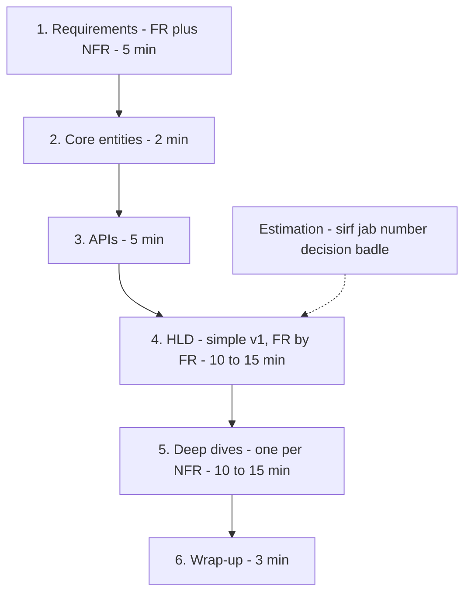

# Interview Framework

**Ek line me:** 45 min ke HLD round ko ek fixed order me chalao: FR → quantified NFR → entities → API → simple v1 se HLD → NFR-driven deep dives → wrap-up. Tum conversation drive karo, interviewer ke har scoring box me tick lage.

> **Example:** "Design WhatsApp". Weak candidate seedha boxes banata hai, 30 min baad pata chalta hai group chat scope me tha hi nahi. Strong candidate 5 min me scope aur numbers fix karta hai, simple v1 banata hai, phir wahi deep dive karta hai jo NFR maangti hai.

## 45-min flow

| Step | Time | Kya karna hai | Output (board pe) |
|---|---|---|---|
| **1a. Functional req.** | ~2 min | 3–4 core "User X kar sake" lines + explicit **out of scope** | FR list |
| **1b. Non-functional req.** | ~3 min | Numbers me: `p99 < 200 ms`, `99.99% reads`, `100M DAU, 10:1 read:write`. **CAP choice** bolo: "booking strong consistency, search eventual" | Ranked NFR list |
| **2. Core entities** | ~2 min | Sirf nouns: User, Show, Seat, Booking. Columns abhi nahi | Entity list |
| **3. APIs** | ~5 min | Har FR ke liye ek endpoint. REST kaafi hai | `POST /bookings` jaisi lines |
| **4. HLD** | 10–15 min | Simple v1 (client → service → ek DB). Phir FR ek-ek karke satisfy karo. Naya component tabhi jab koi requirement ya number maange | Ek clean diagram |
| **5. Deep dives** | 10–15 min | Har deep dive ek NFR se juda ho: "NFR: no double booking → seat lock". End me trade-off | 2–3 solid solutions |
| **6. Wrap-up** | ~3 min | Bottlenecks, failure modes, "aur time hota to" | 3–4 improvements |

Intro aur buffer ke ~5 min alag rakho. **Estimation** sirf wahan jahan number decision badle ("12 writes/sec, ek Postgres kaafi" ya "1M read QPS, cache zaroori"). Baaki math skip.

## Interviewer kya score karta hai (rubric)

| Dimension | Strong signal | Red flag |
|---|---|---|
| **Requirements / scoping** | 3–4 FR, out of scope, NFR numbers me, CAP choice | Bina poochhe design, "fast aur scalable" |
| **Design soundness** | Simple v1 jo har FR cover kare, ek request end-to-end trace ho | Boxes bina flow ke, FR chhoot gaya |
| **Technology justification** | Har component: requirement/number + kyun simpler option se better | "Yahan Kafka laga do" bina reason |
| **Deep-dive depth** | NFR se juda deep dive, alternatives compare | Random topic pe deep dive, ek hi option |
| **Trade-offs & failure handling** | Kya sacrifice kiya, kya toot sakta hai, kaise recover | Har choice "best" bolna, SPOF chhodna |
| **Communication** | Signposting, sochte hue bolna, hints pakadna | 5 min chup, interviewer ki baat kaatna |

## Conversation kaise drive karo

- Har step ke start pe signpost: "Ab APIs, phir HLD." End pe check-in: "Theek lag raha hai?"
- Pehle **simple working v1**, phir evolve. Shuru me sharding, Kafka, microservices mat ghusao.
- Har naya box ek line ke saath: "Ye cache isliye kyunki 100K read QPS hai, DB akela nahi sambhalega."
- Deep dive khud propose karo: "Sabse risky NFR no double booking hai. Wahan chalein?"
- Hint ("celebrity ke 10M followers ho to?") = signal. Turant us direction me jao.

## Ready phrases

- "Design se pehle kuch sawal poochhna chahunga."
- "Read:write ~100:1 maan raha hoon. Theek hai?"
- "Do options hain: A aur B. A ka fayda ye, B ka ye. Yahan A, kyunki... aur isme hum X sacrifice kar rahe hain."
- "Ye single point of failure hai. Replicas se handle karunga."

## "I don't know" kaise handle karo

- Jhooth mat bolo. Bolo: "Exact internal nahi pata, par first principles se..." aur reasoning karo.
- Tool ka naam nahi pata to concept bolo: "Partitioned, replayable append-only log chahiye, jaise Kafka."
- Atak gaye to simplify: "Pehle single server pe sochta hoon, phir distribute."

## Junior vs senior: kya badalta hai

| Level | Expectation |
|---|---|
| **Mid-level (SDE-1/2)** | Working design jo saare FR cover kare + ek request end-to-end trace. Interviewer thoda guide kare to chalega |
| **Senior (SDE-3)** | Bottlenecks, failure modes, consistency choices aur trade-offs **khud** uthao, poochhe jaane se pehle. Deep dives gehre, numbers ke saath |
| **Staff+** | Scope aur evolution drive karo: v1 → 10x → multi-region. Org constraints: team ownership, migration, cost, operability |

Senior ka sabse bada signal: **tum khud bataoge ki kya toot sakta hai**, interviewer ke poochhne se pehle.

## Kin systems me lagta hai

Har question isi flow me hai. Practice ke liye shuru karo:
- [URL Shortener](../02-questions/t1-01-url-shortener.md): flow seekhne ke liye sabse simple
- [BookMyShow](../02-questions/t1-05-bookmyshow.md): requirements se consistency decide karna
- [News Feed](../02-questions/t1-03-news-feed.md): deep dive me fan-out trade-off
- [WhatsApp](../02-questions/t1-04-whatsapp-chat.md), [Uber](../02-questions/t1-06-uber.md), [YouTube](../02-questions/t1-07-youtube.md), [Payment System](../02-questions/t1-11-payment-system.md)

Saath me padho: [Numbers cheatsheet](21-numbers-cheatsheet.md), [Red flags](22-red-flags.md).

## Interview me bolo

> "Pehle 5 min requirements: core features aur numbers wali NFRs. Phir entities aur APIs, phir ek simple v1 jo har functional requirement cover kare. Uske baad har NFR ke liye ek deep dive, jaise scale aur consistency. Kahin zyada focus chahiye to bata dena."

## Common galtiyan

- Requirements skip karke seedha diagram.
- Estimation me 10 min barbaad karna aur deep dive ka time na bachna.
- Pehle hi complex design (sharding, multi-region) jab simple chal jaata.
- Ek component chunna bina requirement, number aur alternative bataye.
- NFR vague rakhna ("fast", "scalable") aur deep dive kisi NFR se na jodna.
- Interviewer ke hint ko ignore karke apne plan pe chalte rehna.
- Wrap-up skip karna. Last 3 min me trade-offs bolna free marks hai.

## Checklist

- [ ] 45 min ke 6 steps aur unka time split bina dekhe bata sakta hoon
- [ ] Har step pe interviewer kya score karta hai, bata sakta hoon
- [ ] Signposting aur check-in phrases natural tareeke se bol sakta hoon
- [ ] "Mujhe nahi pata" situation ko first principles se handle kar sakta hoon
- [ ] Junior vs senior expectations ka farak samjha sakta hoon
