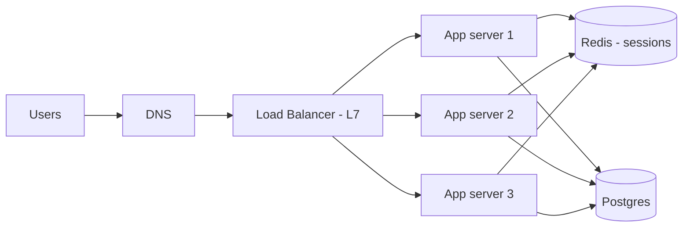

# Scaling Basics

**Ek line me:** traffic badhe to ya to ek machine ko bada karo (vertical), ya machines badhao (horizontal) aur load balancer se traffic baanto. Iske liye services ko stateless rakhna padta hai.

> **Example:** IPL final ke time Hotstar pe traffic 10x ho jaata hai. Ek bade server se kaam nahi chalega. Saikdon chhote servers chahiye, aage load balancer, aur koi bhi server mare to user ko pata na chale.

## Vertical vs horizontal

| | Vertical (scale up) | Horizontal (scale out) |
|---|---|---|
| Kya | Bigger CPU/RAM wali machine | Zyada machines |
| Fayda | Simple, code change nahi, no network hops | Almost unlimited scale, fault tolerant |
| Nuksan | Hardware limit, mehenga, SPOF | Stateless banana padta hai, LB, distributed complexity |
| Kab | Shuru me, DB primary, chhota load | Web/app tier, high traffic |

Interview me default: **app tier horizontal, DB pehle vertical + replicas, phir sharding**.

## Load balancer

### L4 vs L7

| | L4 (transport) | L7 (application) |
|---|---|---|
| Kya dekhta hai | IP + port (TCP/UDP) | HTTP path, headers, cookies |
| Speed | Bahut fast, kam CPU | Thoda slow (TLS terminate, parse) |
| Routing | Sirf connection level | `/api/*` ek service, `/img/*` doosri |
| Example | AWS NLB, HAProxy TCP mode | AWS ALB, Nginx, Envoy |
| Kab | WebSocket/TCP heavy, raw throughput | Microservices, path routing, auth, canary |

### Algorithms

| Algorithm | Kaise | Kab |
|---|---|---|
| Round robin | Ek ke baad ek | Servers same aur requests similar |
| Weighted round robin | Bade server ko zyada | Mixed hardware |
| Least connections | Jiske paas kam active connections | Long-lived requests (WebSocket, uploads) |
| IP hash / consistent hash | Same client → same server | Sticky chahiye, ya local cache use karna |

LB khud SPOF na bane: **active-passive pair** ya managed LB (ALB) lo. Health checks se mare hue server ko hatao.

## Stateless services aur session handling

Stateless matlab: server apni memory me user ka koi data nahi rakhta. Koi bhi request kisi bhi server pe jaa sakti hai.

| Session option | Kaise | Problem |
|---|---|---|
| Sticky sessions | LB same user ko same server pe bheje | Server mara to session gaya, load uneven |
| Central session store | Redis me session, sab servers padhein | Ek extra hop (~1ms), Redis ko HA rakho |
| JWT token | State client ke token me, server sirf verify kare | Revoke karna mushkil, token size |

Default bolo: **JWT for auth + Redis for baaki session state**.

## Autoscaling

- Metric pe scale karo: CPU > 70%, request latency, ya queue depth (workers ke liye best).
- Scale-up fast, scale-down slow (cooldown), warna flapping hota hai.
- Autoscaling minutes leta hai. Known spikes (IPL, Big Billion Day) ke liye **pre-warm** karo.
- DB autoscale nahi hota utni aasani se. App tier scale hua to DB connections phat sakte hain, isliye connection pooling (PgBouncer).

## SPOF (single point of failure)

Har box ko dekho aur poochho: "Ye mara to kya hoga?"
- App server → multiple instances + LB
- LB → redundant pair / managed
- DB → replica + automatic failover
- Cache → Redis replica + Sentinel/Cluster
- Region → multi-AZ minimum, critical ho to multi-region

## Kab kya

- Chhota traffic, MVP: ek vertical server + managed DB. Over-engineer mat karo.
- Read-heavy: horizontal app + cache + read replicas.
- Spiky traffic: autoscaling + queue as buffer + pre-warm.

## Kin systems me lagta hai

- [URL Shortener](../02-questions/t1-01-url-shortener.md): stateless redirect servers behind LB
- [News Feed](../02-questions/t1-03-news-feed.md): horizontal feed service
- [WhatsApp](../02-questions/t1-04-whatsapp-chat.md): L4/least-connections for WebSocket
- [YouTube](../02-questions/t1-07-youtube.md): autoscaled transcoding workers
- [BookMyShow](../02-questions/t1-05-bookmyshow.md), [Flash Sale](../02-questions/t2-15-flash-sale.md): spike handling, pre-warm

## Interview me bolo

> "Saari app services stateless rakhunga, session Redis me aur auth JWT se. Aage L7 load balancer hoga jo path ke basis pe route karega aur health checks karega. App tier CPU aur latency pe autoscale hoga, aur known spikes ke liye pre-warm karenge."

## Common galtiyan

- Diagram me ek hi LB aur ek hi DB, aur SPOF ka zikr hi nahi.
- Sticky sessions ko default bana dena.
- "Autoscaling kar denge" bolna jaise woh instant ho.
- App tier scale karna par DB connections ka dhyan na dena.
- WebSocket ke liye round robin bolna, least connections better hai.

## Checklist

- [ ] Vertical vs horizontal ka trade-off aur default choice bata sakta hoon
- [ ] L4 vs L7 load balancer ka farak example ke saath bata sakta hoon
- [ ] LB algorithms aur kab kaunsa, bata sakta hoon
- [ ] Stateless service aur session handling ke 3 options samjha sakta hoon
- [ ] Kisi bhi diagram me SPOF dhoondh ke fix bata sakta hoon
