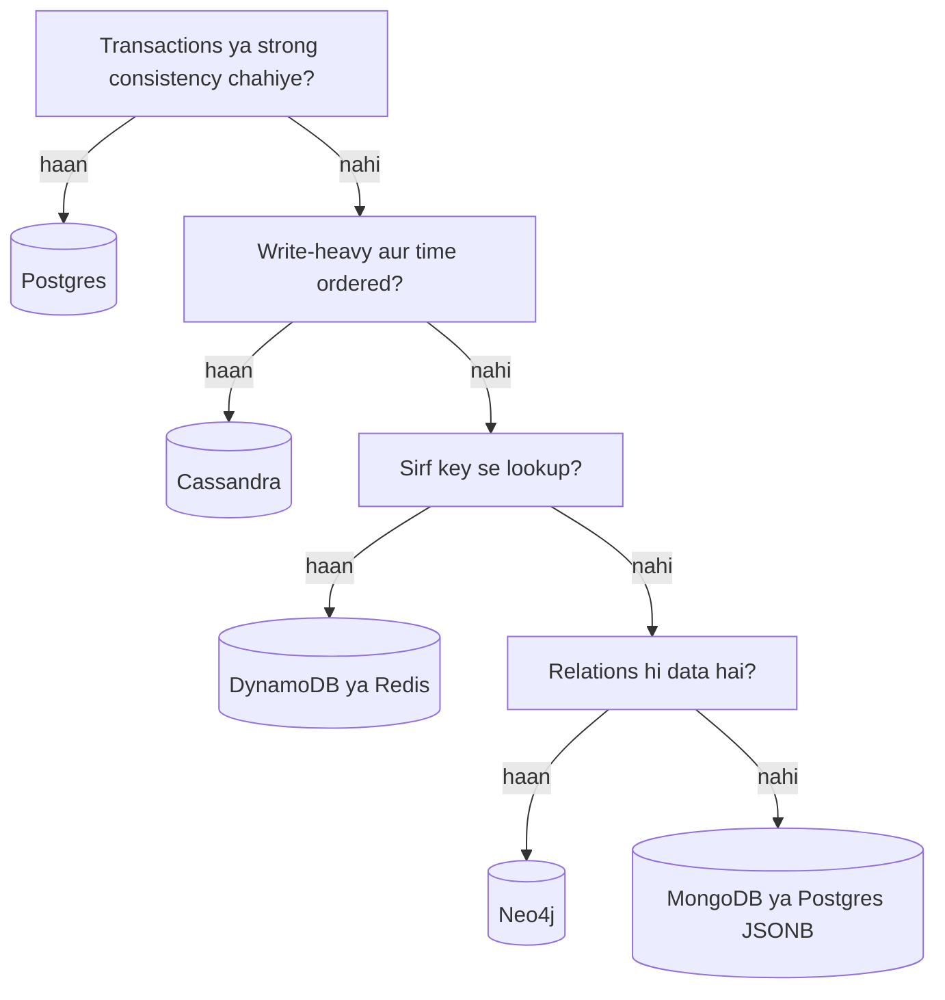

# SQL vs NoSQL

**Ek line me:** SQL tab lo jab relations, transactions aur strong consistency chahiye. NoSQL tab lo jab bahut zyada scale, simple access pattern ya flexible schema chahiye.

> **Detail me padho (Databases section):** [Choosing a Database](../05-db/01-choosing-a-database.md), [SQL](../05-db/02-relational-sql.md), [Key-Value](../05-db/05-key-value.md), [Document](../05-db/06-document.md), [Wide-column](../05-db/07-wide-column.md)

> **Example:** Paytm wallet ka balance aur transactions Postgres me (paisa galat nahi hona chahiye). WhatsApp ke billions messages Cassandra me (bas likhna hai aur chat_id se time order me padhna hai, joins ki zarurat nahi).

## SQL (relational)

- Tables, fixed schema, joins, **ACID transactions**.
- Examples: **Postgres, MySQL**.
- Scale: vertical + read replicas tak aasaan. Sharding manual ya Vitess/Citus jaise tools se.
- Myth: "SQL scale nahi hota". Ek tuned Postgres ~10K+ writes/sec aur TBs data sambhal leta hai.

## NoSQL ke 4 types

| Type | Data kaisa | Examples | Best for |
|---|---|---|---|
| **Key-value** | `key → value` blob | Redis, DynamoDB | Cache, sessions, counters, URL mapping |
| **Document** | JSON document, nested fields | MongoDB, DynamoDB | Product catalog, user profile, flexible schema |
| **Wide-column** | Partition key + sorted clustering key, rows me columns | Cassandra, HBase, ScyllaDB | Heavy writes, time-series, chat messages |
| **Graph** | Nodes + edges | Neo4j, Neptune | Social graph, recommendations, fraud rings |

### Wide-column ka access pattern

Cassandra me table query ke hisaab se banti hai, data ke hisaab se nahi.

```sql
messages(chat_id, message_ts, sender, body, PRIMARY KEY (chat_id, message_ts))
-- chat_id = partition key (kis node pe), message_ts = clustering key (sorted)
```

Ek chat ke saare messages ek partition me time order me. "Last 50 messages" ek fast range read hai.

## Kab kya (decision table)

| Situation | Choose | Kyun |
|---|---|---|
| Payments, orders, bookings, inventory | **Postgres / MySQL** | ACID, unique constraints, multi-row transactions |
| Simple lookup by key, massive scale | **DynamoDB** | Managed, auto-scale, single-digit ms |
| Write-heavy, append-only, time ordered | **Cassandra** | LSM writes, linear scale, multi-DC |
| Flexible/nested schema, catalog | **MongoDB** | Schema change easy, rich queries on fields |
| Hot data, cache, counters, leaderboards | **Redis** | In-memory, sub-ms, sorted sets |
| Friends-of-friends, path queries | **Neo4j** | Multi-hop traversal fast |
| Full-text search | Elasticsearch | Ye primary DB nahi, search index hai |



## Trade-offs ek nazar me

| | SQL | NoSQL (generally) |
|---|---|---|
| Schema | Fixed, migrations | Flexible |
| Joins | Haan | Nahi, denormalize karo |
| Transactions | Full ACID | Single item/partition tak (DynamoDB/Mongo me limited multi-item) |
| Scale | Vertical + replicas, sharding mehnat | Built-in horizontal |
| Consistency | Strong | Aksar eventual, tunable |
| Query flexibility | Ad-hoc SQL | Access pattern pehle se fix |

## Interview me DB choice kaise justify karo

3 cheezein bolo:
1. **Access pattern:** "Hum hamesha `user_id` se padhte hain, range query `timestamp` pe."
2. **Consistency need:** "Ye paisa hai, isliye ACID chahiye" ya "stale feed chalega".
3. **Scale numbers:** "50K writes/sec hai, single Postgres pe tight hai, isliye Cassandra."

Aur ek "kya nahi chuna" line: "MongoDB bhi chal sakta tha, par yahan joins aur transactions zyada hain."

Polyglot persistence normal hai: ek system me Postgres + Redis + Elasticsearch + Cassandra sab ho sakte hain, har ek apne kaam ke liye.

## Kin systems me lagta hai

- [Payment System](../02-questions/t1-11-payment-system.md), [BookMyShow](../02-questions/t1-05-bookmyshow.md): Postgres for ACID
- [WhatsApp](../02-questions/t1-04-whatsapp-chat.md): Cassandra for messages
- [URL Shortener](../02-questions/t1-01-url-shortener.md): DynamoDB / KV
- [News Feed](../02-questions/t1-03-news-feed.md), [Instagram](../02-questions/t2-13-instagram.md): Cassandra + Redis feed cache
- [Uber](../02-questions/t1-06-uber.md): Postgres for trips, Redis for live locations
- [Distributed KV Store](../02-questions/t2-20-distributed-kv-store.md): Dynamo/Cassandra internals

## Interview me bolo

> "Bookings ke liye Postgres lunga kyunki mujhe multi-row transaction aur `UNIQUE` constraint chahiye, aur write load sirf ~100/sec hai. Messages ke liye Cassandra, kyunki write-heavy hai, access pattern fix hai (chat_id + time), aur linear scale chahiye."

## Common galtiyan

- "NoSQL kyunki scale hoga" bolna bina numbers ke.
- Cassandra me ad-hoc queries ya joins expect karna.
- Paise wale data ke liye eventual consistency wala store lena.
- Redis ko primary durable DB bana dena bina persistence/replication ke.
- Elasticsearch ko source of truth bana dena.

## Checklist

- [ ] NoSQL ke 4 types example ke saath bata sakta hoon
- [ ] Decision table se kisi bhi use case ke liye DB chun sakta hoon
- [ ] Cassandra ka partition key + clustering key samjha sakta hoon
- [ ] DB choice ko access pattern, consistency aur scale se justify kar sakta hoon
- [ ] "SQL scale nahi hota" myth ko numbers se tod sakta hoon
