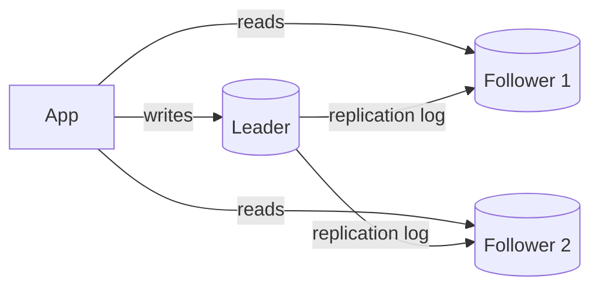

# Indexing & Replication

**Ek line me:** index se reads fast hote hain (poori table scan nahi), aur replication se data ki copies bante hain taaki reads scale hon aur ek machine mare to data na jaye.

> **Detail me padho (Databases section):** [Indexes](../05-db/04-indexes.md), [Scaling Databases](../05-db/14-scaling-databases.md)

> **Example:** Swiggy pe "mere last 10 orders" query `orders` table ke 50 crore rows scan karegi agar `user_id` pe index nahi hai. Index lagao to milliseconds. Aur agar primary DB mar jaye to replica promote ho jaata hai, orders kho nahi jaate.

## Index ke 3 basic structures

| Structure | Kaise kaam karta hai | Achha kis me | Kahan milta hai |
|---|---|---|---|
| **B-tree** | Sorted balanced tree, disk pages | Point lookup + range query (`BETWEEN`, `ORDER BY`) | Postgres, MySQL default |
| **Hash index** | `hash(key) → location` | Sirf exact match, O(1) | Redis, Postgres hash index, in-memory KV |
| **LSM tree** | Writes pehle memory (memtable) me, phir sorted files (SSTables) disk pe, background compaction | Heavy writes | Cassandra, RocksDB, ScyllaDB |

- **B-tree:** read-optimized. Har write pe tree update hota hai (random I/O).
- **LSM:** write-optimized (sequential append). Read pe multiple SSTables check karne padte hain, isliye **Bloom filters** use hote hain.

### Index ka cost
- Har index writes ko slow karta hai (har insert pe index bhi update).
- Extra storage.
- Isliye sirf un columns pe index jo query ke `WHERE`/`ORDER BY` me aate hain.

## Composite index

`INDEX (user_id, created_at)` ek sorted list hai: pehle `user_id` se, phir `created_at` se.

| Query | Index use hoga? |
|---|---|
| `WHERE user_id = 5` | Haan (leftmost prefix) |
| `WHERE user_id = 5 ORDER BY created_at DESC LIMIT 10` | Haan, best case |
| `WHERE created_at > '2026-01-01'` | Nahi, leftmost column missing |

Rule: **equality wale columns pehle, range/sort wala last**. Covering index (query ke saare columns index me) ho to table touch hi nahi hoti.

## Replication

### Leader-follower (single leader)

- Saare writes leader pe, reads followers pe bhi. Read-heavy systems ke liye perfect.
- **Sync replication:** leader tab tak wait kare jab tak follower ack na de. Data loss nahi, par slow. 
- **Async replication:** leader turant ack. Fast, par leader mare to last kuch writes jaa sakte hain.
- Common middle: **semi-sync**, ek follower sync, baaki async.

### Multi-leader

- Har region me ek leader, writes local. Regions aapas me sync karte hain.
- Fayda: low write latency globally, ek region down ho to bhi writes chalein.
- Problem: **write conflicts** (do regions me same row change). Resolve: last-write-wins, CRDTs, ya app-level merge.
- Use: multi-region apps, offline-first apps (Google Docs jaisa collaborative editing).

### Leaderless (bonus)
- Dynamo/Cassandra style: kisi bhi node pe likho, quorum (R + W > N) se consistency. Dekho [CAP & Consistency](06-cap-consistency.md).

## Replication lag aur read-your-writes

Async me follower thoda peeche hota hai (ms se seconds). Problem:

> User ne profile photo badli, page refresh kiya, read follower pe gaya, purani photo dikhi. User sochta hai bug hai.

Fix:
- **Read-your-writes:** user ne last ~10 sec me likha hai to uski reads leader se karo.
- Write ke baad client ko version/LSN do, follower tabhi serve kare jab woh us version tak pahunch gaya ho.
- Critical reads (balance, booking status) hamesha leader se.

**Monotonic reads:** ek user ko hamesha same replica pe bhejo, taaki time ulta na chale (pehle naya data, phir purana).

## Failover

1. Leader ka heartbeat band → detect (timeout ~10–30 sec).
2. Sabse up-to-date follower ko naya leader chuno.
3. Clients/proxy ko naye leader pe route karo.

Risks:
- **Data loss:** async me naye leader ke paas last writes nahi the.
- **Split brain:** purana leader wapas aaya aur khud ko leader samjhe. Fix: fencing token / epoch number, consensus (Raft, etcd, ZooKeeper).
- Timeout chhota → false failovers. Bada → lamba downtime.

Managed options: AWS RDS Multi-AZ, Aurora, Patroni (Postgres).

## Kab kya

| Need | Use |
|---|---|
| Read-heavy, single region | Leader-follower + read replicas |
| Data loss bilkul nahi | Sync / semi-sync replica |
| Global low-latency writes | Multi-leader ya leaderless |
| Write-heavy append | LSM store (Cassandra) |

## Kin systems me lagta hai

- [URL Shortener](../02-questions/t1-01-url-shortener.md): read replicas, index on short code
- [News Feed](../02-questions/t1-03-news-feed.md), [Instagram](../02-questions/t2-13-instagram.md): composite index `(user_id, created_at)`, read-your-writes
- [BookMyShow](../02-questions/t1-05-bookmyshow.md), [Payment System](../02-questions/t1-11-payment-system.md): critical reads leader se, sync replica
- [Distributed KV Store](../02-questions/t2-20-distributed-kv-store.md): LSM + leaderless replication

## Interview me bolo

> "Postgres leader-follower setup rakhunga, writes leader pe aur reads 2–3 replicas pe. Replication lag ki wajah se jo user abhi likh ke aaya hai uski reads leader se jaayengi (read-your-writes). Failover Patroni/RDS Multi-AZ se automatic hoga, aur semi-sync replica rakhunga taaki data loss na ho."

## Common galtiyan

- Har column pe index laga dena, writes slow ho jaate hain.
- Composite index ka column order galat (range column pehle).
- Read replicas bolna par replication lag ka zikr na karna.
- Payment status replica se padhna.
- Failover bolna bina split brain / data loss ke risk ke.

## Checklist

- [ ] B-tree vs hash vs LSM ka farak aur kaunsa DB kya use karta hai, bata sakta hoon
- [ ] Composite index ka leftmost prefix rule samjha sakta hoon
- [ ] Leader-follower vs multi-leader ke trade-offs bata sakta hoon
- [ ] Replication lag ki problem aur read-your-writes fix samjha sakta hoon
- [ ] Failover ke steps aur split brain risk bata sakta hoon
