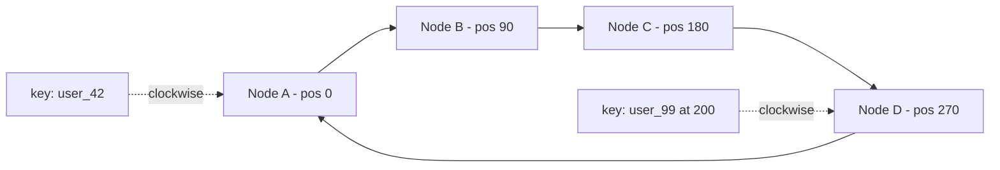

# Sharding & Consistent Hashing

**Ek line me:** jab data ya writes ek DB machine me fit na hon, to data ko key ke basis pe kai machines (shards) me baant do. Consistent hashing se shard add/remove karne pe kam se kam data move hota hai.

> **Detail me padho (Databases section):** [Scaling Databases](../05-db/14-scaling-databases.md), [Wide-column](../05-db/07-wide-column.md)

> **Example:** WhatsApp ke paas har din 100 billion messages. Ek Postgres pe ye impossible hai. `chat_id` ke hash se messages 1000 shards me baante jaate hain. Ek chat ke saare messages ek hi shard pe, isliye chat kholna fast.

## Kyun shard karo

- **Storage:** data ek machine ki disk se bada (10 TB+).
- **Write throughput:** replicas reads scale karte hain, writes nahi. Writes ek leader pe hi jaate hain.
- Pehle try karo: vertical scale, read replicas, cache, archive purana data. Sharding last option hai kyunki complexity bahut badhti hai.

## Sharding ke 3 tareeke

| Tareeka | Kaise | Fayda | Nuksan |
|---|---|---|---|
| **Hash** | `shard = hash(key) % N` | Data evenly spread | Range query har shard pe jaati hai, N badla to sab reshuffle |
| **Range** | `A–F` shard 1, `G–M` shard 2, ya date range | Range query fast | Hot spots (aaj ki date wala shard sab writes le) |
| **Directory** | Lookup table: `key → shard` | Full control, kuch bhi move kar sakte ho | Lookup service extra hop aur khud SPOF |

## Shard key kaise chuno

Achhi shard key:
1. **High cardinality:** bahut saare distinct values (`user_id`, not `country`).
2. **Even distribution:** koi ek value bahut heavy na ho.
3. **Query ke saath match:** main query ek hi shard pe jaaye.

| System | Shard key | Kyun |
|---|---|---|
| Chat | `chat_id` | Ek chat ek shard pe |
| Orders | `user_id` | "Mere orders" ek shard se |
| URL shortener | `short_code` | Lookup hamesha code se |
| Uber trips | `city_id` + `trip_id` | Geo locality, par bade city ko split karo |

## Hot partitions

Ek key pe bahut zyada traffic: Virat Kohli ki post, Big Billion Day ka ek product.
- **Key salting:** `post_123#0..#9`, writes 10 shards me baanto, read pe merge.
- Hot key ko **cache** me rakho (reads ke liye).
- Hot tenant ko dedicated shard do (directory sharding se).

## Resharding

- `hash % N` me N badla to ~sara data move hota hai. Isliye ye use mat karo.
- **Fixed logical shards:** shuru me 1024 logical shards banao, 8 machines pe map karo. Machine add karo to bas kuch logical shards move karo.
- **Consistent hashing:** neeche dekho.
- Move karte waqt: double-write (old + new), backfill, verify, phir reads switch.

## Consistent hashing with virtual nodes

Hash space ko ek ring maano (0 se 2^32). Servers aur keys dono ko ring pe hash karo. Key **clockwise pehle server** pe jaati hai.

- Node add hua (maan lo E at 225) → sirf C aur E ke beech ki keys move hongi (~1/N data), baaki sab wahi.
- Node hata → uski keys agle node pe chali jaati hain.
- **Virtual nodes:** har physical server ring pe 100–200 jagah hota hai (`A#1, A#2, ...`). Isse:
  - Load even hota hai (warna ek node ko bada arc mil sakta hai)
  - Node mare to uska load sab nodes me bat jaata hai, sirf ek padosi pe nahi
  - Bade server ko zyada vnodes de sakte ho
- Replication: key ko clockwise agle 3 distinct nodes pe rakho.
- Use: Cassandra, DynamoDB, Memcached clients, CDN aur LB routing.

## Cross-shard queries

| Problem | Solution |
|---|---|
| Query bina shard key ke ("email se user dhoondho") | Secondary index table: `email → user_id` (khud sharded by email) |
| Aggregate across shards ("total orders today") | Scatter-gather, ya better: analytics pipeline (Kafka → warehouse) |
| Join across shards | Denormalize, ya app me join |
| Transaction across shards | Avoid karo. Zarurat ho to saga / 2PC, dekho [Distributed Transactions](16-distributed-transactions.md) |

Design aisa karo ki **95% queries single-shard** hon.

## Kin systems me lagta hai

- [WhatsApp](../02-questions/t1-04-whatsapp-chat.md): `chat_id` se sharding
- [URL Shortener](../02-questions/t1-01-url-shortener.md): `short_code` hash sharding
- [News Feed](../02-questions/t1-03-news-feed.md), [Instagram](../02-questions/t2-13-instagram.md): `user_id`, celebrity hot keys
- [Uber](../02-questions/t1-06-uber.md): geo/city based sharding
- [YouTube](../02-questions/t1-07-youtube.md): `video_id` sharding for metadata
- [Distributed KV Store](../02-questions/t2-20-distributed-kv-store.md): consistent hashing + vnodes core hai

## Interview me bolo

> "Messages ko `chat_id` pe hash shard karunga, taaki ek chat ki saari reads ek shard pe hon. Consistent hashing with virtual nodes use karunga, taaki naya node add karne pe sirf ~1/N data move ho. Celebrity jaise hot keys ke liye key salting aur cache lagaunga."

## Common galtiyan

- Pehle hi sharding bol dena, jab replicas + cache kaafi the.
- `hash % N` bolna aur resharding ka plan na hona.
- Low cardinality shard key (`country`, `status`).
- Shard key aisi chunna jisse main query har shard pe jaye.
- Virtual nodes ka zikr na karna.

## Checklist

- [ ] Sharding kab chahiye aur pehle kya try karna hai, bata sakta hoon
- [ ] Hash vs range vs directory sharding ke trade-offs bata sakta hoon
- [ ] Kisi bhi system ke liye shard key chun ke justify kar sakta hoon
- [ ] Consistent hashing ring aur virtual nodes board pe samjha sakta hoon
- [ ] Hot partition aur cross-shard query ke solutions bata sakta hoon
