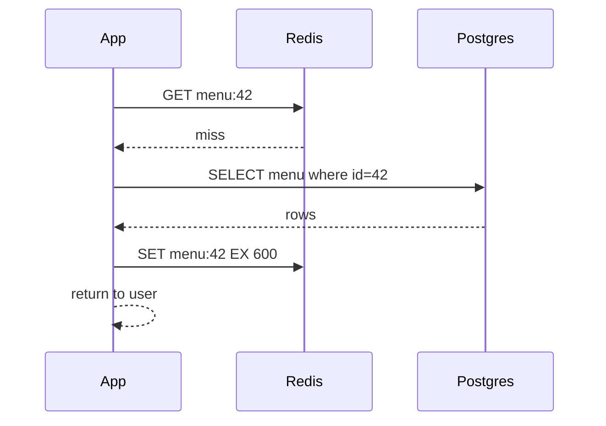

# Caching

**Ek line me:** jo data baar baar padha jaata hai use fast memory (Redis) me rakh do, taaki DB pe load kam ho aur latency ms se bhi neeche aaye.

> **Example:** Zomato pe ek popular restaurant ka menu din me lakhs baar khulta hai, par badalta din me ek baar. Har baar DB se padhna bekar hai. Menu Redis me 10 min TTL ke saath rakho. 99% requests cache se, DB aaram se.

## Caching patterns

| Pattern | Read/Write kaise | Fayda | Nuksan | Kab |
|---|---|---|---|---|
| **Cache-aside (lazy)** | App pehle cache dekhe. Miss → DB se padh ke cache me daale. Write → DB update + cache delete | Simple, sirf zaroori data cache me | Pehli request slow, stale ho sakta hai | Default, 90% cases |
| **Write-through** | Write cache + DB dono me saath | Cache hamesha fresh | Har write slow, kabhi na padha data bhi cache me | Read-after-write zaroori ho |
| **Write-back (write-behind)** | Write sirf cache me, DB me baad me batch | Bahut fast writes | Cache mara to data loss | Counters, likes, view counts |
| **Write-around** | Write seedha DB, cache skip | Cache me kachra nahi | Recent write ki read miss | Data likha jaata hai par turant padha nahi jaata (logs, uploads) |

### Cache-aside flow

Write pe: **pehle DB update, phir cache DELETE** (update nahi). Delete karne se race condition me stale value likhne ka chance kam hota hai.

## Eviction

| Policy | Kya hatata hai | Kab |
|---|---|---|
| **LRU** | Jo sabse pehle use hua tha | Default, recency matter karti hai |
| **LFU** | Jo sabse kam baar use hua | Popular items stable hon (top products) |
| **TTL** | Time ke baad expire | Hamesha lagao, safety net |

Redis me `maxmemory-policy allkeys-lru` common hai.

## TTL aur invalidation

- TTL = kitna stale chalega. Menu: 10 min. Stock count: 5 sec. User profile: 1 hr.
- Invalidation options:
  1. TTL pe chhod do (simplest)
  2. Write pe explicit delete (cache-aside)
  3. CDC / event: DB change → Kafka → cache delete (multiple services ke liye)
- "There are only two hard things: cache invalidation and naming things." Interview me ye maan lo aur TTL safety net bolo.

## Cache stampede / thundering herd

Popular key expire hui, aur ek saath 10,000 requests DB pe gir gayi. DB down.

Fix:
- **Request coalescing (single flight):** sirf ek request DB jaaye, baaki uska wait karein. Redis lock `SET lock:key NX PX 5000` se.
- **TTL jitter:** `TTL = 600 + random(0, 60)`, taaki saari keys ek saath expire na hon.
- **Early refresh:** expire hone se pehle background me refresh (stale-while-revalidate).
- Bahut hot keys ko expire hi mat karo, update pe refresh karo.

## Hot keys

Ek key pe itna traffic ki ek Redis node bhi sambhal na sake (IPL score, celebrity profile).
- **Local in-process cache** (har app server me 1–5 sec ke liye) aage lagao.
- Key replicate karo: `score:final#1..#10`, random ek padho.
- Read replicas of Redis.

## CDN

- Static content (images, video, JS, CSS) user ke paas wale edge server se.
- Dynamic API responses bhi cache ho sakte hain agar sabke liye same ho (`Cache-Control: max-age=30`).
- Invalidation: versioned URLs (`app.v42.js`) best, purge API slow aur mehenga.
- Detail: [Blob Storage & CDN](12-blob-storage-cdn.md).

## Redis vs Memcached

| | Redis | Memcached |
|---|---|---|
| Data types | String, hash, list, set, sorted set, streams | Sirf string |
| Persistence | RDB/AOF | Nahi |
| Replication / cluster | Haan (Sentinel, Cluster) | Client-side sharding |
| Threading | Mostly single-threaded per shard | Multi-threaded |
| Extra | Locks, rate limiter, leaderboard, pub/sub | Pure simple cache |
| Kab | Almost hamesha default | Bahut simple KV cache, multi-core efficiency |

## Kab cache mat karo

- Data har request pe badalta ho, ya har user ka unique aur ek hi baar padha jaaye.
- Strong consistency chahiye (account balance ka final check DB se).
- Read:write ratio kam ho.

## Kin systems me lagta hai

- [URL Shortener](../02-questions/t1-01-url-shortener.md): hot short codes cache-aside
- [News Feed](../02-questions/t1-03-news-feed.md), [Instagram](../02-questions/t2-13-instagram.md): precomputed feed Redis me
- [BookMyShow](../02-questions/t1-05-bookmyshow.md): seat map cache, launch pe stampede
- [YouTube](../02-questions/t1-07-youtube.md): CDN for video
- [Typeahead](../02-questions/t1-10-typeahead.md): top prefixes cache
- [Leaderboard](../02-questions/t2-16-leaderboard.md): Redis sorted set
- [Flash Sale](../02-questions/t2-15-flash-sale.md): hot key, stock counter

## Interview me bolo

> "Read-heavy hai, isliye Redis me cache-aside lunga, TTL 10 min with jitter. Write pe DB update ke baad cache key delete karunga. Popular keys pe stampede rokne ke liye request coalescing, aur bahut hot keys ke liye app servers me chhota local cache."

## Common galtiyan

- "Cache laga denge" bolna bina pattern, TTL aur invalidation bataye.
- Write pe cache update karna (delete better hai).
- Stampede aur hot key ka zikr na karna.
- Cache ko source of truth maan lena.
- Sab keys ka same TTL, ek saath expiry.

## Checklist

- [ ] 4 caching patterns aur kab kaunsa, bata sakta hoon
- [ ] Cache-aside ka read aur write flow board pe bana sakta hoon
- [ ] Cache stampede ke 3 fixes (coalescing, jitter, early refresh) bata sakta hoon
- [ ] Hot key problem aur solution samjha sakta hoon
- [ ] Redis vs Memcached aur LRU vs LFU ka farak bata sakta hoon
