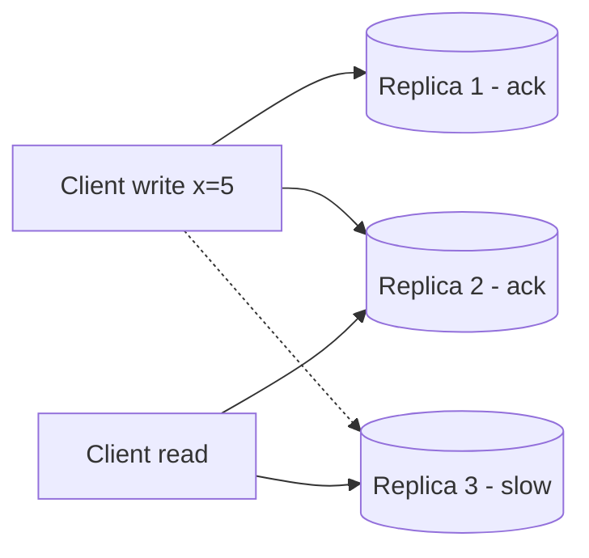

# CAP & Consistency

**Ek line me:** network toot jaye (partition) to distributed system ko chunna padta hai: ya to sabko same latest data do (consistency), ya har request ka jawab do chahe data thoda purana ho (availability).

> **Example:** Paytm me Mumbai aur Delhi data centers ke beech link toot gaya. Agar dono jagah wallet se paisa katne diya (availability), to ek ₹500 balance se do jagah ₹500 kat sakte hain. Isliye payments **consistency** chunte hain. Instagram feed me ek like count 2 sec purana dikhe to koi farak nahi, isliye feed **availability** chunta hai.

## CAP plain words me

- **C (Consistency):** har read ko latest write dikhe.
- **A (Availability):** har request ko jawab mile (error nahi).
- **P (Partition tolerance):** network toot jaye tab bhi system chale.

Network partition real life me hota hi hai, isliye **P mandatory hai**. Asli choice hai: **partition ke time C ya A**.

| Choice | Partition pe kya hota hai | Examples |
|---|---|---|
| **CP** | Kuch requests reject/wait, par galat data nahi | Postgres (single leader), Spanner, ZooKeeper, etcd, HBase |
| **AP** | Har request ka jawab, par stale ho sakta hai | Cassandra, DynamoDB (default), DNS, CDN |

## PACELC (briefly)

**If Partition → A ya C. Else (normal time) → Latency ya Consistency.**

Normal time me bhi trade-off hai: strong consistency ke liye replicas ka wait karna padta hai, jo latency badhata hai.
- Cassandra / DynamoDB: **PA/EL** (fast aur available, eventual)
- Spanner / Postgres sync: **PC/EC** (consistent, thoda slow)

## Consistency levels (strong se weak)

| Level | Matlab | Example |
|---|---|---|
| **Strong (linearizable)** | Write ke turant baad har koi naya data dekhe | Bank balance, seat booking |
| **Read-your-writes** | Kam se kam likhne wala khud apna write dekhe | Profile update ke baad apna profile |
| **Monotonic reads** | Ek baar naya dekh liya to purana kabhi nahi | Chat scroll karte waqt messages gayab na hon |
| **Causal** | Jo cheez kisi aur ki wajah se hui, woh order me dikhe | Comment ka reply comment ke baad hi dikhe |
| **Eventual** | Thodi der me sab same ho jayega | Like count, view count, feed |

Ek hi system me alag features alag level le sakte hain. BookMyShow: search eventual, booking strong.

## Quorum (N, R, W)

Leaderless stores (Cassandra, Dynamo) me:
- **N** = kitni replicas
- **W** = write kitne replicas pe success ho to OK
- **R** = read kitne replicas se karo

**R + W > N** → read aur write sets overlap karte hain, isliye latest value milti hai (strong-ish).

N=3, W=2, R=2: read me kam se kam ek replica (yahan Replica 2) naya value deta hai. Version/timestamp se latest chuno.

| Setting | Behavior |
|---|---|
| W=1, R=1 | Fastest, eventual |
| W=2, R=2 (N=3) | Balanced, quorum consistency |
| W=3, R=1 | Fast reads, write tab fail jab ek node down |
| W=1, R=3 | Fast writes, slow reads |

Cassandra me isse `QUORUM`, `ONE`, `ALL` consistency level se set karte hain, per query.

## Kaun kya chunta hai

| System | Choice | Kyun |
|---|---|---|
| Payments, wallet, ledger | **CP / strong** | Paisa double nahi katna chahiye |
| Seat / inventory booking | **Strong** on booking path | Double booking nahi |
| News feed, likes, views | **AP / eventual** | Thoda stale chalega, downtime nahi |
| Chat messages | **AP + per-chat ordering** | Message deliver hona chahiye, order chat ke andar sahi |
| Shopping cart | **AP** (Amazon Dynamo paper) | Cart add fail hona sales ka nuksan |
| Leader election, config | **CP** (etcd, ZooKeeper) | Do leader nahi hone chahiye |

## Kin systems me lagta hai

- [Payment System](../02-questions/t1-11-payment-system.md): strong consistency, CP
- [BookMyShow](../02-questions/t1-05-bookmyshow.md): booking strong, search eventual
- [News Feed](../02-questions/t1-03-news-feed.md): eventual
- [WhatsApp](../02-questions/t1-04-whatsapp-chat.md): availability + per-chat ordering
- [Google Docs](../02-questions/t2-19-google-docs.md): causal / convergence (OT, CRDT)
- [Distributed KV Store](../02-questions/t2-20-distributed-kv-store.md): tunable quorum

## Interview me bolo

> "Booking path pe main consistency chunta hoon, kyunki double booking ka cost downtime se zyada hai. Partition ke time booking reject ho jayegi par galat nahi hogi. Search aur browse pe availability chunta hoon, wahan eventual consistency chalegi."

> "Cassandra me N=3 rakhunga, aur critical reads ke liye QUORUM read/write, taaki R + W > N ho."

## Common galtiyan

- "Hum CA system banayenge" bolna. Distributed system me P se bach nahi sakte.
- Poore system ke liye ek hi consistency bolna, per-feature nahi.
- CAP ka "consistency" aur ACID ka "consistency" mix karna (alag cheezein hain).
- Eventual consistency bolna bina ye bataye ki kitna stale aur kahan chalega.
- Quorum formula ulta yaad rakhna.

## Checklist

- [ ] CAP ko partition ke example se samjha sakta hoon, aur P kyun mandatory hai bata sakta hoon
- [ ] PACELC ek line me bata sakta hoon
- [ ] Strong, read-your-writes, causal, eventual ka farak example ke saath bata sakta hoon
- [ ] Quorum R + W > N ka matlab aur trade-offs samjha sakta hoon
- [ ] Payments vs feed ke liye consistency choice justify kar sakta hoon
