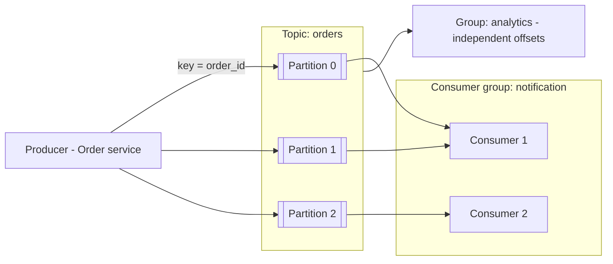

# Message Queues & Kafka

**Ek line me:** service A seedha service B ko call karne ke bajaye message queue me daal deta hai. B apni speed se padhta hai. Isse services decouple hoti hain, spikes absorb hote hain, aur slow kaam async ho jaata hai.

> **Example:** Swiggy pe order place hua. Ab restaurant ko notify karna, delivery partner dhoondhna, SMS bhejna, analytics update karna hai. Agar order API ye sab synchronously kare to 5 sec lagenge aur SMS provider down ho to order hi fail. Isliye order service ek `order_placed` event Kafka me daalti hai aur turant user ko "Order placed" bol deti hai. Baaki services event padh ke apna kaam karti hain.

## Queue kyun

- **Decouple:** producer ko consumer ke baare me nahi pata. Naya consumer bina producer change kiye add karo.
- **Buffer:** IPL spike me 1 lakh events/sec aaye, workers 20K/sec process karein. Queue beech me jama karti hai.
- **Async:** slow kaam (video transcode, email) background me, user ka response fast.
- **Retry:** consumer fail ho to message wapas queue me, kho nahi jaata.

## Queue vs pub/sub vs log

| Model | Kaise | Message ka kya hota hai | Example |
|---|---|---|---|
| **Queue (point-to-point)** | Ek message ek hi consumer ko | Process hone ke baad delete | SQS, RabbitMQ queue |
| **Pub/sub** | Ek message saare subscribers ko | Har subscriber ko copy | SNS, RabbitMQ fanout, Redis pub/sub |
| **Log (stream)** | Append-only log, consumers apna offset track karein | Retention tak rehta hai, replay ho sakta hai | Kafka, Kinesis, Pulsar |

Kafka dono kaam karta hai: consumer group ke andar queue jaisa, alag groups ke beech pub/sub jaisa.

## Kafka basics

- **Topic:** category of events (`orders`, `clicks`).
- **Partition:** topic ke tukde. Har partition ek ordered append-only log. Parallelism ki unit.
- **Offset:** partition me message ka number. Consumer batata hai "maine offset 1042 tak padh liya".
- **Key:** `hash(key) % partitions` se partition decide. Same key → same partition → **order guaranteed**.
- **Consumer group:** ek group me har partition sirf ek consumer ko milta hai. Alag groups same data independently padhte hain.
- **Retention:** messages 7 din (configurable) tak rehte hain, padhne ke baad bhi. Replay possible.
- **Replication:** har partition ki 3 copies brokers pe (leader + followers).

### Ordering rule
- Order sirf **ek partition ke andar** guaranteed hai, poore topic me nahi.
- Chat me key = `chat_id`, payments me key = `account_id`. Isse ek entity ke events order me.
- Consumers > partitions → extra consumers idle baithenge. Partitions pehle se kaafi rakho (jaise 50–100).

## SQS vs RabbitMQ vs Kafka

| | SQS | RabbitMQ | Kafka |
|---|---|---|---|
| Model | Managed queue | Broker with exchanges/routing | Distributed log |
| Retention | Max 14 din, consume ke baad delete | Ack ke baad delete | Time/size based, replay |
| Ordering | FIFO queue me (limited throughput) | Per queue | Per partition |
| Throughput | High, managed | Medium (~10K–50K/sec per node) | Very high (lakhs–millions/sec) |
| Replay | Nahi | Nahi | Haan |
| Best for | Simple task queue on AWS | Complex routing, priority, RPC-style | Event streaming, analytics, many consumers, event sourcing |

## Delivery guarantees

| Guarantee | Matlab | Kaise |
|---|---|---|
| At-most-once | Kho sakta hai, duplicate nahi | Offset pehle commit, phir process |
| **At-least-once** | Kabhi nahi khoyega, duplicate ho sakta hai | Pehle process, phir offset commit. **Default yahi lo** |
| Exactly-once | Na khoye, na duplicate | Kafka transactions, ya practically: at-least-once + **idempotent consumer** |

Interview me: "At-least-once + idempotent consumer (dedupe by `event_id`)". Dekho [Idempotency & Retries](10-idempotency-retries.md).

## DLQ (dead letter queue)

- Message 3–5 retries ke baad bhi fail (kharab data, bug) → DLQ me daalo.
- Isse ek "poison message" poori partition block nahi karta.
- DLQ pe alert + manual/auto reprocess.
- Retries me exponential backoff: retry topics (`orders-retry-1m`, `orders-retry-10m`).

## Back-pressure

Consumer slow hai aur queue badhti ja rahi hai (consumer lag).
- **Monitor consumer lag**, us pe alert aur autoscale (partitions tak).
- Producer side: rate limit, ya `429` return karo.
- Low-priority kaam drop/sample karo (analytics), critical (payments) mat chhodo.
- Queue unbounded mat rakho bina alert ke.

## Kab use karo / kab nahi

- **Use:** slow side effects, fan-out to many services, spikes, event-driven pipelines, analytics.
- **Mat use karo:** jab user ko turant result chahiye (login, balance check). Wahan sync call.

## Kin systems me lagta hai

- [Notification System](../02-questions/t1-09-notification-system.md): priority queues, retries, DLQ
- [News Feed](../02-questions/t1-03-news-feed.md): fan-out on write workers
- [WhatsApp](../02-questions/t1-04-whatsapp-chat.md): offline message delivery, per-chat ordering
- [YouTube](../02-questions/t1-07-youtube.md): transcoding jobs
- [Payment System](../02-questions/t1-11-payment-system.md): ledger events, outbox
- [Web Crawler](../02-questions/t1-12-web-crawler.md): URL frontier
- [Ad Click Aggregator](../02-questions/t2-17-ad-click-aggregator.md): Kafka + stream processing
- [BookMyShow](../02-questions/t1-05-bookmyshow.md): ticket notifications async

## Interview me bolo

> "Order service `order_placed` event Kafka me daalegi, key `order_id`, taaki ek order ke events order me rahein. Notification aur analytics alag consumer groups honge. Delivery at-least-once hai, isliye consumers `event_id` se dedupe karenge, aur 5 retries ke baad message DLQ me jayega. Consumer lag pe alert aur autoscaling rakhunga."

## Common galtiyan

- Kafka me poore topic pe ordering assume karna.
- Exactly-once ka daawa karna bina idempotency ke.
- DLQ na rakhna, ek bad message se partition atak jaata hai.
- Partitions kam rakhna, phir consumers scale nahi hote.
- Har cheez queue me daal dena, jahan sync response chahiye tha wahan bhi.

## Checklist

- [ ] Queue ke 3 fayde (decouple, buffer, async) example ke saath bata sakta hoon
- [ ] Queue vs pub/sub vs log ka farak samjha sakta hoon
- [ ] Kafka topic, partition, offset, consumer group aur per-partition ordering board pe samjha sakta hoon
- [ ] SQS vs RabbitMQ vs Kafka me se sahi tool chun ke justify kar sakta hoon
- [ ] At-least-once + idempotent consumer, DLQ aur back-pressure samjha sakta hoon
