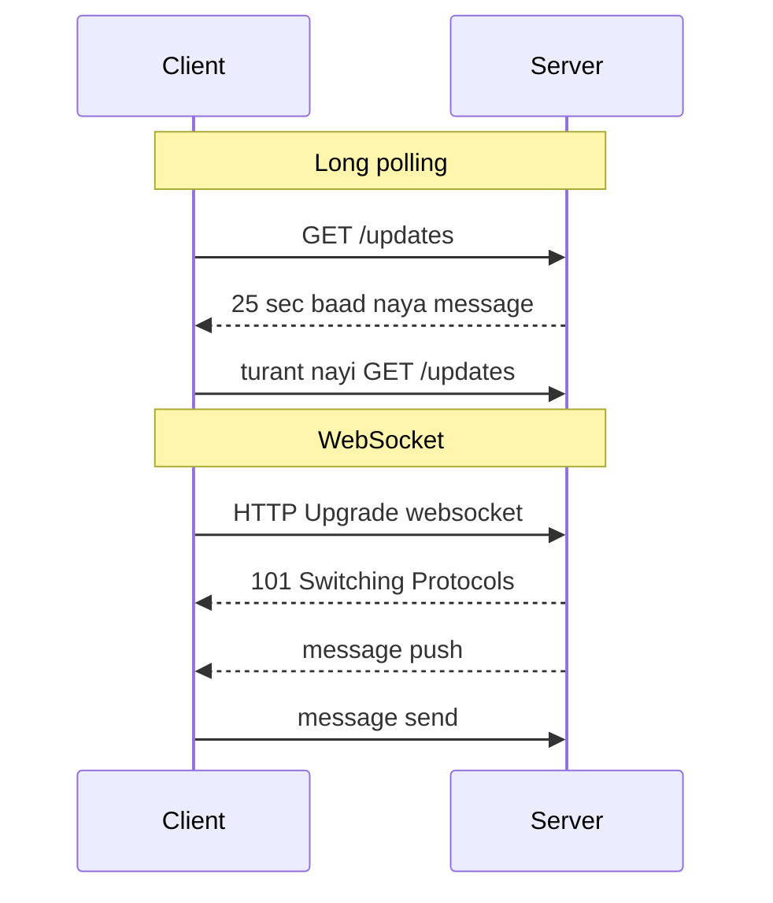
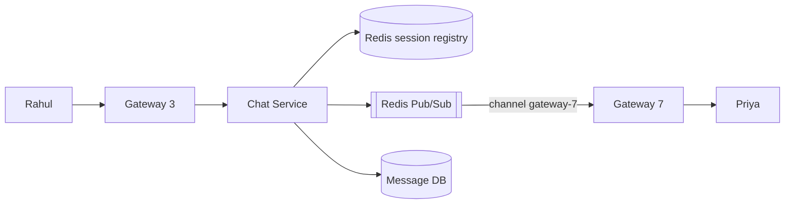

# Real-time Communication

**Ek line me:** server ke paas naya data aate hi client tak turant kaise pahunchaye, bina client ke baar-baar poochhe.

> **Example:** Swiggy app me "Delivery partner 2 min door hai" live update hota hai. WhatsApp pe message aate hi dikhta hai. Normal HTTP me client hi request bhejta hai, server khud se kuch nahi bhej sakta. Isliye real-time ke liye alag tareeke chahiye.

## 4 tareeke (simple se powerful tak)

| Tareeka | Kaise | Direction | Latency | Kab use karo |
|---|---|---|---|---|
| **Short polling** | Client har N sec `GET /updates` maarta hai | Client → Server | N sec tak | Data kabhi-kabhi badle, simple chahiye (order status har 10 sec) |
| **Long polling** | Request open rehti hai jab tak data na aaye ya timeout (30 sec), phir client turant nayi request bhejta hai | Client → Server | Low | WebSocket allowed na ho, purane clients |
| **SSE (Server-Sent Events)** | Ek HTTP connection open, server `text/event-stream` pe events push karta rehta hai | Server → Client only | Low | One-way push: live score, notifications, LLM token streaming |
| **WebSocket** | HTTP upgrade karke full-duplex TCP connection | Dono taraf | Sabse low | Chat, multiplayer game, collaborative editing |

**Kab kaunsa pick karo:**
- Server se sirf push chahiye → **SSE** (auto-reconnect built-in, normal HTTP hai, proxies friendly).
- Dono taraf frequent messages → **WebSocket**.
- Updates rare hain aur scale chhota → **short polling** hi kaafi hai. Over-engineer mat karo.
- Long polling ko fallback samjho, default nahi.

## Connection servers (gateway layer)

WebSocket connection **stateful** hai. User X ka connection ek specific server pe khula hai. Isliye architecture me ek alag layer banao:
- **Connection/Gateway servers:** sirf connections hold karte hain, business logic nahi. Ek server ~50K–1M connections (tuning pe depend).
- **App/Chat service:** stateless, business logic yahan.
- **Session registry (Redis):** `user:X → gateway-7`. Connect pe set, disconnect pe delete, TTL ke saath.

## Message sahi server tak kaise pahunche

Problem: Rahul gateway-3 pe hai, Priya gateway-7 pe. Rahul ka message Priya tak kaise jaaye?

| Approach | Kaise | Trade-off |
|---|---|---|
| **Registry + direct call** | Registry se gateway dhoondo, us gateway ko RPC karo | Simple, par gateways ko discover karna padta hai |
| **Redis Pub/Sub** | Har gateway apne users ke channel (ya apne naam ka channel) subscribe kare. Sender publish kare | Easy fan-out. Pub/Sub fire-and-forget hai, isliye message pehle DB me save karo |
| **Consistent hashing** | `hash(user_id)` se decide ki user kis gateway pe connect hoga | Registry lookup ki zarurat nahi. Gateway add/remove pe thode users hi reconnect karte hain |

User offline ho to message DB me raho, aur push notification (APNs/FCM) bhejo. Reconnect pe client `last_seen_msg_id` bheje aur missed messages sync kare.

## Presence aur heartbeat

- Client har ~30 sec **heartbeat** (ping) bhejta hai. Gateway Redis me `presence:X` ko TTL 60 sec ke saath refresh karta hai.
- Heartbeat band → TTL expire → user offline. Crash me bhi kaam karta hai, kyunki disconnect event aaye ya na aaye, TTL sambhal leta hai.
- "Last seen" ke liye timestamp likho. Presence change sirf contacts/friends ko fan-out karo, sabko nahi.
- Bade groups me presence lazy rakho: jab koi chat open kare tab fetch karo.

## Millions of connections scale karna

- **Gateway horizontally scale:** 10M concurrent users / 100K per server ≈ 100 gateway servers.
- **L4 load balancer** (TCP level) use karo, kyunki connections long-lived hain. Sticky routing zaroori.
- **Memory per connection** kam rakho: epoll/event-loop servers (Netty, Go, Erlang). WhatsApp ne Erlang se ek box pe ~2M connections chalaye the.
- **Reconnect storm:** gateway restart pe lakhs clients ek saath reconnect karenge. Client side **exponential backoff + jitter** lagao.
- **Deploys:** connections ko slowly drain karo, ek saath sab mat todo.

## Kin systems me lagta hai

- [WhatsApp Chat](../02-questions/t1-04-whatsapp-chat.md): WebSocket, gateways, presence
- [Uber](../02-questions/t1-06-uber.md): driver location push, rider ko live map
- [Notification System](../02-questions/t1-09-notification-system.md): in-app push via SSE/WebSocket
- [Google Docs](../02-questions/t2-19-google-docs.md): collaborative editing, WebSocket
- [LLM Chat App](../02-questions/t2-22-llm-chat-app.md): token streaming via SSE
- [BookMyShow](../02-questions/t1-05-bookmyshow.md): live seat map, waiting room position
- [Food Delivery](../02-questions/t2-14-food-delivery.md): order tracking

## Interview me bolo

> "Chat dono taraf hai isliye WebSocket lunga. Connections ek alag stateless-logic gateway layer pe rahenge, aur Redis me `user → gateway` registry hogi. Cross-gateway messages Redis Pub/Sub se route honge, par pehle message DB me persist hoga taaki offline user ko baad me mil sake."

> "LLM response ya live score jaise one-way push ke liye SSE kaafi hai. WebSocket ki complexity nahi chahiye."

## Common galtiyan

- Har cheez ke liye WebSocket bol dena. One-way push me SSE simpler hai.
- WebSocket servers ko stateless maan lena. Connection ek server se bandha hai, routing sochni padti hai.
- Redis Pub/Sub ko durable samajhna. Subscriber down tha to message gaya. DB/Kafka me persist karo.
- Presence ke liye disconnect event pe bharosa karna, heartbeat + TTL ke bina.
- Reconnect storm aur backoff ka zikr na karna.

## Checklist

- [ ] Short polling, long polling, SSE, WebSocket ka farak aur kab kaunsa, bata sakta hoon
- [ ] Gateway layer + session registry kyun chahiye, samjha sakta hoon
- [ ] Cross-server message routing (Pub/Sub ya consistent hashing) diagram ke saath bata sakta hoon
- [ ] Heartbeat + TTL se presence kaise kaam karta hai, bata sakta hoon
- [ ] Millions of connections ke liye estimation aur reconnect storm handling bata sakta hoon
