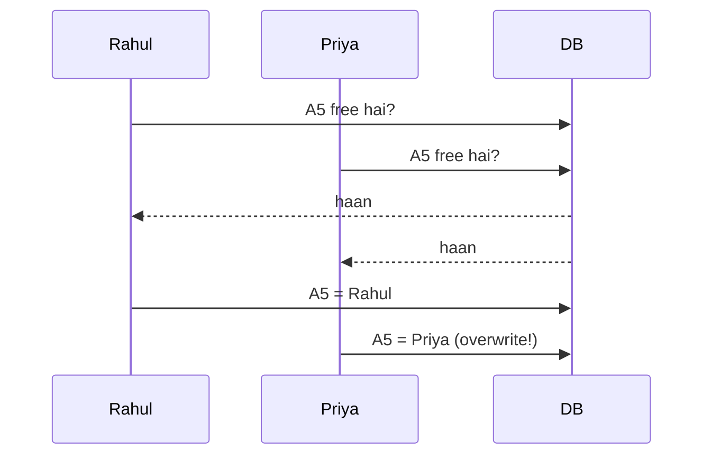
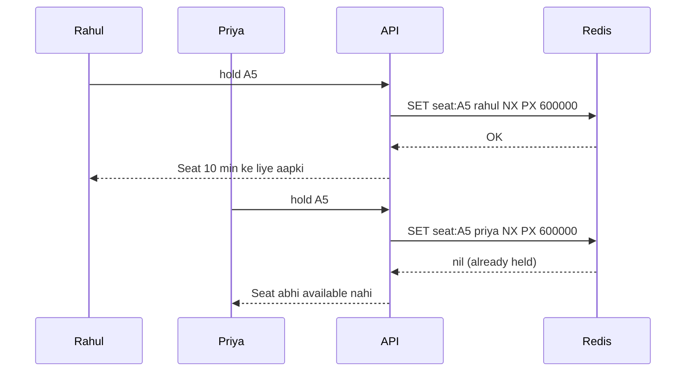

# Locks & Contention

**Ek line me:** jab bahut saare log ek hi cheez ek saath lena chahein (last seat, last iPhone, ek driver), to sirf ek jeete aur data galat na ho.

> **Example:** Movie hall me seat A5 hai. Rahul aur Priya ne same second pe "Book" dabaya. Agar koi lock nahi hai, to dono ko ticket mil jayega. Isi ko **double booking** kehte hain, aur ye race condition ki wajah se hoti hai.

## Problem kyun aata hai

Dono requests ek saath DB padhti hain ("A5 free hai?" → haan), phir dono likh deti hain. Check aur write ke beech ka gap hi problem hai.

## 4 tareeke (simple se strong tak)

| Tareeka | Kaise | Kab use karo | Downside |
|---|---|---|---|
| **DB unique constraint** | `UNIQUE(show_id, seat_id)` on bookings | Hamesha, as last line of defense | Bas error deta hai, hold nahi karta |
| **Pessimistic lock** | `SELECT ... FOR UPDATE`. Pehle lock lo, phir kaam karo | Conflict zyada aur transaction chhota ho | Slow, deadlock ka risk, lock lamba nahi chal sakta |
| **Optimistic lock** | `version` column: `UPDATE ... WHERE id=? AND version=?` | Conflict kam ho (profile edit, inventory count) | High contention me bahut retries |
| **Redis distributed lock** | `SET seat:A5 rahul NX PX 600000` | Multiple servers ho aur temporary hold chahiye (10 min payment window) | Redis down to holds gaye, isliye DB constraint saath me rakho |

### Redis lock ka flow

- `NX`: key tabhi set hogi jab pehle se exist na kare. Isi se atomic check-and-set hota hai.
- `PX 600000`: 10 min ka TTL. User payment chhod ke chala jaye to seat apne aap free ho jaati hai.
- Lock release karte waqt check karo ki value tumhari hi hai (Lua script se). Warna kisi aur ka lock delete ho sakta hai.

## Bahut zyada contention (flash sale, Taylor Swift tickets)

Jab lakhs log ek saath aayein, to lock bhi bottleneck ban jaata hai. Tab:
- **Virtual waiting queue:** users ko line me lagao aur thode-thode karke andar bhejo.
- **Inventory ko Redis me atomic counter** banao (`DECR stock`, agar `< 0` to reject).
- **Queue se serialize karo:** saari requests Kafka me jaayein aur ek partition per item ho, taaki ek item ki requests line me process hon.

## Kin systems me lagta hai

- [BookMyShow / Ticketmaster](../02-questions/t1-05-bookmyshow.md): seat hold
- [Flash Sale](../02-questions/t2-15-flash-sale.md): last item in stock
- [Uber](../02-questions/t1-06-uber.md): ek driver ko ek hi ride
- [Payment System](../02-questions/t1-11-payment-system.md): ek payment ek hi baar
- Auctions, coupon redemption, hotel/flight booking

## Interview me bolo

> "Seat hold ke liye main Redis lock with TTL lunga, taaki user payment chhod de to seat apne aap free ho jaye. Final booking DB me unique constraint ke saath hogi, taaki Redis fail bhi ho jaye to double booking na ho. Ye defense in depth hai."

## Common galtiyan

- Lock pe **TTL na lagana**: server crash ho to lock kabhi release nahi hota.
- Sirf Redis lock pe bharosa karna, bina DB constraint ke.
- Pessimistic lock ko user ke payment ke dauran 10 min tak pakad ke rakhna. DB connections khatam ho jayenge.
- "Distributed lock" bolna bina ye bataye ki kaunsa tool aur kaise.

## Checklist

- [ ] Race condition ka example (check-then-write gap) samjha sakta hoon
- [ ] Pessimistic vs optimistic locking ka farak aur kab kaunsa, bata sakta hoon
- [ ] Redis `SET NX PX` ka matlab aur TTL kyun zaroori hai, bata sakta hoon
- [ ] Redis lock + DB unique constraint (defense in depth) samjha sakta hoon
- [ ] Extreme contention ke liye virtual queue / atomic counter bata sakta hoon
