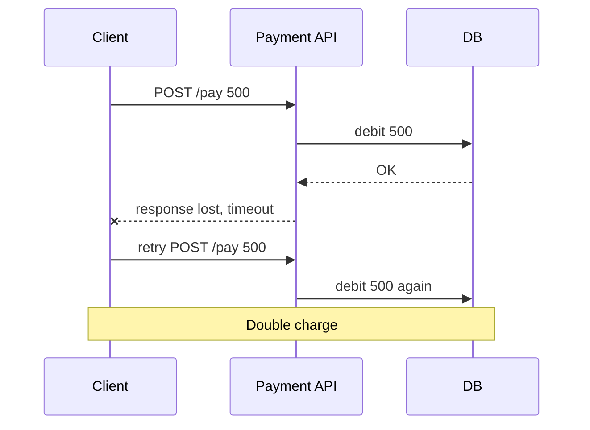

# Idempotency & Retries

**Ek line me:** same request do-teen baar aa jaaye, tab bhi result ek hi baar wala ho. Retry safe hona chahiye.

> **Example:** Paytm pe ₹500 bheje, network slow tha, spinner ghoomta raha. User ne phir "Pay" daba diya. Agar server idempotent nahi hai, to ₹1000 kat jayenge. Idempotency key se server samajh jaata hai ki "ye wahi purani request hai" aur dobara paisa nahi kaatta.

## Retries duplicate kyun banate hain

Client ko pata hi nahi chalta ki request fail hui ya sirf **response** kho gaya.



Timeout ka matlab "fail" nahi, matlab "pata nahi". Isliye retry tabhi safe hai jab server idempotent ho.

## Delivery guarantees

| Guarantee | Matlab | Kaise milta hai | Example |
|---|---|---|---|
| **At-most-once** | 0 ya 1 baar. Loss ho sakta hai | Retry mat karo | Metrics, logs jahan thoda loss chalega |
| **At-least-once** | 1 ya zyada baar. Duplicate ho sakta hai | Ack tak retry karo | Kafka consumers, webhooks (default) |
| **Exactly-once** | Theek 1 baar | Network pe truly possible nahi | Sirf marketing term, bina dedup ke |
| **Effectively-once** | At-least-once delivery + idempotent processing | Retry + dedup | Payments, orders. **Yahi bolo interview me** |

> Rule: "Exactly-once delivery nahi hota. Exactly-once **effect** hota hai, at-least-once + idempotency se."

## Idempotency key kaise kaam karta hai

1. Client ek unique key banata hai (UUID), har logical operation ke liye ek. Retry pe **same key** bhejta hai.
2. Header: `Idempotency-Key: 7f3a...`
3. Server dedup table me check karta hai:
   - Key nahi hai → insert `(key, status=IN_PROGRESS)`, kaam karo, result save karo.
   - Key hai aur `DONE` → saved response wapas do, kaam dobara mat karo.
   - Key hai aur `IN_PROGRESS` → `409 Conflict` ya wait karo.

```sql
idempotency_keys(
  key        VARCHAR PRIMARY KEY,   -- UNIQUE se race bhi solve
  user_id    BIGINT,
  request_hash VARCHAR,             -- same key, alag body? reject
  status     VARCHAR,               -- IN_PROGRESS / DONE
  response   JSONB,
  created_at TIMESTAMP              -- 24h baad cleanup
)
```

- Key insert aur business write **ek hi DB transaction** me karo. Warna crash ke beech me state adhuri reh jaati hai.
- Do requests same key ke saath ek saath aayein to `PRIMARY KEY` constraint ek ko reject kar dega.
- Fast path ke liye Redis `SET key NX EX 86400` chalega, par source of truth DB rakho.

**Naturally idempotent operations:** `PUT /user/5 {name}`, `DELETE`, `SET balance = 100`. **Non-idempotent:** `POST /pay`, `balance = balance + 100`. Jahan ho sake operation ko absolute bana do.

**Consumers me dedup:** Kafka message me `event_id` rakho. Consumer `processed_events(event_id UNIQUE)` me check kare. Ya upsert karo (`INSERT ... ON CONFLICT DO NOTHING`).

## Retry kaise karo: exponential backoff + jitter

| Strategy | Wait | Problem |
|---|---|---|
| Turant retry | 0 | Server already struggling hai, aur load daal diya |
| Fixed delay | 1s, 1s, 1s | Sab clients same time pe wapas aate hain |
| Exponential | 1s, 2s, 4s, 8s | Better, par sab sync me rehte hain |
| **Exponential + jitter** | `random(0, min(cap, base * 2^n))` | Load time pe spread ho jaata hai. **Ye default hai** |

Saath me:
- **Max retries** (3–5) aur **cap** (30s). Phir DLQ (dead letter queue) me daalo.
- Sirf **retryable errors** pe retry: timeout, 503, 429. `400`, `401` pe kabhi nahi.
- 429 me `Retry-After` header aaye to wahi maano.

## Retry storm

Ek service slow hui → har caller 3 retry karta hai → load 3x ho gaya. Agar 3 layers hain aur har layer 3 retry kare to **27x** load. Service kabhi recover nahi karti.

Bachav:
- Retry sirf **ek layer** pe karo (usually edge/client), beech ki layers pe nahi.
- **Retry budget:** total requests ka max 10% hi retry ho sakta hai.
- **Circuit breaker:** errors zyada ho to kuch der call band karo, fail fast karo.
- Backoff + jitter hamesha.

## Outbox pattern (pointer)

DB me order save kiya aur Kafka me event bhejna hai. Dono alag systems hain. Ek fail hua to inconsistency. Solution: event ko **same DB transaction** me `outbox` table me likho, aur ek relay/CDC (Debezium) use Kafka me publish kare. Relay at-least-once hai, isliye consumer idempotent hona chahiye. Detail: [Distributed Transactions](./16-distributed-transactions.md).

## Kin systems me lagta hai

- [Payment System](../02-questions/t1-11-payment-system.md): double charge rokna, sabse important
- [BookMyShow](../02-questions/t1-05-bookmyshow.md): confirm booking pe Idempotency-Key
- [Notification System](../02-questions/t1-09-notification-system.md): ek SMS do baar na jaaye
- [Flash Sale](../02-questions/t2-15-flash-sale.md): order retry pe duplicate order na bane
- [Ad Click Aggregator](../02-questions/t2-17-ad-click-aggregator.md): click do baar count na ho
- [Job Scheduler](../02-questions/t2-18-job-scheduler.md): job retry safe ho
- [Food Delivery](../02-questions/t2-14-food-delivery.md): place order retry

## Interview me bolo

> "Network pe exactly-once delivery possible nahi hai, isliye main at-least-once delivery + idempotent processing karunga. Client har payment pe Idempotency-Key bhejega, server use unique constraint wali table me business write ke saath same transaction me store karega. Retry pe saved response wapas jayega."

> "Retries exponential backoff with jitter ke saath, max 3, aur sirf ek layer pe, taaki retry storm na bane."

## Common galtiyan

- "Kafka exactly-once deta hai" bol ke dedup skip karna. Side effects (DB, email) ke liye dedup chahiye hi.
- Idempotency key server pe generate karna. Key client banata hai, tabhi retry pe same rehti hai.
- Key check aur business write alag transactions me karna.
- Bina jitter ke retry, aur har layer pe retry.
- `400` jaise non-retryable errors pe bhi retry karna.

## Checklist

- [ ] Timeout pe retry se duplicate kyun hota hai, example se samjha sakta hoon
- [ ] At-most, at-least, exactly aur effectively-once ka farak bata sakta hoon
- [ ] Idempotency key flow aur dedup table ka schema bana sakta hoon
- [ ] Exponential backoff + jitter aur retry storm se bachav bata sakta hoon
- [ ] Outbox pattern ek line me samjha sakta hoon
