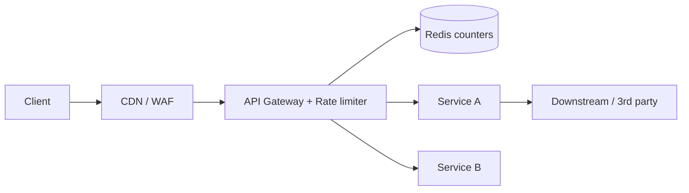

# Rate Limiting

**Ek line me:** ek user/IP/API key kitni requests kitne time me bhej sakta hai, uski limit lagana, taaki system abuse aur overload se bache.

> **Example:** IRCTC Tatkal 10 baje khulta hai. Bots ek second me hazaar requests bhejte hain. Rate limiter bolta hai "ek user = 10 requests/min", baaki ko `429 Too Many Requests`. Isse asli users ko bhi mauka milta hai aur servers girte nahi.

## 5 algorithms

### Token bucket
Bucket me max `N` tokens. Har second `r` tokens refill. Har request ek token leti hai. Token nahi to reject.
- **Burst allow karta hai** (N tak), average rate `r` pe control. AWS, Stripe yahi use karte hain.
- Store karna: sirf `tokens` aur `last_refill_time`.

### Leaky bucket
Requests ek queue me jaati hain, aur queue fixed rate pe "leak" (process) hoti hai. Queue full to drop.
- Output **smooth constant rate**. Burst nahi jaane deta. Traffic shaping ke liye accha.

### Fixed window counter
`counter:user:10:05` (har minute ka key). `INCR`, agar > limit to reject.
- Simple aur sasta. **Problem:** boundary burst. 10:00:59 pe 100 aur 10:01:00 pe 100 = 2 sec me 200.

### Sliding window log
Har request ka timestamp sorted set me rakho. Naye request pe pichhle 60 sec se purane hatao, count karo.
- **Exact**. Par memory zyada: har request ka entry.

### Sliding window counter
Current aur previous window ka weighted mix: `count = curr + prev * (overlap fraction)`.
- Example: 10:01:15 pe, prev window ka 75% overlap → `curr + 0.75 * prev`.
- Kam memory, almost accurate. **Production ka favourite** (Cloudflare).

| Algorithm | Burst | Memory | Accuracy | Kab use karo |
|---|---|---|---|---|
| Token bucket | Haan, controlled | Bahut kam | Achhi | API limits, general default |
| Leaky bucket | Nahi, smooth | Kam (queue) | Achhi | Downstream ko fixed rate chahiye |
| Fixed window | Boundary pe 2x | Bahut kam | Kam | Simple internal limits |
| Sliding log | Nahi | Zyada | Exact | Low volume, strict limits |
| Sliding counter | Thoda | Kam | ~Approx (accha) | High scale, public APIs |

## Limiter kahan lagao



- **Client side:** sirf courtesy. Bharosa nahi kar sakte.
- **CDN/WAF:** IP based, DDoS ke liye.
- **API Gateway / middleware:** **sabse common**. Per user / API key / endpoint limits.
- **Service ke andar:** expensive operations ke liye (OTP send, search).
- Kaunsi key pe limit: `user_id` (logged in), `IP` (anonymous), `api_key` (B2B), ya combo.

## Redis implementation

**Fixed window (INCR + EXPIRE):**
```text
key = "rl:user42:" + current_minute
count = INCR key
if count == 1: EXPIRE key 60
if count > 100: reject 429
```
Dikkat: `INCR` aur `EXPIRE` alag commands hain. Beech me crash hua to key bina TTL ke reh jayegi. Isliye **Lua script** ya `SET key 0 EX 60 NX` + `INCR` use karo.

**Token bucket via Lua (atomic):**
```lua
local tokens = tonumber(redis.call('HGET', KEYS[1], 'tokens') or ARGV[1])
local last   = tonumber(redis.call('HGET', KEYS[1], 'ts') or ARGV[3])
local now, cap, rate = tonumber(ARGV[3]), tonumber(ARGV[1]), tonumber(ARGV[2])
tokens = math.min(cap, tokens + (now - last) * rate)
if tokens < 1 then return 0 end
redis.call('HSET', KEYS[1], 'tokens', tokens - 1, 'ts', now)
redis.call('EXPIRE', KEYS[1], 3600)
return 1
```
Lua script Redis me atomically chalti hai, isliye read-modify-write me race nahi hota.

**Sliding log:** `ZREMRANGEBYSCORE key 0 now-60000`, `ZADD key now reqId`, `ZCARD key`. Ye bhi `MULTI` ya Lua me.

## Distributed limits

- Multiple gateway servers hain → counter **central Redis** me rakho, local memory me nahi. Warna 10 servers = 10x limit.
- Redis ek network hop add karta hai (~1ms). Bahut high QPS pe: **local counter + periodic sync** (thoda inaccurate, par fast).
- Redis Cluster me key `user_id` se shard hoti hai, to load spread ho jaata hai.
- **Redis down to?** Usually **fail open** (request allow karo) taaki poori site na gire. Payment/OTP jaise sensitive endpoints pe fail closed.

## Response: 429 + headers

```http
HTTP/1.1 429 Too Many Requests
Retry-After: 30
X-RateLimit-Limit: 100
X-RateLimit-Remaining: 0
X-RateLimit-Reset: 1696320060
```
Client ko pata chale kab wapas aana hai. Achha client `Retry-After` + backoff follow karega.

## Kin systems me lagta hai

- [Rate Limiter](../02-questions/t1-02-rate-limiter.md): poora question isi pe
- [BookMyShow](../02-questions/t1-05-bookmyshow.md): bots ko gateway pe rokna
- [Flash Sale](../02-questions/t2-15-flash-sale.md): per-user purchase limit
- [Web Crawler](../02-questions/t1-12-web-crawler.md): har domain pe politeness limit
- [LLM Chat App](../02-questions/t2-22-llm-chat-app.md): tokens per minute limit
- [Notification System](../02-questions/t1-09-notification-system.md): user ko spam na karo

## Interview me bolo

> "Main API gateway pe token bucket lagaunga, per user_id. State Redis me hogi aur update ek Lua script se atomically hoga, taaki multiple gateway servers ke beech limit sahi rahe. Limit cross hone pe 429 with Retry-After. Redis down ho to fail open, sirf OTP aur payment pe fail closed."

## Common galtiyan

- Counter ko har server ki local memory me rakhna. Distributed setup me limit multiply ho jaati hai.
- Fixed window ka boundary burst problem na pehchanna.
- `INCR` aur `EXPIRE` ko non-atomic chalana.
- Redis failure pe kya hoga (fail open vs closed), na batana.
- Sirf IP pe limit. Office/college NAT ke peeche hazaar users ek IP pe hote hain.

## Checklist

- [ ] Paanchon algorithms ek-ek line me aur unke trade-offs bata sakta hoon
- [ ] Fixed window ka boundary problem aur sliding window counter ka formula samjha sakta hoon
- [ ] Redis + Lua se atomic token bucket likh/samjha sakta hoon
- [ ] Limiter kahan lagana hai aur distributed limit ka issue bata sakta hoon
- [ ] 429, Retry-After aur fail open vs fail closed bata sakta hoon
