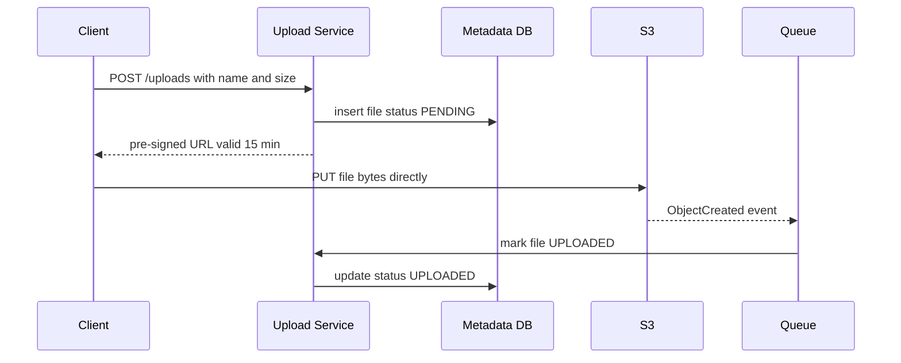
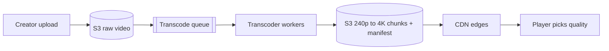

# Blob Storage & CDN

**Ek line me:** images, videos, files jaise bade binary data ko object storage (S3) me rakho, aur CDN se user ke paas wale server se serve karo.

> **Example:** Hotstar pe IPL final 2 crore log ek saath dekh rahe hain. Video Mumbai ke ek server se jaata to woh pighal jaata. Isliye video chunks S3 me rehte hain, aur CDN unhe har shehar ke edge server pe cache karta hai. Delhi wala user Delhi ke edge se dekhta hai.

## Object storage (S3) kya hai

- Flat namespace: `bucket/key → bytes + metadata`. Folders sirf naam ka hissa hain (`users/42/avatar.jpg`).
- Practically infinite scale, **11 nines durability** (data multiple AZ me replicate).
- Sasta (~$0.023/GB/month), aur cold tiers (Glacier) aur saste.
- Immutable objects: update matlab naya object likho. Partial update nahi hota.

## Blob ko DB me kyun nahi rakhte

| DB me blob | S3 me blob |
|---|---|
| DB size phoolta hai, backups/replication slow | DB me sirf metadata + S3 URL |
| DB connections bade transfers me atke rehte hain | Client seedha S3 se download/upload |
| SSD storage mehenga | Storage sasta, tiers available |
| CDN ke saath kaam nahi karta | CDN directly S3 ko origin bana leta hai |

> Rule: **metadata DB me, bytes S3 me.** `files(id, owner_id, s3_key, size, content_hash, created_at)`.

## Pre-signed URLs

App server ke through 2 GB file bhejna = server ki bandwidth aur memory waste. Isliye:
1. Client app server se bolta hai "upload karna hai".
2. Server auth check karke S3 ka **pre-signed URL** deta hai (signed, 15 min valid, sirf us key pe PUT).
3. Client seedha S3 pe upload karta hai.
4. S3 event (ya client callback) se server metadata `UPLOADED` mark karta hai.

Download ke liye bhi same: private files pe pre-signed GET URL ya CDN signed URL do.

## Multipart / chunked & resumable upload

- Bada file (> 100 MB) ko **5–10 MB chunks** me todo. Har chunk alag upload, parallel bhi.
- Ek chunk fail hua to sirf wahi retry karo, poori file nahi.
- **Resumable:** server/S3 track karta hai kaunse chunks aa gaye. Network gaya to client poochhe "kaunse parts hain?" aur baaki se resume kare.
- S3 multipart: `CreateMultipartUpload` → `UploadPart` x N → `CompleteMultipartUpload`.

## Dedup via content hash

- Har file (ya chunk) ka **SHA-256 hash** nikalo. Same hash = same content.
- Upload se pehle client hash bheje. Server ke paas already hai to upload skip ("instant upload"). Dropbox yahi karta hai.
- Chunk-level dedup: file ka sirf badla hua chunk upload hota hai. Bandwidth bachti hai.
- Storage reference counting: ek blob ko kitni files point kar rahi hain, 0 hone pe hi delete.

## CDN

Edge servers duniya bhar me. User ke nazdeek wala edge content serve karta hai. Latency 200ms se ~20ms, aur origin pe load 90%+ kam.

| | Pull CDN | Push CDN |
|---|---|---|
| Kaise | Pehli request pe edge origin se laata hai aur cache karta hai | Tum khud content edge pe upload karte ho |
| Pro | Setup easy, sirf popular content cache hota hai | Pehli request bhi fast, origin pe load zero |
| Con | Pehli request slow (cache miss) | Saara content push karna padta hai, storage mehenga |
| Kab | Default. Images, user content | Bade, predictable files: game patches, new movie launch |

**Cache invalidation:**
- **Versioned URLs** (best): `logo.v42.png` ya `app.a8f3c.js`. Content badla to naya URL. Purana TTL se mar jaata hai.
- **TTL** via `Cache-Control: max-age=86400`.
- **Purge API:** galti se kuch galat publish hua to explicitly hatao. Slow aur mehenga, regular use nahi.

## Video: transcoding + adaptive bitrate

- **Transcoding:** raw video ko multiple resolutions (240p, 480p, 720p, 1080p) aur codecs (H.264, VP9/AV1) me convert karo. CPU heavy, isliye queue + parallel workers (video ko segments me tod ke parallel).
- **Segments:** har quality ko 2–10 sec ke chunks me todo.
- **Adaptive bitrate (HLS / DASH):** ek manifest file (`.m3u8` for HLS, `.mpd` for DASH) me saari qualities aur chunks ki list. Player bandwidth dekh ke har chunk pe quality switch karta hai. Jio 4G slow hua to 480p, WiFi pe 1080p. Buffering kam.
- HLS Apple ka hai, sab jagah chalta hai. DASH open standard hai.

## Kin systems me lagta hai

- [YouTube](../02-questions/t1-07-youtube.md): upload, transcoding, HLS, CDN
- [Dropbox](../02-questions/t1-08-dropbox.md): chunked upload, dedup, sync
- [Instagram](../02-questions/t2-13-instagram.md): photos S3 + CDN, pre-signed upload
- [Web Crawler](../02-questions/t1-12-web-crawler.md): crawled pages S3 me
- [News Feed](../02-questions/t1-03-news-feed.md): post media CDN se
- [LLM Chat App](../02-questions/t2-22-llm-chat-app.md): file attachments

## Interview me bolo

> "Media ke bytes S3 me aur metadata DB me rahega. Upload pre-signed URL se client seedha S3 pe karega, app servers bandwidth me nahi phansenge. Bade files multipart aur resumable honge. Reads CDN se, versioned URLs ke saath taaki invalidation ki tension na ho."

> "Video ke liye upload ke baad async transcoding pipeline: multiple resolutions, chunks, aur HLS manifest. Player network ke hisaab se quality switch karega."

## Common galtiyan

- Video/images ko DB me BLOB column me rakhna.
- Upload ko app server ke through proxy karna.
- Transcoding ko upload request ke andar synchronous karna. Ye minutes leta hai, async queue chahiye.
- CDN bolna par invalidation ka plan na batana.
- Bade file ka resumable upload na sochna (mobile network pe bahut fail hota hai).

## Checklist

- [ ] Blob DB me kyun nahi, aur metadata vs bytes split bata sakta hoon
- [ ] Pre-signed URL upload flow diagram ke saath samjha sakta hoon
- [ ] Multipart/resumable upload aur content-hash dedup bata sakta hoon
- [ ] Pull vs push CDN aur versioned URL se invalidation bata sakta hoon
- [ ] Transcoding + HLS/DASH adaptive bitrate samjha sakta hoon
